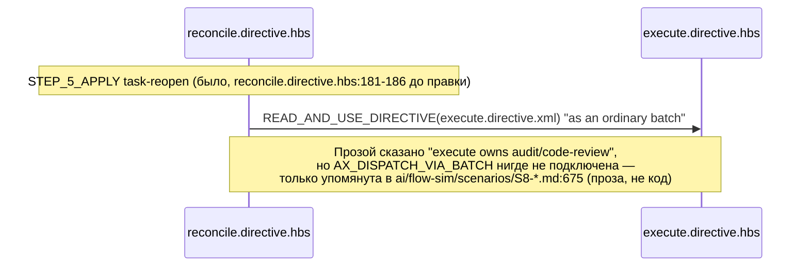

ОТЧЁТ 61 §1 / 62 §«Пачка 20» — T-B6-05: `AX_DISPATCH_VIA_BATCH` в `reconcile` — execute единственный владелец audit/code-review

СТАТУС: DONE

Рабочее дерево: `rc-w3`. Ветка `lead/review-critic-bounds` от `origin/codex/sdd-v2-rc52-followup`.

КОММИТ (локальный, НИЧЕГО не запушено):
- `1da11d89` feat(T-B6-05): reconcile dispatches task-reopen as one execute batch

---

## 1. Файлы

| Путь | Тип | Смысловое изменение | Чем доказано |
|---|---|---|---|
| `ai/kit/templates/sdd-v2/reconcile.directive.hbs` | правка | `BeliefState` подключает `{{> "axiom/process/ax-dispatch-via-batch"}}` (существовал в библиотеке, упоминался только в прозе `ai/flow-sim/scenarios/S8-*`/`S9-*`, нигде не собран в шаблон). `STEP_5_APPLY`'s ветка **task-reopen** переформулирована: reopened-тикеты диспетчатся через `execute.directive.xml` одним BATCH по `AX_DISPATCH_VIA_BATCH`; явно сказано «no reconcile-only audit flag — execute remains the sole owner of each affected group's audit and code-review»; reconcile «never dispatches a second review», только принимает и проверяет результат на `STEP_6_VERIFY`. | `review-critic-bounds.test.ts` (describe «reconcile: task-reopen dispatches as one execute batch»). |
| `ai/directives/sdd-v2/reconcile.directive.xml` | правка (сборка) | Прямое следствие правки шаблона. | `check:directives-fresh`. |
| `ai/kit/__tests__/review-critic-bounds.test.ts` | правка | Добавлен `describe` T-B6-05 (3 кейса): аксиома определена; активирована внутри `STEP_5_APPLY` с текстом «as one BATCH» / «sole owner ... audit and code-review» / «never dispatches a second review»; «no reconcile-only audit flag». | Сам файл. |

`git diff --stat` этого коммита — 3 файла, все покрыты выше.

---

## 2. Архитектура было / стало

### Было — прозаическая гарантия без собранной аксиомы



### Стало — `AX_DISPATCH_VIA_BATCH` явно активирована в `STEP_5_APPLY`

```mermaid
sequenceDiagram
  participant R as reconcile.directive.hbs
  participant E as execute.directive.hbs (единственный владелец)

  Note over R: STEP_5_APPLY task-reopen (reconcile.directive.hbs:181-198)
  R->>E: READ_AND_USE_DIRECTIVE(execute.directive.xml) "as one BATCH" per AX_DISPATCH_VIA_BATCH
  E-->>E: планирует слои, гоняет фазы, закрывает раунды,\nсинхронизирует трекеры (sdd-task --audit-group, свой lifecycle)
  E-->>R: возвращает per-group audit/code-review результат
  Note over R: STEP_6_VERIFY (reconcile.directive.hbs:222-236)\nreconcile ТОЛЬКО принимает и проверяет —\nне диспетчит второй review, "no reconcile-only audit flag"
  style E fill:#9f9,stroke:#090
```

---

## 3. Доказательства (команды из ПРИЁМКИ, фактический вывод, exit-код)

**1. Целевые кейсы (накопительно T-B6-03+ISS-10+T-B6-05 — 13 тестов, 4 suite).**
```
$ node --import tsx --test ai/kit/__tests__/review-critic-bounds.test.ts \
    ai/kit/__tests__/stateless-sdd-flow-contract.test.ts \
    cli/__tests__/directive-tool-contract/directive-tool-contract.test.ts
# tests 75, pass 75, fail 0
```
exit 0. ВЫПОЛНЕНО.

**2. `npm run build:directives` + `check:directives-fresh`.**
```
Generated 55 directive(s).
✓ ai/directives/** matches a fresh rebuild.
```
exit 0/0. ВЫПОЛНЕНО.

**3. `audit:sdd-templates`.**
```
✓ axiom-activation / contract-activation / halt-activation audit clean.
✓ every lazy directive ... within budget.
```
exit 0. ВЫПОЛНЕНО.

**4. Коммит через `pre-commit` целиком, без `--no-verify`.**
Первая попытка упала на `test:coverage` (host под нагрузкой — тесты `bootstrap-path.test.ts`, `clean-repo-composition.test.ts`, `sdd-verify-repair-adapters.test.ts`, `lint.cmd.test.ts` попали в `cancelled 4`, не `failed`; сам `lint.cmd.test.ts` независимо прогнан отдельно — 31/31 pass). Синхронный повтор (правило брифа: «при таймауте pre-commit под нагрузкой — синхронный повтор до 3 раз») со второй попытки прошёл целиком:
```
[sdd-verify] ✅ ALL PASS (5/5)
  ✅ type-check (10.4s)
  ✅ test:coverage (49.8s)
  ✅ lint (10.3s)
  ✅ format (2.4s)
  ✅ yagni (0.6s)
✓ ai/directives/** matches a fresh rebuild.
✅ Pre-commit passed
[lead/review-critic-bounds 1da11d89] feat(T-B6-05): reconcile dispatches task-reopen as one execute batch
```
exit 0. ВЫПОЛНЕНО.

---

## 4. Отклонения, открытые вопросы, команды пуша

**Отклонение:** нет по существу задачи. Один нерегламентный повтор коммита из-за флаки под host-нагрузкой (load average >100 на хосте в момент прогона — см. сводный отчёт §3), разрешён протоколом брифа буквально.

**Открытые вопросы:** нет.

**Команды пуша для Lead** — см. сводный отчёт `R-BATCH-20-review-critic-bounds.md`.
