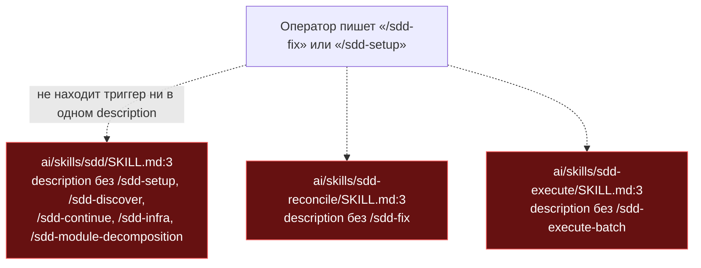
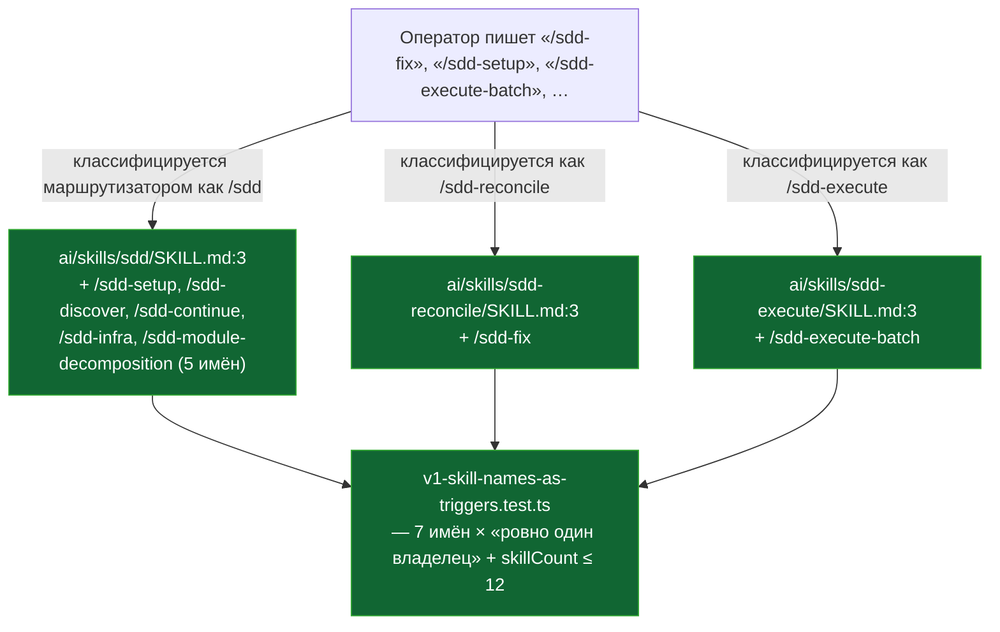

ОТЧЁТ 61 §1 — T-B6-07: v1-имена скиллов живут только как триггеры в description

СТАТУС: DONE

Рабочее дерево: `rc-w3`. Ветка `lead/promises-not-wider` от `lead/review-critic-bounds` (PR #45).

КОММИТ (локальный, НИЧЕГО не запушено), после T-B6-29 (`8b4842ca`):
- `9c257d2d` fix(T-B6-07): retired v1 skill names live only as description triggers

---

## 1. Файлы

| Путь | Тип | Смысловое изменение | Чем доказано |
|---|---|---|---|
| `ai/skills/sdd/SKILL.md:3` | правка | `description` получил хвост: «Also the v2 destination for the retired v1 skill names "/sdd-setup", "/sdd-discover", "/sdd-continue", "/sdd-infra", "/sdd-module-decomposition" — v2 has no separate skill for these; this router classifies the intent from ordinary text instead.» | `v1-skill-names-as-triggers.test.ts` — 5 из 7 подтест-проверок «ровно один владелец». |
| `ai/skills/sdd-reconcile/SKILL.md:3` | правка | `description` получил хвост: «Also the v2 destination for the retired v1 skill name "/sdd-fix".» | Тот же тест, кейс `/sdd-fix`. |
| `ai/skills/sdd-execute/SKILL.md:3` | правка | `description` получил хвост: «Also the v2 destination for the retired v1 skill name "/sdd-execute-batch".» | Тот же тест, кейс `/sdd-execute-batch`. |
| `ai/kit/__tests__/v1-skill-names-as-triggers.test.ts` | новый | Замок «каждое из 7 снятых v1-имён — триггер ровно одного скилла» + «число скиллов не выросло (baseline 12)» + явная карта имя→владелец. | 9/9 pass (см. §3). |

`git show --stat 9c257d2d` — 4 файла (+91/−3). Совпадает.

Не тронуто (вне зоны брифа): `specs/ai-skills/ai-skills.spec.md` (упомянут в `40-TRACK-DIRECTIVES-SKILLS.md` как дополнительная правка — `sdd-hooks-install` в RC нет; `specs/**` в зоне брифа не значится и явно исключён правилами исполнителя), `ai/skills/README.md`.

---

## 2. Архитектура было / стало

### Было — пять v1-имён нигде не упомянуты; операторский текст не находит их



### Стало — семь v1-имён живут ровно в одном description каждое; число скиллов не изменилось (12)



---

## 3. Доказательства

**1. Каждое снятое v1-имя — триггер ровно одного скилла; число скиллов не выросло.**
```
$ node --import tsx --test ai/kit/__tests__/v1-skill-names-as-triggers.test.ts
ok 1 - does not exceed the pre-retirement skill count — no wrapper/alias skill was created
ok 2 - "/sdd-setup" is a trigger in exactly one skill description
ok 3 - "/sdd-discover" is a trigger in exactly one skill description
ok 4 - "/sdd-continue" is a trigger in exactly one skill description
ok 5 - "/sdd-infra" is a trigger in exactly one skill description
ok 6 - "/sdd-module-decomposition" is a trigger in exactly one skill description
ok 7 - "/sdd-fix" is a trigger in exactly one skill description
ok 8 - "/sdd-execute-batch" is a trigger in exactly one skill description
ok 9 - routes every retired v1 name to its documented v2 owner
# tests 9
# pass 9
# fail 0
```
exit 0. ВЫПОЛНЕНО.

**2. Риск регрессии #16 («DIRECTIVE ACTIVATED») не вернулся вместе с правкой description.**
```
$ node --import tsx --test ai/kit/__tests__/directive-activation-announcement.test.ts
ok 1 - DIRECTIVE ACTIVATED announcement never returns to a skill or dispatch template (LOCK-3)
# tests 2
# pass 2
# fail 0
```
exit 0. ВЫПОЛНЕНО.

**3. Коммит через pre-commit целиком.**
```
[sdd-verify] ✅ ALL PASS (5/5): type-check 4.2s, test:coverage 44.5s, lint, format, yagni
✓ ai/directives/** matches a fresh rebuild.
✓ axiom/contract/halt-activation audit clean
✅ Pre-commit passed
[lead/promises-not-wider 9c257d2d] fix(T-B6-07): retired v1 skill names live only as description triggers
```
exit 0. ВЫПОЛНЕНО.

---

## 4. Отклонения, открытые вопросы

**Отклонение (сужение зоны против track-документа).** `40-TRACK-DIRECTIVES-SKILLS.md` строка T-B6-07 называет ещё `ai/skills/README.md` и `specs/ai-skills/ai-skills.spec.md` (исправление дрейфа `sdd-hooks-install`) в списке файлов. Бриф явно ограничил зону `ai/skills/{sdd,sdd-reconcile,sdd-execute}/SKILL.md`, а системные правила исполнителя запрещают трогать `specs/**` без исключения. Оставлено как выявленное, но не исправленное — Lead может завести отдельный мелкий фоллоу-ап на `ai-skills.spec.md`, если дрейф подтверждён.

**Открытые вопросы Lead:** нет.

**Команда пуша (для Lead):** см. `R-BATCH-21-promises-not-wider.md`.
