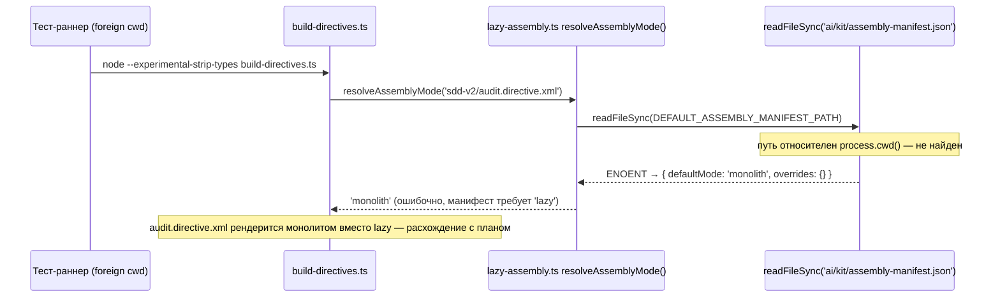
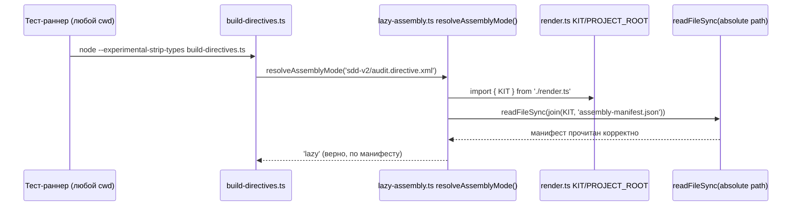

ОТЧЁТ 61 §1 — T-B6-09: Kit-скрипты и их тесты не зависят от cwd

СТАТУС: DONE

Рабочее дерево: `rc-w2` (второе дерево исполнителя). Ветка `lead/kit-lint`, создана от `origin/lead/release-package` (SHA `f16d7f17d66354551d3166e8952dcc6fd0e4fca0`) — см. сводный отчёт `R-BATCH-05-kit-lint.md` за обоснование базы.

КОММИТ (локальный, НИЧЕГО не запушено):
- `5d472780` fix(T-B6-09): kit scripts resolve the package root regardless of cwd

---

## 1. Файлы

| Путь | Тип | Смысловое изменение | Чем доказано |
|---|---|---|---|
| `ai/kit/lazy-assembly.ts` | правка | `DEFAULT_ASSEMBLY_MANIFEST_PATH` был относительной строкой `'ai/kit/assembly-manifest.json'` (резолвится через `process.cwd()`) → стал `join(KIT, 'assembly-manifest.json')`, абсолютным путём от `render.ts`'s `KIT` (`import.meta.dirname`). | Ручная репродукция бага (см. ниже) до/после правки; `cwd-independence.test.ts`. |
| `ai/kit/render.ts` | правка | Добавлен новый экспорт `PROJECT_ROOT = join(KIT, '..', '..')` — единая точка резолва корня пакета для всех kit-скриптов, задокументирован инвариант «никогда не используй относительный путь `'ai/kit/…'`». | `step-budget-gate.ts` и `lazy-assembly.ts` теперь оба его используют; тесты зелены. |
| `ai/kit/step-budget-gate.ts` | правка | CLI-резолв `sddV2Dir` вместо собственного `fileURLToPath(new URL('../..', import.meta.url))` теперь использует общий `PROJECT_ROOT` — устраняет дублирование URL-математики, тот же результат. | `check:directive-budgets` зелен до и после; `cwd-independence.test.ts` косвенно (build-directives.test.ts спавнит `step-budget-gate` не напрямую, но косвенно через `check`). |
| `ai/kit/__tests__/cwd-independence.test.ts` | новый | 3 кейса: `build-directives.test.ts`, `delta-assembly.test.ts`, `skeleton-package-binding.guard.test.ts` запускаются `tsx --test` из свежего `tmpdir()`-каталога и проверяются на exit 0. | Сам файл — это и есть доказательство; независимо перезапущен вручную (см. §3). |

`git diff --stat` коммита — 4 файла, 4 строки таблицы. Совпадает.

---

## 2. Архитектура было / стало

### Было — относительный путь ломается вне корня пакета



### Стало — абсолютный путь от `import.meta.dirname`, не зависит от `process.cwd()`


Узлы: `ai/kit/render.ts:18` (`PROJECT_ROOT`), `ai/kit/lazy-assembly.ts:24-30` (`DEFAULT_ASSEMBLY_MANIFEST_PATH`), `ai/kit/step-budget-gate.ts:149` (`join(PROJECT_ROOT, 'ai/directives/sdd-v2')`).

---

## 3. Доказательства (команды из ПРИЁМКИ, фактический вывод, exit-код)

**1. Репродукция бага ДО правки (независимо, из foreign cwd) — «resolves the manifest from the package root regardless of cwd».**
```
$ sh -c "cd /tmp/foreign-cwd-test && '<rc-w2>/node_modules/.bin/tsx' --test '<rc-w2>/ai/kit/__tests__/delta-assembly.test.ts'"
not ok 1 - every generated directive file equals the plan-driven render (build is not stale)
# tests 11, pass 10, fail 1
```
exit 1 (до правки). Диагноз: `audit.directive.xml` рендерится `monolith` вместо `lazy` — манифест не найден.

**2. Та же команда ПОСЛЕ правки.**
```
$ sh -c "cd /tmp/foreign-cwd-test && '<rc-w2>/node_modules/.bin/tsx' --test '<rc-w2>/ai/kit/__tests__/delta-assembly.test.ts'"
# tests 11, pass 11, fail 0
```
exit 0. ВЫПОЛНЕНО.

**3. Прогон трёх файлов §0 из чужого cwd вручную (build-directives.test.ts, skeleton-package-binding.guard.test.ts) — та же схема.**
```
build-directives.test.ts: tests 6, pass 6, fail 0
skeleton-package-binding.guard.test.ts: tests 4, pass 4, fail 0
```
exit 0 каждый. ВЫПОЛНЕНО.

**4. Новый `cwd-independence.test.ts` (собственный кейс, запущенный из обычного cwd — сам тест создаёт свой чужой cwd внутри).**
```
$ tsx --test ai/kit/__tests__/cwd-independence.test.ts
# tests 3, pass 3, fail 0
```
exit 0. ВЫПОЛНЕНО.

**5. `npm run build:directives` + `npm run check:directives-fresh` (обязательное правило пачки после правки шаблонов/скриптов — здесь скрипты, не шаблоны, но прогнано для полноты).**
```
Generated 55 directive(s).
✓ ai/directives/** matches a fresh rebuild.
```
exit 0/0. ВЫПОЛНЕНО.

**6. Коммит через `pre-commit` целиком (`npm run check` + `check:directives-fresh` + `audit:axioms` + `audit:contracts` + `audit:halts` + `check:directive-budgets`), без `--no-verify`.**
```
[sdd-verify] ✅ ALL PASS (5/5)
✓ ai/directives/** matches a fresh rebuild.
✓ axiom-activation audit clean — 28 template(s) checked.
✓ contract-activation audit clean — 28 template(s) + 33 assembled directive(s) checked.
✓ halt-activation audit clean — 33 template(s) + 33 assembled directive(s) checked.
✓ every lazy directive under ai/directives/sdd-v2/** is within budget.
✅ Pre-commit passed
[lead/kit-lint 5d472780] fix(T-B6-09): kit scripts resolve the package root regardless of cwd
```
exit 0. ВЫПОЛНЕНО.

---

## 4. Отклонения, открытые вопросы, команды пуша

**Отклонения:** нет — бриф (`61-TASK-BOARD.md:146`) выполнен буквально, включая точный список файлов (`lazy-assembly.ts`, `render.ts`, `step-budget-gate.ts`) плюс новый тестовый файл.

**Открытые вопросы:** нет.

**Команды пуша для Lead** — см. сводный отчёт `R-BATCH-05-kit-lint.md`.
