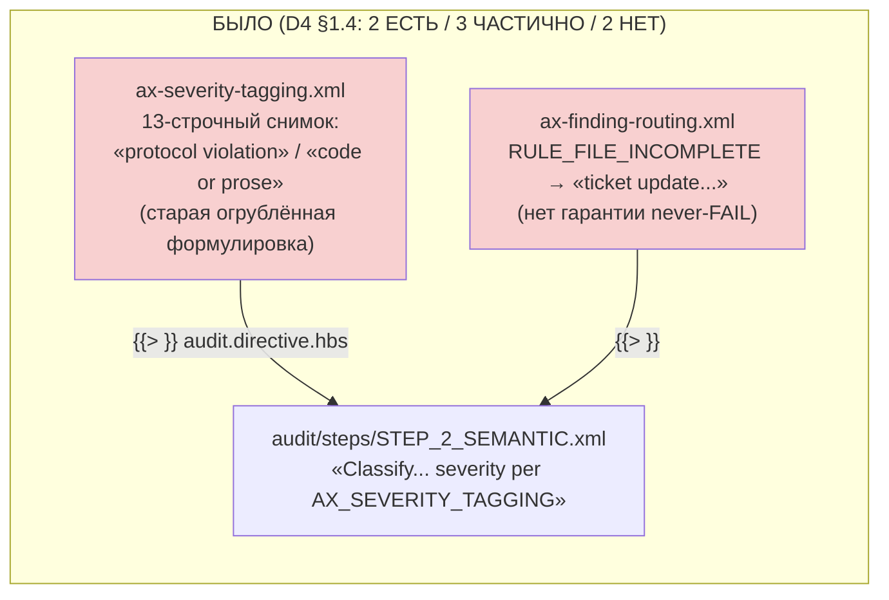
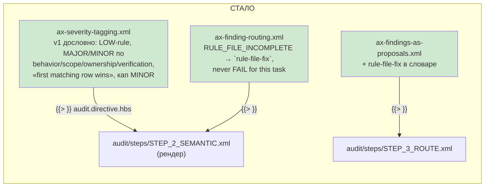

# R-T-B6-11 — D4.4–D4.7 восстановлены дословно из v1

Ветка `lead/axioms-one-home`, коммит `40935c63`. Источник v1: repo `gennady` @ `d37d5910` (`chore(release): v0.9.0-next.4`), `ai/directives/sdd/audit.directive.xml` (`ver="3.0"`). `git log --oneline d37d5910 -- ai/directives/sdd/audit.directive.xml` показывает только `feat`/`fix` коммиты, ведущие к этой редакции (`8bb38477`, `ac2e9d73`, `139448e3`, `cd7f3e01`, …) — ни одного revert между введением текста и `d37d5910`; по L-25 сверять «отменённые редакции» было нечего.

## 1. Файлы

| Путь | Тип | Смысловое изменение | Чем доказано |
|---|---|---|---|
| `ai/kit/axiom/audit/ax-severity-tagging.xml` | правка | заменён на дословный v1-текст (`d37d5910:88-130`): таблица `MAJOR`/`MINOR` по поведению/области/доказуемости (D4.5), confidence-правило `LOW` (D4.4), «заявленная верификация без evidence = MAJOR» (D4.6), таблица «first matching row wins» + кап проектных находок (D4.1/D4.7) | grep-замок на рендере + `stateless-sdd-flow-contract.test.ts` |
| `ai/kit/axiom/audit/ax-finding-routing.xml` | правка | строка `RULE_FILE_INCOMPLETE` заменена на дословный v1-текст (`d37d5910:155`): `rule-file-fix`, «never `ticket-update`, never a phase owner, never `FAIL` for this task» | тот же тест |
| `ai/kit/axiom/audit/ax-findings-as-proposals.xml` | правка | добавлен remediation-тип `rule-file-fix` (`d37d5910:137`) — найдено попутно: без него восстановленная строка `ax-finding-routing` ссылалась бы на тип, не входящий в словарь этой аксиомы | чтение диффа |
| `ai/kit/axiom/audit/ax-drift-taxonomy.xml` | без изменений | строка `RULE_FILE_INCOMPLETE` уже дословно совпадала с v1 — проверено диффом, не на глаз | `diff` между v1-текстом и текущим файлом |
| `ai/kit/__tests__/stateless-sdd-flow-contract.test.ts` | правка | 2 новых теста-замка (см. §3) | `node --test` |
| `ai/directives/sdd-v2/audit.directive.xml`, `.../audit/steps/STEP_2_SEMANTIC.xml`, `.../audit/steps/STEP_3_ROUTE.xml`, `.../code-review.directive.xml` | сгенерированы | `check:directives-fresh` перерендерил после правки трёх library-файлов (code-review переиспользует те же партиалы) | `check:directives-fresh` |

## 2. Архитектура было / стало

## 3. Доказательства

| # | Команда | Вывод | Exit | Статус |
|---|---|---|---|---|
| 1 | `grep -rn "First matching row wins" ai/directives/sdd-v2` | 2 хита (`code-review.directive.xml:200`, `audit/steps/STEP_2_SEMANTIC.xml:169`) | — | ВЫПОЛНЕНО |
| 2 | `grep -rn "LOW.*finding never causes" ai/directives/sdd-v2` | 2 хита | — | ВЫПОЛНЕНО |
| 3 | `grep -rn "project-scope finding enters this table capped" ai/directives/sdd-v2` | 2 хита | — | ВЫПОЛНЕНО |
| 4 | `grep -rn "never .FAIL. for this task" ai/directives/sdd-v2` | 1 хит (`audit.directive.xml:208`, `RULE_FILE_INCOMPLETE` строка) | — | ВЫПОЛНЕНО |
| 5 | `node --experimental-strip-types --test ai/kit/__tests__/stateless-sdd-flow-contract.test.ts` | `# tests 19 / # pass 19 / # fail 0` (2 новых кейса: «computes its verdict from a printed severity table», «routes RULE_FILE_INCOMPLETE to rule-file-fix») | 0 | ВЫПОЛНЕНО |
| 6 | `npm run build:directives` + `npm run audit:sdd-templates` | все 5 под-гейтов `✓` | 0 | ВЫПОЛНЕНО |
| 7 | `npm run check` | `ALL PASS (5/5)` | 0 | ВЫПОЛНЕНО |

Замечание по методологии замка: план 40-doc предполагал, что этот текст рендерится в `audit/steps/STEP_3_ROUTE.xml` — фактически lazy-сборка кладёт `ax-severity-tagging`/`ax-finding-routing`/`ax-drift-taxonomy` в `STEP_2_SEMANTIC.xml` (там, где реально стоит `Classify each per AX_DRIFT_TAXONOMY, severity per AX_SEVERITY_TAGGING`), а `ax-findings-as-proposals` — в `STEP_3_ROUTE.xml`. Тест написан так, чтобы читать ВЕСЬ каталог `ai/directives/sdd-v2/audit/**`, а не фиксированное имя файла — переживёт следующий ребаланс lazy-сборки.

## 4. Отклонения и открытые вопросы

- **Не тронуто (вне скоупа, зафиксировано для протокола):** v1's `EXECUTION_LOG_INCOMPLETE` в `ax-drift-taxonomy.xml` несёт дополнительные пункты про токены `sdd check` `[LOG]` (`unknown-token`/`unclosed-round`/`bad-round-close`/`entry-after-close`/`extra-close-entry` — findings; `retired-token`/`round-close-no-timestamp` — нет), которых нет в текущей v2-строке. Это не входит в D4.4–D4.7 (это D5/механическая-правда трек, `sdd check` [LOG] уже отдельно владеет трек CHECK-LOG/B2-*) — задачи-владельца на доске нет, находка не в зоне T-B6-11.
- `ax-findings-as-proposals.xml` не входит в список файлов брифа (`axiom/audit/{ax-severity-tagging,ax-finding-routing,ax-drift-taxonomy}.xml`), но правка неизбежна: без словарного слова `rule-file-fix` восстановленная строка маршрутизации ссылалась бы на несуществующий тип. В зоне (`ai/kit/axiom/**`), сделано минимально.
- Команда пуша — см. сводный отчёт пачки.

## 5. Правки по вердикту верификатора (V-BATCH-18)

**B-1 (БЛОКИРУЮЩАЯ, решение Lead L-27).** Находка: восстановленный дословно v1-абзац `ax-severity-tagging.xml` («This matters because the status is consumed mechanically: the orchestrator sets `[x] DONE` on PASS…») подключён в ту же собранную `audit.directive`, куда T-B6-25 (тем же брифом-пачкой) подключила v2-семантику group-audit (`AX_AUDIT_HOOK`: «`[x] DONE` is mechanical close, not verification»; тикет уже `[x] DONE` до старта аудита) — две взаимоисключающие модели о том, кто и когда ставит `[x] DONE`, обе внесены пачкой 18.

Что сделано (коммит `d06bd5e5`, дерево `rc-v6`): последний абзац `ax-severity-tagging.xml` переписан под v2-модель — «on PASS the audit records the round verdict; `[x] DONE` is already the phase's mechanical close» — с пометкой `<!-- v2 close model (L-27): … -->` внутри тела аксиомы и объяснением в файловом заголовке. Это единственный абзац файла, НЕ перенесённый дословно; D4.1/D4.4–D4.7 (таблица `Meaning`, confidence-правило, таблица вердикта, кап `MINOR`) не задеты — замки, ссылки в §3 выше на них, остаются в силе без изменений. Пересобраны `audit.directive.xml`, `audit/steps/STEP_2_SEMANTIC.xml`, `code-review.directive.xml`; добавлен новый тест-замок в `stateless-sdd-flow-contract.test.ts` («the assembled audit directive no longer claims the orchestrator sets `[x] DONE` on PASS (L-27)») — `doesNotMatch` на старую фразу + `match` на новую, `node --test` зелёный.

**D4.1 (остаток, F-6, НЕ исправлено этой правкой).** Верификатор отметил, что таблица вычисления вердикта («print which row matched» + кап `MINOR`) лежит только в `STEP_2_SEMANTIC.xml`, а не доезжает до `STEP_3_ROUTE.xml`, как предполагал план 40-doc; замечание по методологии замка в §3 выше уже честно фиксирует это расхождение места (не факта). Решение Lead по B-1 не затрагивает размещение — правка ограничена текстом абзаца, не его местом в lazy-сборке. **D4.1 остаётся ЧАСТИЧНО**; нужна отдельная запись в `40-TRACK-DIRECTIVES-SKILLS.md` §1.4 (перенос партиала в блок, попадающий в `STEP_3_ROUTE`, либо явное признание ослабленного замка) — вне зоны «трогать» этого брифа (только `rc-v6`).
