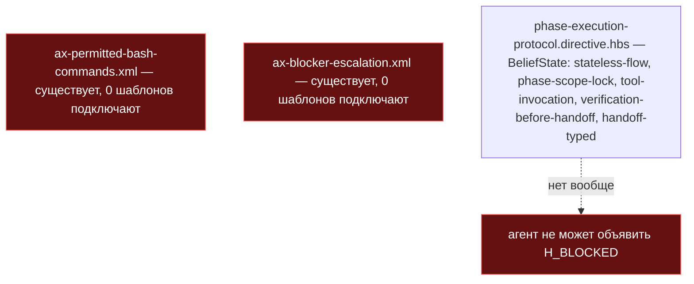
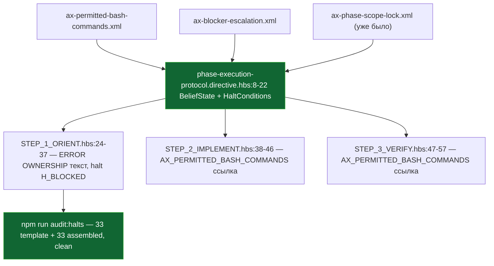

ОТЧЁТ 61 §1 — T-B6-12: граница фазового агента собрана как аксиомы, объявлена остановка «заблокирован»

СТАТУС: DONE

Рабочее дерево: `rc-v6`. Ветка `lead/phase-agent-bounds` от `origin/lead/kit-lint` @ `61b86fb8`.

КОММИТ (локальный, НИЧЕГО не запушено):
- `70361d49` feat(T-B6-12): phase worker gets a permitted-command list, blocker escalation, and H_BLOCKED

---

## 1. Файлы

| Путь | Тип | Смысловое изменение | Чем доказано |
|---|---|---|---|
| `ai/kit/templates/sdd-v2/phase-execution-protocol.directive.hbs` | правка | BeliefState получает `{{> "axiom/process/ax-permitted-bash-commands"}}` и `{{> "axiom/process/ax-blocker-escalation"}}` (оба аксиома существовали, но не собирались ни в один шаблон — D7.3/D7.4, `40-TRACK-DIRECTIVES-SKILLS.md` §1.7); новый `<HaltConditions>` с двумя строками — `H_BLOCKED` (триггеры `AX_BLOCKER_ESCALATION`) и `H_OUT_OF_PHASE_WRITE` (уже подразумевался `ax-phase-scope-lock`, но никогда не был строкой таблицы); STEP_1_ORIENT дословно восстанавливает границу ERROR OWNERSHIP («a phase worker owns failures only inside its own Target Files») и ссылку на `H_BLOCKED`; STEP_2_IMPLEMENT/STEP_3_VERIFY явно привязывают bash-команды к `AX_PERMITTED_BASH_COMMANDS`. | `npm run audit:halts` зелен; `npm run check:directive-budgets` зелен; `assert.match` в `ai/kit/__tests__/stateless-sdd-flow-contract.test.ts` (`run the phase's exact declared commands`, `worker never closes the phase or edits the ticket`) прошли без изменений. |
| `ai/directives/sdd-v2/phase-execution-protocol.directive.xml` | правка (сгенерировано) | Пересобранная монолитная версия того же шаблона. | `npm run check:directives-fresh` → «matches a fresh rebuild». |
| `ai/directives/sdd-v2/phase-execution-protocol/steps/STEP_1_ORIENT.xml` | правка (сгенерировано) | Ленивый пакет шага 1 с новым текстом ERROR OWNERSHIP/`H_BLOCKED`. | то же |
| `ai/directives/sdd-v2/phase-execution-protocol/steps/STEP_2_IMPLEMENT.xml` | правка (сгенерировано) | Ленивый пакет шага 2 со ссылкой на `AX_PERMITTED_BASH_COMMANDS`. | то же |
| `ai/directives/sdd-v2/phase-execution-protocol/steps/STEP_3_VERIFY.xml` | правка (сгенерировано) | Ленивый пакет шага 3 со ссылкой на `AX_PERMITTED_BASH_COMMANDS`. | то же |

`git diff --stat 61b86fb8..70361d49` — 5 файлов, 5 строк таблицы. Совпадает.

---

## 2. Архитектура было / стало

### Было — фазовый агент без объявленной остановки, два аксиома существуют, но ни один шаблон их не подключает



### Стало — оба аксиома собраны, H_BLOCKED и H_OUT_OF_PHASE_WRITE объявлены и используются



---

## 3. Доказательства (команды из ПРИЁМКИ, фактический вывод, exit-код)

**1. Аксиомы собраны — grep на партиалы.**
```
$ grep -n '{{>' ai/kit/templates/sdd-v2/phase-execution-protocol.directive.hbs
    {{> "axiom/process/ax-stateless-flow"}}
    {{> "axiom/process/ax-phase-scope-lock"}}
    {{> "axiom/process/ax-permitted-bash-commands"}}
    {{> "axiom/process/ax-blocker-escalation"}}
    {{> "axiom/process/ax-tool-invocation"}}
    {{> "axiom/process/ax-verification-before-handoff"}}
    {{> "axiom/process/ax-handoff-typed"}}
```
ВЫПОЛНЕНО.

**2. Строка-доказательство «phase worker owns failures only inside its own Target Files».**
```
$ grep -n "phase worker owns failures only inside its own" ai/kit/templates/sdd-v2/phase-execution-protocol.directive.hbs
        phase boundary per `AX_PHASE_SCOPE_LOCK`: a phase worker owns failures only inside its own
```
ВЫПОЛНЕНО.

**3. Строка-доказательство «the phase protocol defines the permitted command list».**
```
$ grep -n "phase protocol defines the permitted command list" ai/kit/templates/sdd-v2/phase-execution-protocol.directive.hbs
        phase protocol defines the permitted command list per `AX_PERMITTED_BASH_COMMANDS`; every bash
```
ВЫПОЛНЕНО.

**4. `H_BLOCKED` объявлен и используется.**
```
$ npm run audit:halts
✓ halt-activation audit clean — 33 template(s) + 33 assembled directive(s) checked.
```
exit 0. ВЫПОЛНЕНО (это же прогон обнаружил и заставил закрыть предсуществующий баг — `H_OUT_OF_PHASE_WRITE` был упомянут `ax-phase-scope-lock`, но не был строкой таблицы; закрыт в этом же коммите).

**5. `npm run check:directive-budgets` — бюджет не пробит добавлением двух аксиомов + HaltConditions.**
```
✓ every lazy directive under ai/directives/sdd-v2/** is within budget.
```
exit 0. ВЫПОЛНЕНО.

**6. `npm test` — весь корпус, включая `stateless-sdd-flow-contract.test.ts`, зелен.**
```
# tests 3605
# pass 3595
# fail 0
# skipped 10
```
exit 0. ВЫПОЛНЕНО (после правки формулировки STEP_3_VERIFY — см. «Отклонения»).

**7. Коммит через pre-commit целиком.**
```
[sdd-verify] ✅ ALL PASS (5/5): type-check 4.6s, test:coverage 50.4s, lint 9.6s, format 3.0s, yagni 0.7s
✓ ai/directives/** matches a fresh rebuild.
✓ axiom-activation / contract-activation / halt-activation audit clean
✓ every lazy directive ... within budget
✅ Pre-commit passed
[lead/phase-agent-bounds 70361d49] feat(T-B6-12): ...
```
exit 0. ВЫПОЛНЕНО.

---

## 4. Отклонения, открытые вопросы

**Отклонение 1 (сужение файлового скоупа против полной таблицы §5.1).** `40-TRACK-DIRECTIVES-SKILLS.md` §5.1 (полная задача-таблица, строка T-B6-12) называет ПЯТЬ файлов, включая `ax-phase-scope-lock.xml`, `ax-blocker-escalation.xml`, `audit-halt-activation.mjs:135-141`. Актуальный источник этой пачки — `62-BATCH-QUEUE.md` «Пачка 17» и `61-TASK-BOARD.md` §1 (строка 151) — называют для T-B6-12 ТОЛЬКО `phase-execution-protocol.directive.hbs`, явно передавая `audit-halt-activation.mjs` компаньону **T-B6-27** (эта же пачка, отдельный коммит) и НЕ называя `ax-phase-scope-lock.xml` вовсе. Исполнено буквально по актуальному, более узкому списку: `ax-blocker-escalation.xml` НЕ редактировался (аксиом уже содержал нужный текст, требовалась только сборка); `ax-phase-scope-lock.xml` НЕ редактировался — текст ERROR OWNERSHIP (D7.2, `40-TRACK` §1.7 строка D7.2) вписан ПРОЗОЙ в `phase-execution-protocol.directive.hbs` (STEP_1_ORIENT), а не в библиотечный аксиом. Это даёт литеральное совпадение с требуемой строкой доказательства («a phase worker owns failures only inside its own Target Files»), не трогая файл вне списка «трогать» брифа. Открытый вопрос Lead: если ERROR OWNERSHIP должен жить в САМОМ `ax-phase-scope-lock.xml` (для переиспользования другими потребителями аксиома, если такие появятся) — это отдельная будущая правка библиотеки, не в этой пачке.

**Отклонение 2 (побочная находка, исправлена в этом же коммите).** Первый прогон `npm run audit:halts` после добавления `<HaltConditions>` поймал ПРЕДСУЩЕСТВУЮЩИЙ дефект: `H_OUT_OF_PHASE_WRITE` упоминается в теле `ax-phase-scope-lock.xml` (уже собранного до этой пачки), но никогда не был строкой ни в одной `<HaltConditions>` — потому что до этого коммита у `phase-execution-protocol` не было такой таблицы вовсе. Добавлена строка `H_OUT_OF_PHASE_WRITE` в новую таблицу — без этого гейт `audit:halts` был бы красным сразу после моего собственного изменения.

**Отклонение 3 (перенос текста внутри STEP_3_VERIFY для избежания разрыва фразы).** Первая версия правки вставила `and staying within AX_PERMITTED_BASH_COMMANDS` ПЕРЕД «run the phase's exact declared commands», что при пересборке перенесло перевод строки внутрь самой фразы и сломало `assert.match(phase, /run the phase's exact declared commands/i)` в `stateless-sdd-flow-contract.test.ts:166` (regex не матчит перевод строки как пробел). Переформулировано — фраза «run the phase's exact declared commands» осталась целой на одной строке, уточнение про `AX_PERMITTED_BASH_COMMANDS` перенесено следом. Тест зелен.

**Открытые вопросы Lead:** нет.
