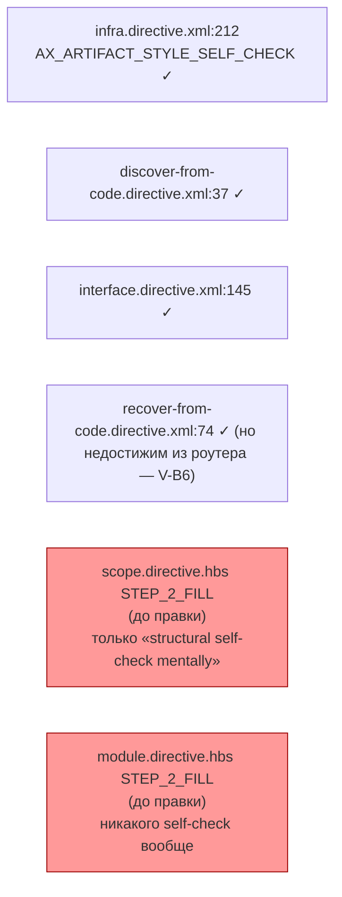
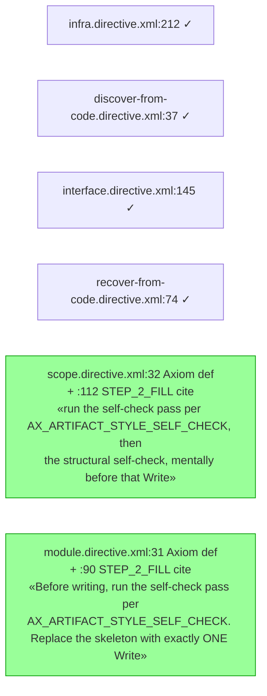

ОТЧЁТ 61 §1 / Пачка 19 — T-B6-14: Каждая запись документа целиком несёт самопроверку стиля

СТАТУС: DONE

Рабочее дерево: `rc-w3`. Ветка `lead/spec-authoring`, от `origin/codex/sdd-v2-rc52-followup` @ `c9b58636`. Предпосылка `T-B6-01` (`d0dde2cd`) выполнена в этой же ветке до этого коммита.

КОММИТ (локальный, НИЧЕГО не запушено):
- `068c7080aea629e95b0ff1593ea3115eb4d69bb3` feat(T-B6-14): every whole-document Write in scope/module carries the style self-check

---

## 1. Файлы

| Путь | Тип | Смысловое изменение | Чем доказано |
|---|---|---|---|
| `ai/kit/templates/sdd-v2/scope.directive.hbs` | правка | BeliefState подключил `{{> "axiom/process/ax-artifact-style-self-check"}}`; `STEP_2_FILL` перед единственным whole-document `Write` теперь явно вызывает «Before writing, run the self-check pass per `AX_ARTIFACT_STYLE_SELF_CHECK`», рядом со старым структурным самочеком. | `check:directives-fresh`; `audit:axioms`/`audit:halts` |
| `ai/kit/templates/sdd-v2/module.directive.hbs` | правка | То же самое: подключён аксиом + вызов «Before writing, run the self-check pass per `AX_ARTIFACT_STYLE_SELF_CHECK`» прямо перед `Replace the skeleton with exactly ONE Write`. | то же |
| `ai/directives/sdd-v2/scope.directive.xml` | регенерирован | Пересобран. | `check:directives-fresh` |
| `ai/directives/sdd-v2/module.directive.xml` | регенерирован | Пересобран. | `check:directives-fresh` |

`git diff --stat`: 4 файла, 32 insertions(+), 6 deletions(-) — все 4 в таблице.

---

## 2. Архитектура было / стало

### Было — 2 из 6 whole-document-Write владельцев (scope, module) без стилевого самочека



### Стало — все 6 whole-document-Write владельцев несут аксиом



---

## 3. Доказательства (ПРИЁМКА: «every whole-document Write carries the style self-check»)

**1. Текстовая проверка обоих владельцев.**
```
$ grep -n "AX_ARTIFACT_STYLE_SELF_CHECK" ai/directives/sdd-v2/scope.directive.xml ai/directives/sdd-v2/module.directive.xml
scope.directive.xml:32:    <Axiom id="AX_ARTIFACT_STYLE_SELF_CHECK">
scope.directive.xml:112:        `AX_ARTIFACT_STYLE_SELF_CHECK`, then the structural self-check, mentally before that Write.
module.directive.xml:31:    <Axiom id="AX_ARTIFACT_STYLE_SELF_CHECK">
module.directive.xml:90:        writing, run the self-check pass per `AX_ARTIFACT_STYLE_SELF_CHECK`. Replace
```
Оба файла содержат и определение аксиома, и цитирование рядом с `Write` — ВЫПОЛНЕНО.

**2. `build:directives` / `check:directives-fresh`.**
```
$ npm run build:directives && node ai/kit/check-directives-fresh.ts
Generated 55 directive(s).
✓ ai/directives/** matches a fresh rebuild.
```
exit 0 оба раза. ВЫПОЛНЕНО.

**3. `audit:sdd-templates` (fresh + axioms + contracts + halts + budgets) — не появилось dangling/undefined находок по новому аксиому.**
```
✓ axiom-activation audit clean — 28 template(s) checked.
```
exit 0. ВЫПОЛНЕНО (аксиом заякорен вне BeliefState в обоих файлах — иначе `lintDanglingAxioms` дал бы warning).

**4. Кит-тесты (45 файлов `ai/kit/__tests__/*.test.ts`).**
```
# tests 238, pass 237, fail 0, skipped 1
```
ВЫПОЛНЕНО.

---

## 4. Отклонения от брифа

Нет. Задача выполнена буквально по формулировке доски (`61-TASK-BOARD.md:162`, «D9 восстановлен: AX_ARTIFACT_STYLE_SELF_CHECK в scope/module»).

ОТКРЫТЫЕ ВОПРОСЫ: нет.

---

## § Правки по V-BATCH-19 (независимая проверка)

Верификатор нашёл два неблокирующих дефекта, оба исправлены:

1. **Три числа строки в mermaid были неверны в обоих диаграммах** («было» и «стало»): `infra.directive.xml:207`→`:212`, `interface.directive.xml:140`→`:145`, `recover-from-code.directive.xml:69`→`:74` (реальные строки на базе `c9b58636`, эти три файла пачкой не тронуты). `discover-from-code.directive.xml:37` был верен изначально. Исправлено выше (6 вхождений: по 3 числа × 2 диаграммы).
2. **Регресс-замка у T-B6-14 не было**: `grep -rn AX_ARTIFACT_STYLE_SELF_CHECK ai/kit/__tests__` до этой правки не давал попаданий; приёмка держалась только на grep из этого отчёта (§3 п.1). Добавлен коммитом `5803239478de9c3ec946912fd1a270693e0741ee` (`test(kit): regression locks for T-B6-01/T-B6-14`) — describe-блок `every whole-document Write carries the style self-check (LOCK-3, T-B6-14, V-BATCH-19)` в `ai/kit/__tests__/stateless-sdd-flow-contract.test.ts`: grep-контракт по всем 6 генерируемым владельцам (`scope`, `module`, `infra`, `interface`, `discover-from-code`, `recover-from-code`), каждый обязан цитировать `AX_ARTIFACT_STYLE_SELF_CHECK` непосредственно перед своим единственным `Write`.

Проверено после обеих правок: `npm test` (3635/3643 pass, exit 0), `npm run check` (ALL PASS 5/5), `npm run build:directives && npm run check:directives-fresh` (fresh). Подробности — сводный отчёт `R-BATCH-19-spec-authoring.md` § «Правки по V-BATCH-19 и T-B6-10b».

Команды пуша для Lead:
```
git push origin lead/spec-authoring
```
