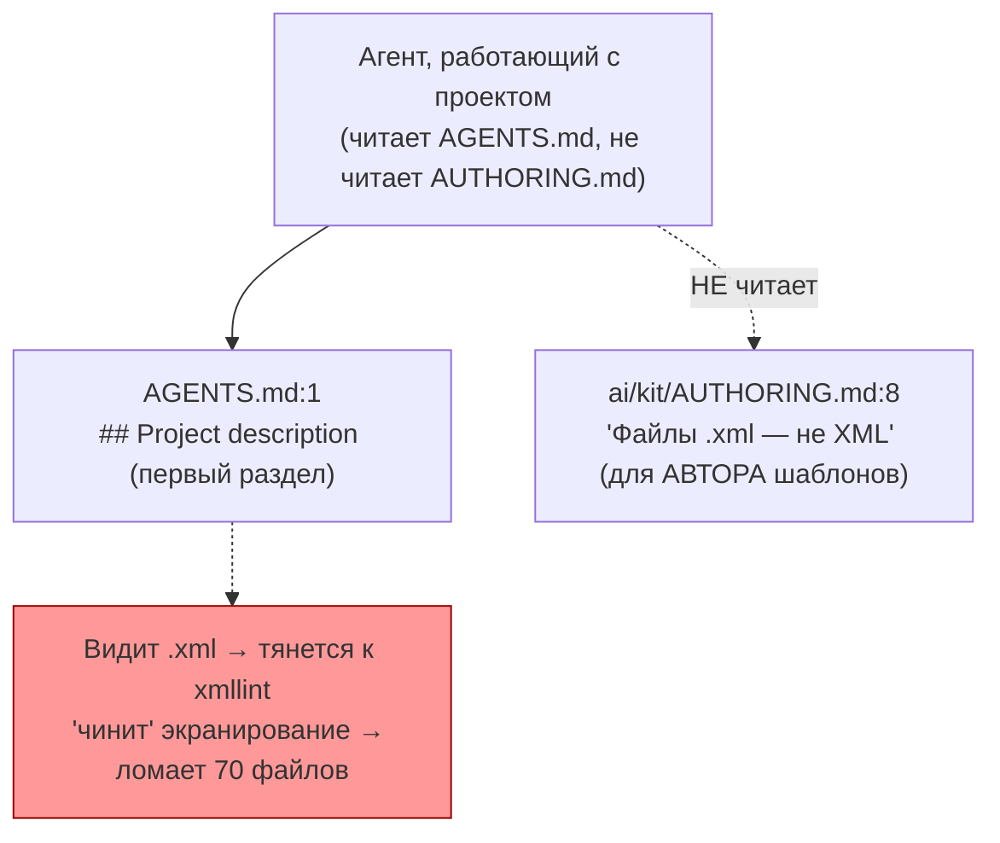
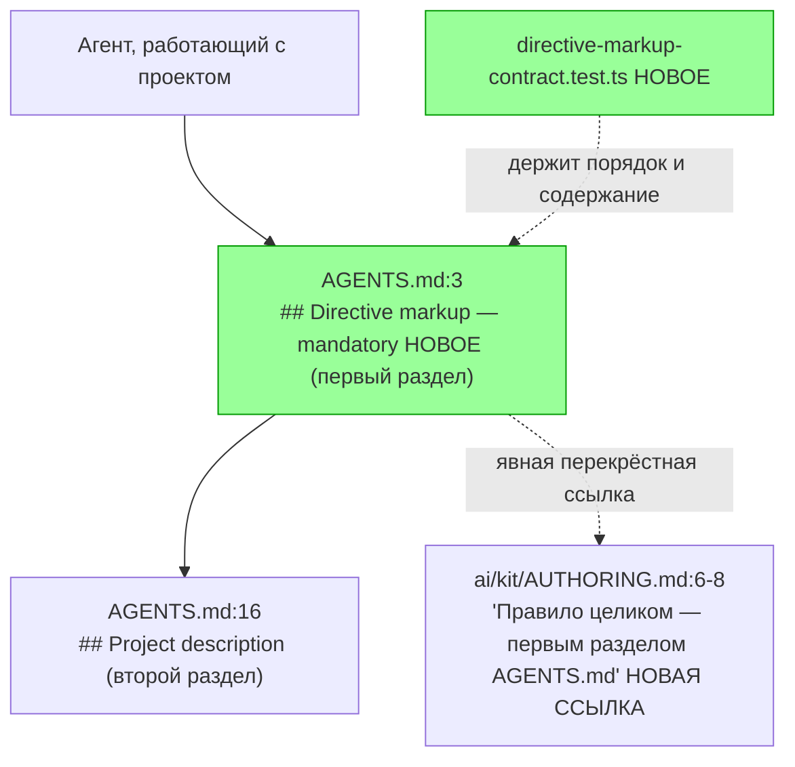

ОТЧЁТ 61 §1 — T-B6-15: D2 восстановлен — «Directive markup — mandatory» первым разделом `AGENTS.md`

СТАТУС: DONE

Рабочее дерево: `rc-w2`. Ветка `lead/kit-lint`.

КОММИТ (локальный, НИЧЕГО не запушено):
- `4401017a` docs(T-B6-15): AGENTS.md restores directive-markup-mandatory as its first section

---

## 1. Файлы

| Путь | Тип | Смысловое изменение | Чем доказано |
|---|---|---|---|
| `AGENTS.md` | правка | Новый раздел «## Directive markup — mandatory» вставлен ПЕРЕД «## Project description» (был первым в v1, отсутствовал в v2 RC целиком). Текст: `ai/directives/**/*.xml` — prompt markup, не XML; теги — якоря внимания, не парсер-синтаксис; запрет запускать `xmllint`/валидатор. | `directive-markup-contract.test.ts`. |
| `ai/kit/AUTHORING.md` | правка | §1 дополнен перекрёстной ссылкой на новый раздел `AGENTS.md` (правило теперь известно и агенту-оператору проекта, не только автору шаблонов). | Ручная сверка текста. |
| `ai/kit/__tests__/directive-markup-contract.test.ts` | новый | 5 кейсов: оба заголовка существуют; «Directive markup» раньше «Project description»; секция содержит «not XML» + «xmllint»; `package.json` не содержит `xmllint`; ни один файл `scripts/**.{ts,js,mjs,sh}` не содержит `xmllint`. | Сам файл. |

`git diff --stat` — 3 файла, 3 строки таблицы. Совпадает.

---

## 2. Архитектура было / стало

### Было — `AGENTS.md` открывается сразу с «Project description», правило живёт только в документе для авторов шаблонов



### Стало — правило первым разделом `AGENTS.md`, кросс-ссылка в `AUTHORING.md`


Узлы: `AGENTS.md:3-13` (новый раздел), `ai/kit/AUTHORING.md:6-8` (кросс-ссылка), `ai/kit/__tests__/directive-markup-contract.test.ts`.

---

## 3. Доказательства (команды из ПРИЁМКИ, фактический вывод, exit-код)

**1. «AGENTS.md declares directive markup before project description» + «no repository script invokes an XML validator» — новый файл, все 5 кейсов зелены.**
```
$ tsx --test ai/kit/__tests__/directive-markup-contract.test.ts
# tests 5, pass 5, fail 0
```
exit 0. ВЫПОЛНЕНО.

**2. Полный kit-набор (41 файл) + `npm run check`.**
```
# tests 219, pass 218, fail 0, skip 1
[sdd-verify] ✅ ALL PASS (5/5)
  ✅ type-check  ✅ test:coverage  ✅ lint  ✅ format  ✅ yagni
```
exit 0. ВЫПОЛНЕНО. (Правка не затрагивает `ai/directives/**` — пересборка директив не требуется, `check:directives-fresh` не запускался отдельно для этой задачи, но входит в `pre-commit`, см. п.3.)

**3. Коммит через `pre-commit` целиком, без `--no-verify` (первая попытка коммита закончилась флейком/успехом с плейсхолдер-сообщением «wip» — исправлено `git commit --amend` на этой же, единственной, вершине коммитов; хук отработал одинаково оба раза).**
```
✅ Pre-commit passed
[lead/kit-lint 4401017a] docs(T-B6-15): AGENTS.md restores directive-markup-mandatory as its first section
 3 files changed, 92 insertions(+)
```
exit 0. ВЫПОЛНЕНО.

---

## 4. Отклонения, открытые вопросы, команды пуша

**Отклонение.** Тест-файл размещён в `ai/kit/__tests__/directive-markup-contract.test.ts` (совпадает с именем v1-замка по доске); координация каталога с параллельной задачей T-9 (RULES, вне этой пачки) не потребовалась — конфликта имён файлов не возникло.

**Открытые вопросы:** нет.

**Команды пуша для Lead** — см. сводный отчёт `R-BATCH-05-kit-lint.md`.
