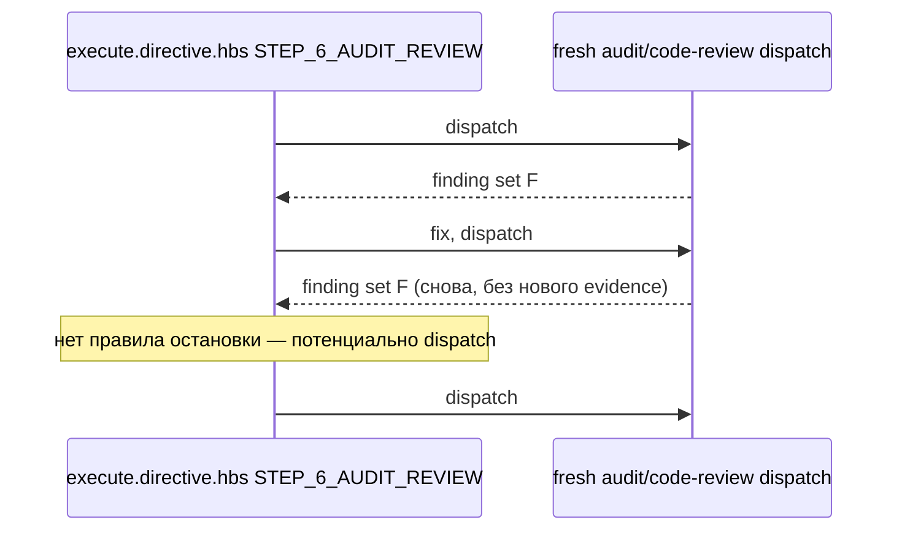
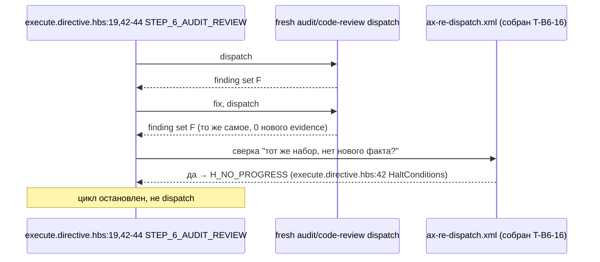

ОТЧЁТ 61 §1 — T-B6-16: повтор блокирующего набора без нового evidence останавливает цикл

СТАТУС: DONE

Рабочее дерево: `rc-v6`. Ветка `lead/phase-agent-bounds` (см. `R-BATCH-17-phase-agent-bounds.md`).

КОММИТ (локальный, НИЧЕГО не запушено):
- `6de96024` feat(T-B6-16): repeated blocking finding set with no new evidence halts execute

---

## 1. Файлы

| Путь | Тип | Смысловое изменение | Чем доказано |
|---|---|---|---|
| `ai/kit/axiom/process/ax-re-dispatch.xml` | правка | Аксиом (ранее не собирался ни в один шаблон — dangling) получил вторую половину: помимо «любая правка → обязателен новый изолированный ревью-диспатч», теперь явно ограничивает повтор — если повторный диспатч возвращает ТОТ ЖЕ блокирующий набор находок, что и предыдущая попытка, без нового доказательства между попытками (ни нового диффа, ни нового прогона инструмента, ни нового факта), это доказуемое отсутствие прогресса → halt `H_NO_PROGRESS` вместо третьего диспатча на тот же набор. | Ручное чтение текста; `npm run audit:halts` зелен после сборки (см. §3). |
| `ai/kit/templates/sdd-v2/execute.directive.hbs` | правка | BeliefState подключает `{{> "axiom/process/ax-re-dispatch"}}`; новая строка `H_NO_PROGRESS` в `<HaltConditions>`; STEP_6_AUDIT_REVIEW дополнен: правка «earns another fresh isolated audit/code-review dispatch» + явный halt `H_NO_PROGRESS` при повторе набора без нового evidence. | `npm run audit:halts` зелен; `npm run check:directive-budgets` зелен; `npm test` зелен (после правки снапшота инспектора — см. «Отклонения»). |
| `ai/directives/sdd-v2/execute.directive.xml` | правка (сгенерировано) | Пересобранная монолитная версия того же шаблона. | `npm run check:directives-fresh` → «matches a fresh rebuild». |
| `ai/inspector/core/__tests__/parse-directive.test.ts` | правка | Снапшот-тест `HaltConditions carries the current stateless execute boundaries` (список из 5 id, отсортирован) дополнен новым `H_NO_PROGRESS` — механическое следствие новой строки, не поведенческая правка инспектора. | Сам тест: `not ok` → `ok` после правки (см. §3). |

`git diff --stat 6b60f7e9..6de96024` — 4 файла. Совпадает.

---

## 2. Архитектура было / стало

### Было — AX_RE_DISPATCH не собран нигде; execute может редиспатчить бесконечно на одном и том же наборе находок



### Стало — H_NO_PROGRESS останавливает цикл на втором повторе без нового доказательства



---

## 3. Доказательства

**1. Аксиом собран, halt объявлен.**
```
$ grep -n 'ax-re-dispatch\|H_NO_PROGRESS' ai/kit/templates/sdd-v2/execute.directive.hbs
    {{> "axiom/process/ax-re-dispatch"}}
    | `H_NO_PROGRESS` | Per `AX_RE_DISPATCH`, a re-dispatch returns the same blocking finding set as the immediately preceding attempt on the same artifact, with no new evidence between the two attempts |
        halt `H_NO_PROGRESS` rather than re-dispatching again on the identical set.
```
ВЫПОЛНЕНО.

**2. Строка-доказательство «halts on repeated finding set with no new evidence».**
```
$ grep -n "same blocking finding set\|no new evidence" ai/kit/axiom/process/ax-re-dispatch.xml ai/kit/templates/sdd-v2/execute.directive.hbs
ax-re-dispatch.xml:  Re-dispatch is not unbounded, though. If a re-dispatch returns the SAME blocking finding set as the
ax-re-dispatch.xml:  between the two attempts (no changed diff, no new tool output, no new fact the prior attempt did not
execute.directive.hbs:    | `H_NO_PROGRESS` | ... with no new evidence between the two attempts |
execute.directive.hbs:        that fresh dispatch returns the same blocking finding set as the immediately preceding one,
execute.directive.hbs:        with no new evidence between the two attempts, halt `H_NO_PROGRESS` ...
```
ВЫПОЛНЕНО.

**3. `npm run audit:halts`/`check:directive-budgets` зелены после сборки.**
```
✓ halt-activation audit clean — 33 template(s) + 33 assembled directive(s) checked.
✓ every lazy directive under ai/directives/sdd-v2/** is within budget.
```
exit 0 оба. ВЫПОЛНЕНО.

**4. `npm test` — обнаружена и исправлена сломанная строка снапшота ВНЕ зоны `ai/kit/**` (см. «Отклонения»), после правки зелено.**
```
до правки: not ok 35 - HaltConditions carries the current stateless execute boundaries
  (expected 5 ids, actual 6 — H_NO_PROGRESS отсутствовал в ожидаемом списке)
после правки:
# tests 3605
# pass 3595
# fail 0
```
exit 0. ВЫПОЛНЕНО.

**5. Коммит через pre-commit целиком (полный `npm run check` внутри, включая test:coverage).**
```
[sdd-verify] ✅ ALL PASS (5/5)
✓ ai/directives/** matches a fresh rebuild.
✓ audit:axioms / audit:contracts / audit:halts clean
✓ every lazy directive ... within budget
✅ Pre-commit passed
[lead/phase-agent-bounds 6de96024] feat(T-B6-16): ...
```
exit 0. ВЫПОЛНЕНО (коммит выполнялся в фоне из-за таймаута 120с полного профиля; дождался завершения, exit 0 подтверждён).

---

## 4. Отклонения, открытые вопросы

**Отклонение 1 (правка файла вне списка «трогать» брифа — необходимое следствие).** Добавление `H_NO_PROGRESS` в `execute.directive.hbs`'s `<HaltConditions>` сломало существующий снапшот-тест `ai/inspector/core/__tests__/parse-directive.test.ts` (жёстко перечисляет 5 halt id для `execute.directive.xml`, теперь их 6). Файл — вне зоны брифа (`ai/kit/**` не включает `ai/inspector/**`) и вне явного списка «Файлы» задачи. Правка неизбежна: без неё `npm test` красный, а pre-commit-гейт `check` (включающий `test:coverage`) блокирует любой коммит без `--no-verify` (запрещено правилами). Правка механическая (добавлена одна строка в отсортированный массив ожидаемых id), не меняет поведение самого инспектора — он по-прежнему корректно парсит `<HaltConditions>`, просто теперь ожидает актуальный список. Задокументировано отдельным пунктом в теле коммита.

**Отклонение 2 (сознательно НЕ реализовано — both-way про запись вердикта, по риску батча).** Бриф явно указывает: «both-way про запись отложенного решения — remains за отложенной темой (§3.4)». Реализован ТОЛЬКО правило останова (повтор набора без нового evidence → `H_NO_PROGRESS`); механизм записи `[verdict: pending-operator]` и правило «эта запись НЕ считается новым evidence» — НЕ реализованы, поскольку самого механизма записи отложенного решения в дереве ещё не существует (это предмет будущей задачи V14-2e). Текст halt-правила сформулирован достаточно обще («no new fact the prior attempt did not already have»), чтобы не противоречить будущему both-way уточнению V14-2e, когда оно появится.

**Отклонение 3 (АХ_RE_DISPATCH — переиспользование существующего, изначально «ревью»-ориентированного аксиома).** `ax-re-dispatch.xml` до этой правки был исключительно про «правка → обязателен новый ревью-диспатч» (тема STEP_2⇄STEP_3 review-lifecycle/critic-protocol, ср. `ap-no-re-dispatch.xml`). Файловый список брифа (`ax-re-dispatch.xml`, `execute.directive.hbs`) и текст задачи («Provable-progress») однозначно указывают на РАСШИРЕНИЕ этого же аксиома вторым абзацем про ограничение повтора, а не на создание нового id — так и сделано; смысл первого абзаца не тронут.

**Открытые вопросы Lead:** нет.
