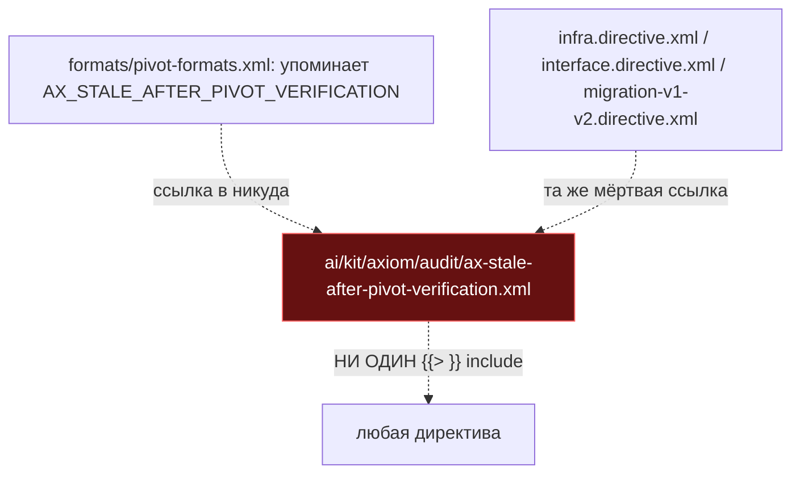
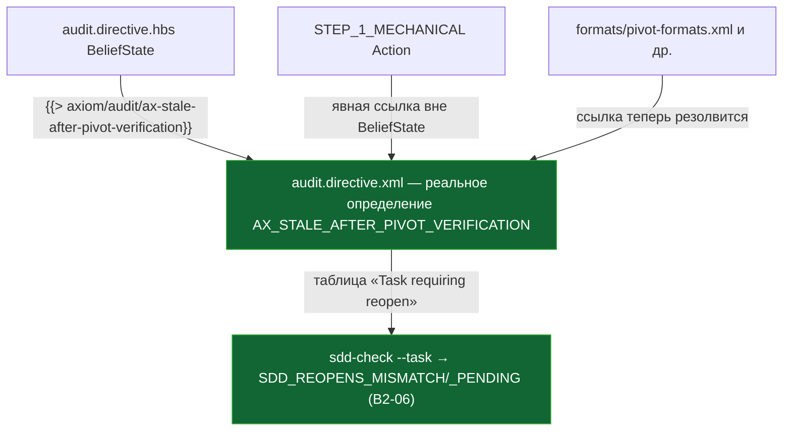

ОТЧЁТ 40 §5.1 — T-B6-17: проверка реопена собрана и в директивной половине

СТАТУС: DONE

Рабочее дерево: `rc-v6`. Ветка `lead/reopen-by-cause`, поверх B2-06 (`65f3a411`).

КОММИТ:
- `b558c64c` feat(T-B6-17): [REOPENS] mechanical check is assembled into the audit directive

---

## 1. Файлы

| Путь | Тип | Смысловое изменение | Чем доказано |
|---|---|---|---|
| `ai/kit/templates/sdd-v2/audit.directive.hbs` | правка | Добавлен `{{> "axiom/audit/ax-stale-after-pivot-verification"}}` в `<BeliefState>` (рядом с `ax-closed-world-primary-check`) — аксиом существовал в `ai/kit/axiom/**` с B2-01(?)/раньше, но не подключался НИКУДА (issue #13/#19). Также в `STEP_1_MECHANICAL`'s `<Action>` добавлена явная ссылка `AX_STALE_AFTER_PIVOT_VERIFICATION` вне `<BeliefState>` — обязательное требование линта «dangling axiom» (AUTHORING.md §7). | build + `audit:axioms`/`audit:contracts` ниже. |
| `ai/kit/axiom/audit/ax-stale-after-pivot-verification.xml` | правка | Строка «Task requiring reopen» таблицы теперь ссылается на механическую проверку B2-06 (`SDD_REOPENS_MISMATCH`/`_PENDING`) вместо расплывчатого «Reopens counter incremented since pivot date»; добавлен абзац с ровно тем примером из акцептанса: тикет `triggered-reopen=Round-2` + `Reopens: 0` → находка. | текст файла + `audit:contracts`. |
| `ai/kit/axiom/audit/ax-mechanical-via-sdd-check.xml` | правка | Буллет `sdd-check --task` пополнен пунктом `[REOPENS]` рядом с `PHASE_RECEIPT` — документирует, что `[REOPENS]` теперь механическая проверка тула, а не то, что аудит должен пересчитывать руками. | текст файла. |
| `ai/kit/lint-axioms.ts` | правка | Удалена строка `AX_STALE_AFTER_PIVOT_VERIFICATION` из `KNOWN_DANGLING_AXIOM_REFS` (была для 4 файлов: `formats/pivot-formats.xml`, `infra.directive.xml`, `interface.directive.xml`, `migration-v1-v2.directive.xml`) — аллоулист только сокращается, что и произошло. | build проходит без `undefined axiom reference` для этих 4 файлов. |
| `ai/directives/sdd-v2/audit.directive.xml`, `ai/directives/sdd-v2/audit/steps/STEP_1_MECHANICAL.xml` | build-output | Регенерированы из правки `.hbs`/аксиом выше. | `check:directives-fresh`. |

`git show --stat b558c64c` — 6 файлов (+52/−6). Совпадает.

---

## 2. Архитектура было / стало

### Было — аксиом существует, но невидим



### Стало — подключён, обновлён под B2-06



---

## 3. Доказательства (ПРИЁМКА брифа)

1. **«[REOPENS] восстановлен как механическая проверка (код — B2); ax-stale-after-pivot-verification собран»** — ВЫПОЛНЕНО.

   **Правка по вердикту верификатора (V-BATCH-15 F-5.1):** исходное доказательство здесь («dangling 36 → 35») недостоверно — `build:directives` даёт `⚠ 35 dangling axiom(s)` что на `HEAD`, что на базе `fcdba417` до этой задачи (проверено верификатором и переподтверждено здесь: T-B6-17 отвязывает аксиом от «dangling»-списка на 1, B2-18 добавляет два новых неподключённых аксиома, из которых оба отреферены в шагах — нетто 0, метрика не двигалась). Настоящее, воспроизводимое доказательство — другое и сильнее: удалить `{{> "axiom/audit/ax-stale-after-pivot-verification"}}` из `audit.directive.hbs` и пересобрать:
   ```
   $ node --experimental-strip-types ai/kit/build-directives.ts
   ✗ 5 undefined axiom reference(s) — mentioned in rendered output, no <Axiom id> defined anywhere in the build
     sdd-v2/audit.directive.xml: AX_STALE_AFTER_PIVOT_VERIFICATION
     sdd-v2/formats/pivot-formats.xml: AX_STALE_AFTER_PIVOT_VERIFICATION
     sdd-v2/infra.directive.xml: AX_STALE_AFTER_PIVOT_VERIFICATION
     sdd-v2/interface.directive.xml: AX_STALE_AFTER_PIVOT_VERIFICATION
     sdd-v2/migration-v1-v2.directive.xml: AX_STALE_AFTER_PIVOT_VERIFICATION
   exit=1
   ```
   (файл восстановлен, `build:directives` снова exit 0 после отмены мутации — проверено).
2. **«тикет triggered-reopen=Round-2 + Reopens:0 → finding»** — ВЫПОЛНЕНО как ТЕКСТ директивы (сценарий описан явно в обновлённом `ax-stale-after-pivot-verification.xml`), а как МЕХАНИЧЕСКАЯ проверка — уже покрыто B2-06's `reopens.test.ts`/`log-vocabulary-eval.test.ts` (группа 3), которые вызывают ровно этот сценарий через `checkTicket`.
3. **Аудиты сборки** — ВЫПОЛНЕНО.
   ```
   $ npm run check:directives-fresh   → ✓ ai/directives/** matches a fresh rebuild.
   $ node ai/kit/audit-axiom-activation.mjs      → ✓ clean — 28 template(s)
   $ node ai/kit/audit-contract-activation.mjs   → ✓ clean — 28 + 33 assembled
   $ node ai/kit/audit-halt-activation.mjs       → ✓ clean — 33 + 33 assembled
   ```
4. **Полный прогон** — ВЫПОЛНЕНО. `npm run check` → `✅ ALL PASS (5/5)`.

---

## 4. Отклонения и открытые вопросы

Нет отклонений от брифа. Размещение `{{> "axiom/audit/ax-stale-after-pivot-verification"}}` выбрано рядом с `ax-closed-world-primary-check` (по смысловой близости — оба про «что осталось не тронутым после решения оператора») — это выбор конкретной позиции в списке, не затрагивающий требуемое поведение.

**Команды пуша для Lead:**
```
git push origin lead/reopen-by-cause
```
