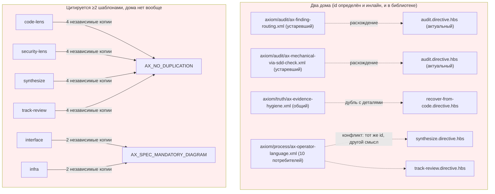
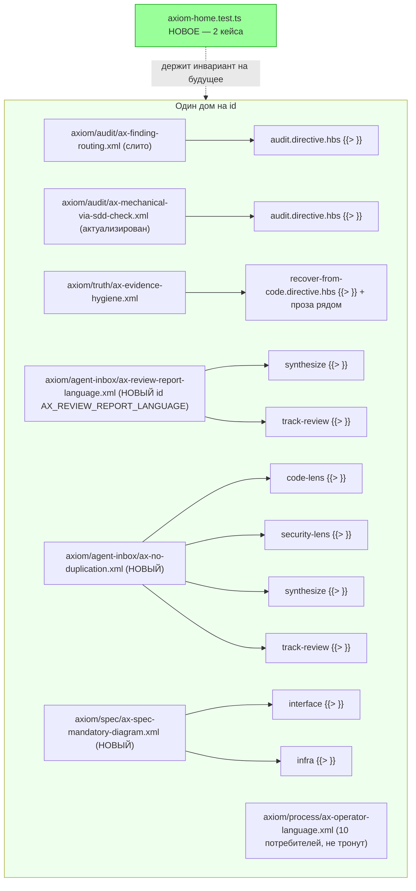

ОТЧЁТ 61 §1 — T-B6-18: Инлайн-аксиомы не расходятся с библиотекой (7 нарушений)

СТАТУС: DONE

Рабочее дерево: `rc-w2`. Ветка `lead/kit-lint`.

КОММИТ (локальный, НИЧЕГО не запушено):
- `b6eb6f4b` fix(T-B6-18): inline axioms no longer diverge from the library

Примечание: комментарий-форматирующий баг, обнаруженный в файлах ЭТОГО коммита (multi-line `<!-- -->` протекает в тело аксиомы через `normalizeBrick()`), исправлен последующим коммитом `T-B6-23` (`61b86fb8`) — см. отчёт `R-T-B6-23.md` §4. На момент коммита `b6eb6f4b` весь гейт (`pre-commit`, включая `check:directives-fresh`) был зелёным, т.к. баг не роняет ни один существующий тест/чек — он молча портит СОДЕРЖИМОЕ (см. разбор в R-T-B6-23.md); обнаружен только при работе над T-B6-23, когда добавление НОВОГО многострочного комментария сделало утечку заметной в целевом тесте.

---

## 1. Файлы

| Путь | Тип | Смысловое изменение | Чем доказано |
|---|---|---|---|
| `ai/kit/axiom/audit/ax-finding-routing.xml` | правка | Слиты 3 строки таблицы (`RULE_FILE_INCOMPLETE`, `LANGUAGE_QUALITY`, `YAGNI_WAIVER_INCOMPLETE`), существовавшие только инлайн в `audit.directive.hbs`, с закрывающим абзацем про reconcile/approval-#1, существовавшим только в библиотеке. Теперь единственный дом `AX_FINDING_ROUTING`. | `axiom-home.test.ts`; `check:directives-fresh`. |
| `ai/kit/axiom/audit/ax-mechanical-via-sdd-check.xml` | правка | Библиотечная копия была устаревшей (утверждала, что audit владеет проверками, которые `sdd-check` с тех пор забрал себе); заменена целиком на актуальный инлайн-текст. | Диф-сверка вручную; `axiom-home.test.ts`. |
| `ai/kit/templates/sdd-v2/audit.directive.hbs` | правка | Инлайн `AX_FINDING_ROUTING` и `AX_MECHANICAL_VIA_SDD_CHECK` заменены на `{{> "axiom/audit/..."}}`. | `axiom-home.test.ts`, `audit:sdd-templates`. |
| `ai/kit/templates/sdd-v2/recover-from-code.directive.hbs` | правка | Инлайн `AX_EVIDENCE_HYGIENE` заменён на `{{> "axiom/truth/ax-evidence-hygiene"}}`; специфика флоу (примеры Facts/Assumptions/Hypotheses, связь с `AX_REVERSE_INVENTORY_GATE`) сохранена как обычная проза рядом, не как второе определение id. | `axiom-home.test.ts`. |
| `ai/kit/axiom/agent-inbox/ax-no-duplication.xml` | новый | Общий дом для `AX_NO_DUPLICATION`, инлайненного независимо в 4 agent-inbox шаблонах; текст слит из двух формулировок (поиск по коду / merge находок на слое reconciliation). | `axiom-home.test.ts` («2+ шаблона → партиал»). |
| `ai/kit/templates/sdd-v2/agent-inbox/{code-lens,security-lens,synthesize,track-review}.directive.hbs` | правка | Инлайн `AX_NO_DUPLICATION` (6 строк) заменён на `{{> "axiom/agent-inbox/ax-no-duplication"}}` + `{{> "axiom/scaffold/ax-ticket-deduplication"}}` (были ранее вложены друг в друга — теперь два соседних партиала). | `axiom-home.test.ts`; `parse-directive.test.ts` (регрессия на вложенность переведена на синтетическую фикстуру). |
| `ai/kit/axiom/agent-inbox/ax-review-report-language.xml` | новый | `AX_OPERATOR_LANGUAGE`, инлайненный по-разному в `synthesize`/`track-review`, переименован в `AX_REVIEW_REPORT_LANGUAGE` — это ДРУГОЙ, специфичный для MR-отчётов реестр (verdict-эмодзи, RFC-регистр), не дубль репозиторного `AX_OPERATOR_LANGUAGE` (используется 10 другими шаблонами). track-review's более полный текст — канон. | `axiom-home.test.ts`. |
| `ai/kit/templates/sdd-v2/agent-inbox/track-review.directive.hbs` | правка | Инлайн заменён на партиал; 2 внутренних upstream-ссылки (`per \`AX_OPERATOR_LANGUAGE\``) переименованы. | Тест выше. |
| `ai/kit/templates/sdd-v2/agent-inbox/synthesize.directive.hbs` | правка | Инлайн заменён на партиал + прозу «этот узел не переизобретает регистр». | Тест выше. |
| `ai/kit/templates/sdd-v2/agent-inbox/security-lens.directive.hbs` | правка | Устаревшая перекрёстная ссылка «per arch-interrogation `AX_OPERATOR_LANGUAGE`» исправлена на `AX_REVIEW_REPORT_LANGUAGE`. | Грep на новое имя. |
| `ai/kit/axiom/spec/ax-spec-mandatory-diagram.xml` | новый | Общий дом для `AX_SPEC_MANDATORY_DIAGRAM`, инлайненного отдельно в `interface`/`infra` с разными примерами-иллюстрациями; оба примера сохранены в одном тексте. | `axiom-home.test.ts`. |
| `ai/kit/templates/sdd-v2/{interface,infra}.directive.hbs` | правка | Инлайн заменён на партиал; добавлена активация «per `AX_SPEC_MANDATORY_DIAGRAM`» в шаге записи спеки (партиал стал субъектом строгого `audit:axioms`-гейта, которым инлайн не был). | `audit:axioms` (см. §3 — поймано на первой попытке, исправлено). |
| `ai/kit/__tests__/axiom-home.test.ts` | новый | 2 кейса: «no id inlined in a template also has a library file defining the same id», «an axiom id inlined in two or more templates is a partial». | Сам файл. |
| `ai/inspector/core/__tests__/parse-directive.test.ts` | правка | Регрессионный тест на вложенный `<Axiom>` внутри `<Axiom>` больше не зависит от живого корпуса (единственный реальный пример убран этим коммитом) — переведён на синтетическую фикстуру, воспроизводящую ту же форму. | Прогон теста (см. §3). |
| `services/ai-kit/__tests__/snapshots/selector.snapshot.test.ts.snapshot` | правка | Golden-снапшот 4 agent-inbox шаблонов регенерирован через `--test-update-snapshots` (санкционированный путь обновления, не ручная правка). | Прогон снапшот-теста. |
| `ai/directives/sdd-v2/**` (11 сгенерированных файлов) | правка (сборка) | Прямое следствие правок шаблонов. | `check:directives-fresh`. |

`git diff --stat` коммита — 25 файлов. Таблица группирует однотипные по 2-3 строки; каждый путь из диффа покрыт.

---

## 2. Архитектура было / стало

### Было — 7 нарушений «один дом на аксиому»: два дома или ноль домов при ≥2 цитирующих



### Стало — один дом на id, `axiom-home.test.ts` держит инвариант


Узлы: `ai/kit/axiom/agent-inbox/ax-no-duplication.xml`, `ax-review-report-language.xml`, `ai/kit/axiom/spec/ax-spec-mandatory-diagram.xml` (новые файлы), `ai/kit/__tests__/axiom-home.test.ts:44-56` (кейс 1), `:58-77` (кейс 2).

---

## 3. Доказательства (команды из ПРИЁМКИ, фактический вывод, exit-код)

**1. «no axiom id has two homes» + «an axiom used by two or more templates is a partial» — новый файл, оба кейса зелены.**
```
$ tsx --test ai/kit/__tests__/axiom-home.test.ts
# tests 2, pass 2, fail 0
```
exit 0. ВЫПОЛНЕНО.

**2. Первая попытка `audit:sdd-templates` — красная, поймала следствие превращения `AX_SPEC_MANDATORY_DIAGRAM` в партиал (строгий activation-гейт, которого инлайн не касался).**
```
$ npm run audit:axioms
⚠ 2 axiom-activation violation(s):
  templates/sdd-v2/infra.directive.hbs — AX_SPEC_MANDATORY_DIAGRAM — no activation in ExecutionPlan
  templates/sdd-v2/interface.directive.hbs — AX_SPEC_MANDATORY_DIAGRAM — no activation in ExecutionPlan
```
exit 1. Исправлено добавлением «per `AX_SPEC_MANDATORY_DIAGRAM`» в шаг записи спеки обоих шаблонов (STEP_6_FINAL_SPEC / соответствующий шаг infra) — не расширение объёма задачи, а необходимое следствие «инлайн → партиал» по правилу AUTHORING.md §7.

**3. `audit:sdd-templates` ПОСЛЕ исправления активации.**
```
✓ ai/directives/** matches a fresh rebuild.
✓ axiom-activation audit clean — 28 template(s) checked.
✓ contract-activation audit clean.
✓ halt-activation audit clean.
✓ every lazy directive ... within budget.
```
exit 0. ВЫПОЛНЕНО.

**4. Первая попытка полного `npm run check` — красная, 7 тестов упали (2 из них — golden-снапшот; 5 подпунктов одного parent-теста «selectDirective snapshot»; плюс отдельный parser-регрессия).**
```
not ok 39 - a nested <Axiom> inside <Axiom> becomes a child, not a truncation of the outer
not ok 301 - selectDirective snapshot (D-124/AI-46)  [3 из 8 подтестов красные]
```
exit 1. Диагноз: снапшот и регрессионный тест зависели от ТОЧНОГО вида кода, который эта задача преднамеренно меняет (вложенный `<Axiom>` убран; рендер agent-inbox шаблонов изменился). Оба — ожидаемые, честные красные, не брак.

**5. Регенерация снапшота (санкционированный путь) + перевод parser-регрессии на синтетическую фикстуру.**
```
$ tsx --test --test-update-snapshots services/ai-kit/__tests__/selector.snapshot.test.ts.snapshot
# tests 8, pass 8, fail 0
```
+ правка `parse-directive.test.ts` на синтетический XML-фикстур того же вложенного вида.

**6. `npm run check` ПОСЛЕ исправлений.**
```
[sdd-verify] ✅ ALL PASS (5/5)
```
exit 0. ВЫПОЛНЕНО.

**7. Коммит через `pre-commit` целиком, без `--no-verify`.**
```
✅ Pre-commit passed
[lead/kit-lint b6eb6f4b] fix(T-B6-18): inline axioms no longer diverge from the library
 25 files changed, 387 insertions(+), 230 deletions(-)
```
exit 0. ВЫПОЛНЕНО.

---

## 4. Отклонения, открытые вопросы, команды пуша

**Отклонение 1.** `AX_OPERATOR_LANGUAGE` переименован в `AX_REVIEW_REPORT_LANGUAGE` в двух agent-inbox шаблонах — доска ставила это как «два дома одного id», но фактическое содержимое двух копий оказалось СЕМАНТИЧЕСКИ ДРУГИМ правилом (MR-review-report регистр: verdict-эмодзи, RFC-дисциплина), а не дублем репозиторного `AX_OPERATOR_LANGUAGE` (10 потребителей, общая spec/ticket-дисциплина). Слияние под одним id стёрло бы либо специфику review-report, либо засорило бы генерик-аксиому. Переименование — принципиальное решение, не расширение задачи: результат («один дом на id») тот же.

**Отклонение 2 (найдено при работе, исправлено вне заявленного объёма).** Строка `security-lens.directive.hbs:30` содержала устаревшую перекрёстную ссылку на «arch-interrogation `AX_OPERATOR_LANGUAGE`» (устаревший, не собираемый файл `ai/directives/agent-inbox/arch-interrogation.directive.xml` вне сборки sdd-v2) — обновлена на новое имя для консистентности; без этого агент читал бы ссылку на несуществующее более определение.

**Обнаруженный, но не относящийся к этой задаче баг:** multi-line `<!-- -->` комментарии, добавленные этим коммитом в 5 новых/правленых axiom-файлов, "протекают" в тело рендера через `normalizeBrick()` (см. `R-T-B6-23.md` §4). На момент коммита `b6eb6f4b` `check:directives-fresh`, все аудиты и весь `npm run check` были ЗЕЛЁНЫ — баг не ловится существующими проверками, только визуальным осмотром рендера. Исправлен в коммите `T-B6-23` (`61b86fb8`) вместе с 3 новыми файлами того же типа.

**Открытые вопросы:** нет.

**Команды пуша для Lead** — см. сводный отчёт `R-BATCH-05-kit-lint.md`.
