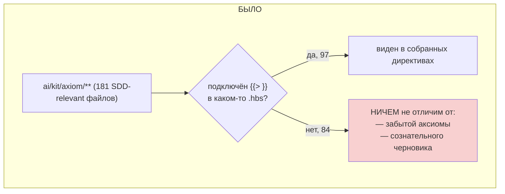
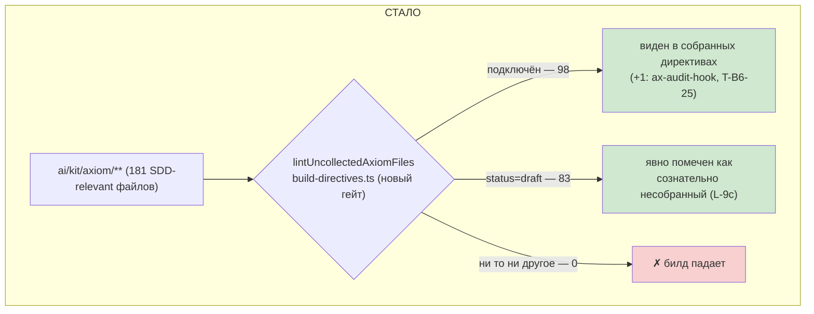

# R-T-B6-19 — каждая аксиома либо использована, либо помечена черновиком

Ветка `lead/axioms-one-home`, коммит `7db7e1de`. L-9 (гибрид вариант c): 20 цитируемых в плане + названные в §1 аксиомы — собрать (сделано предыдущими задачами трека T-B6); остальные из SDD-relevant подмножества — `status="draft"`.

**Критерий выборки (Q1, зафиксирован явно).** 40-TRACK-DIRECTIVES-SKILLS.md §4.1 указал: библиотека целиком — 427 аксиомов, 322 не собраны; но «SDD-relevant» подмножество — `process`(56)/`spec`(36)/`audit`(25)/`scaffold`(20)/`boundary`(16)/`critic`(13)/`truth`(11)/`interview`(3) = 181 (не 427/322). Остальные каталоги (`coding`/`svelte`/`testing`/`e2e`/`storybook`/`infra`/`uikit`/`error`/`typescript`/`perf`/`logging`/`agent-inbox`) — per-language rule-файлы, потребляемые через `AX_RULES_COMPLIANCE_AGAINST_ACTIVATED_RULES`'s cascade, а не через `{{> "axiom/…"}}`-инклюды директив; вне критерия этой задачи по построению.

## 1. Файлы

### 1.1 Код и тесты

| Путь | Тип | Смысловое изменение | Чем доказано |
|---|---|---|---|
| `ai/kit/lint-axioms.ts` | правка | новая `lintUncollectedAxiomFiles(axiomFiles, connectedPartials)` + `formatUncollectedAxiomsReport` — каждый файл либо в `connectedPartials`, либо несёт `status="draft"` | `lint-axioms.test.ts` 30/30 |
| `ai/kit/build-directives.ts` | правка | новый гейт (`START_FAIL_ON_UNCOLLECTED_AXIOM_FILES`): обходит 8 SDD-relevant каталогов `ai/kit/axiom/**`, собирает все `{{> "axiom/…"}}`-инклюды из `ai/kit/templates/sdd-v2/**`, роняет билд при находке | `build:directives --check` exit 0 |
| `ai/kit/__tests__/lint-axioms.test.ts` | правка | unit-тесты `lintUncollectedAxiomFiles`/`formatUncollectedAxiomsReport` + интеграционный замок на РЕАЛЬНОМ дереве (`ai/kit/axiom` × `ai/kit/templates/sdd-v2`) | `node --test` |

### 1.2 83 аксиома, помечены `status="draft"` (файл не подключён ни одним `{{> "axiom/<dir>/<name>"}}` на момент задачи)

| Путь | Тип | Смысловое изменение | Чем доказано |
|---|---|---|---|
| `ai/kit/axiom/audit/ax-bdd-coverage-verification.xml` | правка | добавлен `status="draft"` на `<Axiom id>` — файл не подключён ни одним `{{> }}` | `lintUncollectedAxiomFiles` в build:directives (0 нарушений) |
| `ai/kit/axiom/audit/ax-completeness-check.xml` | правка | добавлен `status="draft"` на `<Axiom id>` — файл не подключён ни одним `{{> }}` | `lintUncollectedAxiomFiles` в build:directives (0 нарушений) |
| `ai/kit/axiom/audit/ax-execution-log-verification.xml` | правка | добавлен `status="draft"` на `<Axiom id>` — файл не подключён ни одним `{{> }}` | `lintUncollectedAxiomFiles` в build:directives (0 нарушений) |
| `ai/kit/axiom/audit/ax-learning-context.xml` | правка | добавлен `status="draft"` на `<Axiom id>` — файл не подключён ни одним `{{> }}` | `lintUncollectedAxiomFiles` в build:directives (0 нарушений) |
| `ai/kit/axiom/audit/ax-provenance-is-a-product.xml` | правка | добавлен `status="draft"` на `<Axiom id>` — файл не подключён ни одним `{{> }}` | `lintUncollectedAxiomFiles` в build:directives (0 нарушений) |
| `ai/kit/axiom/audit/ax-rules-compliance-against-activated-rules.xml` | правка | добавлен `status="draft"` на `<Axiom id>` — файл не подключён ни одним `{{> }}` | `lintUncollectedAxiomFiles` в build:directives (0 нарушений) |
| `ai/kit/axiom/audit/ax-severity.xml` | правка | добавлен `status="draft"` на `<Axiom id>` — файл не подключён ни одним `{{> }}` | `lintUncollectedAxiomFiles` в build:directives (0 нарушений) |
| `ai/kit/axiom/audit/ax-task-id-integrity.xml` | правка | добавлен `status="draft"` на `<Axiom id>` — файл не подключён ни одним `{{> }}` | `lintUncollectedAxiomFiles` в build:directives (0 нарушений) |
| `ai/kit/axiom/boundary/ax-closed-world-inventory.xml` | правка | добавлен `status="draft"` на `<Axiom id>` — файл не подключён ни одним `{{> }}` | `lintUncollectedAxiomFiles` в build:directives (0 нарушений) |
| `ai/kit/axiom/boundary/ax-entity-surface-completeness.xml` | правка | добавлен `status="draft"` на `<Axiom id>` — файл не подключён ни одним `{{> }}` | `lintUncollectedAxiomFiles` в build:directives (0 нарушений) |
| `ai/kit/axiom/boundary/ax-guarded-result-boundary.xml` | правка | добавлен `status="draft"` на `<Axiom id>` — файл не подключён ни одним `{{> }}` | `lintUncollectedAxiomFiles` в build:directives (0 нарушений) |
| `ai/kit/axiom/boundary/ax-isolation-signal.xml` | правка | добавлен `status="draft"` на `<Axiom id>` — файл не подключён ни одним `{{> }}` | `lintUncollectedAxiomFiles` в build:directives (0 нарушений) |
| `ai/kit/axiom/boundary/ax-isolation-through-public-boundary.xml` | правка | добавлен `status="draft"` на `<Axiom id>` — файл не подключён ни одним `{{> }}` | `lintUncollectedAxiomFiles` в build:directives (0 нарушений) |
| `ai/kit/axiom/boundary/ax-reference-over-copy.xml` | правка | добавлен `status="draft"` на `<Axiom id>` — файл не подключён ни одним `{{> }}` | `lintUncollectedAxiomFiles` в build:directives (0 нарушений) |
| `ai/kit/axiom/boundary/ax-result-public-boundary.xml` | правка | добавлен `status="draft"` на `<Axiom id>` — файл не подключён ни одним `{{> }}` | `lintUncollectedAxiomFiles` в build:directives (0 нарушений) |
| `ai/kit/axiom/boundary/ax-scope-type-gate.xml` | правка | добавлен `status="draft"` на `<Axiom id>` — файл не подключён ни одним `{{> }}` | `lintUncollectedAxiomFiles` в build:directives (0 нарушений) |
| `ai/kit/axiom/boundary/ax-semantic-location-over-lines.xml` | правка | добавлен `status="draft"` на `<Axiom id>` — файл не подключён ни одним `{{> }}` | `lintUncollectedAxiomFiles` в build:directives (0 нарушений) |
| `ai/kit/axiom/boundary/ax-semantic-safety.xml` | правка | добавлен `status="draft"` на `<Axiom id>` — файл не подключён ни одним `{{> }}` | `lintUncollectedAxiomFiles` в build:directives (0 нарушений) |
| `ai/kit/axiom/boundary/ax-spec-never-edited.xml` | правка | добавлен `status="draft"` на `<Axiom id>` — файл не подключён ни одним `{{> }}` | `lintUncollectedAxiomFiles` в build:directives (0 нарушений) |
| `ai/kit/axiom/boundary/ax-ssot-traceability.xml` | правка | добавлен `status="draft"` на `<Axiom id>` — файл не подключён ни одним `{{> }}` | `lintUncollectedAxiomFiles` в build:directives (0 нарушений) |
| `ai/kit/axiom/boundary/ax-ticket-write-scope.xml` | правка | добавлен `status="draft"` на `<Axiom id>` — файл не подключён ни одним `{{> }}` | `lintUncollectedAxiomFiles` в build:directives (0 нарушений) |
| `ai/kit/axiom/critic/ax-critic-model-tier.xml` | правка | добавлен `status="draft"` на `<Axiom id>` — файл не подключён ни одним `{{> }}` | `lintUncollectedAxiomFiles` в build:directives (0 нарушений) |
| `ai/kit/axiom/critic/ax-default-accept.xml` | правка | добавлен `status="draft"` на `<Axiom id>` — файл не подключён ни одним `{{> }}` | `lintUncollectedAxiomFiles` в build:directives (0 нарушений) |
| `ai/kit/axiom/critic/ax-finding-addressee.xml` | правка | добавлен `status="draft"` на `<Axiom id>` — файл не подключён ни одним `{{> }}` | `lintUncollectedAxiomFiles` в build:directives (0 нарушений) |
| `ai/kit/axiom/critic/ax-goal-owner-gate.xml` | правка | добавлен `status="draft"` на `<Axiom id>` — файл не подключён ни одним `{{> }}` | `lintUncollectedAxiomFiles` в build:directives (0 нарушений) |
| `ai/kit/axiom/critic/ax-language-lens.xml` | правка | добавлен `status="draft"` на `<Axiom id>` — файл не подключён ни одним `{{> }}` | `lintUncollectedAxiomFiles` в build:directives (0 нарушений) |
| `ai/kit/axiom/critic/ax-polish-mode.xml` | правка | добавлен `status="draft"` на `<Axiom id>` — файл не подключён ни одним `{{> }}` | `lintUncollectedAxiomFiles` в build:directives (0 нарушений) |
| `ai/kit/axiom/critic/ax-product-architect-lens.xml` | правка | добавлен `status="draft"` на `<Axiom id>` — файл не подключён ни одним `{{> }}` | `lintUncollectedAxiomFiles` в build:directives (0 нарушений) |
| `ai/kit/axiom/process/ax-cap-5.xml` | правка | добавлен `status="draft"` на `<Axiom id>` — файл не подключён ни одним `{{> }}` | `lintUncollectedAxiomFiles` в build:directives (0 нарушений) |
| `ai/kit/axiom/process/ax-coverage-report-blocker-explicit.xml` | правка | добавлен `status="draft"` на `<Axiom id>` — файл не подключён ни одним `{{> }}` | `lintUncollectedAxiomFiles` в build:directives (0 нарушений) |
| `ai/kit/axiom/process/ax-cross-scope-change.xml` | правка | добавлен `status="draft"` на `<Axiom id>` — файл не подключён ни одним `{{> }}` | `lintUncollectedAxiomFiles` в build:directives (0 нарушений) |
| `ai/kit/axiom/process/ax-deviation-self-resolve.xml` | правка | добавлен `status="draft"` на `<Axiom id>` — файл не подключён ни одним `{{> }}` | `lintUncollectedAxiomFiles` в build:directives (0 нарушений) |
| `ai/kit/axiom/process/ax-dispatch-via-batch.xml` | правка | добавлен `status="draft"` на `<Axiom id>` — файл не подключён ни одним `{{> }}` | `lintUncollectedAxiomFiles` в build:directives (0 нарушений) |
| `ai/kit/axiom/process/ax-env-fix-channel.xml` | правка | добавлен `status="draft"` на `<Axiom id>` — файл не подключён ни одним `{{> }}` | `lintUncollectedAxiomFiles` в build:directives (0 нарушений) |
| `ai/kit/axiom/process/ax-live-log.xml` | правка | добавлен `status="draft"` на `<Axiom id>` — файл не подключён ни одним `{{> }}` | `lintUncollectedAxiomFiles` в build:directives (0 нарушений) |
| `ai/kit/axiom/process/ax-narrow-recon.xml` | правка | добавлен `status="draft"` на `<Axiom id>` — файл не подключён ни одним `{{> }}` | `lintUncollectedAxiomFiles` в build:directives (0 нарушений) |
| `ai/kit/axiom/process/ax-no-focused-or-skipped-tests-on-merge.xml` | правка | добавлен `status="draft"` на `<Axiom id>` — файл не подключён ни одним `{{> }}` | `lintUncollectedAxiomFiles` в build:directives (0 нарушений) |
| `ai/kit/axiom/process/ax-permitted-bash-commands.xml` | правка | добавлен `status="draft"` на `<Axiom id>` — файл не подключён ни одним `{{> }}` | `lintUncollectedAxiomFiles` в build:directives (0 нарушений) |
| `ai/kit/axiom/process/ax-re-dispatch.xml` | правка | добавлен `status="draft"` на `<Axiom id>` — файл не подключён ни одним `{{> }}` | `lintUncollectedAxiomFiles` в build:directives (0 нарушений) |
| `ai/kit/axiom/process/ax-rejection-reason.xml` | правка | добавлен `status="draft"` на `<Axiom id>` — файл не подключён ни одним `{{> }}` | `lintUncollectedAxiomFiles` в build:directives (0 нарушений) |
| `ai/kit/axiom/process/ax-release-ready-default.xml` | правка | добавлен `status="draft"` на `<Axiom id>` — файл не подключён ни одним `{{> }}` | `lintUncollectedAxiomFiles` в build:directives (0 нарушений) |
| `ai/kit/axiom/process/ax-review-vcs-commands.xml` | правка | добавлен `status="draft"` на `<Axiom id>` — файл не подключён ни одним `{{> }}` | `lintUncollectedAxiomFiles` в build:directives (0 нарушений) |
| `ai/kit/axiom/process/ax-step-by-step-approval.xml` | правка | добавлен `status="draft"` на `<Axiom id>` — файл не подключён ни одним `{{> }}` | `lintUncollectedAxiomFiles` в build:directives (0 нарушений) |
| `ai/kit/axiom/process/ax-stop-no-edits.xml` | правка | добавлен `status="draft"` на `<Axiom id>` — файл не подключён ни одним `{{> }}` | `lintUncollectedAxiomFiles` в build:directives (0 нарушений) |
| `ai/kit/axiom/process/ax-surgical.xml` | правка | добавлен `status="draft"` на `<Axiom id>` — файл не подключён ни одним `{{> }}` | `lintUncollectedAxiomFiles` в build:directives (0 нарушений) |
| `ai/kit/axiom/process/ax-verify-and-finalize.xml` | правка | добавлен `status="draft"` на `<Axiom id>` — файл не подключён ни одним `{{> }}` | `lintUncollectedAxiomFiles` в build:directives (0 нарушений) |
| `ai/kit/axiom/scaffold/ax-append-only-module-add.xml` | правка | добавлен `status="draft"` на `<Axiom id>` — файл не подключён ни одним `{{> }}` | `lintUncollectedAxiomFiles` в build:directives (0 нарушений) |
| `ai/kit/axiom/scaffold/ax-cross-scope-task-placement.xml` | правка | добавлен `status="draft"` на `<Axiom id>` — файл не подключён ни одним `{{> }}` | `lintUncollectedAxiomFiles` в build:directives (0 нарушений) |
| `ai/kit/axiom/scaffold/ax-extend-dag-preserves-existing-ids.xml` | правка | добавлен `status="draft"` на `<Axiom id>` — файл не подключён ни одним `{{> }}` | `lintUncollectedAxiomFiles` в build:directives (0 нарушений) |
| `ai/kit/axiom/scaffold/ax-handoff-to-task-scaffolding.xml` | правка | добавлен `status="draft"` на `<Axiom id>` — файл не подключён ни одним `{{> }}` | `lintUncollectedAxiomFiles` в build:directives (0 нарушений) |
| `ai/kit/axiom/scaffold/ax-phases-declared-in-header.xml` | правка | добавлен `status="draft"` на `<Axiom id>` — файл не подключён ни одним `{{> }}` | `lintUncollectedAxiomFiles` в build:directives (0 нарушений) |
| `ai/kit/axiom/scaffold/ax-rule-activation-plan.xml` | правка | добавлен `status="draft"` на `<Axiom id>` — файл не подключён ни одним `{{> }}` | `lintUncollectedAxiomFiles` в build:directives (0 нарушений) |
| `ai/kit/axiom/scaffold/ax-rules-cascade-resolution.xml` | правка | добавлен `status="draft"` на `<Axiom id>` — файл не подключён ни одним `{{> }}` | `lintUncollectedAxiomFiles` в build:directives (0 нарушений) |
| `ai/kit/axiom/scaffold/ax-rules-load-from-phase-block.xml` | правка | добавлен `status="draft"` на `<Axiom id>` — файл не подключён ни одним `{{> }}` | `lintUncollectedAxiomFiles` в build:directives (0 нарушений) |
| `ai/kit/axiom/scaffold/ax-rules-resolution-hard-fail.xml` | правка | добавлен `status="draft"` на `<Axiom id>` — файл не подключён ни одним `{{> }}` | `lintUncollectedAxiomFiles` в build:directives (0 нарушений) |
| `ai/kit/axiom/scaffold/ax-stack-based-flow.xml` | правка | добавлен `status="draft"` на `<Axiom id>` — файл не подключён ни одним `{{> }}` | `lintUncollectedAxiomFiles` в build:directives (0 нарушений) |
| `ai/kit/axiom/spec/ax-context-to-contract.xml` | правка | добавлен `status="draft"` на `<Axiom id>` — файл не подключён ни одним `{{> }}` | `lintUncollectedAxiomFiles` в build:directives (0 нарушений) |
| `ai/kit/axiom/spec/ax-contracts-textual-agnostic.xml` | правка | добавлен `status="draft"` на `<Axiom id>` — файл не подключён ни одним `{{> }}` | `lintUncollectedAxiomFiles` в build:directives (0 нарушений) |
| `ai/kit/axiom/spec/ax-draft-ready-for-review.xml` | правка | добавлен `status="draft"` на `<Axiom id>` — файл не подключён ни одним `{{> }}` | `lintUncollectedAxiomFiles` в build:directives (0 нарушений) |
| `ai/kit/axiom/spec/ax-dx-first.xml` | правка | добавлен `status="draft"` на `<Axiom id>` — файл не подключён ни одним `{{> }}` | `lintUncollectedAxiomFiles` в build:directives (0 нарушений) |
| `ai/kit/axiom/spec/ax-exact-scope.xml` | правка | добавлен `status="draft"` на `<Axiom id>` — файл не подключён ни одним `{{> }}` | `lintUncollectedAxiomFiles` в build:directives (0 нарушений) |
| `ai/kit/axiom/spec/ax-handoff-to-module-decomposition.xml` | правка | добавлен `status="draft"` на `<Axiom id>` — файл не подключён ни одним `{{> }}` | `lintUncollectedAxiomFiles` в build:directives (0 нарушений) |
| `ai/kit/axiom/spec/ax-hierarchical-specs.xml` | правка | добавлен `status="draft"` на `<Axiom id>` — файл не подключён ни одним `{{> }}` | `lintUncollectedAxiomFiles` в build:directives (0 нарушений) |
| `ai/kit/axiom/spec/ax-module-boundary-by-operator.xml` | правка | добавлен `status="draft"` на `<Axiom id>` — файл не подключён ни одним `{{> }}` | `lintUncollectedAxiomFiles` в build:directives (0 нарушений) |
| `ai/kit/axiom/spec/ax-no-data-loss.xml` | правка | добавлен `status="draft"` на `<Axiom id>` — файл не подключён ни одним `{{> }}` | `lintUncollectedAxiomFiles` в build:directives (0 нарушений) |
| `ai/kit/axiom/spec/ax-no-silent-option-drop.xml` | правка | добавлен `status="draft"` на `<Axiom id>` — файл не подключён ни одним `{{> }}` | `lintUncollectedAxiomFiles` в build:directives (0 нарушений) |
| `ai/kit/axiom/spec/ax-ports-and-abstractions-discipline.xml` | правка | добавлен `status="draft"` на `<Axiom id>` — файл не подключён ни одним `{{> }}` | `lintUncollectedAxiomFiles` в build:directives (0 нарушений) |
| `ai/kit/axiom/spec/ax-product-library-flow.xml` | правка | добавлен `status="draft"` на `<Axiom id>` — файл не подключён ни одним `{{> }}` | `lintUncollectedAxiomFiles` в build:directives (0 нарушений) |
| `ai/kit/axiom/spec/ax-refine-module-preserves-contracts.xml` | правка | добавлен `status="draft"` на `<Axiom id>` — файл не подключён ни одним `{{> }}` | `lintUncollectedAxiomFiles` в build:directives (0 нарушений) |
| `ai/kit/axiom/spec/ax-runtime-backing-explicit.xml` | правка | добавлен `status="draft"` на `<Axiom id>` — файл не подключён ни одним `{{> }}` | `lintUncollectedAxiomFiles` в build:directives (0 нарушений) |
| `ai/kit/axiom/spec/ax-runtime-backing-in-contracts.xml` | правка | добавлен `status="draft"` на `<Axiom id>` — файл не подключён ни одним `{{> }}` | `lintUncollectedAxiomFiles` в build:directives (0 нарушений) |
| `ai/kit/axiom/spec/ax-scope-graph-detection.xml` | правка | добавлен `status="draft"` на `<Axiom id>` — файл не подключён ни одним `{{> }}` | `lintUncollectedAxiomFiles` в build:directives (0 нарушений) |
| `ai/kit/axiom/spec/ax-scope-spec-module-map-ownership.xml` | правка | добавлен `status="draft"` на `<Axiom id>` — файл не подключён ни одним `{{> }}` | `lintUncollectedAxiomFiles` в build:directives (0 нарушений) |
| `ai/kit/axiom/spec/ax-scope-stays-thin.xml` | правка | добавлен `status="draft"` на `<Axiom id>` — файл не подключён ни одним `{{> }}` | `lintUncollectedAxiomFiles` в build:directives (0 нарушений) |
| `ai/kit/axiom/spec/ax-scope-type-branch.xml` | правка | добавлен `status="draft"` на `<Axiom id>` — файл не подключён ни одним `{{> }}` | `lintUncollectedAxiomFiles` в build:directives (0 нарушений) |
| `ai/kit/axiom/spec/ax-spec-structure.xml` | правка | добавлен `status="draft"` на `<Axiom id>` — файл не подключён ни одним `{{> }}` | `lintUncollectedAxiomFiles` в build:directives (0 нарушений) |
| `ai/kit/axiom/truth/ax-autonomous-research.xml` | правка | добавлен `status="draft"` на `<Axiom id>` — файл не подключён ни одним `{{> }}` | `lintUncollectedAxiomFiles` в build:directives (0 нарушений) |
| `ai/kit/axiom/truth/ax-freshness-guard.xml` | правка | добавлен `status="draft"` на `<Axiom id>` — файл не подключён ни одним `{{> }}` | `lintUncollectedAxiomFiles` в build:directives (0 нарушений) |
| `ai/kit/axiom/truth/ax-live-source-only.xml` | правка | добавлен `status="draft"` на `<Axiom id>` — файл не подключён ни одним `{{> }}` | `lintUncollectedAxiomFiles` в build:directives (0 нарушений) |
| `ai/kit/axiom/truth/ax-no-unverified-findings.xml` | правка | добавлен `status="draft"` на `<Axiom id>` — файл не подключён ни одним `{{> }}` | `lintUncollectedAxiomFiles` в build:directives (0 нарушений) |
| `ai/kit/axiom/truth/ax-production-realism.xml` | правка | добавлен `status="draft"` на `<Axiom id>` — файл не подключён ни одним `{{> }}` | `lintUncollectedAxiomFiles` в build:directives (0 нарушений) |
| `ai/kit/axiom/truth/ax-real-run-over-ping.xml` | правка | добавлен `status="draft"` на `<Axiom id>` — файл не подключён ни одним `{{> }}` | `lintUncollectedAxiomFiles` в build:directives (0 нарушений) |
| `ai/kit/axiom/truth/ax-stale-must-be-rejected.xml` | правка | добавлен `status="draft"` на `<Axiom id>` — файл не подключён ни одним `{{> }}` | `lintUncollectedAxiomFiles` в build:directives (0 нарушений) |

## 2. Архитектура было / стало





## 3. Доказательства

Воспроизводимая команда (одна и та же «до»/«после», не «на слово» — V-BATCH-15 F-5 требует именно этого):

```
node <probe>.mjs "$RC"   # обходит ai/kit/axiom/{process,spec,audit,scaffold,boundary,critic,truth,interview},
                          # ai/kit/templates/sdd-v2/**/*.hbs; печатает connected / already draft / needs draft
```

| # | Момент | connected | already draft | needs draft | total | Команда/статус |
|---|---|---|---|---|---|---|
| 1 | до пачки 18 (после T-B6-08, до T-B6-24/25/11/GAP-3) | 97 | 0 | 84 | 181 | зафиксировано в начале сессии |
| 2 | после T-B6-25 (ax-audit-hook подключён) | 98 | 0 | 83 | 181 | зафиксировано перед T-B6-19 |
| 3 | после T-B6-19 (83 файла помечены `status="draft"`) | 98 | 83 | **0** | 181 | `node --experimental-strip-types ai/kit/build-directives.ts --check` → exit 0 |

| # | Команда | Вывод | Exit | Статус |
|---|---|---|---|---|
| 1 | `node --experimental-strip-types ai/kit/build-directives.ts --check` | `Checked 55 directive(s)` + 0 uncollected-axiom violations | 0 | ВЫПОЛНЕНО |
| 2 | **Sanity (нагрузочная проверка, не «на слово»):** временно снят `status="draft"` с `ai/kit/axiom/process/ax-cap-5.xml`, тот же прогон | `✗ 1 axiom file(s) neither collected... process/ax-cap-5.xml: AX_CAP_5` | 1 | ВЫПОЛНЕНО (доказывает: гейт нагрузку несёт, не декоративен) |
| 3 | Файл восстановлен, повторный прогон | 0 нарушений | 0 | ВЫПОЛНЕНО |
| 4 | `node --experimental-strip-types --test ai/kit/__tests__/lint-axioms.test.ts` | `# tests 30 / # pass 30 / # fail 0` (включая интеграционный замок на реальном дереве) | 0 | ВЫПОЛНЕНО |
| 5 | `npm run build:directives` (запись) + `npm run audit:sdd-templates` | все 5 под-гейтов `✓` | 0 | ВЫПОЛНЕНО |
| 6 | `npm run check` | `ALL PASS (5/5)`: type-check 10.2s, test:coverage 63.1s, lint 21.3s, format 13.3s, yagni 10.8s | 0 | ВЫПОЛНЕНО |

**Про «`dangling axiom(s)` = 35».** Это ДРУГОЙ, независимый счётчик (обратное направление: аксиома объявлена в `BeliefState` собранной директивы, но не процитирована ни одним шагом/halt'ом/route — WARNING, не эта задача). Он не менялся этой задачей (35 → 35, было/стало идентично) — упомянут только чтобы не спутать с 84→0 выше; обе цифры воспроизведены командой `node build-directives.ts --check` в одном прогоне (первая — warning-блок, вторая — error-гейт).

## 4. Отклонения и открытые вопросы

- `ai/kit/axiom/boundary/ax-result-public-boundary.xml` не совпал с общим regex-паттерном скрипта разметки (у него уже был атрибут `enforcement="convention"` на теге `<Axiom>`) — размечен вручную отдельной правкой, тем же результатом (`status="draft"` добавлен, ничего не перезаписано).
- `ai/kit/axiom/critic/ax-default-accept.xml` попал в список 83 (не был подключён на момент этой задачи) и помечен `status="draft"`. Известно по L-25 (пачка 20, `_raw/V-BATCH-20.md`), что этот файл несёт ДОРЕФОРМЕННЫЙ v1-текст и должен получить каноническую редакцию + активацию в `review-lifecycle` — это задача пачки 20, не этой. Разметка `status="draft"` не противоречит и не блокирует ту работу: как только пачка 20 подключит аксиому (с исправленным текстом), она перестанет быть draft автоматически (гейт этого не потребует — он проверяет «подключена ИЛИ draft», подключение снимает необходимость метки, метку можно снять или оставить, гейт пропустит оба варианта).
- Команда пуша — см. сводный отчёт пачки.
