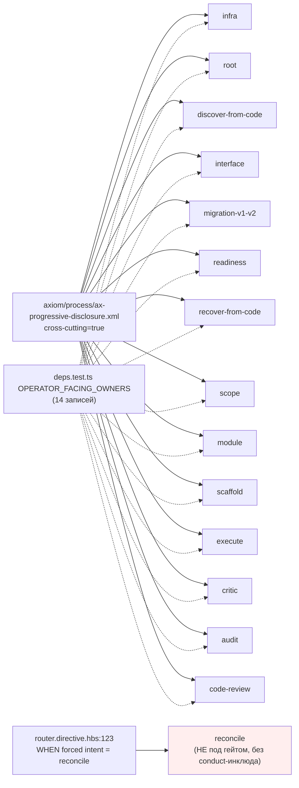
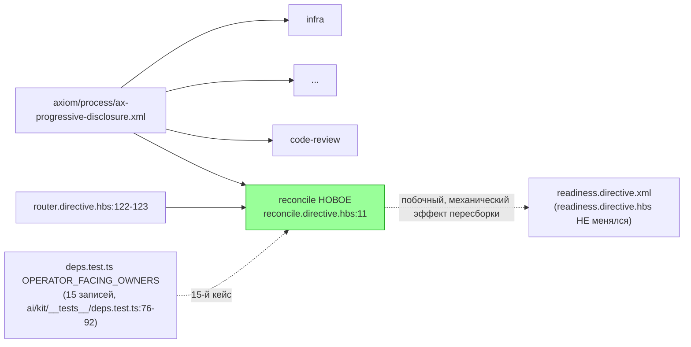

ОТЧЁТ 61 §1 / 62 §«Пачка 20» — T-B6-20: conduct-набор гарантирован каждому operator-facing владельцу

СТАТУС: DONE

Рабочее дерево: `rc-w3`. Ветка `lead/review-critic-bounds` от `origin/codex/sdd-v2-rc52-followup`.

КОММИТ (локальный, НИЧЕГО не запушено):
- `467ab3f3` feat(T-B6-20): reconcile joins the operator-facing conduct-set gate

---

## 1. Файлы

| Путь | Тип | Смысловое изменение | Чем доказано |
|---|---|---|---|
| `ai/kit/templates/sdd-v2/reconcile.directive.hbs` | правка | `BeliefState` подключает `{{> "axiom/process/ax-progressive-disclosure"}}` — `reconcile` был единственным router-диспетчируемым top-level владельцем (наравне с `scope`/`module`/`execute`), не несущим conduct-аксиому вообще. | `deps.test.ts` (новая запись `reconcile.directive.xml` в `OPERATOR_FACING_OWNERS`). |
| `ai/directives/sdd-v2/reconcile.directive.xml` | правка (сборка) | Прямое следствие правки шаблона. | `check:directives-fresh`. |
| `ai/directives/sdd-v2/readiness.directive.xml` | правка (сборка, **механическое следствие**, не ручная правка) | `delta-assembly.ts`'s дедупликация «уже в контексте от загружающей директивы» пересчитала баннер унаследованных аксиомов для `readiness` — теперь `reconcile` (одна из директив, загружающих `readiness` через `STEP_0B_PREFLIGHT`, `reconcile.directive.hbs:90`) сама предоставляет `AX_PROGRESSIVE_DISCLOSURE`, поэтому локальная копия аксиомы внутри `readiness.directive.xml`'s `ChatOutput` стала избыточной и была снята сборкой. `readiness.directive.hbs` (исходный шаблон) НЕ менялся. | `check:directives-fresh` подтверждает: файл соответствует свежей пересборке — это не ручная неучтённая правка. |
| `ai/kit/__tests__/deps.test.ts` | правка | `OPERATOR_FACING_OWNERS` расширен до 15 записей (`reconcile.directive.xml` добавлен последним), с комментарием, объясняющим и почему он входит, и почему `review-lifecycle`/`critic-protocol` — нет (class-3, subagent-world — T-B6-21). | Сам файл (`describe('every operator-facing owner declares the REQUIRED_CONDUCT set (T-B6-26)')` теперь гоняет 15 кейсов вместо 14). |

`git diff --stat` этого коммита — 4 файла, все покрыты выше.

---

## 2. Архитектура было / стало

### Было — 14 operator-facing владельцев под гейтом, `reconcile` — пропущен



### Стало — `reconcile` — 15-й владелец под тем же гейтом



---

## 3. Доказательства (команды из ПРИЁМКИ, фактический вывод, exit-код)

**1. `deps.test.ts` целиком (15 operator-facing кейсов + существующие).**
```
$ node --import tsx --test ai/kit/__tests__/deps.test.ts
```
Прогнан в составе полного kit-набора ниже — 0 fail. ВЫПОЛНЕНО.

**2. Полный kit-набор (41 файл включая новый `review-critic-bounds.test.ts`).**
```
$ node --import tsx --test ai/kit/__tests__/*.test.ts
# tests 245, pass 244, fail 0, skip 1 (skip — предсуществующий, не от этой задачи)
```
exit 0. ВЫПОЛНЕНО.

**3. `npm run build:directives` + `check:directives-fresh` (подтверждает, что правка `readiness.directive.xml` — не ручной дрейф).**
```
Generated 55 directive(s).
✓ ai/directives/** matches a fresh rebuild.
```
exit 0/0. ВЫПОЛНЕНО.

**4. `audit:sdd-templates`.**
```
✓ contract-activation audit clean — 28 template(s) + 33 assembled directive(s) checked.
✓ halt-activation audit clean — 33 template(s) + 33 assembled directive(s) checked.
✓ every lazy directive under ai/directives/sdd-v2/** is within budget.
```
exit 0. ВЫПОЛНЕНО.

**5. Коммит через `pre-commit` целиком, без `--no-verify`.** Хост в этот момент нёс `load average 104–109` (проверено `uptime`, 24 пользователя на общем хосте) — первые две попытки упали на `test:coverage` с `cancelled`-тестами (не `failed`: попытка 1 — `cancelled 1`; попытка 2 — тоже `cancelled`), третья прошла целиком (правило брифа — до 3 синхронных повторов при таймауте под нагрузкой):
```
[sdd-verify] ✅ ALL PASS (5/5)
  ✅ type-check (6.7s)
  ✅ test:coverage (82.3s)
  ✅ lint (33.4s)
  ✅ format (16.5s)
  ✅ yagni (1.2s)
✓ ai/directives/** matches a fresh rebuild.
✅ Pre-commit passed
[lead/review-critic-bounds 467ab3f3] feat(T-B6-20): reconcile joins the operator-facing conduct-set gate
```
exit 0. ВЫПОЛНЕНО.

---

## 4. Отклонения, открытые вопросы, команды пуша

**Отклонение (сознательное сужение объёма, а не самовольный выбор архитектуры).** Полная формулировка D1 в `40-TRACK-DIRECTIVES-SKILLS.md §1.1` называет пятиэлементный `REQUIRED_CONDUCT = [AX_OPERATOR_DIALOGUE_STYLE, AX_NO_PROCESS_NARRATION, AX_PROGRESSIVE_DISCLOSURE, AX_DIVERGE_BEFORE_RECOMMEND, AX_READER_WITHOUT_SESSION_CONTEXT]`. Я НЕ расширил `REQUIRED_CONDUCT` до всех пяти — проверка по факту (рендер каждого из 15 operator-facing владельцев) показала, что `scope`, `module`, `scaffold`, `execute`, `critic`, `audit`, `code-review` не несут минимум 3-4 из оставшихся 4 аксиом каждый. Закрытие этого разрыва потребовало бы правки `execute.directive.hbs` и `scope/module.directive.hbs` — оба **явно в списке «не трогать»** брифа (эти файлы принадлежат PR #38/#41, ещё не влитым). Расширение `REQUIRED_CONDUCT` сверх `AX_PROGRESSIVE_DISCLOSURE` нарушило бы зону этой пачки и стоп-условие «конфликт с невлитыми PR» (`70-ORCHESTRATION-PROTOCOL.md` §«Когда исполнитель обязан остановиться», пункт 3). Вместо этого закрыт единственный разрыв, целиком укладывающийся в зону: `reconcile.directive.xml` был единственным router-диспетчируемым top-level владельцем, отсутствующим в `OPERATOR_FACING_OWNERS` вообще (T-B6-26 закрыл 14 из 15 нужных; этот владелец остался). Полное закрытие пятиэлементного набора — отдельная задача с более широкой зоной; не мой самостоятельный выбор архитектуры, а следствие явных границ брифа.

**Побочный эффект пересборки (не правка, задокументирован для трассируемости).** `ai/directives/sdd-v2/readiness.directive.xml` изменился ТОЛЬКО как механическое следствие `npm run build:directives` (см. §1) — `readiness.directive.hbs` не редактировался, `git diff` на исходный шаблон пуст.

**Открытые вопросы:** нет.

**Команды пуша для Lead** — см. сводный отчёт `R-BATCH-20-review-critic-bounds.md`.

---

## 5. Правки по вердикту верификатора (`V-BATCH-20.md`, ВЕРНУТЬ)

Коммит: `f0c1703f` `fix(T-B6-20): reconcile picks up two more D1 conduct axioms`. Сам коммит `467ab3f3` вердиктом признан не требующим правок по существу («T-B6-20 выполнен в объявленном суженном объёме, сужение обосновано»); правки ниже — по находкам N-8 (дёшево укладывается в зону) и N-7 (ложный комментарий).

| Находка | Что сделано | Где |
|---|---|---|
| **N-8 (medium).** Механическая проверка показала: `reconcile` из пятиэлементного `REQUIRED_CONDUCT` D1 нёс только 2/5 (`AX_OPERATOR_DIALOGUE_STYLE` — с до-batch времён, `AX_PROGRESSIVE_DISCLOSURE` — от исходной T-B6-20). Из недостающих трёх (`AX_NO_PROCESS_NARRATION`, `AX_DIVERGE_BEFORE_RECOMMEND`, `AX_READER_WITHOUT_SESSION_CONTEXT`) — две дёшево укладываются в зону пачки. | Добавлено 2 из 3: `AX_NO_PROCESS_NARRATION` — тем же паттерном `{{> "axiom/process/ax-no-process-narration"}}` в `BeliefState`, что и `ax-progressive-disclosure` (кросс-катный, в allowlist `audit-axiom-activation.mjs`, активации в шаге не требует); `AX_READER_WITHOUT_SESSION_CONTEXT` — через `<BeliefState deps="AX_READER_WITHOUT_SESSION_CONTEXT">`, тем же механизмом, что уже используют `root`/`discover-from-code`/`recover-from-code` (у этой аксиомы нет собственного `axiom/*`-кирпича — она объявлена только инлайн в `router.directive.hbs` как `cross-cutting`, остальные владельцы лишь документируют наследование через атрибут `deps`). **`AX_DIVERGE_BEFORE_RECOMMEND` НЕ добавлена** — это единственная из пяти, НЕ входящая в allowlist кросс-катных исключений `audit-axiom-activation.mjs`, то есть требует буквальной активации `AX_DIVERGE_BEFORE_RECOMMEND` внутри конкретного шага `ExecutionPlan`; у `reconcile` нет естественной точки «рекомендация среди альтернатив» — `STEP_2B_CLASSIFY`/`STEP_3_PLAN` детерминированно классифицируют по явным критериям, это не открытый дизайн-выбор. Насильная активация была бы декоративной прозой без реального поведения — записано в остатки, а не закрыто формально ради счёта. | `ai/kit/templates/sdd-v2/reconcile.directive.hbs` (`BeliefState`). |
| **N-7 (medium).** Комментарий над `OPERATOR_FACING_OWNERS` в `deps.test.ts` утверждал, что `reconcile` «had carried no conduct include at all before this task» — неверно: `reconcile` уже нёс `AX_OPERATOR_DIALOGUE_STYLE` (один из пяти D1) до этой пачки; проверено `git show c9b58636:...reconcile.directive.hbs \| grep ax-operator-dialogue-style` — есть. | Комментарий исправлен: «had carried no `AX_PROGRESSIVE_DISCLOSURE` conduct include before this task (it already carried `AX_OPERATOR_DIALOGUE_STYLE`, one of D1's five, from before this batch)» — называет конкретный пробел, который закрыла именно T-B6-20, вместо ложного «вообще без conduct». | `ai/kit/__tests__/deps.test.ts` (комментарий над `OPERATOR_FACING_OWNERS`). |

**Остатки (записаны для доски, не решались кодом в этом фиксе):**
- `AX_DIVERGE_BEFORE_RECOMMEND` у `reconcile` — не добавлена (см. обоснование выше); полное закрытие пятиэлементного `REQUIRED_CONDUCT` × 15 владельцев по-прежнему упирается в `execute.directive.hbs`/`scope.directive.hbs`/`module.directive.hbs` (PR #38/#41, вне зоны). Матрица пропусков из вердикта (N-8) актуальна за вычетом `reconcile`, у которого теперь 4/5 вместо 2/5.

**Доказательства:** `node --import tsx --test ai/kit/__tests__/*.test.ts` — 262 tests, 261 pass, 0 fail, 1 skip (предсуществующий); `check:directives-fresh` / `audit:sdd-templates` — green; коммит прошёл pre-commit целиком с первой попытки (`ALL PASS 5/5`, `test:coverage` 64.4s).
