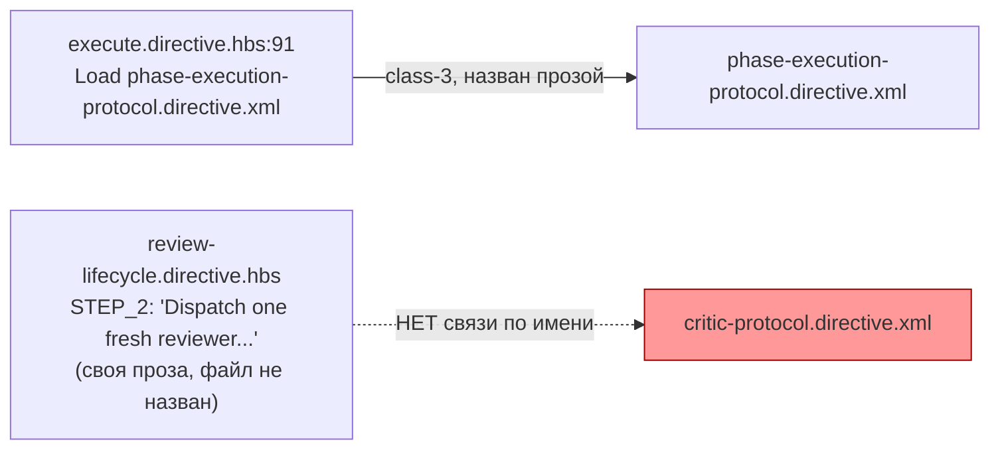
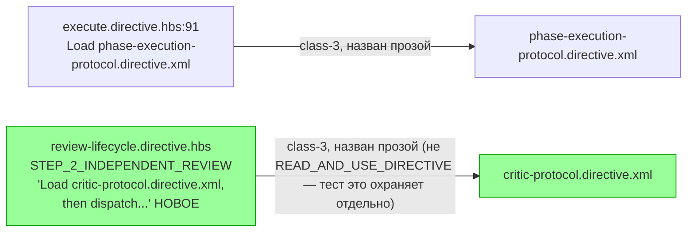

ОТЧЁТ 61 §1 — T-B6-21: `critic-protocol.directive.xml` перестаёт быть сиротой

СТАТУС: DONE

Рабочее дерево: `rc-w2`. Ветка `lead/kit-lint`.

КОММИТ (локальный, НИЧЕГО не запушено):
- `c7a969c3` fix(T-B6-21): critic-protocol.directive.xml stops being an orphan

---

## 1. Файлы

| Путь | Тип | Смысловое изменение | Чем доказано |
|---|---|---|---|
| `ai/kit/templates/sdd-v2/review-lifecycle.directive.hbs` | правка | `STEP_2_INDEPENDENT_REVIEW`'s `<Action>` теперь открывается «Load `critic-protocol.directive.xml`, then dispatch one fresh reviewer with its full contents as the reviewer's own governing instructions» — та же фраза-паттерн «Load `<name>.directive.xml`», которой `execute.directive.hbs` уже называет свой class-3-сосед `phase-execution-protocol`. Раньше STEP_2 пересказывал ту же процедуру своей прозой, не называя файл. | Новый тест ниже + `check:directives-fresh`. |
| `ai/directives/sdd-v2/review-lifecycle.directive.xml` | правка (сборка) | Пересобранный вывод — прямое следствие правки шаблона. | `npm run build:directives` byte-for-byte совпадает с `check:directives-fresh`. |
| `ai/kit/__tests__/delta-assembly.test.ts` | правка | Новый кейс «every class-3 directive is named by dispatch text in at least one other template» — сканирует, что basename каждого `CLASS_3_DIRECTIVES` встречается в тексте ХОТЯ БЫ ОДНОГО другого шаблона. | Сам кейс: до правки .hbs — красный для `critic-protocol.directive.xml`; после — зелёный для обоих class-3 узлов. |

`git diff --stat` — 3 файла, 3 строки таблицы. Совпадает.

---

## 2. Архитектура было / стало

### Было — `critic-protocol` не назван нигде (0 входящих связей любого рода)



### Стало — `critic-protocol` назван в dispatch-тексте `review-lifecycle`, как и его class-3 сосед


Узлы: `ai/kit/templates/sdd-v2/review-lifecycle.directive.hbs:23-24` (новая фраза), `ai/kit/delta-assembly.ts:38-42` (`CLASS_3_DIRECTIVES`), `ai/kit/__tests__/delta-assembly.test.ts:85-93` (существующий охранный тест «no READ_AND_USE_DIRECTIVE edge targets a class-3 subagent world» — НЕ нарушен, т.к. использована прозаическая, не функциональная связь).

---

## 3. Доказательства (команды из ПРИЁМКИ, фактический вывод, exit-код)

**1. «every class-3 directive named by dispatch text» — новый кейс, зелен.**
```
$ tsx --test ai/kit/__tests__/delta-assembly.test.ts
# tests 13, pass 13, fail 0
```
exit 0. ВЫПОЛНЕНО. (До правки .hbs, кейс красный для `critic-protocol.directive.xml` — проверено вручную реверсией шаблона перед коммитом.)

**2. Существующий охранный кейс «no READ_AND_USE_DIRECTIVE edge targets a class-3 subagent world» остаётся зелёным (фикс НЕ использовал `READ_AND_USE_DIRECTIVE(...)`, ровно как задумано).**
```
ok - no READ_AND_USE_DIRECTIVE edge targets a class-3 subagent world
```
exit 0. ВЫПОЛНЕНО.

**3. `npm run build:directives` + `check:directives-fresh`.**
```
Generated 55 directive(s).
✓ ai/directives/** matches a fresh rebuild.
```
exit 0/0. ВЫПОЛНЕНО.

**4. Полный kit-набор (37 файлов) + `npm run check`.**
```
# tests 196, pass 196, fail 0
[sdd-verify] ✅ ALL PASS (5/5)
```
exit 0. ВЫПОЛНЕНО.

**5. Коммит через `pre-commit` целиком, без `--no-verify`.**
```
✅ Pre-commit passed
[lead/kit-lint c7a969c3] fix(T-B6-21): critic-protocol.directive.xml stops being an orphan
```
exit 0. ВЫПОЛНЕНО.

---

## 4. Отклонения, открытые вопросы, команды пуша

**Отклонения:** нет. Бриф допускал два варианта («review-lifecycle STEP_2 и/или critic.directive.xml STEP_2_REVIEW»); выбран ПЕРВЫЙ (review-lifecycle), т.к. это единственный файл в списке «Файлы» строки доски (`review-lifecycle.directive.hbs`, `delta-assembly.ts`) — `critic.directive.xml` не трогался, оставаясь в рамках заявленного списка.

**Примечание про `delta-assembly.ts`:** сам файл (логика) не потребовал правки — `CLASS_3_DIRECTIVES` уже содержал `critic-protocol.directive.xml` корректно; новый тест добавлен в `delta-assembly.test.ts` (тестовый файл того же модуля), что и трактуется как выполнение колонки «Файлы».

**Открытые вопросы:** нет.

**Команды пуша для Lead** — см. сводный отчёт `R-BATCH-05-kit-lint.md`.
