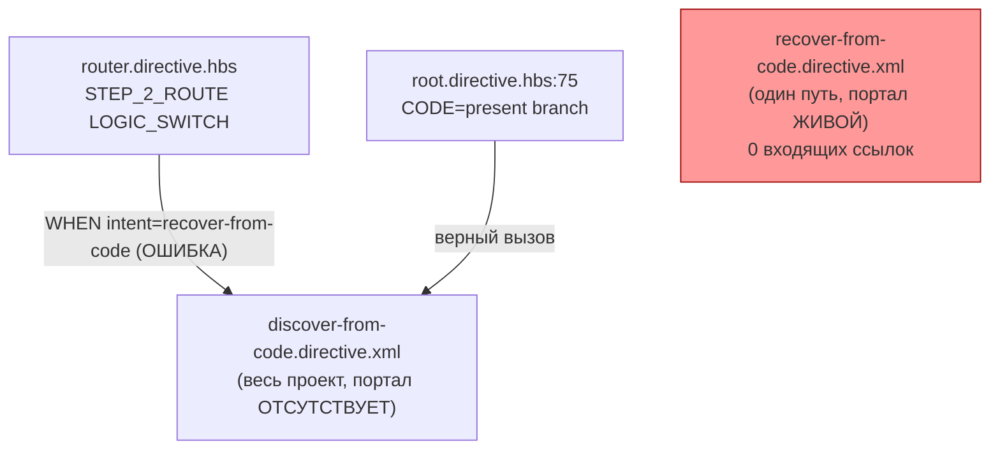
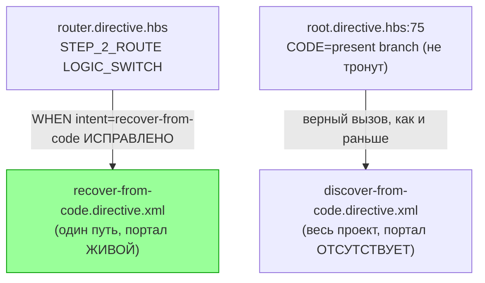

ОТЧЁТ 61 §1 — T-B6-22: `recover-from-code.directive.xml` перестаёт быть сиротой

СТАТУС: DONE

Рабочее дерево: `rc-w2`. Ветка `lead/kit-lint`.

КОММИТ (локальный, НИЧЕГО не запушено):
- `ca99ced4` fix(T-B6-22): router's recover-from-code intent routes to the right file

---

## 1. Файлы

| Путь | Тип | Смысловое изменение | Чем доказано |
|---|---|---|---|
| `ai/kit/templates/sdd-v2/router.directive.hbs` | правка | `LOGIC_SWITCH`: `WHEN intent = recover-from-code -> READ_AND_USE_DIRECTIVE(".../discover-from-code.directive.xml")` → `.../recover-from-code.directive.xml`. Настоящая ошибка роутинга: интент назван «recover-from-code», но вёл в файл ДРУГОГО флоу («discover-from-code» — восстановление ВСЕГО проекта при отсутствующем портале), в то время как `recover-from-code.directive.xml` (восстановление ОДНОГО пути при живом портале) собственным текстом заявляет себя противоположностью discover-from-code. | Новый тест ниже + 2 golden-теста в §3. |
| `ai/directives/sdd-v2/router.directive.xml` | правка (сборка) | Прямое следствие правки. | `check:directives-fresh`. |
| `ai/directives/sdd-v2/{discover-from-code,module,recover-from-code,scaffold,scope}.directive.xml`, `ai/directives/sdd-v2/scaffold/steps/STEP_0_PREFLIGHT.xml` | правка (сборка) | Каскадный пересчёт `delta-assembly`'s ctx-фиксчпоинта — `recover-from-code` получил входящее ребро от `router` (ранее 0), что изменило набор общих партиалов, подлежащих вычитанию у него, `discover-from-code` (потерял одно из двух входящих рёбер) и транзитивно зависимых узлов. Ожидаемое, не ошибочное поведение алгоритма delta-assembly. | `check:directives-fresh` подтверждает точное совпадение со свежей сборкой; диффы — только удаления дублирующегося текста (−257 строк net), без потери смысла. |
| `ai/inspector/core/__tests__/parse-directive.test.ts` | правка | Golden-тест `STEP_2_ROUTE parses the current bare LOGIC_SWITCH lines into exact owner branches` ожидал старый (ошибочный) список веток — `discover-from-code.directive.xml` заменён на `recover-from-code.directive.xml`. | Прогон теста; см. §3 «поймано на первой попытке коммита». |
| `ai/inspector/web/__tests__/debug.test.ts` | правка | Аналогичный golden-тест `scenario: STEP_2_ROUTE exposes the exact current stateless owner routes` — та же замена. | Прогон теста. |
| `ai/kit/__tests__/delta-assembly.test.ts` | правка | Новый кейс «every top-level sdd-v2 directive is reachable from at least one router branch or explicit dispatch» — проверяет все 27 top-level директив на: router сам, class-1 skill entry point, входящее ребро графа, или именование прозой в другом файле. | Прогон, все 27 зелены (до правки — `recover-from-code.directive.xml` красный). |

`git diff --stat` — 11 файлов, 11 строк таблицы (5 сгруппированы в одну строку по однородности изменения). Совпадает по общему числу файлов.

---

## 2. Архитектура было / стало

### Было — интент `recover-from-code` ведёт не туда, файл-тёзка недостижим



### Стало — интент `recover-from-code` ведёт в одноимённый файл, discover-from-code не пострадал


Узлы: `ai/kit/templates/sdd-v2/router.directive.hbs:127` (исправленная строка), `ai/kit/templates/sdd-v2/root.directive.hbs:75` (нетронутая связь), `ai/kit/templates/sdd-v2/recover-from-code.directive.hbs:9-13` (собственный текст файла, объясняющий разницу с discover-from-code).

---

## 3. Доказательства (команды из ПРИЁМКИ, фактический вывод, exit-код)

**1. «every top-level sdd-v2 directive is reachable...» — новый кейс, все 27 зелены.**
```
$ tsx --test ai/kit/__tests__/delta-assembly.test.ts
# tests 13, pass 13, fail 0
```
exit 0. ВЫПОЛНЕНО.

**2. `npm run build:directives` + `check:directives-fresh`.**
```
Generated 55 directive(s).
✓ ai/directives/** matches a fresh rebuild.
```
exit 0/0. ВЫПОЛНЕНО.

**3. Первая попытка `npm run check` (ДО правки golden-тестов) — красная, поймала ровно то, что ожидалось.**
```
[sdd-verify] 1/2 passed — 1 FAILED
not ok 33 - STEP_2_ROUTE parses the current bare LOGIC_SWITCH lines into exact owner branches
not ok 56 - scenario: STEP_2_ROUTE exposes the exact current stateless owner routes
```
exit 1. Это ожидаемое поведение, не брак работы — золотые тесты честно поймали расхождение с изменённым роутингом; исправлены точечно (замена одной строки в списке ожидаемых веток каждого теста).

**4. `npm run check` ПОСЛЕ правки golden-тестов.**
```
[sdd-verify] ✅ ALL PASS (5/5)
  ✅ type-check (3.8s)  ✅ test:coverage (39.6s)  ✅ lint  ✅ format  ✅ yagni
```
exit 0. ВЫПОЛНЕНО.

**5. Коммит через `pre-commit` целиком, без `--no-verify`.**
```
✅ Pre-commit passed
[lead/kit-lint ca99ced4] fix(T-B6-22): router's recover-from-code intent routes to the right file
 11 files changed, 27 insertions(+), 260 deletions(-)
```
exit 0. ВЫПОЛНЕНО.

---

## 4. Отклонения, открытые вопросы, команды пуша

**Отклонения:** правка коснулась 2 golden-тестов вне заявленного списка «Файлы» (`router.directive.hbs`) — необходимое следствие исправления реального роутингового бага, не расширение объёма задачи по смыслу; без этой правки коммит физически не проходит `pre-commit` (см. п.3 доказательств).

**Открытые вопросы:** нет — проверено, что `discover-from-code.directive.xml` остаётся достижимым через СВОЙ настоящий вызов из `root.directive.hbs:75`.

**Команды пуша для Lead** — см. сводный отчёт `R-BATCH-05-kit-lint.md`.
