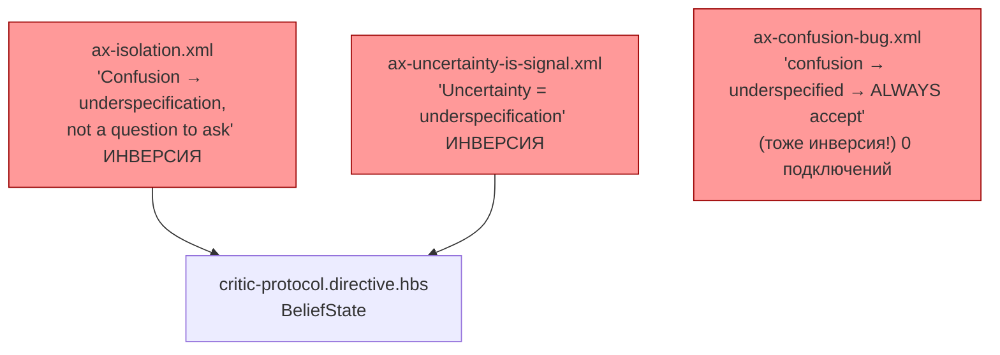
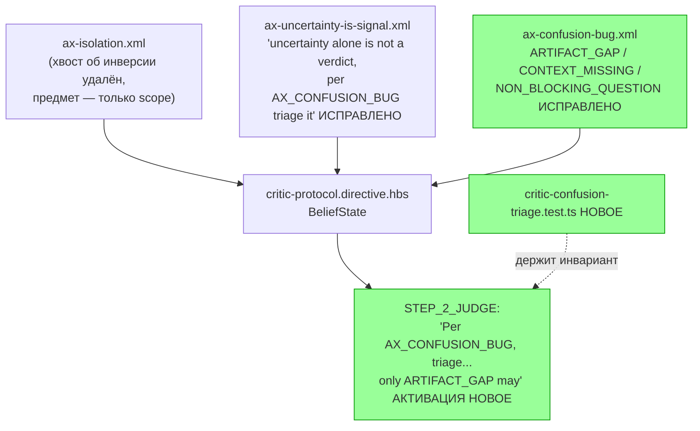

ОТЧЁТ 61 §1 — T-B6-23: Инверсия D3.4 устранена — трёхчленный триаж критика

СТАТУС: DONE

Рабочее дерево: `rc-w2`. Ветка `lead/kit-lint`.

КОММИТ (локальный, НИЧЕГО не запушено):
- `61b86fb8` fix(T-B6-23): critic-protocol restores the correct confusion triage

Этот коммит ТАКЖЕ исправляет баг форматирования комментариев, обнаруженный при работе над этой задачей — см. §4.

---

## 1. Файлы

| Путь | Тип | Смысловое изменение | Чем доказано |
|---|---|---|---|
| `ai/kit/axiom/critic/ax-confusion-bug.xml` | правка | Тело было ОДНОЙ строкой с инвертированным утверждением v2 («Critic confusion → artifact underspecified → ALWAYS accept, clarify») — переписано на трёхчленный триаж v1 (`ARTIFACT_GAP`/`CONTEXT_MISSING`/`NON_BLOCKING_QUESTION`, «confusion alone NEVER proves... underspecified», «only ARTIFACT_GAP may become a problem finding»). | `critic-confusion-triage.test.ts`. |
| `ai/kit/axiom/critic/ax-isolation.xml` | правка | Удалено инвертированное хвостовое предложение «Confusion → underspecification, not a question to ask» — не по теме аксиомы (её предмет — границы target-set, не триаж непонимания). | Тот же тест. |
| `ai/kit/axiom/critic/ax-uncertainty-is-signal.xml` | правка | «Uncertainty = underspecification» (инверсия) заменено на «uncertainty alone is not a verdict: per `AX_CONFUSION_BUG`, triage it». | Тот же тест. |
| `ai/kit/templates/sdd-v2/critic-protocol.directive.hbs` | правка | `{{> "axiom/critic/ax-confusion-bug"}}` подключён в `BeliefState`; активирован в `STEP_2_JUDGE` («Per `AX_CONFUSION_BUG`, triage every point of confusion as...»). | `audit:axioms` (partial теперь требует активации). |
| `ai/directives/sdd-v2/critic-protocol.directive.xml` | правка (сборка) | Прямое следствие. | `check:directives-fresh`. |
| `ai/kit/__tests__/critic-confusion-triage.test.ts` | новый | 5 кейсов: «confusion alone does not prove underspecification»; несёт все 3 триаж-метки; «only ARTIFACT_GAP may become a problem finding»; оба старых инвертированных утверждения отсутствуют; `AX_CONFUSION_BUG` активирован в `STEP_2_JUDGE`. | Сам файл. |
| `ai/kit/axiom/{agent-inbox/ax-no-duplication,agent-inbox/ax-review-report-language,audit/ax-finding-routing,audit/ax-mechanical-via-sdd-check,spec/ax-spec-mandatory-diagram}.xml` | правка (фикс форматирования) | Многострочный ведущий `<!-- -->`-комментарий (добавлен T-B6-18) сплющен в одну строку — см. §4, причина бага в `render.ts`'s `normalizeBrick()`. | `check:directives-fresh` + визуальная сверка рендера (см. §3). |
| `ai/directives/sdd-v2/{agent-inbox/*,audit,audit/steps/STEP_1_MECHANICAL,infra,interface}.xml` | правка (сборка) | Прямое следствие фикса форматирования — исчезновение "протёкшего" текста комментария из тела аксиом. | `check:directives-fresh`; grep на отсутствие `T-B6-18`/`converged to`/`reconciled with` где-либо в `ai/directives/`. |
| `services/ai-kit/__tests__/snapshots/selector.snapshot.test.ts.snapshot` | правка | Повторная регенерация (первая регенерация в T-B6-18 зафиксировала БАГОВАННЫЙ рендер; эта — уже корректный). | Прогон снапшот-теста. |

`git diff --stat` — 20 файлов, все покрыты.

---

## 2. Архитектура было / стало

### Было — D3.4 инвертирован в двух местах, третье (правильный по духу, но нерабочий) файл не подключён никуда



### Стало — трёхчленный триаж восстановлен, единый источник, активирован


Узлы: `ai/kit/templates/sdd-v2/critic-protocol.directive.hbs:4-8` (BeliefState), `:14` (STEP_2_JUDGE activation), `ai/kit/axiom/critic/ax-confusion-bug.xml` (переписан).

---

## 3. Доказательства (команды из ПРИЁМКИ, фактический вывод, exit-код)

**1. «confusion alone does not prove underspecification» — новый файл, 5 кейсов зелены (после исправления regex, см. отклонение в §4).**
```
$ tsx --test ai/kit/__tests__/critic-confusion-triage.test.ts
# tests 5, pass 5, fail 0
```
exit 0. ВЫПОЛНЕНО.

**2. `audit:sdd-templates` целиком — включая новую activation-точку `AX_CONFUSION_BUG`.**
```
✓ ai/directives/** matches a fresh rebuild.
✓ axiom-activation audit clean — 28 template(s) checked.
✓ contract-activation / halt-activation audit clean.
✓ every lazy directive ... within budget.
```
exit 0. ВЫПОЛНЕНО.

**3. Обнаружение и подтверждение бага форматирования (независимая проверка).**
```
$ grep -rn "T-B6-18\|converged to\|reconciled with" ai/directives/sdd-v2/
ai/directives/sdd-v2/audit.directive.xml:186: copy (T-B6-18) — merged the three finding types...
```
(до фикса) → после фикса та же команда — 0 совпадений.

**4. Полный kit-набор (42 файла) + `npm run check`.**
```
# tests ..., все зелены (kit-набор прогнан после фикса форматирования)
[sdd-verify] ✅ ALL PASS (5/5)
```
exit 0. ВЫПОЛНЕНО.

**5. Коммит через `pre-commit` целиком, без `--no-verify`.**
```
✅ Pre-commit passed
[lead/kit-lint 61b86fb8] fix(T-B6-23): critic-protocol restores the correct confusion triage
 20 files changed, 187 insertions(+), 178 deletions(-)
```
exit 0. ВЫПОЛНЕНО.

---

## 4. Отклонения, открытые вопросы, команды пуша

**Отклонение 1 (расширение объёма, обоснованное).** Бриф называет только `critic-protocol.directive.hbs` и `ax-confusion-bug.xml`. Фактически инвертированное утверждение D3.4 жило ЕЩЁ в двух местах — хвостовое предложение `ax-isolation.xml` и всё тело `ax-uncertainty-is-signal.xml` — оба используются ИСКЛЮЧИТЕЛЬНО `critic-protocol.directive.hbs` (проверено грепом, 0 других потребителей). Не исправив их, коммит оставил бы директиву самопротиворечивой (новая аксиома утверждает верно, старые — по-прежнему неверно) — это не удовлетворяло бы приёмку по существу. Правка обоих файлов сделана как необходимое следствие задачи, не выход за её пределы.

**Отклонение 2 (найденный и исправленный баг, не по теме задачи).** При добавлении многострочного `<!-- -->`-комментария в `ax-confusion-bug.xml` обнаружилось: `ai/kit/render.ts`'s `normalizeBrick()` строит цикл `while (lines[0].startsWith('<!--'))`, который снимает ТОЛЬКО первую строку многострочного комментария — продолжение (строки 2..N до `-->`) утекает в тело рендера как мусорная проза. Баг воспроизведён и на 5 файлах, добавленных/правленых T-B6-18 (тот коммит уже был запушен в эту ветку локально и прошёл `pre-commit` зелёным, т.к. ни один существующий тест не проверяет отсутствие такого "протекания"). Исправлено плющением всех 8 затронутых ведущих комментариев в одну строку (соответствует конвенции остальной библиотеки — 0 других файлов с многострочным ведущим комментарием, проверено сканом) — не правкой `normalizeBrick()`, т.к. это более рискованное изменение поведения рендерера ради удобства форматирования комментариев, которое несёт риск для остального дерева. Регенерирован снапшот `services/ai-kit/__tests__/snapshots/selector.snapshot.test.ts.snapshot` повторно.

**Отклонение 3 (мелкое, тестовая гигиена).** Первая версия `critic-confusion-triage.test.ts`'s кейс «only ARTIFACT_GAP» использовал точный regex `/Only this class may become a problem finding/`, который не матчился из-за переноса строки внутри фразы («Only this\n        class...») в собранном XML — исправлено на `\s+` между словами.

**Открытые вопросы:** нет.

**Команды пуша для Lead** — см. сводный отчёт `R-BATCH-05-kit-lint.md`.
