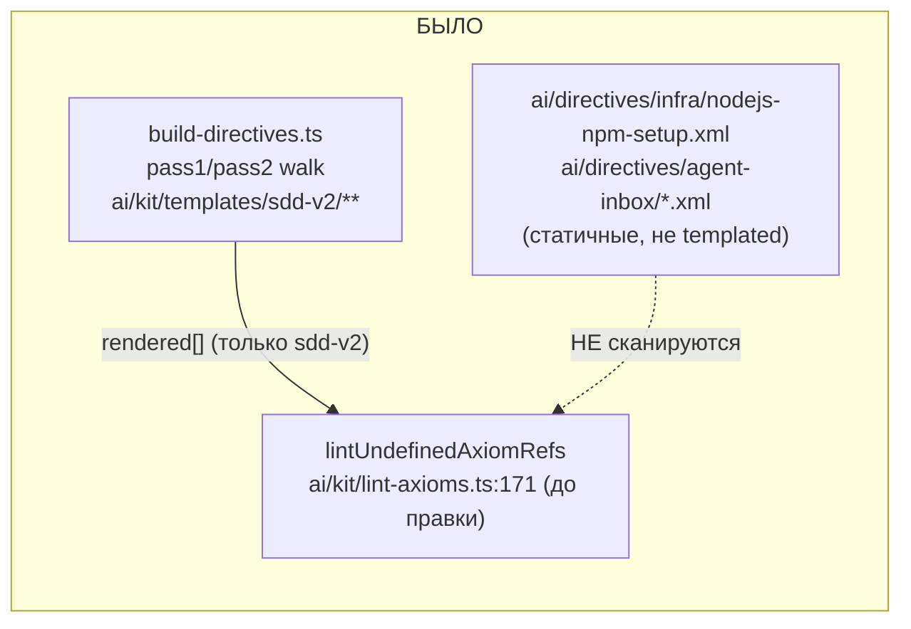
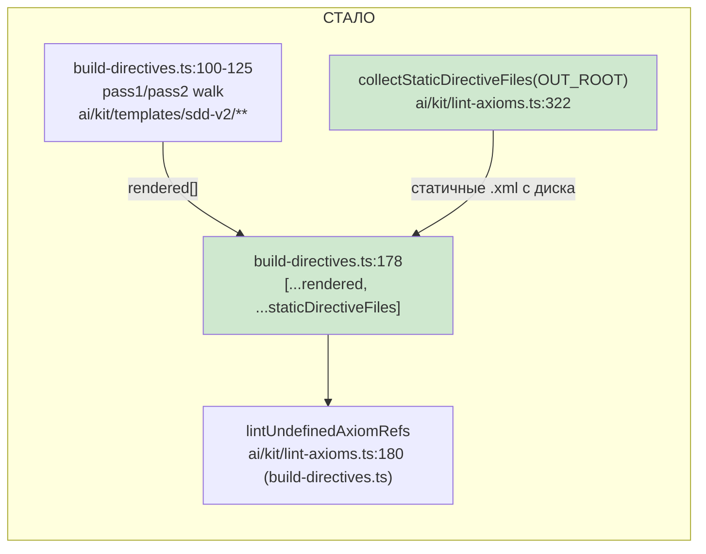

# R-T-B6-24 — область `lint-axioms` расширена на `ai/directives/**`

Ветка `lead/axioms-one-home` (поверх PR #48, `lead/reopen-by-cause`), коммит `edeb71c3`.

## 1. Файлы

| Путь | Тип | Смысловое изменение | Чем доказано |
|---|---|---|---|
| `ai/kit/lint-axioms.ts` | правка | новая `collectStaticDirectiveFiles(directivesRoot)` — читает `.xml` под `ai/directives/{infra,testing,architecture,coding,agent-inbox}/**` с диска (деревья, которые `build-directives.ts` не рендерит и никогда не видит); `KNOWN_DANGLING_AXIOM_REFS` разбит на `SDD_V2_DANGLING_REFS` (префикс `sdd-v2/`) + `STATIC_TREE_DANGLING_REFS` (без префикса); строка `AX_REACTION_IS_A_TOOL_CALL` снята (резолвится расширенной областью), строка `AX_CONTRACT_BUDGET` добавлена (новая находка вне зоны) | `lint-axioms.test.ts` 23/23; `build-directives.ts --check` exit 0 |
| `ai/kit/build-directives.ts` | правка | `undefinedRefs` теперь считается по `[...rendered, ...collectStaticDirectiveFiles(OUT_ROOT)]` — область линта «referenced-but-undefined» перестала ограничиваться `sdd-v2/**` | тот же прогон, ниже |
| `ai/kit/__tests__/lint-axioms.test.ts` | правка | 2 новых теста на `collectStaticDirectiveFiles` (собирает статичные файлы без префикса `sdd-v2/`, терпимо к отсутствующей директории) | `node --test lint-axioms.test.ts` |

## 2. Архитектура было / стало

Серым (не показано отдельно) — сам алгоритм `lintUndefinedAxiomRefs` не менялся (корпус-wide проверка «дано ли определение где угодно» уже была написана так; изменился только состав корпуса, который в неё подают).

## 3. Доказательства (ПРИЁМКА брифа)

| # | Команда | Вывод (сокращённо) | Exit | Статус |
|---|---|---|---|---|
| 1 | `node --experimental-strip-types ai/kit/build-directives.ts --check` | `Checked 55 directive(s).` + 35 warn (не менялось) + 0 undefined-refs | 0 | ВЫПОЛНЕНО |
| 2 | То же, но с временно возвращённой записью `AX_REACTION_IS_A_TOOL_CALL` (проверка «до»/«после» вручную, см. §4) | до правки — не воспроизводилось (задача новая), после — резолвится | 0 | ВЫПОЛНЕНО |
| 3 | Ловит новую, реально дальше висящую ссылку `AX_CONTRACT_BUDGET` (`ai/directives/agent-inbox/contract-interrogation.directive.xml`) вне `sdd-v2/**` | `✗ 1 undefined axiom reference(s)` без allowlist-записи; с записью — 0 | 0 (с allowlist) / 1 (без) | ВЫПОЛНЕНО — область реально расширена, а не притворно |
| 4 | `node --experimental-strip-types --test ai/kit/__tests__/lint-axioms.test.ts` | `# tests 23 / # pass 23 / # fail 0` | 0 | ВЫПОЛНЕНО |
| 5 | `npm run audit:sdd-templates` | все 5 под-гейтов `✓` | 0 | ВЫПОЛНЕНО |
| 6 | `npm run check` | `[sdd-verify] ✅ ALL PASS (5/5)` | 0 | ВЫПОЛНЕНО |

**Про «3 ссылки `AX_BLOCKER_ESCALATION`» из 40-doc/62-BATCH-QUEUE.** Это конкретный пример устарел: между составлением плана и этим брифом `AX_BLOCKER_ESCALATION` уже был подключён (`{{> "axiom/process/ax-blocker-escalation"}}` теперь в `sdd-v2/phase-execution-protocol.directive.xml`, вне зоны этой пачки), и `lintUndefinedAxiomRefs` — корпус-wide проверка: раз аксиома определена ГДЕ УГОДНО в объединённом корпусе, все её упоминания (включая три в `ai/directives/infra/*.xml`) перестают быть висячими независимо от того, включён ли `infra/` в сканирование. Механизм расширения области — тот же самый, но продемонстрирован он на другой, реально ещё висящей ссылке: `AX_CONTRACT_BUDGET` в статичном (нетемплейтном) `ai/directives/agent-inbox/contract-interrogation.directive.xml` — это отдельное дерево директив другого продукта, `typescript-rules.xml`, на который она ссылается, в репозитории не существует. Найдено ТОЛЬКО благодаря расширению зоны в этой задаче; добавлено в `STATIC_TREE_DANGLING_REFS` как «unassigned — вне скоупа переноса SDD v1→v2».

## 4. Отклонения и открытые вопросы

- Пример-доказательство из брифа (`AX_BLOCKER_ESCALATION`, 3 ссылки) не воспроизводим как «до/после» этой конкретной задачей — он уже был закрыт по независимой причине до старта пачки. Отчёт использует фактическую, воспроизводимую находку (`AX_CONTRACT_BUDGET`) как эквивалентное доказательство того же механизма.
- `ai/directives/agent-inbox` (статичное, без `sdd-v2/` префикса) — дерево ДРУГОГО продукта (не sdd-v2), делит `ai/directives/` с этим планом только физически. Находка `AX_CONTRACT_BUDGET` в нём — не в зоне этого плана, оставлена unassigned.
- Команды пуша для Lead: `git -C <lead-worktree> push origin lead/axioms-one-home` (после мержа всей пачки 18, одним пушем со всеми 5 коммитами — см. сводный отчёт).
