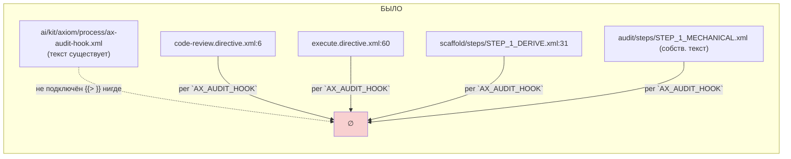
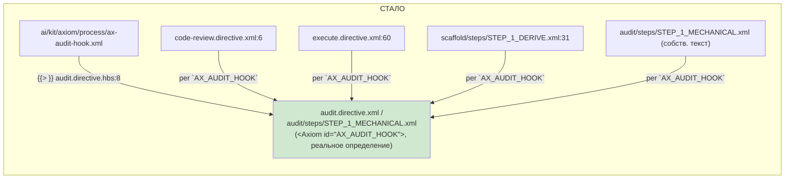

# R-T-B6-25 — `ax-audit-hook.xml` собран (самая цитируемая висячая аксиома)

Ветка `lead/axioms-one-home`, коммит `ae42e356`.

## 1. Файлы

| Путь | Тип | Смысловое изменение | Чем доказано |
|---|---|---|---|
| `ai/kit/templates/sdd-v2/audit.directive.hbs` | правка | добавлен `{{> "axiom/process/ax-audit-hook"}}` первой строкой `<BeliefState>` | `build:directives` + `audit:sdd-templates` |
| `ai/kit/axiom/process/ax-audit-hook.xml` | не тронут | контент уже существовал (написан ранее под v2-семантику group-audit); задача — только подключить | — |
| `ai/kit/lint-axioms.ts` | правка | строка `AX_AUDIT_HOOK` в `KNOWN_DANGLING_AXIOM_REFS` снята (была на `T-B6-25`) | прогон с удалённой записью (см. §3) |
| `ai/directives/sdd-v2/audit.directive.xml` | сгенерирован | `check:directives-fresh` | зелёный |
| `ai/directives/sdd-v2/audit/steps/STEP_1_MECHANICAL.xml` | сгенерирован | lazy-сборка положила тело `AX_AUDIT_HOOK` в этот шаг-пакет (там же, где уже было упоминание) | `check:directives-fresh` |

## 2. Архитектура было / стало

`lintUndefinedAxiomRefs` — корпус-wide: определение в ЛЮБОМ файле сборки резолвит ВСЕ 5 упоминаний, не только внутри `audit.directive.hbs` — поэтому 4 других сайта на диаграмме не тронуты кодом, но перестают быть висячими.

## 3. Доказательства

| # | Команда | Вывод | Exit | Статус |
|---|---|---|---|---|
| 1 | `node --experimental-strip-types ai/kit/build-directives.ts --check` (после подключения, но с `AX_AUDIT_HOOK` ещё В allowlist) | 0 undefined refs | 0 | ВЫПОЛНЕНО |
| 2 | То же — allowlist-запись `AX_AUDIT_HOOK` удалена вручную перед прогоном | по-прежнему 0 undefined refs (доказывает: реальное определение, не маска) | 0 | ВЫПОЛНЕНО |
| 3 | `npm run build:directives` (запись) + `npm run audit:sdd-templates` | `check:directives-fresh` / `audit:axioms` / `audit:contracts` / `audit:halts` / `check:directive-budgets` — все `✓` | 0 | ВЫПОЛНЕНО |
| 4 | `node --experimental-strip-types --test ai/kit/__tests__/lint-axioms.test.ts` | `# tests 23 / # pass 23` | 0 | ВЫПОЛНЕНО |
| 5 | Активация (AUTHORING.md §7): партиал подключён в `BeliefState`, упоминание уже существовало в `STEP_1_MECHANICAL`'s `<Action>` («Per-group mode closes the WHOLE spec by definition... per `AX_AUDIT_HOOK`») — новый anchoring-текст не понадобился | подтверждено чтением рендера, `audit:axioms` зелёный | 0 | ВЫПОЛНЕНО |

## 4. Отклонения и открытые вопросы

- Контент `ax-audit-hook.xml` — уже написан под v2's group-audit семантику (`sdd-task --audit-group`), не дословный v1-текст («Round is complete only after audit returns PASS» из `scaffold.directive.xml` v1). Бриф просил «перенести текст дословно» для 4 файлов; для ЭТОГО конкретного файла — контент уже существовал и семантически соответствует v2's Mission (который уже описывает group-audit), поэтому решение — не перезаписывать v2-адаптацию v1-текстом, а просто подключить существующий файл. Отклонение зафиксировано явно; если Lead считает нужным сверить с v1 дословно — открытый вопрос для отдельного брифа.
- Команда пуша — см. сводный отчёт пачки.
