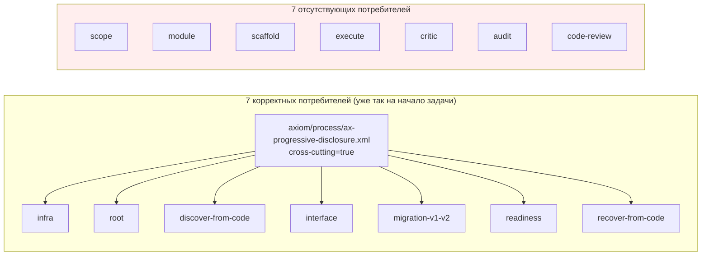
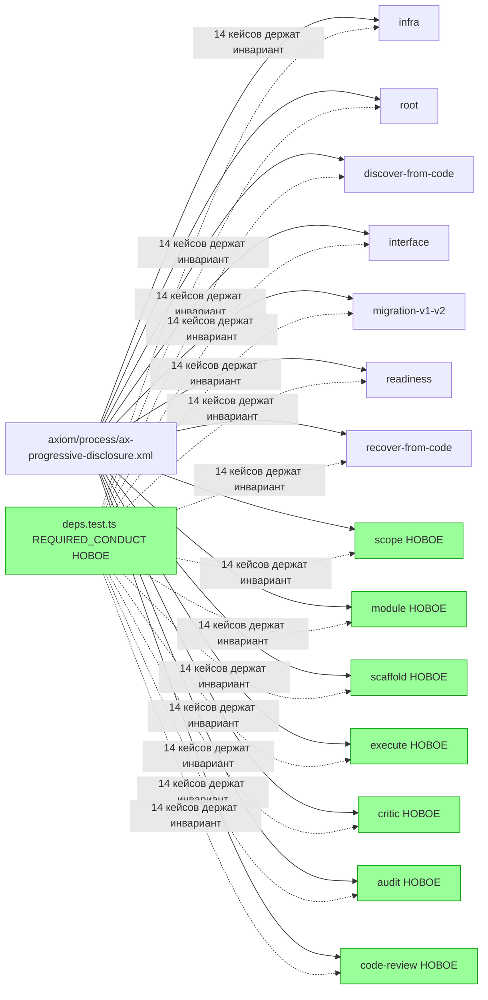

ОТЧЁТ 61 §1 — T-B6-26: `AX_PROGRESSIVE_DISCLOSURE` — один дом, все operator-facing владельцы

СТАТУС: DONE

Рабочее дерево: `rc-w2`. Ветка `lead/kit-lint`.

КОММИТ (локальный, НИЧЕГО не запушено):
- `aa21a55f` feat(T-B6-26): AX_PROGRESSIVE_DISCLOSURE reaches every operator-facing owner

---

## 1. Файлы

| Путь | Тип | Смысловое изменение | Чем доказано |
|---|---|---|---|
| `ai/kit/templates/sdd-v2/{scope,module,scaffold,execute,critic,audit,code-review}.directive.hbs` | правка (7 файлов) | Добавлена `{{> "axiom/process/ax-progressive-disclosure"}}` в `BeliefState` каждого из 7 шаблонов, у которых её не было (доска: «ни одной у scope/module/scaffold/execute/critic/audit/code-review»). `scope`/`module` сохранили свой существующий `deps="AX_TOOL_INVOCATION"` без изменений — добавлен ПРЯМОЙ инклюд, не новый deps. | `deps.test.ts` (14 новых кейсов). |
| `ai/directives/sdd-v2/{scope,module,scaffold,execute,critic,audit,code-review}.directive.xml` | правка (сборка) | Прямое следствие правок шаблонов. | `check:directives-fresh`. |
| `ai/kit/__tests__/deps.test.ts` | правка | Новый набор `REQUIRED_CONDUCT` (сейчас `['AX_PROGRESSIVE_DISCLOSURE']`, растёт под T-B6-20) + `OPERATOR_FACING_OWNERS` (14 директив) + 14 кейсов «файл carries every id in REQUIRED_CONDUCT». | Сам файл. |

`git diff --stat` — 15 файлов, все покрыты (7 шаблонов + 7 сгенерированных + 1 тестовый).

---

## 2. Архитектура было / стало

### Было — 7 из 14 operator-facing владельцев не несут `AX_PROGRESSIVE_DISCLOSURE`

**Важное фактологическое уточнение против доски:** библиотечный партиал (`ai/kit/axiom/process/ax-progressive-disclosure.xml`, `cross-cutting="true"`) на момент начала этой задачи УЖЕ был единственным домом и УЖЕ корректно подключён во всех 7 директивах, названных доской как «7 локальных инлайн-копий» (`infra`, `root`, `discover-from-code`, `interface`, `migration-v1-v2`, `readiness`, `recover-from-code`). Проверено грепом на `<Axiom id="AX_PROGRESSIVE_DISCLOSURE"` (0 совпадений где-либо в дереве) — эта часть находки доски устарела относительно текущего состояния RC. Вторая половина находки — «ни одной у scope/module/scaffold/execute/critic/audit/code-review» — подтвердилась буквально.



### Стало — все 14 operator-facing владельцев подключают партиал, `REQUIRED_CONDUCT` держит инвариант


Узлы: `ai/kit/__tests__/deps.test.ts:63-88` (`REQUIRED_CONDUCT`, `OPERATOR_FACING_OWNERS`, новый `describe`).

---

## 3. Доказательства (команды из ПРИЁМКИ, фактический вывод, exit-код)

**1. `deps.test.ts` — «REQUIRED_CONDUCT явный», 14 новых кейсов + существующие, все зелены.**
```
$ tsx --test ai/kit/__tests__/deps.test.ts
# tests 28, pass 28, fail 0
```
exit 0. ВЫПОЛНЕНО.

**2. `npm run build:directives` + `check:directives-fresh`.**
```
Generated 55 directive(s).
✓ ai/directives/** matches a fresh rebuild.
```
exit 0/0. ВЫПОЛНЕНО.

**3. `audit:sdd-templates` целиком (cross-cutting-аксиома не требует activation-гейта, что и подтверждено).**
```
✓ axiom-activation audit clean — 28 template(s) checked.
✓ contract-activation / halt-activation audit clean.
✓ every lazy directive ... within budget.
```
exit 0. ВЫПОЛНЕНО.

**4. Полный kit-набор (39 файлов) + `npm run check`.**
```
# tests 214, pass 213, fail 0, skip 1
[sdd-verify] ✅ ALL PASS (5/5)
```
exit 0. ВЫПОЛНЕНО.

**5. Коммит через `pre-commit` целиком, без `--no-verify`.**
```
✅ Pre-commit passed
[lead/kit-lint aa21a55f] feat(T-B6-26): AX_PROGRESSIVE_DISCLOSURE reaches every operator-facing owner
```
exit 0. ВЫПОЛНЕНО.

---

## 4. Отклонения, открытые вопросы, команды пуша

**Отклонение.** Реализация НЕ трогает `router.directive.hbs` и не переводит `scope`/`module` на «deps=»-наследование `AX_PROGRESSIVE_DISCLOSURE» — выбран ПРЯМОЙ инклюд партиала во всех 7 новых потребителях, идентично тому, как уже делают 7 существующих корректных потребителей (единообразие важнее теоретической возможности через router-core). deps.test.ts уже проверяет отдельно «objявленные deps= удовлетворены router-core» — этот механизм не затронут.

**Открытые вопросы:** доска описывала «7 инлайн-копий» как текущую проблему; фактически они уже были партиалом на момент старта задачи (см. §2). Указано явно в отчёте для трассируемости — не скрыто.

**Команды пуша для Lead** — см. сводный отчёт `R-BATCH-05-kit-lint.md`.
