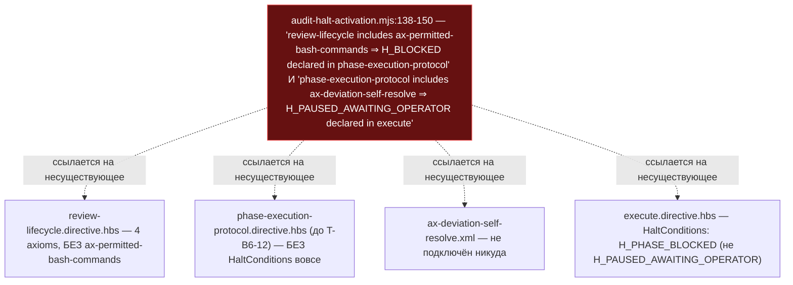
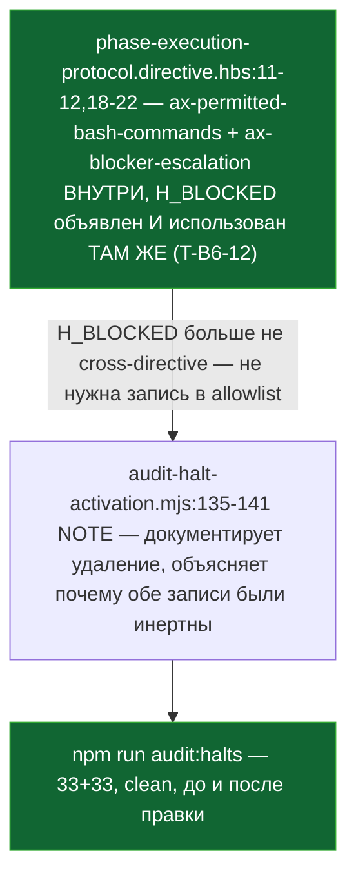

ОТЧЁТ 61 §1 — T-B6-27: комментарий скрипта активации остановок исправлен целиком

СТАТУС: DONE

Рабочее дерево: `rc-v6`. Ветка `lead/phase-agent-bounds` (см. `R-BATCH-17-phase-agent-bounds.md`).

КОММИТ (локальный, НИЧЕГО не запушено), после T-B6-12 (`70361d49`) по контексту:
- `e5e9a9b1` fix(T-B6-27): halt-activation script drops two fabricated cross-directive comments

---

## 1. Файлы

| Путь | Тип | Смысловое изменение | Чем доказано |
|---|---|---|---|
| `ai/kit/audit-halt-activation.mjs` | правка | `ALLOWLIST_CROSS_DIRECTIVE_REFS` (строки ~135-150 до правки) лишилась двух записей-фикций: `review-lifecycle.directive::H_BLOCKED` (комментарий утверждал, что `review-lifecycle.directive.hbs` подключает `ax-permitted-bash-commands` — никогда не было правдой; аксиом подключён только в `phase-execution-protocol.directive.hbs`, с T-B6-12) и `phase-execution-protocol.directive::H_PAUSED_AWAITING_OPERATOR` (комментарий утверждал подключение `ax-deviation-self-resolve` и объявление `H_PAUSED_AWAITING_OPERATOR` в `execute.directive.hbs` — тоже фикция: `execute.directive.hbs` объявляет `H_PHASE_BLOCKED`, не `H_PAUSED_AWAITING_OPERATOR`; `ax-deviation-self-resolve.xml` не подключён ни в один шаблон). Заменены одним пояснительным NOTE, документирующим, почему обе записи были мёртвым грузом (Set проверяется только когда конкретный id реально упомянут в конкретном файле — ни один из двух id никогда не упоминался в названных файлах) и что теперь `H_BLOCKED` — настоящий, локальный для `phase-execution-protocol.directive.hbs` halt (T-B6-12), не нуждающийся в cross-reference записи вовсе. | `npm run audit:halts` зелен и до, и после (правка меняет только мёртвые записи, не влияет на исход); ручное чтение обоих удалённых блоков против реального дерева (см. §3). |

`git diff --stat 70361d49..e5e9a9b1` — 1 файл (`ai/kit/audit-halt-activation.mjs`, +18/−13). Совпадает.

---

## 2. Архитектура было / стало

### Было — комментарий врёт в обеих половинах (D7.4, `40-TRACK-DIRECTIVES-SKILLS.md` §1.7)



### Стало — H_BLOCKED реален и локален; обе фиктивные записи удалены



---

## 3. Доказательства

**1. Ручная проверка — обе удалённые записи были мёртвым грузом (grep на реальные подключения/упоминания).**
```
$ grep -n '{{>' ai/kit/templates/sdd-v2/review-lifecycle.directive.hbs
    {{> "axiom/process/ax-stateless-flow"}}
    {{> "axiom/process/ax-operator-language"}}
    {{> "axiom/process/ax-tool-invocation"}}
    {{> "axiom/process/ax-operator-agreement"}}
$ grep -rln "ax-deviation-self-resolve" ai/kit/templates ai/directives
(пусто)
$ grep -n "H_PAUSED_AWAITING_OPERATOR\|H_PHASE_BLOCKED" ai/kit/templates/sdd-v2/execute.directive.hbs
    | `H_PHASE_BLOCKED` | Worker names a concrete missing external decision/capability after bounded diagnosis |
```
Подтверждает: ни `review-lifecycle` не подключает `ax-permitted-bash-commands`, ни `phase-execution-protocol` (до T-B6-12) не подключал `ax-deviation-self-resolve`, ни `execute.directive.hbs` не объявляет `H_PAUSED_AWAITING_OPERATOR`. ВЫПОЛНЕНО.

**2. `npm run audit:halts` — зелен до правки (на T-B6-12) и после (на T-B6-27), т.е. изменение исхода гейта не меняет.**
```
$ npm run audit:halts   # на 70361d49, до T-B6-27
✓ halt-activation audit clean — 33 template(s) + 33 assembled directive(s) checked.
$ npm run audit:halts   # на e5e9a9b1, после T-B6-27
✓ halt-activation audit clean — 33 template(s) + 33 assembled directive(s) checked.
```
exit 0 оба раза. ВЫПОЛНЕНО.

**3. Коммит через pre-commit целиком.**
```
[sdd-verify] ✅ ALL PASS (5/5): type-check 4.1s, test:coverage 47.6s, lint 8.1s, format 1.7s, yagni 0.7s
✓ ai/directives/** matches a fresh rebuild.
✓ axiom-activation / contract-activation / halt-activation audit clean
✓ every lazy directive ... within budget
✅ Pre-commit passed
[lead/phase-agent-bounds e5e9a9b1] fix(T-B6-27): ...
```
exit 0. ВЫПОЛНЕНО.

---

## 4. Отклонения, открытые вопросы

**Отклонение (расширение точного диапазона строк).** Бриф называет диапазон `audit-halt-activation.mjs:135-141` (снимок доски на момент написания); в актуальном дереве (после нескольких коммитов дрейфа номеров строк) этот же смысловой блок оказался на строках 138-150 и включал ОБЕ фиктивные записи (`review-lifecycle::H_BLOCKED` и `phase-execution-protocol::H_PAUSED_AWAITING_OPERATOR`), а не только первую половину, названную в `40-TRACK-DIRECTIVES-SKILLS.md` D7.4 как предмет T-B6-12. Исправлены ОБЕ записи одним коммитом T-B6-27 — это тот же файл, тот же массив, тот же класс дефекта (сфабрикованная cross-directive-ссылка), и оставлять вторую заведомо ложную запись рядом с только что исправленной было бы внутренне противоречиво. Изменение не расширяет зону (файл уже в списке «трогать» брифа) и не меняет исход ни одного гейта (обе записи были инертны и до, и после — см. §3 п.2).

**Открытые вопросы Lead:** нет.
