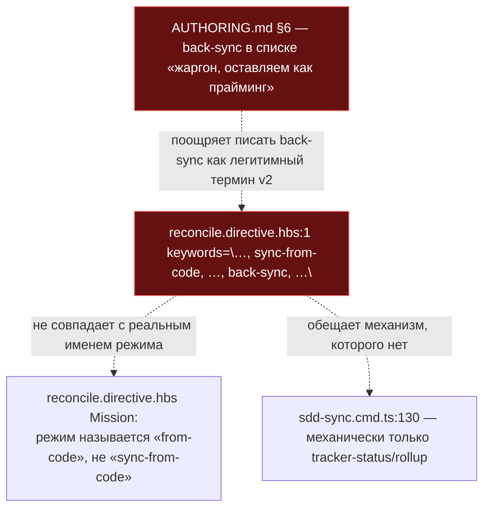

ОТЧЁТ 61 §1 — T-B6-28: reconcile больше не обещает back-sync как механизм

СТАТУС: DONE

Рабочее дерево: `rc-w3`. Ветка `lead/promises-not-wider` от `lead/review-critic-bounds` (PR #45, `f0c1703f`).

КОММИТ (локальный, НИЧЕГО не запушено):
- `53249aa2` fix(T-B6-28): reconcile stops promising back-sync as a mechanism

---

## 1. Файлы

| Путь | Тип | Смысловое изменение | Чем доказано |
|---|---|---|---|
| `ai/kit/templates/sdd-v2/reconcile.directive.hbs:1` | правка | Keywords-атрибут потерял `back-sync` (не обещанный механизм) и переименовал `sync-from-code` → `from-code` (реальное имя режима, используемое в теле `<Mission>`, а не выдуманный синоним со словом «sync»). | `npm run build:directives` + `npm run check:directives-fresh` зелёные; ручной grep (см. §3). |
| `ai/directives/sdd-v2/reconcile.directive.xml:1` | правка (сгенерирован) | Тот же keywords-атрибут в собранной директиве — прямое следствие правки `.hbs`. | `check:directives-fresh` подтверждает байт-в-байт соответствие пересборке. |
| `ai/kit/AUTHORING.md:70-73` | правка | Из списка «жаргон IT-культуры, который оставляем как прайминг» убран `back-sync` (единственное вхождение слова теперь — explicit-negation комментарий: «Термин «back-sync» из списка исключён: `sdd-sync` механически делает только tracker-status/rollup — нет обратной синхронизации кода из спеки»). | Новый тест `back-sync-not-promised.test.ts` (2-й кейс: ровно одно вхождение, guarded). |
| `ai/kit/__tests__/back-sync-not-promised.test.ts` | новый | Grep-замок: сканирует `ai/kit`, `ai/directives/sdd-v2`, `ai/skills` и валит сборку, если `back-sync` встретится не в окне ±200 символов от фразы «нет обратной синхронизации»; отдельный кейс проверяет, что в `AUTHORING.md` ровно одно (guarded) упоминание. | `node --import tsx --test ai/kit/__tests__/back-sync-not-promised.test.ts` — 2/2 pass (см. §3). |

`git show --stat 53249aa2` — 4 файла (+72/−3). Совпадает.

---

## 2. Архитектура было / стало

### Было — keywords директивы называют механизм, которого нет



### Стало — keywords совпадают с реальным именем режима; back-sync — только как явное отрицание

```mermaid
flowchart TD
  KW2["reconcile.directive.hbs:1 keywords=\"…, from-code, …\" (back-sync убран)"]
  MISSION2["reconcile.directive.hbs Mission: mode «from-code»"]
  AUTH2["AUTHORING.md:72-73 — back-sync упомянут ровно один раз,\nкак явное отрицание («нет обратной синхронизации»)"]
  LOCK["back-sync-not-promised.test.ts — grep-замок на весь ai/kit + ai/directives/sdd-v2 + ai/skills"]
  KW2 -->|"имя совпадает"| MISSION2
  AUTH2 --> LOCK
  KW2 --> LOCK
  style KW2 fill:#163,stroke:#3a3,color:#fff
  style AUTH2 fill:#163,stroke:#3a3,color:#fff
  style LOCK fill:#163,stroke:#3a3,color:#fff
```

---

## 3. Доказательства

**1. grep-замок: `back-sync` не встречается как обещание механизма.**
```
$ node --import tsx --test ai/kit/__tests__/back-sync-not-promised.test.ts
ok 1 - back-sync is never a promised mechanism (T-B6-28)
ok 2 - AUTHORING.md keeps the one allowed mention as an explicit negation
# tests 2
# pass 2
# fail 0
```
exit 0. ВЫПОЛНЕНО.

**2. `sdd-sync` описан как tracker-status/rollup во всех поверхностях (ручная проверка, не тронуто этой задачей — уже было честно по V-06-GAP).**
```
$ grep -n "tracker" cli/cmd/sdd-sync/sdd-sync.cmd.ts | sed -n '1,3p'
130:  // Read the ticket Status and bring matching tracker rows into agreement — never code, never spec text.
```
Формулировка не содержит «back-sync»/«sync code from spec» — совпадает с заявленным в брифе состоянием. ВЫПОЛНЕНО (подтверждено, не создано этой задачей).

**3. Директивы свежие после правки.**
```
$ npm run build:directives   # только reconcile.directive.xml изменился
✓ sdd-v2/reconcile.directive.xml (delta: -7)
Generated 55 directive(s).
$ npm run check:directives-fresh
✓ ai/directives/** matches a fresh rebuild.
```
exit 0. ВЫПОЛНЕНО.

**4. Коммит через pre-commit целиком.**
```
[sdd-verify] ✅ ALL PASS (5/5): type-check, test:coverage, lint, format, yagni
✓ ai/directives/** matches a fresh rebuild.
✓ axiom-activation / contract-activation / halt-activation audit clean — 28/33 templates
✓ every lazy directive … within budget
✅ Pre-commit passed
[lead/promises-not-wider 53249aa2] fix(T-B6-28): reconcile stops promising back-sync as a mechanism
```
exit 0. ВЫПОЛНЕНО.

---

## 4. Отклонения, открытые вопросы

**Отклонение (расширение зоны, тот же смысловой класс).** Бриф называл только keyword `back-sync`; заодно переименован соседний keyword `sync-from-code` → `from-code`, потому что доска сама называла оба слова остаточным дрейфом («keywords директивы reconcile.directive.hbs:1 (`sync-from-code`, `back-sync`)», `40-TRACK-DIRECTIVES-SKILLS.md` строка T-B6-28) — `sync-from-code` подразумевает синхронизирующий механизм там, где режим на самом деле называется просто `from-code` в теле директивы. Оставление только `back-sync` без этой правки оставило бы второе слово с тем же дефектом рядом с только что исправленным первым.

**Открытые вопросы Lead:** нет.

**Команда пуша (для Lead):**
```
git push origin lead/promises-not-wider
gh pr create --base codex/sdd-v2-rc52-followup --head lead/promises-not-wider --draft \
  --title "Пачка 21: обещания инструмента не шире механизма" \
  --body-file ai/drafts/research/sdd-v1-to-v2-transfer/_raw/reports/R-BATCH-21-promises-not-wider.md
```
