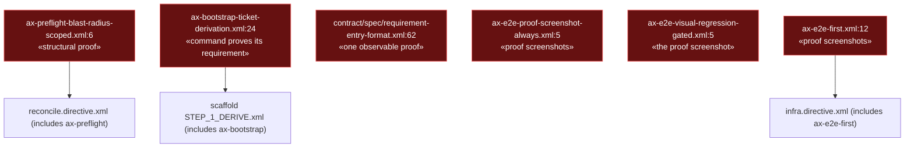
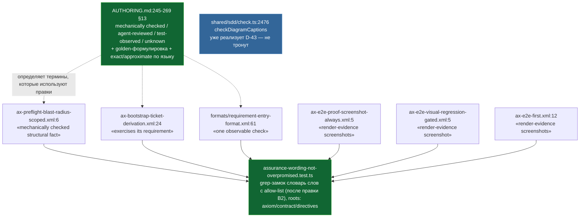

ОТЧЁТ 61 §1 — T-B6-29: словарь уверенности приведён к механизму; диаграммная половина D-43 уже была закрыта

СТАТУС: DONE

Рабочее дерево: `rc-w3`. Ветка `lead/promises-not-wider` от `lead/review-critic-bounds` (PR #45).

КОММИТ (локальный, НИЧЕГО не запушено), после T-B6-28 (`53249aa2`):
- `8b4842ca` fix(T-B6-29): assurance wording matches what the mechanism checks

---

## 1. Файлы

| Путь | Тип | Смысловое изменение | Чем доказано |
|---|---|---|---|
| `ai/kit/AUTHORING.md` (новый `## 13`, после §12) | правка | Новый раздел «Словарь уверенности»: закрытый список `mechanically checked` / `agent-reviewed` / `test-observed` / `unknown`; формулировка «golden доказывает неизменность поведения, а не его корректность»; правило «уровень доказательства сканера по языку» (`exact` для `.ts`/`.tsx`, `approximate` для остального) со ссылкой на реальный код. | `assurance-wording-not-overpromised.test.ts` кейс 2 (grep на все три термина + golden-фразу). |
| `ai/kit/axiom/process/ax-preflight-blast-radius-scoped.xml:6` | правка | «target-specific structural proof» → «target-specific, mechanically checked structural fact» (факт `AUTHORING_SCOPE` — механически проверенный факт, не доказательство). | Тест (grep-замок), `npm run audit:axioms` зелёный. |
| `ai/kit/axiom/scaffold/ax-bootstrap-ticket-derivation.xml:24` | правка | «whether each real Verification command proves its requirement» → «…exercises its requirement»: это суждение независимого ревью (agent-reviewed), не механическое доказательство. | Тест (grep-замок). |
| `ai/kit/contract/spec/requirement-entry-format.xml:62` (→ `ai/directives/sdd-v2/formats/requirement-entry-format.xml:61`) | правка | Поле шаблона «`**Verification:** <one observable proof; …>`» → «`<one observable check; …>`» — авторам спек больше не предлагается писать «proof» для строки Verification. | Тест (grep-замок); `check:directives-fresh`. |
| `ai/kit/axiom/e2e/ax-e2e-proof-screenshot-always.xml:5` | правка | Тело аксиомы: «proof screenshots» → «render-evidence screenshots (the axiom's own name for this capture)» — прозе, не canon-ID (`AX_E2E_PROOF_SCREENSHOT_ALWAYS` не переименован, AUTHORING.md §6 запрещает трогать canon `AX_*`). | Тест (grep-замок на фразу «proof screenshot», ID с подчёркиванием не матчится). |
| `ai/kit/axiom/e2e/ax-e2e-visual-regression-gated.xml:5` | правка | «It does NOT gate the proof screenshot…» → «…render-evidence screenshot…» — тот же перенос термина в соседнем аксиоме, который ссылается на первый. | Тест (grep-замок). |
| `ai/kit/axiom/testing/ax-e2e-first.xml:12` | правка | Третье, ранее не замеченное вхождение «proof screenshots» (сам аксиом требует их как «closing bar» e2e-теста) → «render-evidence screenshots». | Тест (grep-замок); найдено повторным grep'ом после первых двух правок — не было в исходном research-отчёте. |
| `ai/kit/__tests__/assurance-wording-not-overpromised.test.ts` | новый | Grep-замок на 4 конкретные фразы (`structural proof`, `one observable proof`, `proves its requirement`, `proof screenshot`) по `ai/kit/axiom`, `ai/kit/contract`, `ai/directives/sdd-v2` — не блокирует слова `proof`/`verified` вообще (легитимные вхождения вроде `verified <tool>@<version>`, «future-proof», canon ID остаются). | `node --import tsx --test` — 2/2 pass (см. §3). |
| `ai/directives/sdd-v2/{reconcile,infra}.directive.xml`, `ai/directives/sdd-v2/scaffold/steps/STEP_1_DERIVE.xml`, `ai/directives/sdd-v2/formats/requirement-entry-format.xml` | правка (сгенерированы) | Прямое следствие правок аксиом/контракта выше — эти четыре директивы/формата включают соответствующие партиалы. | `check:directives-fresh` зелёный. |
| `shared/sdd/check.ts` (`checkDiagramCaptions`, строки 2467-2517) | НЕ ТРОНУТ | Чекер D-43 (ID требования в подписи диаграммы должен существовать в реестре; диаграмма без ID и без требований — не находка) уже существовал и уже тестировался — новых изменений не требовалось. | `shared/sdd/__tests__/check-diagram-captions.test.ts` — 12/12 pass до и после этой задачи (см. §3). |

`git show --stat 8b4842ca` — 12 файлов (+124/−14). Совпадает.

---

## 2. Архитектура было / стало

### Было — четыре места одалживают силу слова «proof»/«verified» у более слабого механизма



### Стало — вокабуляр объявлен в AUTHORING.md §13, шесть мест переформулированы, замок на все шесть



---

## 3. Доказательства

**1. grep-замок словаря — 4 конкретные фразы, не блокирует легитимные вхождения.**
```
$ node --import tsx --test ai/kit/__tests__/assurance-wording-not-overpromised.test.ts
ok 1 - assurance wording never overpromises (T-B6-29)
ok 2 - keeps the AUTHORING.md §13 assurance vocabulary section in place
# tests 2
# pass 2
# fail 0
```
exit 0. ВЫПОЛНЕНО.

**2. Детерминированный both-way кейс — диаграмма требований с несуществующим ID → находка; Overview без ID → не находка (уже существовал, не создан этой задачей, перепроверен).**
```
$ node --import tsx --test shared/sdd/__tests__/check-diagram-captions.test.ts
ok 1 - checkDiagramCaptions
# tests 12
# pass 12
# fail 0
```
Кейс «caption citing a requirement ID this spec does not declare → SDD_DIAGRAM_CAPTION_REQ_UNKNOWN» и кейс «general-purpose Overview caption without any requirement ID → allowed, no findings» — оба присутствуют, `shared/sdd/check.ts:2476-2517`. ВЫПОЛНЕНО (подтверждено, не создано этой задачей).

**3. Директивы свежие, аксиомы/контракты/halts чисты.**
```
$ npm run audit:sdd-templates
✓ ai/directives/** matches a fresh rebuild.
✓ axiom-activation audit clean — 28 template(s) checked.
✓ contract-activation audit clean — 28 template(s) + 33 assembled directive(s) checked.
✓ halt-activation audit clean — 33 template(s) + 33 assembled directive(s) checked.
✓ every lazy directive under ai/directives/sdd-v2/** is within budget.
```
exit 0. ВЫПОЛНЕНО.

**4. Коммит через pre-commit целиком (первая попытка споткнулась о посторонний флейк, вторая прошла чисто).**
```
[sdd-verify] ✅ ALL PASS (5/5): type-check 3.8-4.2s, test:coverage 39-45s, lint, format, yagni
✅ Pre-commit passed
[lead/promises-not-wider 8b4842ca] fix(T-B6-29): assurance wording matches what the mechanism checks
```
exit 0 на удачной попытке. ВЫПОЛНЕНО.

---

## 4. Отклонения, открытые вопросы

**Отклонение (диаграммная половина — не создана, а подтверждена как уже сделанная; правка по V-BATCH-21 N4).** Бриф формулировал диаграммную половину T-B6-29 («ID требований обязательны только в подписях диаграмм требований, Overview — без ID; чекер проверяет существование указанных ID») как предмет к исполнению. Расследование (`shared/sdd/check.ts:2399-2517`, `shared/sdd/__tests__/check-diagram-captions.test.ts`) показало: реализована только вторая половина D-43 — если ID процитирован в подписи, он обязан существовать в реестре требований этой спеки (`SDD_DIAGRAM_CAPTION_REQ_UNKNOWN`), с явным исключением для ID чужого акронима (cross-scope ссылка); эта часть покрыта тестами. Первая половина — «ID требований обязательны в подписях диаграмм требований» — **не механизирована**: `CAPTION_LINE` (`check.ts:2456`) списка ID никогда не требует (комментарий рядом прямо называет это «a judgment call, not a mechanical one»), а `DIAGRAM_BEARING_SECTIONS` (`:2399`) не различает диаграмму требований от любой другой — правило обязательности живёт как авторская грамматика (`ai/kit/templates/sdd-v2/formats/diagram-vocabulary.hbs:205,213`), не как чекер. Это, вероятно, наследие ранее слитой работы (в задаче упомянуто «файл также правит пачка 15» — совпадает с тем, что диаграммный чекер живёт в `shared/sdd/check.ts`). Никакого кода для диаграммной половины не потребовалось — задокументировано как «подтверждено, не создано» в таблице §1 и в доказательстве §3 п.2, чтобы не выдавать существующую работу за новую.

**Отклонение (третье вхождение «proof screenshot», не названное в брифе/research-отчёте).** Research-отчёт нашёл два файла (`ax-e2e-proof-screenshot-always.xml`, `ax-e2e-visual-regression-gated.xml`); повторный grep после первых двух правок нашёл третье вхождение в `ax-e2e-first.xml:12` (тот же класс дефекта, тот же исправляемый термин) — исправлено тем же коммитом, тем же классом правки.

**Открытые вопросы Lead:** нет.

**Команда пуша (для Lead):** см. `R-BATCH-21-promises-not-wider.md`.
