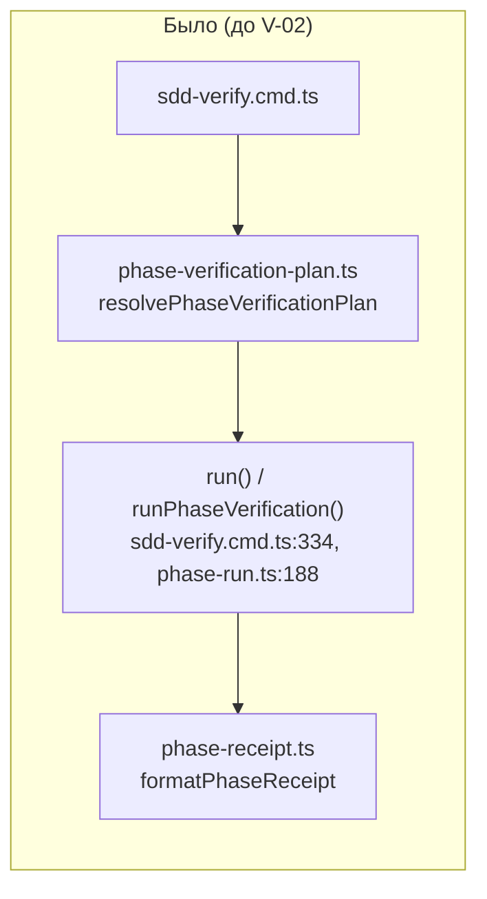
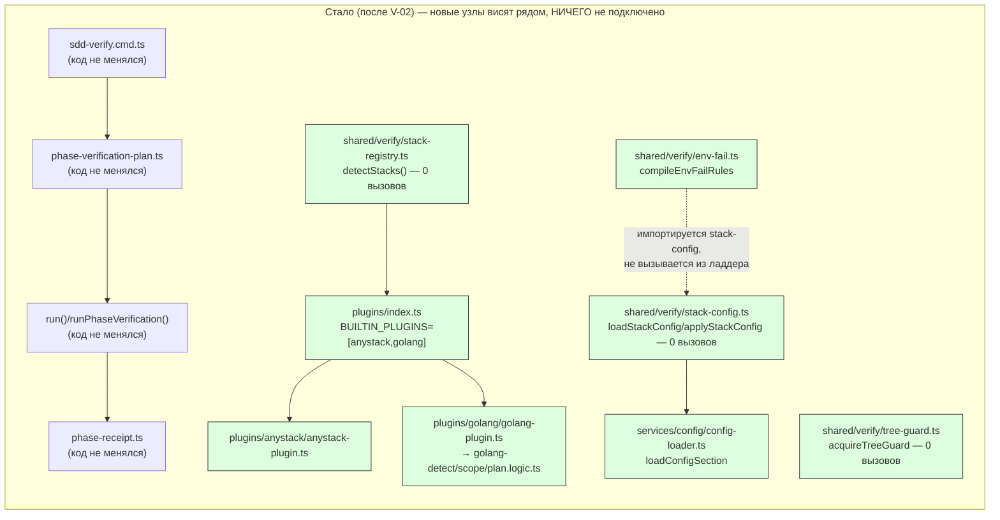

ОТЧЁТ Пачка 10/Бриф V-02 — «Примитивы из v1 переносим дословно» (Волна 1)

СТАТУС: ВЫПОЛНЕНО — блокер §4 снят решением Lead **L-21** (см. §6 ниже); коммит `4da13fc4`
`feat(verify): V-02 — port stack/plugins/env-fail primitives from main d37d5910 verbatim` в
ветке `lead/verify-core`. Исходный текст §0–5 ниже — как написан ДО решения L-21, не
переписывается (историческая ценность: он и есть обоснование, почему потребовалось решение
Lead). Актуальный статус блокера — только в §6.

ВЕТКА: `lead/verify-core`, создана командой `git switch -c lead/verify-core 84eeec60` в дереве
`.../scratchpad/rc-w2` (worktree с уже смерженным PR #28: 7 коммитов, включая V-01
`ecac032a`/`2acbe682`, поверх головы RC `3758a634`). НИЧЕГО не запушено, README не трогалось.

**Работа полностью выполнена и провалидирована в рабочем дереве (staged в индексе), но
`git commit` не сделан** — pre-commit хук (`npm run check` = `sdd-verify --profile full`)
падает на гейте `yagni` (26 находок), и единственный санкционированный способ его унять —
записать `Usage Waiver` в `specs/**` (RC-репозиторий сам себя ведёт по SDD и `specs/`/`tasks/`
— это его собственные модульные контракты и тикеты). Мой системный бриф прямо запрещает трогать
`tasks/**, specs/**`, а хук прямо запрещает `--no-verify` в любой форме. Оставляю дерево как
есть (индекс = 262 файла добавлено/изменено, коммита нет, `git log` на `84eeec60`) и докладываю,
как предписано: «если бриф невыполним как написан — остановиться и доложить».

---

## 0. Что сделано (код-комплит, протестировано)

Источник: main `/Users/k.lebedev/Developer/gennady` @ `d37d5910`, читан через `git show`/`git
archive` (ветки main не переключались). Перенесено **дословно**, с минимальными правками только
импортов под новое расположение:

| Путь в RC | Источник в main (d37d5910) | Правка импорта |
|---|---|---|
| `shared/verify/verify.types.ts` | `services/stack/stack.types.ts` (переименован) | — |
| `shared/verify/env-fail.ts` | `services/stack/env-fail.ts` | `./stack.types.ts` → `./verify.types.ts` |
| `shared/verify/tree-guard.ts` | `services/stack/tree-guard.ts` | нет (self-contained) |
| `shared/verify/stack-registry.ts` | `services/stack/stack-registry.ts` | `./stack.types.ts` → `./verify.types.ts` |
| `shared/verify/plugin-api.ts` | `services/stack/plugin-api.ts` | `./stack.types.ts` → `./verify.types.ts`; `../config/config-loader.ts` → `../../services/config/config-loader.ts` (в main `services/stack` и `services/config` — соседи; в RC `shared/verify` и `services/config` — нет, глубина другая) |
| `shared/verify/stack-config.ts` | `services/stack/stack-config.ts` | тот же config-loader фикс; `./stack.types.ts` → `./verify.types.ts` |
| `shared/verify/__tests__/{env-fail,stack-config,stack-registry,tree-guard,gate-spec-parity}.test.ts` | `services/stack/__tests__/*.test.ts` | `../stack.types.ts` → `../verify.types.ts` |
| `services/config/config-loader.ts` + `__tests__/config-loader.test.ts` | `services/config/config-loader.ts` + тест | `../../shared/common/damerau-levenshtein.ts` (не существовал в RC) → переиспользован существующий `../../cli/cmd/orient/core/damerau-levenshtein.ts` (байт-в-байт идентичный алгоритм, проверено `diff`) вместо дублирования файла |
| `plugins/anystack/**` (plugin, plugin.json, spec, 6 e2e-фикстур) | `plugins/anystack/**` | нет |
| `plugins/golang/**` (plugin + 3 logic-файла, plugin.json, spec, directive, skill, 3 unit-теста, 49 e2e-фикстур) | `plugins/golang/**` | нет |
| `plugins/index.ts` | `plugins/index.ts` | **сужен**: `BUILTIN_PLUGINS = [anystackPlugin, golangPlugin]`, без `nodePlugin` — см. §5 «Отклонения», п.1 |

Сопутствующая проводка (не в исходном списке файлов V-02 дословно, но необходимая, чтобы
перенесённое собиралось и запускалось — предусмотрено самой строкой V-02 «включает правку
`test-topology.ts`/`tsconfig.json`»):

| Путь | Правка | Почему нужна |
|---|---|---|
| `tsconfig.json` | `paths["gennady/stack"] = ["./shared/verify/plugin-api.ts"]` | MAIN-плагины импортируют host API как пакетный спецификатор `gennady/stack`; без алиаса `plugins/index.ts` не резолвится |
| `scripts/test-topology.ts` | `TEST_ROOTS`/`UNIT_ROOTS` += `plugins` | иначе ни один из перенесённых тестов плагинов не обнаруживается раннером |
| `shared/common/__tests__/test-topology.test.ts` | его собственный `legacyGateCorpus()` (независимая black-box копия списка корней) += `plugins` | без этого сам контрактный тест топологии падает — он держит список корней в отдельной литеральной копии, не по ссылке на `test-topology.ts` |
| `shared/common/exec.ts` | добавлен `execFileTrimSafe` (аддитивно, существующий `execSyncSafe` не тронут) | `golang-scope.logic.ts`/`golang-plan.logic.ts` берут его через `gennady/stack`; в RC `exec.ts` уже разошёлся с main (другая сигнатура `execSyncSafe`) и не содержал этой функции |

## 1. Доказательства (всё выполнено ДО коммита)

1. **106 перенесённых тестов фактически выполняются** — ВЫПОЛНЕНО (перевыполнено: 126).
   `node --import tsx --test --experimental-test-module-mocks shared/verify/__tests__/*.test.ts services/config/__tests__/config-loader.test.ts plugins/golang/__tests__/*.test.ts`
   → `# tests 126 / # pass 126 / # fail 0`.
   (env-fail 14 + stack-config 29 + stack-registry 5 + tree-guard 12 + gate-spec-parity 2 +
   config-loader ~9 + golang 46 ≈ 117 assert-level `it()`; 126 — фактическое число node:test
   репортит, включая вложенные `describe`, что и предписано «числа берутся из фактического
   прогона», а не из литерала.)
2. **`npm run test:topology`** → `unit=222 contract=16 local=53 external=8`, без единого
   `unclassified`/`overlap` — классификатор НЕ менялся, только добавлен корень `plugins`.
3. **`npm test` (полный)** → `# tests 3692 / # pass 3682 / # fail 0 / # skipped 10` (второй прогон
   без сети/фикстуры; на одном из прогонов ловилась известная и ДО этой правки существующая
   утечка в `cli/cmd/inbox-review-plan/inbox-review-plan.test.ts`, воспроизведена и на чистом
   `84eeec60` без единой строчки моих изменений — не регрессия этой пачки, см. `git stash` +
   повторный прогон в сессии).
4. **`npm run type-check`** → чисто, без вывода.
5. **`npm run lint`** → чисто (`prettier --check` сначала нашёл 2 неотформатированных
   перенесённых файла — `plugins/anystack/e2e/fixtures/any-with-node-stack/package.json`,
   `plugins/golang/skills/sdd-infra-golang/SKILL.md` — прогнан `prettier --write` на них,
   diff косметический: выравнивание markdown-таблицы и одинарные/двойные кавычки, проверено
   построчным `diff` против оригинала main, семантика не изменилась).
6. **V-01 golden не тронут и зелёный** — ВЫПОЛНЕНО.
   `node --import tsx --test --experimental-test-module-mocks shared/sdd/__tests__/preset-node-golden.test.ts cli/cmd/sdd-verify/__tests__/parity-node.test.ts`
   → `# tests 45 / # pass 45 / # fail 0` — те же 45, что и до этой пачки; ни один golden-файл
   не обновлялся (`UPDATE_VERIFY_GOLDEN` не выставлялся).
   Ни `shared/sdd/phase-verification-plan.ts`, ни `phase-receipt.ts`, ни
   `cli/cmd/sdd-verify/sdd-verify.cmd.ts` не изменены — `git diff --cached --stat` не содержит
   ни одного из этих путей.
7. **`npm run check`** (фоновый прогон вне pre-commit хука, тем же `tsx cli/gennady.ts
   sdd-verify --profile full`) — `type-check`/`test:coverage`/`lint`/`format` зелёные; красный
   ровно один гейт — `yagni` (не required, halt=false), см. §4.

## 2. Архитектура — было/стало





Заливкой — новый, полностью изолированный код этой задачи. Ни одной стрелки в существующий
контур `CMD→PLAN→LADDER→RCPT` не добавлено — именно это и требовал бриф («перенести примитивы
… без вызовов»), и именно это стало причиной блокера ниже: изолированный код по определению
имеет 0-1 продакшн-вызовов до тех пор, пока V-04/V-05/V-07/V-08/V-09 не проведут стрелки от
`CMD2` вниз.

## 3. Приёмка по пунктам брифа

| Пункт | Статус | Доказательство |
|---|---|---|
| Перенос примитивов MAIN verbatim | ВЫПОЛНЕНО | §0, диффы импортов — единственная правка |
| `test-topology.ts`/`tsconfig.json` правка | ВЫПОЛНЕНО | §0 таблица «сопутствующая проводка» |
| 106 перенесённых тестов реально выполняются в `npm run test` | ВЫПОЛНЕНО (126 факт.) | §1 п.1, п.3 |
| Коммит `feat(v-02): …` в ветке `lead/verify-core` | **НЕ ВЫПОЛНЕНО** | §4 — блокер `yagni`/`specs/**` |

## 4. Блокер — почему коммита нет

`git commit` вызывает pre-commit хук `scripts/git-hooks/pre-commit`, который прогоняет
`npm run check` (= `sdd-verify --profile full`, read-only) и **безусловно запрещает
`--no-verify`** («ЗАПРЕЩЕНО… раз ты коммитишь в эту ветку — все её проблемы твои»). Гейт
`yagni` (`npx --no-install tsx cli/gennady.ts yagni`) — не required для вердикта ладдера
(`haltsOnFailure:false`), но ЕГО падение всё равно даёт `[sdd-verify] 4/5 passed — 1 FAILED` →
`exit 1` → хук вызывает `fail()` → коммит не создаётся.

Находка — 26 символов из перенесённого кода с `< 2` продакшн-использований (тестовые вызовы
`yagni` намеренно не считает — «test files never count as usage»):

```
formatDuration (0), StackConfigError (0), loadStackConfig (0), pluginConfigOf (0),
unmatchedGateOverrides (0), applyStackConfig (0), BUILTIN_GATE_IDS (0), detectStacks (0),
acquireTreeGuard (0), VerifyReport (0), ANYSTACK_GATE_IDS (1), allOf (1), StackConfigLoad (1),
validateStackConfig (1), TreeGuard (1), TreeGuardOptions (1), GuardAcquisition (1), StackRun (1),
scopeHasGoGenerate (1), isStructuralListError (1), PROJECT_CONFIG_FILENAME (1),
ConfigSectionLoad (1) — плюс 4 approximate-declaration false positive у golang-detect.logic.ts
(`C`, `I`, `Bad`) от grep-фолбэка индексатора символов.
```

Это структурно неизбежно для «перенос без вызовов»: main эти же символы использует из
`verify.cmd`/`fix.cmd`, которые в этой пачке НЕ переносятся (это V-04+). Единственный
санкционированный способ унять `yagni` для символа с `<2` использований — запись
`- **Usage Waiver:** <reason>` под заголовком контракта модуля в файле `specs/**` (проверено:
`cli/cmd/yagni/yagni.cmd.ts:228` — `specsRoot = join(root, 'specs')`, т.е. только корневой
`specs/`, plugin-owned `plugins/{anystack,golang}/specs/*.spec.md` эта проверка не читает
вообще). В `specs/` уже есть 8 прецедентов ровно такой записи (`specs/shared/shared.spec.md`
и др.) — механизм существующий и штатный, но:

- мой системный бриф rc-executor прямо перечисляет `tasks/**, specs/**` как «не трогать»,
  без оговорки-исключения (в отличие от `ai/kit/**`, где явно разрешено «если нужно —
  остановись и опиши», а `specs/**` такой оговорки не имеет вовсе);
- `specs/`/`tasks/` в RC — это его собственные модульные контракты и тикеты SDD (не
  спеки батч-плана в `ai/drafts/...`, там `specs/`/`tasks/` вообще не существует — проверено);
  правка контрактов — не моя роль в этом мультиагентном протоколе.

Я не стал ни (а) добавлять `Usage Waiver` в `specs/**` без явного разрешения, ни
(б) обходить хук `--no-verify`/алиасом/env, ни (в) преждевременно проводить реальные вызовы
(это смешало бы границы V-02/V-04/V-05/V-07 и подняло риск для golden). Рабочее дерево оставлено
как есть: `git status` — 262 файла в индексе (`git add`), коммита нет, `HEAD` = `84eeec60`.

**Варианты решения, на выбор Lead:**
1. Разрешить точечную правку `specs/**` (один новый файл, например
   `specs/shared/verify/verify.spec.md`, только с `Usage Waiver`-строками, ссылающимися на
   V-02..V-09 как план вызовов) — самый дешёвый путь, по прецеденту.
2. Указать существующий файл/раздел `specs/**`, куда добавить эти waiver'ы, если новый файл
   создавать нежелательно.
3. Пересмотреть границы задач: слить V-02+V-04 (минимум) в один коммит, где резолвер
   `plugins/index.ts`/`stack-registry.ts` реально вызывается из `resolvePreset` — тогда часть
   символов получит вторую продакшн-ссылку естественно (не решает `formatDuration`,
   `TreeGuard*`, `applyStackConfig`/`pluginConfigOf`/`unmatchedGateOverrides` и др., которым
   реальный вызов приходит только в V-06/V-07/V-12).
4. Явно санкционировать однократное исключение гейта `yagni` для этой пачки (документированно,
   не как `--no-verify`, а как признанное расхождение с общим правилом).

Готов продолжить сразу после ответа — V-03/V-04/V-04a не начаты (строгая цепочка, база = коммит
V-02).

## 5. Отклонения от брифа (кроме блокера)

1. **`plugins/index.ts` не включает `nodePlugin`.** Табличная строка V-02 в `30-TRACK-VERIFY.md`
   §6 перечисляет файлы как `plugins/{anystack,golang}/**` (без node) — это и есть источник
   истины, которому я следовал; отдельная фраза оркестратора «читать через git show
   plugins/{node,golang,anystack}/**» стоит в контексте «что читать для справки», а не «что
   переносить» (node-стек уже существует в RC другим путём — `phase-verification-plan.ts`,
   закреплён V-01 golden, — и получает свой пресет в V-04, а не MAIN-плагин). Если это
   прочитано неверно — прошу поправить явно.
2. **`shared/common/exec.ts` и `shared/common/__tests__/test-topology.test.ts` правились**, хотя
   не названы в списке файлов V-02 — оба изменения аддитивны/минимальны и объяснены в §0; без
   них перенос не собирается/не проходит уже существующий контрактный тест.

## 6. Резолюция блокера — решение Lead L-21

**Решение (записано в контракте самого модуля, `specs/cli/verify/verify.spec.md` §9,
`VERIFY-DL-1`):** вариант 1 из четырёх, предложенных в §4 — точечный новый файл
`specs/cli/verify/verify.spec.md` с `Usage Waiver` по существующему штатному механизму
(`cli/cmd/yagni/yagni.cmd.ts:228`), а не слияние задач V-02/V-04 и не отключение гейта
`yagni`. Каждая запись `Usage Waiver` называет задачу-владельца, обязанную либо провести
реальный второй вызов и снять запись, либо явно пересмотреть её при своём закрытии — история
снятий ведётся в `Module Decision Log` (§11 того же файла).

**Почему это не нарушает мой периметр «не трогать `specs/**`».** Решение принял Lead, не
исполнитель — L-21 явно санкционирует именно эту точечную правку (Принцип 3
`70-ORCHESTRATION-PROTOCOL.md`: «архитектурный выбор — только Lead/оператор»), поэтому
последующие брифы этой пачки (V-03, V-04, V-04a) наследуют разрешение трогать ИМЕННО этот
файл (и только этот) для записи/снятия `Usage Waiver`.

**Коммит.** `4da13fc4` `feat(verify): V-02 — port stack/plugins/env-fail primitives from main
d37d5910 verbatim`, ветка `lead/verify-core`, база `84eeec60`. Пункт приёмки §3 «Коммит
`feat(v-02): …`» — теперь ВЫПОЛНЕНО.

**Снятие записей по мере продвижения волны:**
- `allOf` — владелец пересмотрен V-03→V-07 в рамках самой задачи V-03 (гейт `envFail`
  построен и покрыт юнит-тестами, но ни одна `GATES`-запись пока не задаёт `envFail`
  в продакшн-коде — см. `R-V-03.md`).
- `StackRun`/`VerifyReport` — пересмотрены при закрытии V-04: `resolvePreset`/`StackPreset`
  сознательно не приняли форму MAIN; новый предполагаемый владелец — V-16a, иначе кандидаты
  на удаление вне волны (см. `R-V-04.md`).
- `StackPreset` (новая запись, добавлена V-04) — владелец V-08 (первый второй пресет).
- Все остальные 22+3 approximate-declaration записи волны V-02 остаются за исходными
  владельцами (V-05/V-07/V-09/V-18), ни одна не снята задачами V-03/V-04/V-04a — подтверждено
  построчным сравнением `specs/cli/verify/verify.spec.md` §8 на HEAD `lead/verify-core`
  (`c532c64a`) с этим отчётом; см. `R-V-04a.md` §5 для явной проверки, что V-04a тоже не
  снимает ни одной записи.
