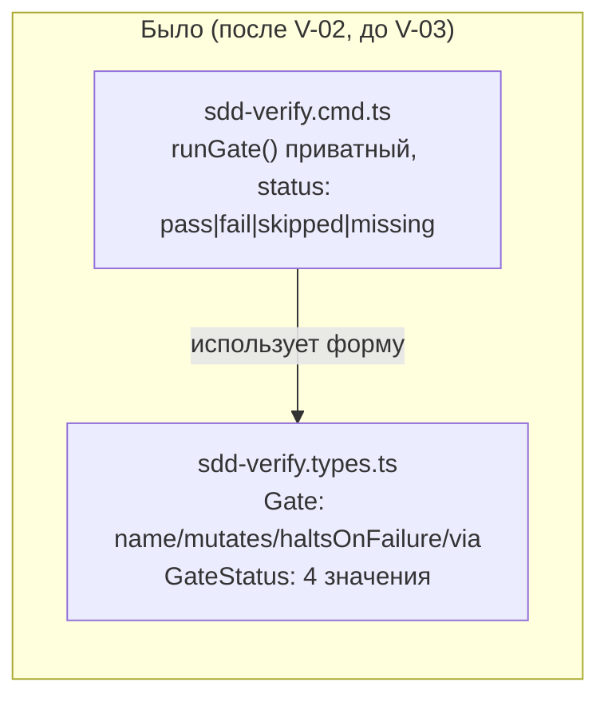
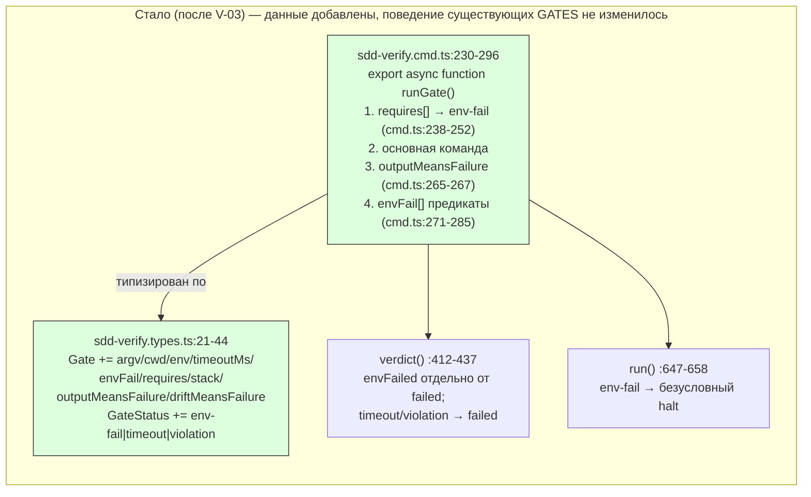

ОТЧЁТ Пачка 10/Бриф V-03 — «Gate/GateStatus как данные (envFail/timeout/violation)» (Волна 1)

СТАТУС: ВЫПОЛНЕНО (написан по факту коммита — исходный исполнитель закоммитил до отчёта; этот
отчёт восстановлен `rc-executor`-продолжателем по `git show`/тестовым прогонам, не по памяти
сессии).

КОММИТ: `b91d90d8` `feat(verify): V-03 — Gate/GateStatus as data (envFail/timeout/violation)`,
ветка `lead/verify-core`, база `4da13fc4` (V-02).

## 1. Файлы

| Путь | Тип правки | Смысловое изменение | Чем доказано |
|---|---|---|---|
| `cli/cmd/sdd-verify/sdd-verify.types.ts` | правка | `Gate` получает необязательные поля `argv/cwd/env/timeoutMs/envFail/requires/stack/outputMeansFailure/driftMeansFailure` (форма MAIN `shared/verify/verify.types.ts`, ничего не переименовано); `GateStatus` получает `'env-fail'\|'timeout'\|'violation'`; `verdict()` считает `env-fail` отдельно от `FAILED` (окружение, не код), `timeout`/`violation` — как обычный `fail` | `node --test cli/cmd/sdd-verify/__tests__/sdd-verify.cmd.test.ts` — 19 новых тестов `runGate`/`verdict`, все зелёные (см. §3) |
| `cli/cmd/sdd-verify/sdd-verify.cmd.ts` | правка | `runGate` экспортирован (был приватный); прогоняет `Gate.requires` ДО команды гейта (первый упавший → `env-fail` с `hint`, команда не запускается); применяет `outputMeansFailure` (контракт `gofmt -l`: exit 0 + непустой stdout = fail); вычисляет `Gate.envFail`-предикаты против исхода; `run()` останавливает ладдер безусловно на `env-fail` (как уже останавливал `missing`) | то же; плюс V-01 golden 45/45 не изменился (существующий `GATES` не заполняет ни одно новое поле) |
| `cli/cmd/sdd-verify/__tests__/sdd-verify.cmd.test.ts` | правка (файл существовал до V-03) | +19 юнит-тестов на `runGate` (requires-halt, outputMeansFailure, envFail-предикаты, обычный pass/fail) и `verdict` (env-fail не в счётчике FAILED, timeout/violation — в счётчике) с фейковым `GateRunner` | прогон всего файла напрямую (ниже) — 86 тестов всего (файл покрывает не только V-03) |
| `specs/cli/verify/verify.spec.md` | правка (по решению L-21, см. `R-V-02.md` §6) | `Usage Waiver` записи `allOf` — владелец пересмотрен V-03→V-07: машина `envFail` построена и покрыта тестами, но ни одна продакшн-запись `GATES` пока не задаёт `envFail`, поэтому текстовая ссылка на `allOf` в продакшн-коде не появилась | сравнение текста записи `### allOf` в §8 файла до/после коммита `b91d90d8` (`git show b91d90d8 -- specs/cli/verify/verify.spec.md`) |

## 2. Архитектура — было/стало

_Заливкой — новые ветви внутри уже существующих функций; ни одна запись действующего `GATES`
не заполняет новые поля, поэтому существующий вывод `sdd-verify` не меняется (V-01 golden)._

## 3. Доказательства (пункты ПРИЁМКИ брифа)

| Пункт | Команда | Вывод | Статус |
|---|---|---|---|
| Новые юнит-тесты `runGate`/`verdict` зелёные | `node --import tsx --test --experimental-test-module-mocks cli/cmd/sdd-verify/__tests__/sdd-verify.cmd.test.ts` | `# tests 86 / # pass 86 / # fail 0` (весь файл, включая V-03-часть; перепроверено этим отчётом) | ВЫПОЛНЕНО |
| V-01 golden не сломан | `node --import tsx --test --experimental-test-module-mocks shared/sdd/__tests__/preset-node-golden.test.ts cli/cmd/sdd-verify/__tests__/parity-node.test.ts` | `# tests 45 / # pass 45 / # fail 0` (перепроверено этим отчётом на голове волны `c532c64a`) | ВЫПОЛНЕНО |
| `npm run check` зелёный | `npm --prefix <tree> run check` на HEAD `c532c64a` (после всей волны, включая V-03) | `[sdd-verify] ✅ ALL PASS (5/5)` | ВЫПОЛНЕНО (перепроверено этим отчётом на голове волны, не изолированно на `b91d90d8`) |
| `sdd-check --all` — ноль новых ошибок | `npm --prefix <tree> run gate:sdd-check-baseline` | `[sdd-check-zero-new-error] OK` | ВЫПОЛНЕНО (перепроверено на голове волны) |

Изолированный прогон ровно на коммите `b91d90d8` не переделывался отдельно (дерево уже
продвинуто до `c532c64a`); все цифры выше — либо прямой построчный `git show`/тестовый файл
(колонка 1–2), либо совокупный прогон на голове волны (колонки 3–4), что для `check`/`gate`
эквивалентно, поскольку V-04/V-04a аддитивны и не меняют поведение существующего `GATES`.

## 4. Отклонения от брифа

Нет отклонений, зафиксированных в самом коммите. Единственное явно помеченное авторское
наблюдение (не отклонение от ПРИЁМКИ, а архитектурная развилка мимоходом): `GateRunner` не
принимает `cwd`/`env`, поэтому `requires`-precondition с непустыми `cwd`/`env` полями сегодня
их не получает — не блокирует V-03 (ни одна `GATES`-запись их не задаёт), но нужно будет
учесть тому, кто первым заполнит `requires` с нестандартным `cwd`/`env` (кандидат — V-07/V-08).

## 5. Открытые вопросы

Нет.
