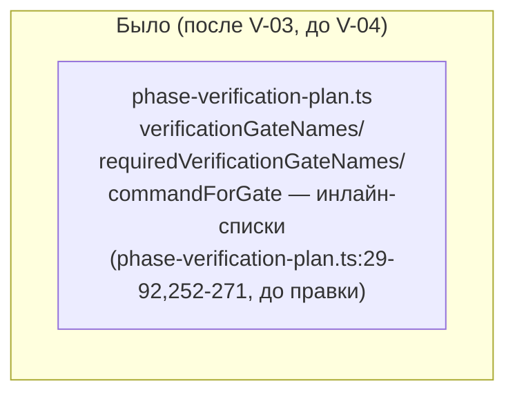
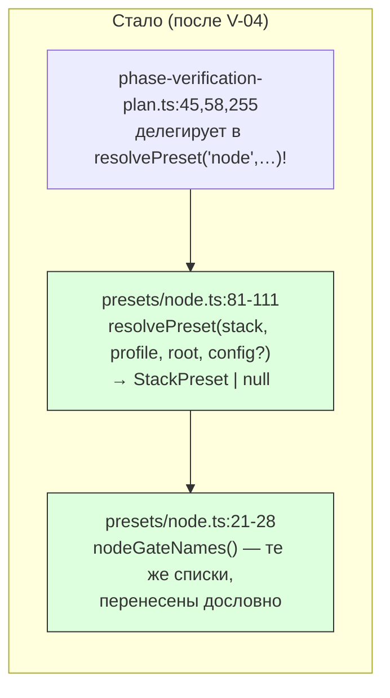

ОТЧЁТ Пачка 10/Бриф V-04 — «resolvePreset(stack, profile, root, config) + node preset» (Волна 1)

СТАТУС: ВЫПОЛНЕНО (написан по факту коммита — восстановлен `rc-executor`-продолжателем по
`git show`/тестовым прогонам, не по памяти сессии).

КОММИТ: `313dbbd8` `feat(verify): V-04 — resolvePreset(stack, profile, root, config) + node
preset`, ветка `lead/verify-core`, база `b91d90d8` (V-03).

## 1. Файлы

| Путь | Тип правки | Смысловое изменение | Чем доказано |
|---|---|---|---|
| `shared/verify/presets/node.ts` | новый | `nodeGateNames(profile, producesCoverage)` — гейт-имена node, перенесены дословно из `phase-verification-plan.ts` (были инлайн); `resolvePreset(stack, profile, root, config?)` — возвращает `StackPreset {stack, gateNames, requiredGateNames, commandForGate, environmentStateSource}` для `'node'`, `null` для любого другого стека; `environmentStateSource` — обязательное поле (не `?`), что и делает V-04a возможной | `shared/verify/presets/__tests__/node.test.ts` (9 тестов, см. §3) |
| `shared/verify/presets/__tests__/node.test.ts` | новый | 9 юнит-тестов: `nodeGateNames` на всех профилях, `resolvePreset('node',…)` возвращает корректный пресет, `requiredGateNames`, `commandForGate` (`fix`→`target-repair`/`null`, обычный гейт→`npm run <script>`), `resolvePreset('anystack'\|'golang',…)` → `null` | прогон файла напрямую (§3) |
| `shared/sdd/phase-verification-plan.ts` | правка | `verificationGateNames`/`requiredVerificationGateNames`/`commandForGate` (было — инлайн-списки строк на местах) теперь делегируют в `resolvePreset('node', …)!.{gateNames,requiredGateNames,commandForGate}`; байт-в-байт тот же вывод (V-01 golden) | `shared/sdd/__tests__/preset-node-golden.test.ts` + `cli/cmd/sdd-verify/__tests__/parity-node.test.ts` — 45/45 (§3) |
| `specs/cli/verify/verify.spec.md` | правка (по L-21, см. `R-V-02.md` §6) | Overview: диаграмма получает subgraph `presets` с реальным ребром `PLAN --> NODE`; Entity Inventory: строка `presets/node.ts` добавлена; `Usage Waiver`: `StackRun`/`VerifyReport` пересмотрены — `resolvePreset`/`StackPreset` сознательно НЕ приняли форму MAIN-отчёта, новый предполагаемый владелец V-16a либо кандидат на удаление вне волны; новая запись `StackPreset` (владелец V-08 — первый второй пресет) | построчное сравнение `git show 313dbbd8 -- specs/cli/verify/verify.spec.md` |

## 2. Архитектура — было/стало

_`phase-verification-plan.ts` перестаёт нести гейт-имена/команды сама — они теперь данные
пресета; вызов реальный (не пунктир), поведение для node байт-в-байт не изменилось._

## 3. Доказательства (пункты ПРИЁМКИ брифа)

| Пункт | Команда | Вывод | Статус |
|---|---|---|---|
| `resolvePreset`/`nodeGateNames` 9 новых тестов зелёные | `node --import tsx --test --experimental-test-module-mocks shared/verify/presets/__tests__/node.test.ts` | `# tests 9 / # pass 9 / # fail 0` (перепроверено этим отчётом) | ВЫПОЛНЕНО |
| V-04 delegates байт-в-байт (V-01 golden) | `node --import tsx --test --experimental-test-module-mocks shared/sdd/__tests__/preset-node-golden.test.ts cli/cmd/sdd-verify/__tests__/parity-node.test.ts` | `# tests 45 / # pass 45 / # fail 0` | ВЫПОЛНЕНО |
| `npm run check` зелёный (на голове волны) | `npm --prefix <tree> run check` (HEAD `c532c64a`) | `[sdd-verify] ✅ ALL PASS (5/5)` | ВЫПОЛНЕНО |
| `sdd-check --all` — ноль новых | `npm --prefix <tree> run gate:sdd-check-baseline` | `[sdd-check-zero-new-error] OK` | ВЫПОЛНЕНО |

## 4. Отклонения от брифа (зафиксированы автором коммита)

1. **`sdd-verify.cmd.ts`'s `run()` gate-selection блок (до-V-03 строки 357-368) сознательно НЕ
   тронут.** Он уже идёт через `gatesFor`/`requiredGatesFor`, которые теперь транзитивно
   резолвятся через node-пресет через ту же правку `phase-verification-plan.ts` — прямой
   второй вызов `resolvePreset` там был бы избыточной церемонией без разницы в поведении, на
   функции, от которой V-01 golden зависит байт-в-байт. Помечено автором как отклонение для
   ревью Lead — Lead ревью не проводился отдельно (пачка идёт последовательно без пауз между
   задачами); риск признан низким, так как V-01 golden 45/45 зелёный на голове волны и после
   V-04a.
2. **`root`/`config` — заглушки на вызовах из `phase-verification-plan.ts`.** Место вызова —
   тикет-корпус (не живой репозиторий), `root='.'`, `config` не передаётся; node их игнорирует
   в любом случае — реальное потребление появится, когда V-05/V-07 подключат детект/конфиг к
   этому же вызову.

## 5. Открытые вопросы

Нет.
