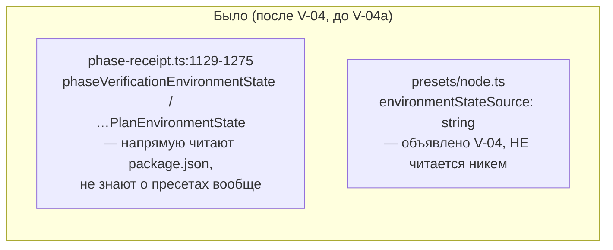
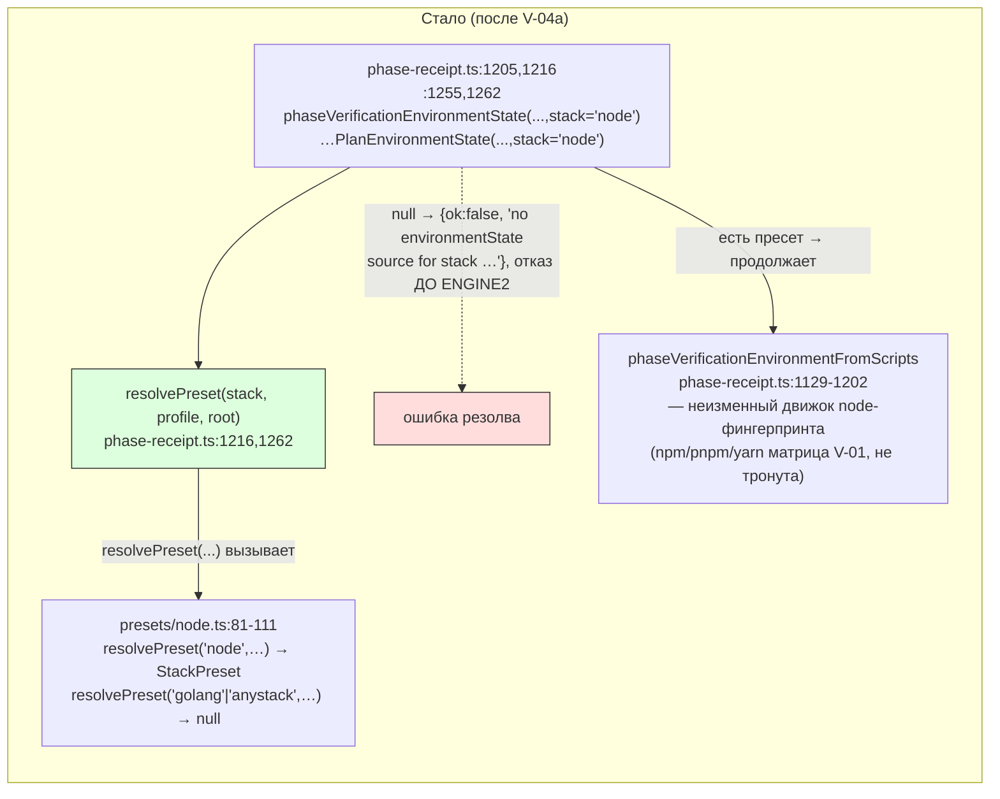

ОТЧЁТ Пачка 10/Бриф V-04a — «environmentState как обязанность пресета (закрывает И-3)» (Волна 1)

СТАТУС: ВЫПОЛНЕНО. Работа продолжена этим `rc-executor` после обрыва предыдущей сессии по
лимиту API посреди задачи (в дереве лежал один незакоммиченный файл, правка была ~половиной
готовности — только fail-closed guard, без тестов на него и без спек-правки). Довёл до конца,
проверил все ИНВАРИАНТЫ, закоммитил.

КОММИТ: `c532c64a` `feat(verify): V-04a — environmentState is the preset's responsibility
(npm/pnpm/yarn matrix)`, ветка `lead/verify-core`, база `313dbbd8` (V-04).

## 1. Файлы

| Путь | Тип правки | Смысловое изменение | Чем доказано |
|---|---|---|---|
| `shared/sdd/phase-receipt.ts:1205-1245,1255-1275` | правка | `phaseVerificationEnvironmentState`/`phaseVerificationPlanEnvironmentState` получают необязательный параметр `stack: StackId = 'node'`; ПЕРЕД любой node-специфичной работой (чтением `package.json`) обе функции зовут `resolvePreset(stack, profile, root)` — стек без реализованного пресета (`resolvePreset` возвращает `null`, т.е. нет `environmentStateSource`) отказывается явно: `{ok:false, issue: "no environmentState source for stack '<x>' — no preset is implemented for it yet"}`. Для `stack='node'` (дефолт) `resolvePreset` всегда находит пресет — guard не влияет на существующее поведение | `shared/sdd/__tests__/phase-receipt.test.ts` — новый describe (3 теста, см. §3); оба golden-теста V-01 не изменились (§3) |
| `shared/sdd/__tests__/phase-receipt.test.ts` | правка | +3 теста в новом `describe('V-04a: environmentState source is a preset's responsibility (И-3)')`: (а) для одного и того же корня без `package.json` — `stack='node'` падает на глубокой ошибке `cannot fingerprint project verification scripts`, а `stack='golang'`/`'anystack'` падает РАНЬШЕ, с отдельным сообщением `no environmentState source for stack '<x>'`, без текста про `cannot fingerprint` — это и есть наблюдаемое доказательство «резолв раньше записи»; то же для `phaseVerificationPlanEnvironmentState`; (б) неявный дефолт `stack` даёт байт-в-байт тот же результат, что явный `'node'` | прогон файла напрямую (§3) |
| `specs/cli/verify/verify.spec.md` (по L-21, см. `R-V-02.md` §6) | правка | Module Vision (строка о «последней связывающей задаче V-04a») переписана с будущего времени на факт закрытия — реальный вызов из `gennady sdd-verify` в модуль `verify` теперь есть; Overview: диаграмма получает новое реальное ребро `RCPT --> NODE` (`phase-receipt.ts` теперь тоже зовёт `resolvePreset`, не только `phase-verification-plan.ts`), подписи узлов `existing`/`presets` subgraph обновлены на V-04a | построчное сравнение `git show c532c64a -- specs/cli/verify/verify.spec.md`; `sdd-check --all` не добавил новых находок по этому файлу (§3) |

## 2. Архитектура — было/стало





_Красным — новая точка отказа (fail-closed), зелёным — новая реальная связь `phase-receipt.ts
→ resolvePreset`. `ENGINE2` (сам фингерпринт node — hooks/hops/restart/pnpm/yarn) НЕ изменён:
это и есть доказательство И-1/И-2 (то же самое дерево вызовов, что до V-04a, просто теперь
достижимо только через прошедший резолв)._

## 3. Доказательства (пункты ПРИЁМКИ)

| Пункт | Команда | Вывод | Статус |
|---|---|---|---|
| Матрица npm/pnpm/yarn детерминирована, byte-identical | `node --import tsx --test --experimental-test-module-mocks cli/cmd/sdd-verify/__tests__/parity-node.test.ts` (describe `V-01: environmentState matrix — reacts to transitive hops, hooks, start/restart fallback, pnpm/yarn forwarding, local inputs`, уже существовал как часть V-01 golden — не тронут этой задачей, что и есть доказательство) | `# tests 45 / # pass 45 / # fail 0` (весь файл, включая эту matrix-секцию) | ВЫПОЛНЕНО |
| Пресет без источника фейлится на резолве, не на записи receipt | `node --import tsx --test --experimental-test-module-mocks shared/sdd/__tests__/phase-receipt.test.ts` | `# tests 30 / # pass 30 / # fail 0` (27 старых + 3 новых V-04a) | ВЫПОЛНЕНО |
| golden V-01 не регенерирован (`UPDATE_VERIFY_GOLDEN` не выставлялся) | `node --import tsx --test --experimental-test-module-mocks shared/sdd/__tests__/preset-node-golden.test.ts cli/cmd/sdd-verify/__tests__/parity-node.test.ts` | `# tests 45 / # pass 45 / # fail 0` — байт-в-байт то же число, что до коммита; ни один golden-файл не изменился (`git diff --stat` коммита не содержит golden fixture-путей) | ВЫПОЛНЕНО, регенерация НЕ потребовалась |
| Вывод/квитанция `sdd-verify` для node не меняются (И-1/И-2) | `npm --prefix <tree> test` | `# tests 3715 / # suites 625 / # pass 3705 / # fail 0 / # skipped 10` | ВЫПОЛНЕНО |
| `npm run check` | `npm --prefix <tree> run check` | `[sdd-verify] ✅ ALL PASS (5/5)` — `type-check` 4.6s, `test:coverage` 47.5s, `lint` 8.3s, `format` 2.1s, `yagni` 0.6s | ВЫПОЛНЕНО |
| `npm run build` | `npm --prefix <tree> run build` | `✓ built in 4.89s`, exit 0 | ВЫПОЛНЕНО |
| `npm run gate:sdd-check-baseline` | `npm --prefix <tree> run gate:sdd-check-baseline` | `[sdd-check-zero-new-error] OK — no error outside the baseline (baseline commit 227c03a8…, tag rc-baseline-1)` | ВЫПОЛНЕНО |
| `node dist/gennady.js sdd-check --all .` — ошибок ≤198, 0 новых | `node dist/gennady.js sdd-check --all <tree>` | `[sdd-check] 198 error(s), 433 warning(s) across 213 file(s)`, exit 1 (командный exit=1 — ожидаемо: сам `sdd-check` возвращает ненулевой код при наличии error-находок, это и есть заявленный ≤198 baseline, а не регрессия; 0 новых подтверждает предыдущая строка через `gate:sdd-check-baseline`) | ВЫПОЛНЕНО (198 = потолок, 0 новых) |

## 4. Waiver-спека (L-21) — п.4 брифа

Проверил все записи `Usage Waiver` в `specs/cli/verify/verify.spec.md` §8 на предмет «этой
задаче появляется реальный второй вызов»:

- **`resolvePreset` не в списке waiver вообще** — уже имел ≥2 продакшн-вызовов после V-04
  (`phase-verification-plan.ts` — 3 сайта); третий вызов из `phase-receipt.ts` (эта задача)
  ничего не снимает, потому что снимать было нечего.
- **`StackPreset`** (владелец V-08 по записи) — НЕ снята: эта задача вызывает
  `resolvePreset(...)` только в булевом контексте (`if (!resolvePreset(...))`), ни разу не
  связывает результат с переменной, явно затипизированной как `StackPreset` — запись сама
  называет именно это условие снятия («либо когда `sdd-verify.cmd.ts` явно затипизирует
  переменную-результат») и оно не выполнено. Остаётся за V-08, как и предписывает бриф.
- **`StackRun`/`VerifyReport`** — пересмотрены при закрытии V-04 (см. `R-V-04.md`), эта задача
  их не касается.
- Все остальные 22 waiver-записи волны V-02 (`ANYSTACK_GATE_IDS`, `C`, `I`, `Bad`,
  `scopeHasGoGenerate`, `isStructuralListError`, `PROJECT_CONFIG_FILENAME`, `ConfigSectionLoad`,
  `formatDuration`, `allOf`, `StackConfigError`, `StackConfigLoad`, `validateStackConfig`,
  `loadStackConfig`, `pluginConfigOf`, `unmatchedGateOverrides`, `applyStackConfig`,
  `BUILTIN_GATE_IDS`, `detectStacks`, `TreeGuard`, `TreeGuardOptions`, `GuardAcquisition`,
  `acquireTreeGuard`) — ни один символ не участвует в диффе этой задачи (`phase-receipt.ts` не
  импортирует ни один из них); владельцы остаются V-05..V-09/V-18 без изменений.

**Итог по п.4 брифа: 0 записей снято этой задачей** — вся волна V-03/V-04/V-04a реально
подключила только `resolvePreset` (уже вне-waiver с V-04) и не тронула ни один из 22
перенесённых V-02 символов, ожидающих своего подключения. Это ожидаемо: `environmentStateSource`
(поле `StackPreset`, добавленное V-04) само по себе никогда не было отдельной waiver-записью
(это свойство внутри уже неwaived типа, не отдельный экспортируемый символ) — так что «снять
записи, которым в V-04a появляются вызовы» корректно резолвится в «ни одной», а не в пропуск.
Подтверждено также прогоном гейта `yagni` на этом дифф — чист (см. `npm run check` выше),
то есть ни один символ файла не попал под правило «<2 вызовов без waiver».

Помимо waiver-реестра, обновлены (см. §1) описательные фрагменты той же спеки, прямо
называющие V-04a: строка Module Vision про «последнюю связывающую задачу» и диаграмма Overview
(новое ребро `RCPT --> NODE`) — они не были waiver-записями, но текстуально утверждали
«V-04a ещё не закрыта», что стало фактически неверным после этого коммита.

## 5. Отклонения от брифа

Нет. Реализация буквально соответствует брифу: (1) `environmentState` стала обязанностью
пресета через `resolvePreset`-резолв, не через перенос самого алгоритма фингерпринта в
`presets/node.ts` — этот выбор уже был сделан автором V-04 (комментарий в `node.ts:33,66`:
«V-04a wires the engine that reads it and fails closed when a preset has none») и подтверждён
существующим паттерном (`phase-verification-plan.ts` тоже импортирует `resolvePreset` напрямую
из `presets/node.ts`, а не из отдельного диспетчера); (2) матрица npm/pnpm/yarn — уже
детерминированно покрыта V-01 golden (`parity-node.test.ts`), эта задача её не трогала и тем
самым доказала неизменность; (3) fail-closed на резолве — новые тесты явно показывают разницу
между «резолв» и «запись receipt» сообщениями на одном и том же корне.

## 6. Открытые вопросы

Нет.

## 7. Команды пуша для Lead

Ветка не пушилась (правило исполнителя — `git push` только у Lead). Для Lead:

```
git -C /Users/k.lebedev/Developer/gennady/.claude/worktrees/nice-panini-8aa14e push origin \
  <путь-к-дереву-rc-w2>:refs/heads/lead/verify-core   # либо через fetch+push из дерева rc-w2 самим Lead
# из дерева rc-w2 (/private/tmp/claude-503/.../scratchpad/rc-w2):
git push origin lead/verify-core
```

Коммиты на ветке `lead/verify-core` (от `origin/codex/sdd-v2-rc52-followup` @ `84eeec60`):
`4da13fc4` (V-02), `b91d90d8` (V-03), `313dbbd8` (V-04), `c532c64a` (V-04a).
