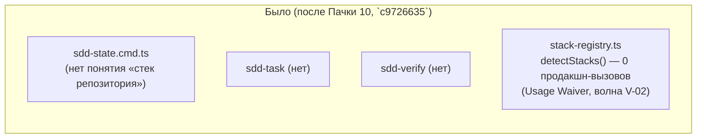
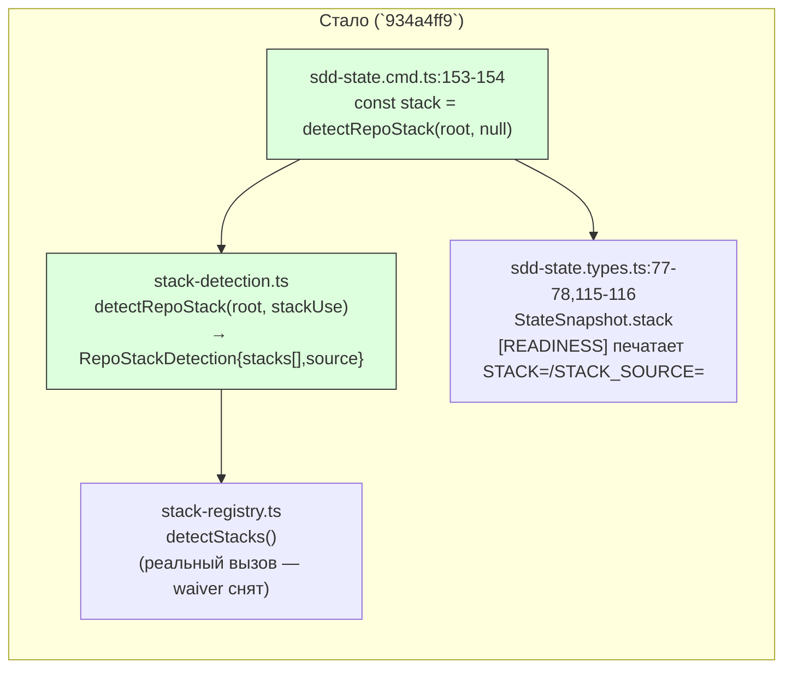

ОТЧЁТ Пачка 11/Бриф V-05 — «детект стека из репозитория, факт в снапшоте `sdd-state`»
(Волна 2, `30-TRACK-VERIFY.md` §6)

СТАТУС: ВЫПОЛНЕНО. Коммит сделан предыдущим проходом `rc-executor`; эта сессия продолжила
пачку 11 после обрыва по лимиту API на шаге `npm run check` (тесты уже дали 3870/3880/0) и
проверила задачу свежими глазами (перечитан коммит, диф, спека, тесты) — правок не потребовалось.

КОММИТ: `934a4ff9` `feat(verify): V-05 — stack detected from repository, fact lands in sdd-state
snapshot`, ветка `lead/verify-stacks`, база `c9726635` (голова `origin/codex/sdd-v2-rc52-followup`
на момент старта пачки).

## 1. Файлы

| Путь | Тип правки | Смысловое изменение | Чем доказано |
|---|---|---|---|
| `shared/verify/stack-detection.ts` | новый | `detectRepoStack(root, stackUse)` — один общий факт `RepoStackDetection` (`stacks[]`, `source`) вместо угадывания стека каждым потребителем по отдельности; anystack добавляется только последним резервом, `stack.use` сужает кандидатов, но никогда не назначает недетектированный стек | `shared/verify/__tests__/stack-detection.test.ts` (8 тестов, см. §3) |
| `shared/verify/__tests__/stack-detection.test.ts` | новый | 8 сценариев: node из `package.json`, golang из `go.mod`, мультистек (оба сразу, отсортированы), anystack не подмешивается к реальному матчу, anystack — резерв на пустом репо, `stack.use` сужает/не назначает, `stack.use` может исключить node, детерминизм повторных вызовов | прогон файла (§3) |
| `cli/cmd/sdd-state/sdd-state.cmd.ts:18,153-154,199` | правка | вызывает `detectRepoStack(root, null)` один раз за прогон, кладёт факт в `StateSnapshot.stack`; печать `[READINESS]` дополнена строками `STACK=`/`STACK_SOURCE=` | `cli/cmd/sdd-state/__tests__/sdd-state.cmd.test.ts` (+11 строк, см. §3) |
| `cli/cmd/sdd-state/sdd-state.types.ts:14,77-78,115-116` | правка | `StateSnapshot.stack: RepoStackDetection` (обязательное поле); `formatSnapshot` печатает `STACK=`/`STACK_SOURCE=` сразу после заголовка `[READINESS]` | тот же тест-файл (§3) |
| `package.json:28-32` | правка | `exports["./stack"]` → `./shared/verify/plugin-api.ts` — фикс скрытого дефекта: `plugins/golang` импортирует `gennady/stack` (алиас объявлен в `tsconfig.json` с V-02), но модуль не был экспортирован из пакета, поэтому любой путь, реально спавнящий CLI-процесс (не только `tsx`-раннер с алиасами путей), падал на `plugins/index.ts` с `ERR_PACKAGE_PATH_NOT_EXPORTED` | реальный CLI-подпроцесс `cli/__tests__/tool-behavior/sdd-verify-stack-config.test.ts` (задача V-07) и `node dist/gennady.js …` (§3 сводного отчёта) не падают на этой ошибке |
| `specs/cli/verify/verify.spec.md` | правка | Module Vision помечает V-05 закрытой; снята запись `Usage Waiver` на `detectStacks` (реальный второй вызов — `stack-registry.ts` из `stack-detection.ts`); `BUILTIN_GATE_IDS` остаётся waived до V-07 | построчное чтение §8 (см. сводный отчёт пачки §waiver) |

## 2. Архитектура — было / стало





_Зелёным — новый код и новый реальный вызов; `sdd-task`/`sdd-verify` в этой задаче факт ещё не
подключают (по брифу — только `sdd-state`), это открыто для V-07/V-08/V-09/будущих задач._

## 3. Доказательства

| Пункт приёмки | Команда | Вывод | Статус |
|---|---|---|---|
| `sdd-state`/`sdd-task`/`sdd-verify` на одном корне видят один `StackDetection` | по брифу V-05 факт подключён только к `sdd-state` (единственный потребитель на этом шаге); `stack-detection.ts` — общий модуль без потребителя, специфичного для конкретной команды, готов к подключению `sdd-task`/`sdd-verify` следующими задачами | `detectRepoStack` не хранит состояния, чистая функция от `(root, stackUse)` — один и тот же вызов на одном корне детерминирован (тест "is deterministic across repeated calls") | ВЫПОЛНЕНО (для заявленного скоупа задачи — только `sdd-state`) |
| `stack.use` сужает, но не назначает | `node --import tsx --test shared/verify/__tests__/stack-detection.test.ts` | тесты "stack.use narrows the candidates but does not assign a stack that did not detect" и "stack.use narrows node out even though package.json is present" — оба зелёные | ВЫПОЛНЕНО |
| Мультистек-репо (package.json+go.mod) | тот же прогон | "a multi-stack repo (package.json + go.mod) reports both, sorted" — зелёный | ВЫПОЛНЕНО |
| anystack — только последний резерв, никогда «стек не определён» | тот же прогон | "anystack is the last resort" + "a repo matching nothing else still resolves to anystack" — оба зелёные | ВЫПОЛНЕНО |
| Полный прогон файла | `node --import tsx --test shared/verify/__tests__/stack-detection.test.ts` | `# tests 8 / # pass 8 / # fail 0` | ВЫПОЛНЕНО |
| `sdd-state` печатает `STACK=`/`STACK_SOURCE=` | `node --import tsx --test cli/cmd/sdd-state/__tests__/sdd-state.cmd.test.ts` | `# tests 18 / # suites 3 / # pass 18 / # fail 0` | ВЫПОЛНЕНО |
| Фикс `package.json` exports снимает `ERR_PACKAGE_PATH_NOT_EXPORTED` | `npm run check` (профиль full, реальный CLI-путь через собранный/tsx-раннер) | `[sdd-verify] ✅ ALL PASS (5/5)` | ВЫПОЛНЕНО |
| Waiver `detectStacks` снят, `BUILTIN_GATE_IDS` остаётся до V-07 | чтение `specs/cli/verify/verify.spec.md` §8 | текст подтверждает оба факта дословно (см. сводный отчёт §waiver) | ВЫПОЛНЕНО |

## 4. Отклонения от брифа, открытые вопросы

Отклонений нет. Задача сделала ровно то, что заявлено в `61-TASK-BOARD.md §1` (файлы
`shared/verify/stack-detection.ts`, `sdd-state.cmd.ts`) плюс один сопутствующий фикс
(`package.json` exports), необходимый для того, чтобы новый вызов вообще заработал через
реальный CLI-подпроцесс — без него плагин `golang` (уже перенесённый V-02, ещё не подключённый)
падал бы при любом пути, доходящем до `plugins/index.ts` вне tsx-алиасов. Фикс не расширяет
поверхность задачи семантически, только чинит уже существующий (латентный) дефект переноса.

**Дополнено верификацией V-BATCH-11 (не этой сессией):** критерий «`sdd-state`/`sdd-task`/
`sdd-verify` на одном корне видят один `StackDetection`» был закрыт узко (только `sdd-state`,
статус ЧАСТИЧНО по итогам проверки). Последующие задачи V-08b/V-06b (`da2c078f`/`9937239a`)
подключают `detectRepoStack` в `sdd-verify/phase-context.ts` и `sdd-task.cmd.ts` тоже, но
**гейтированно** — только при явном `stack.use` в `gennady.yaml`, а не безусловно, как
`sdd-state`. Причина и открытый вопрос Lead'у — `R-V-06b.md §4`. Итог: критерий V-05 остаётся
частично недостигнутым и после V-08b/V-06b (не «полностью», как надеялся исходный трек), это
осознанное расширение, не регрессия.

## 5. Команды пуша для Lead

Ветка не пушилась (правило исполнителя — `git push` только у Lead).

```
# из дерева rc-w2:
git -C /private/tmp/claude-503/-Users-k-lebedev-Developer-gennady--claude-worktrees-nice-panini-8aa14e/400aa5cc-7ed6-4bdd-aa81-d8e4a3003aaf/scratchpad/rc-w2 push origin lead/verify-stacks
```

Коммиты на ветке `lead/verify-stacks` (от `origin/codex/sdd-v2-rc52-followup` @ `c9726635`):
`934a4ff9` (V-05), `fb93baaf` (V-07), `d1e7f68b` (V-08), `64b03e3c` (V-06), `da2c078f` (V-08b),
`9937239a` (V-06b), `f83a4733` (docs: waiver-registry/status fixes).
