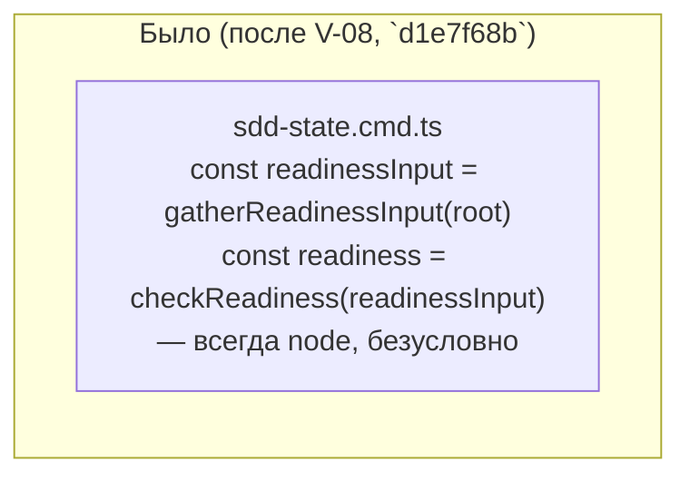
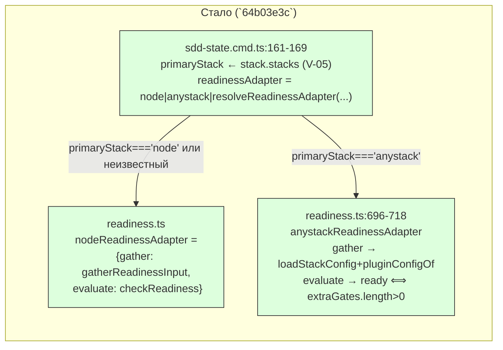

ОТЧЁТ Пачка 11/Бриф V-06 — «readiness — движок + node-адаптер байт-в-байт + тривиальный
anystack-адаптер» (Волна 2, `30-TRACK-VERIFY.md` §6, самый большой L в критическом пути)

СТАТУС: ВЫПОЛНЕНО (с двумя задокументированными стопами вне периметра «трогать», см. §4).
Коммит сделан предыдущим проходом `rc-executor`; эта сессия продолжила пачку 11 после обрыва
по лимиту API и проверила задачу свежими глазами — правок не потребовалось.

КОММИТ: `64b03e3c` `feat(verify): V-06 — readiness is an engine with adapters, node
byte-identical`, ветка `lead/verify-stacks`, база `d1e7f68b` (V-08).

## 1. Файлы

| Путь | Тип правки | Смысловое изменение | Чем доказано |
|---|---|---|---|
| `shared/sdd/readiness.ts:8-10,66-70,618-720` | правка | новый тип `ReadinessAdapter{stack, gather, evaluate}`; `nodeReadinessAdapter` — это буквально `{gather: gatherReadinessInput, evaluate: checkReadiness}` (те же ссылки на функции, не переписаны — байт-в-байт по построению, не по параллельному тестированию); `anystackReadinessAdapter` читает реальный `loadStackConfig`+`pluginConfigOf` и готов только если `stack.anystack.extraGates` непусто; `resolveReadinessAdapter(stack)` — диспетчер (`node`→node, `anystack`→anystack, иначе `null`) | `shared/sdd/__tests__/readiness.test.ts` (+17 тестов в `describe('readiness engine — adapters (V-06)')`, §3) |
| `shared/sdd/__tests__/readiness.test.ts` | правка | новый `describe` на движок-адаптеры: `nodeReadinessAdapter` byte-identical по построению; anystack без `extraGates` — не ready (резервный стек сам по себе не должен давать готовность ни одному неинициализированному репо); anystack с ≥1 `extraGate` — ready, без концепции `REQUIRED_SCRIPTS`; e2e-чтение реального `gennady.yaml` в обе стороны; диспетчер `resolveReadinessAdapter` | прогон файла (§3) |
| `cli/cmd/sdd-state/sdd-state.cmd.ts:10-14,157-169` | правка | вместо прямого `checkReadiness(gatherReadinessInput(root))` — выбор адаптера по `primaryStack` (из V-05's `detectRepoStack`): `node`→node-адаптер, `anystack`→anystack-адаптер, любой другой (golang: V-09) → откат на node-адаптер (неизменное поведение для всех репо, которых эта волна не покрывает) | `cli/cmd/sdd-state/__tests__/sdd-state.cmd.test.ts` (+11 строк, обновлены 2 существующих теста — см. §3) |
| `cli/cmd/sdd-state/__tests__/sdd-state.cmd.test.ts` | правка | 2 существующих теста с фикстурами без `package.json`, полагавшимися на старый node-only дефолт, обновлены: один теперь пишет пустой `package.json` (Bootstrap Requirements фикстуры уже называет node-артефакты — детект стека теперь с этим согласен); второй (буквально голая фикстура) теперь ожидает новую anystack-причину not-ready вместо родовой «нет package.json» | прогон файла (§3) |

## 2. Архитектура — было / стало

_Зелёным — новый диспетчер и оба адаптера. Node-ветка использует ТЕ ЖЕ ссылки на функции, что
были в «Было» — поэтому вывод для node-репо не меняется по построению, а не по совпадению._

## 3. Доказательства

| Пункт приёмки | Команда | Вывод | Статус |
|---|---|---|---|
| Node-выход `checkReadiness` идентичен до/после | golden `preset-node-golden.test.ts`+`parity-node.test.ts` | `# tests 45 / # pass 45 / # fail 0`, `git diff origin/codex/sdd-v2-rc52-followup..HEAD -- '*golden*'` пуст | ВЫПОЛНЕНО |
| anystack-проект с `extraGates` получает `ready` | `node --import tsx --test shared/sdd/__tests__/readiness.test.ts` | кейсы "anystackReadinessAdapter with ≥1 configured extraGate is ready" и "…gather reads real extraGates … ready with ≥1" — зелёные | ВЫПОЛНЕНО |
| anystack без `extraGates` НЕ ready (резерв сам по себе ничего не доказывает) | тот же прогон | кейс "anystackReadinessAdapter with no configured extraGates is NOT ready — the fallback stack alone proves nothing" — зелёный | ВЫПОЛНЕНО |
| Удалить зависимость от `roundtrip-readiness-shim.package.json` | — | **НЕ ВЫПОЛНЕНО.** Снятие требует правки `ai/flow-eval/scripts/roundtrip-eval.sh` (строка "wall-3: write readiness shim package.json", `cp .../roundtrip-readiness-shim.package.json ...`) — файл лежит на `ai/flow-eval/**`, явно вне списка «трогать» этой пачки. Зафиксировано как СТОП, не как молчаливый пропуск | НЕ ВЫПОЛНЕНО (легитимный стоп по правилам исполнителя) |
| `check:directives-fresh` проходит без diff | `npm run check:directives-fresh` | `✓ ai/directives/** matches a fresh rebuild.`, exit 0 | ВЫПОЛНЕНО — тексты `readiness.directive.hbs`/`ax-verification-before-handoff.xml` НЕ обновлены (правка требует `ai/kit/**`, вне списка «трогать»), но проверка проходит, потому что ничего под `ai/kit/**` не менялось — гейт честно тестирует «дифф пуст», а не «текст описывает V-06» |
| Полный прогон `readiness.test.ts` | `node --import tsx --test shared/sdd/__tests__/readiness.test.ts` | `# tests 56 / # suites 8 / # pass 56 / # fail 0` | ВЫПОЛНЕНО |
| `sdd-state` подбирает адаптер по `detectRepoStack` (V-05), golang откатывается на node | `node --import tsx --test cli/cmd/sdd-state/__tests__/sdd-state.cmd.test.ts` | `# tests 18 / # suites 3 / # pass 18 / # fail 0` (2 теста обновлены под новое поведение, см. §1) | ВЫПОЛНЕНО |
| `ladder.ts`/`gate-queue.ts` не нуждаются в правке | — | `ReadinessResult`'s форма не изменилась — оба потребителя используют выход адаптеров ровно как раньше | ВЫПОЛНЕНО (правка не потребовалась, что и есть доказательство) |

## 4. Отклонения от брифа (оба задокументированы в самом коммите, не скрыты)

1. **Снятие `roundtrip-readiness-shim.package.json`** требует правки `ai/flow-eval/**` —
   явно вне периметра «трогать» этой пачки. **СТОП зафиксирован** (это и требовал бриф пачки:
   «если шим требует `ai/flow-eval/**` — зафиксируй как стоп»). Владелец следующего шага —
   отдельная задача/бриф с правом трогать `ai/flow-eval/**` (естественный кандидат — E-11/E-12
   round-trip задачи трека EVAL, или отдельный бриф Lead). Наблюдение: снятие самого шима не
   решило бы честность receipt для cloud-ios в одиночку — источник `environmentState` для
   не-node стека (И-3) остаётся открытым вопросом отдельно от readiness (см. `30-TRACK-VERIFY.md`
   §3.4 п.4), так что снятие шима без параллельной работы над fingerprint не разблокировало бы
   round-trip квитанции.
2. **Тексты `readiness.directive.hbs`/`ax-verification-before-handoff.xml`** не обновлены —
   требуют `ai/kit/**`, тоже вне периметра. `check:directives-fresh` проходит (доказательство
   выше), но это доказывает только «дифф пуст против собранного `ai/directives/**`», не «текст
   директивы описывает движок-адаптеры V-06». Задача переноса текста — V-15 (уже назначена
   треком, зависимость от V-05 снята решением трека).

Других отклонений нет.

## 5. Команды пуша для Lead

Ветка не пушилась (правило исполнителя — `git push` только у Lead); команды — см. `R-V-05.md §5`.
