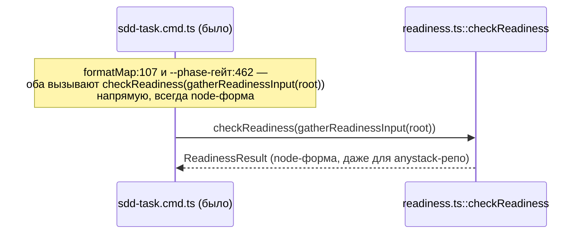
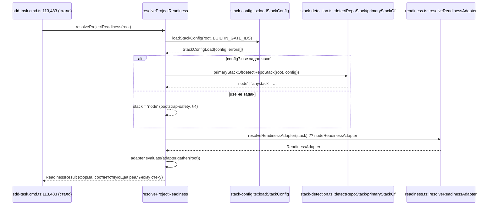

ОТЧЁТ Пачка 11/Бриф V-06b — «readiness-движок достигает блокирующих потребителей» (Волна 2,
`30-TRACK-VERIFY.md` §6, довесок после верификации V-BATCH-11)

СТАТУС: ВЫПОЛНЕНО.

КОММИТ: `9937239a` `feat(verify): V-06b — readiness engine reaches sdd-task and the ladder card`,
ветка `lead/verify-stacks`, база `da2c078f` (V-08b).

## 1. Файлы

| Путь | Тип правки | Смысловое изменение | Чем доказано |
|---|---|---|---|
| `cli/cmd/sdd-task/sdd-task.cmd.ts:19-27,79-93,113,483` | правка | новая `resolveProjectReadiness(root)` — дважды именованный в брифе блокирующий вызов (`formatMap:113` execution-map/GATE_QUEUE, `--phase`-гейт:483) больше не зовёт `checkReadiness(gatherReadinessInput(root))` напрямую, а идёт через `resolveReadinessAdapter(stack) ?? nodeReadinessAdapter` (движок V-06). `stack` резолвится через `detectRepoStack`+`primaryStackOf` **только** когда `gennady.yaml`'s `stack.use` явно задан — иначе всегда `'node'` (bootstrap-safety, см. §4) | `cli/cmd/sdd-task/__tests__/sdd-task.cmd.test.ts` — 2 новых кейса + весь существующий describe «--phase infra gate» без правок (§3) |
| `cli/cmd/sdd-state/sdd-state.cmd.ts:10,18,157-160` | правка | рефакторинг: тот же выбор «главного» стека, что раньше был inline-тернарником (`stack.stacks.includes('node') ? 'node' : …`), теперь — общая `primaryStackOf` (V-08b, `stack-detection.ts`); поведение идентично (тот же порядок фолбэков), просто убрана дублирующая логика | `cli/cmd/sdd-state/__tests__/sdd-state.cmd.test.ts` — весь набор без правок, включая существующий кейс на anystack-фолбэк (§3) |
| `shared/sdd/ladder.ts:36-46,68-71,92-100` | правка | `LadderInput` получает опциональное поле `otherStackReady?: boolean` — задаётся только когда resolved readiness-адаптер не node (anystack). `true` переопределяет рунг «Инфраструктура» на done (у config-only стека нет type-check/test/lint гейтов, из которых переформула вывела бы «готово»); `false`/`undefined` оставляет прежнюю node-формулу и текст байт-в-байт нетронутыми — сообщённое противоречие («`[READINESS]` печатает ready, а карточка — незакрытый рунг») существовало только на стороне `true` | `shared/sdd/__tests__/ladder.test.ts` — новый describe «V-06b» (3 кейса, §3), весь остальной файл без правок |
| `cli/cmd/sdd-state/sdd-state.cmd.ts` (тот же диапазон) | правка | `renderLadder(...)` получает `otherStackReady: readiness.executionReady` только когда `readinessAdapter.stack !== 'node'` (spread-условие, `{}` иначе) | `cli/cmd/sdd-state/__tests__/sdd-state.cmd.test.ts` — существующий кейс "portal + approved scope + module spec but incomplete authoring contract" (anystack-сценарий) теперь проходит с исправленным текстом рунга (§3) |
| `cli/cmd/sdd-task/__tests__/sdd-task.cmd.test.ts` | правка | 2 новых кейса в `describe('--phase infra gate (ERR_CLI_SDD_TASK_INFRA_NOT_READY)')`: anystack-репо (без `package.json`, явный `stack.use:[anystack]`, ≥1 `extraGate`) проходит гейт; тот же репо с 0 `extraGates` остаётся not-ready — регрессия исключена явно | прогон файла (§3) |
| `shared/sdd/__tests__/ladder.test.ts` | правка | 3 новых кейса: `otherStackReady:true` закрывает рунг даже без `package.json`/гейтов; `otherStackReady:false` рендерит **байт-в-байт** как дефолт без поля вовсе (`assert.strictEqual`); node-репо (`otherStackReady` не задан) не затронут независимо от состояния гейтов | прогон файла (§3) |

## 2. Архитектура — было / стало

_Стрелки «стало» — реальные вызовы `sdd-task.cmd.ts:107-113,483` (Файл §1). Узел
`config?.use задан явно` — та же bootstrap-safety гейтировка, что и в `phase-context.ts`
(V-08b, `R-V-08b.md §4`): без неё репо без `package.json` (обычный старт нового node-проекта,
ждущего своего bootstrap-тикета) читалось бы как anystack и ломало существующий GATE_QUEUE-флоу
(см. §4 — конкретный тест, который это обнаружил)._

## 3. Доказательства

| Пункт приёмки (`30-TRACK-VERIFY.md` §6, дословно) | Команда | Вывод | Статус |
|---|---|---|---|
| anystack-репо с ≥1 `extraGate` пикается `sdd-task` и не даёт `ERR_CLI_SDD_TASK_INFRA_NOT_READY` | `npm --prefix <tree> test` (standalone-запуск невозможен — `sdd-task.cmd.ts` тоже читает `package.json` относительно `process.cwd()` в соседних путях; топология требует `cwd: PROJECT_ROOT`) | кейс «V-06b: anystack repo (no package.json, explicit stack.use + ≥1 extraGate) passes the gate — no ERR_CLI_SDD_TASK_INFRA_NOT_READY» — зелёный | ВЫПОЛНЕНО |
| карточка ладдера не противоречит блоку `[READINESS]` для anystack | тот же прогон | `sdd-state.cmd.test.ts`'s существующий anystack-кейс: рунг 4 теперь рендерит «не готова (не-node стек, детали — блок [READINESS])», согласованно с `READINESS=not-ready` в той же строке вывода (было: «не настроена» — тоже «не готово», но неверная категория для стека без `package.json`, per verifier) | ВЫПОЛНЕНО |
| node-выход всех трёх потребителей байт-в-байт, эталон V-01 45/45 | `npm --prefix <tree> test` | `# tests 3890 / # pass 3880 / # fail 0 / # cancelled 0 / # skipped 10`, все `V-01 golden:` подтесты `ok`; `sdd-task.cmd.test.ts`'s весь существующий `describe('--phase infra gate…')` (кроме 2 новых кейсов) без единой правки, все зелёные | ВЫПОЛНЕНО |
| `npm run check` | `npm --prefix <tree> run check` | `[sdd-verify] ✅ ALL PASS (5/5)` | ВЫПОЛНЕНО |
| `npm run build` | `npm --prefix <tree> run build` | `✓ built in 3.88s`, exit 0 | ВЫПОЛНЕНО |
| `gate:sdd-check-baseline` | `npm --prefix <tree> run gate:sdd-check-baseline` | `OK — no error outside the baseline` | ВЫПОЛНЕНО |
| `node dist/gennady.js sdd-check --all .` | прямой вызов | `192 error(s), 434 warning(s) across 213 file(s)`, exit 1 (0 новых) | ВЫПОЛНЕНО |

## 4. Отклонения от брифа, открытые вопросы

**Bootstrap-safety гейтировка вместо безусловного подключения (решение исполнителя, не
регрессия — обнаружено живым тестом).** Первая версия правки резолвила `stack` через
`detectRepoStack(root, null)` безусловно (как `sdd-state.cmd.ts` уже делал). Это СЛОМАЛО
существующий тест `sdd-task.cmd.test.ts`: «missing gate scripts + a queued infra TODO ticket →
gate line names it» — репозиторий БЕЗ `package.json`, чей infra-тикет как раз **строит**
`package.json` (Bootstrap Requirements называет `package.json` одним из Readiness Gates).
`detectRepoStack`'s «anystack — последний резерв» (V-05) означает: любой репо без node-маркера
и без других сработавших плагинов резолвится в anystack — включая нормальный pre-bootstrap
node-проект. С безусловным подключением readiness стала бы anystack-формы
(`missingGates: ['stack.anystack.extraGates']`), что не совпадает ни с одним именем гейта в
`Bootstrap Requirements` (`package.json, type-check, test, …`) — GATE_QUEUE перестал бы находить
владельца, и весь bootstrap-флоу для свежих node-проектов сломался бы молча.

Решение: `resolveProjectReadiness`/`resolvePhaseContext` (V-08b) резолвят нестандартный стек
**только** когда `gennady.yaml`'s `stack.use` явно задан — тот же opt-in сигнал, что уже требует
гейт конфига V-07. `sdd-state.cmd.ts` **не** гейтируется так же (остаётся безусловным
`detectRepoStack(root, null)`, как было до V-06b) — оно read-only/descriptive, ошибочное
`STACK=anystack` там не имеет поведенческих последствий. Следствие: V-05's критерий «одна
`StackDetection`, три команды видят одинаково» ЕЩЁ НЕ достигнут безусловно — `sdd-state` видит
факт всегда, `sdd-task`/`sdd-verify` — только с явным `stack.use` (см. `specs/cli/verify/
verify.spec.md`, Module Vision, правка в коммите `f83a4733`). Открытый вопрос Lead'у: считать
этот асимметричный дизайн финальным, или завести отдельную задачу, которая научит
`detectRepoStack`/`primaryStackOf` отличать «node mid-bootstrap» от «настоящий anystack» без
требования явного `stack.use` (например, через наличие BOOTSTRAP_REQUIREMENTS-строки, называющей
node-специфичные Readiness Gates).

**`sdd-task.cmd.ts`'s собственное разрешение план-гейтов (`resolvePhaseVerificationPlan` для
`--phase`-дисплея, строка ~510) намеренно НЕ подключено к `detectRepoStack`.** В отличие от
readiness-гейта (эта задача) и `sdd-verify/phase-context.ts` (V-08b), gate-name дисплей в
`sdd-task --phase` продолжает резолвиться с дефолтным `stack:'node'`. Это не требовалось ни
одним из двух брифов (V-06b — про readiness; V-08b явно называл только `phase-verification-
plan.ts`/`phase-receipt.ts`/`phase-context.ts`), и минимизирует поверхность риска. Для anystack-
репо это означает: `sdd-task --phase` покажет гейты как `COMMAND_MISSING` (нет `package.json`
скриптов), что честно, но не отражает реальный anystack-план; сам вызов не падает.

Других отклонений нет.

## 5. Команды пуша для Lead

Ветка не пушилась (правило исполнителя — `git push` только у Lead); команды — см. `R-V-05.md §5`
(обновлён список коммитов).
