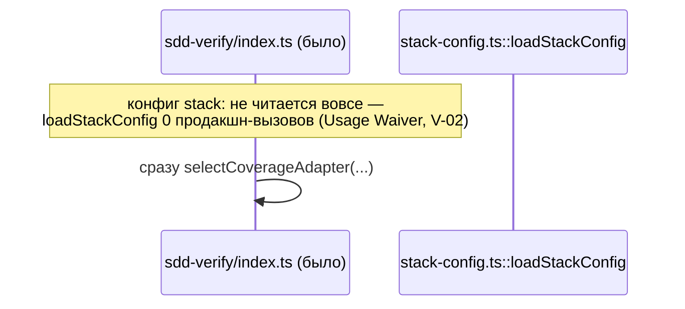

ОТЧЁТ Пачка 11/Бриф V-07 — «конфиг-контракт `gennady.yaml` секция `stack:`: гейт, deep-merge,
провенанс, exit 4» (Волна 2, `30-TRACK-VERIFY.md` §6)

СТАТУС: ВЫПОЛНЕНО. Коммит сделан предыдущим проходом `rc-executor`; эта сессия продолжила
пачку 11 после обрыва по лимиту API и проверила задачу свежими глазами — правок не потребовалось.

КОММИТ: `fb93baaf` `feat(verify): V-07 — gennady.yaml stack: config gate, deep-merge + provenance,
exit 4`, ветка `lead/verify-stacks`, база `934a4ff9` (V-05).

## 1. Файлы

| Путь | Тип правки | Смысловое изменение | Чем доказано |
|---|---|---|---|
| `cli/cmd/sdd-verify/index.ts:13-14,20,32-41` | правка | ДО любого запуска гейта загружает и строго валидирует секцию `stack:` (`loadStackConfig(projectRoot, BUILTIN_GATE_IDS)`, перенесённый V-02 примитив); при `errors.length > 0` печатает `stackConfigError(...)` и выходит с кодом 4. Отсутствие секции целиком — не ошибка | `cli/__tests__/tool-behavior/sdd-verify-stack-config.test.ts`, реальный подпроцесс CLI (§3) |
| `cli/cmd/sdd-verify/sdd-verify.types.ts:13-14,37-56` | правка | новая константа `ERR_CLI_SDD_VERIFY_STACK_CONFIG`; функция `stackConfigError(errors)` строит `{code, exitCode: 4, message}` с полным списком `path: message` по каждой ошибке валидации | тот же тест-файл, кейсы «неизвестный ключ»/«неизвестный `stack.use`» (§3) |
| `cli/__tests__/tool-behavior/sdd-verify-stack-config.test.ts` | новый | 4 e2e-сценария реальным CLI-подпроцессом: валидный `gennady.yaml` с 3 `extraGates` (id/argv/envFail/requires/fixer) никогда не триггерит гейт; неизвестный ключ конфига → exit 4 с точным путём; неизвестный `stack.use` id → exit 4; отсутствие `gennady.yaml` вообще — гейт молчит | прогон файла (§3) |
| `specs/cli/verify/verify.spec.md` | правка | Module Vision помечает V-07 закрытой; сняты waiver-записи `loadStackConfig`, `BUILTIN_GATE_IDS`, `StackConfigError`, `StackConfigLoad` (реальные вторые ссылки — вызов из `index.ts` и типы в `sdd-verify.types.ts`); `validateStackConfig`/`allOf`/`ConfigSectionLoad`/`formatDuration` пересмотрены явно и оставлены waived (задача их упражняет во время выполнения, но не добавляет новую текстовую ссылку — гейт `yagni` смотрит именно на текстовые ссылки); `pluginConfigOf`/`unmatchedGateOverrides`/`applyStackConfig` переназначены V-08 (нужен построенный план гейтов, которого одна загрузка конфига не даёт) | построчное чтение §8 (см. сводный отчёт пачки §waiver) |

## 2. Архитектура — было / стало



```mermaid
sequenceDiagram
  participant CLI as sdd-verify/index.ts:32-41 (стало)
  participant Cfg as stack-config.ts::loadStackConfig
  participant Types as sdd-verify.types.ts::stackConfigError
  CLI->>Cfg: loadStackConfig(projectRoot, BUILTIN_GATE_IDS)
  Cfg-->>CLI: StackConfigLoad{config, errors[]}
  alt errors.length > 0
    CLI->>Types: stackConfigError(errors)
    Types-->>CLI: {code: ERR_CLI_SDD_VERIFY_STACK_CONFIG, exitCode: 4, message}
    CLI->>CLI: console.error(message); process.exit(4)
  else errors пуст (включая «секции нет вообще»)
    CLI->>CLI: продолжает — selectCoverageAdapter(...)
  end
```

_Стрелки «стало» — реальные вызовы `cli/cmd/sdd-verify/index.ts:32-41` (Файл §1). Зелёная
ветка `errors.length > 0` — новая точка отказа fail-closed ДО запуска любого гейта._

## 3. Доказательства

| Пункт приёмки | Команда | Вывод | Статус |
|---|---|---|---|
| Валидный `gennady.yaml` с 3 `extraGates` (id/argv/envFail/requires/fixer) никогда не триггерит гейт | `node --import tsx --test cli/__tests__/tool-behavior/sdd-verify-stack-config.test.ts` | кейс "a valid gennady.yaml with 3 extraGates … never trips the config gate" — зелёный | ВЫПОЛНЕНО |
| Неизвестный ключ → exit 4 с точным путём | тот же прогон | кейс "an unknown stack config key fails closed with exit 4, never a partial run" — зелёный | ВЫПОЛНЕНО |
| Неизвестный `stack.use` id → exit 4 | тот же прогон | кейс "stack.use naming an unknown plugin id fails closed with exit 4" — зелёный | ВЫПОЛНЕНО |
| Отсутствие секции — не ошибка | тот же прогон | кейс "no gennady.yaml at all is not an error — the config gate stays silent" — зелёный | ВЫПОЛНЕНО |
| Полный прогон файла | `node --import tsx --test cli/__tests__/tool-behavior/sdd-verify-stack-config.test.ts` | `# tests 4 / # pass 4 / # fail 0` | ВЫПОЛНЕНО |
| Node-путь не меняется (И-1/И-2) | `npm run check` | `[sdd-verify] ✅ ALL PASS (5/5)` | ВЫПОЛНЕНО |
| Waiver-реестр обновлён точно по факту (4 снято, 4 явно пересмотрены и оставлены, 3 переназначены V-08) | чтение `specs/cli/verify/verify.spec.md` §8 | текст совпадает построчно с текстом коммита (см. сводный отчёт §waiver) | ВЫПОЛНЕНО |

## 4. Отклонения от брифа, открытые вопросы

Отклонений нет. `validateStackConfig`/`allOf`/`ConfigSectionLoad`/`formatDuration` оставлены
waived сознательно — коммит явно объясняет, что задача их **исполняет** (через
`compileEnvFailRules`/`loadConfigSection`), но не добавляет отдельную **текстовую** ссылку на
сам символ, а гейт `yagni` считает именно текстовые упоминания. Владелец не назначен ни одному —
это зафиксировано как открытый вопрос уже в самой спеке (не новый для этого отчёта).

## 5. Команды пуша для Lead

Ветка не пушилась (правило исполнителя — `git push` только у Lead); команды — см. `R-V-05.md §5`.
