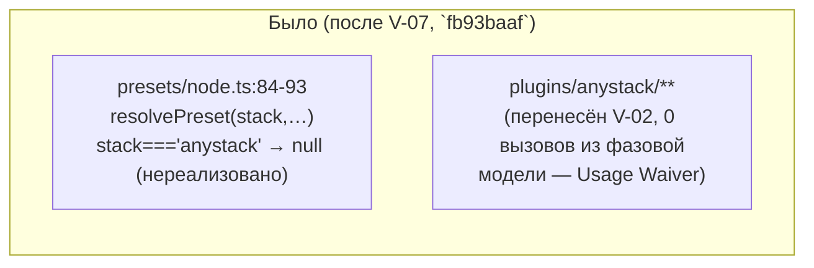
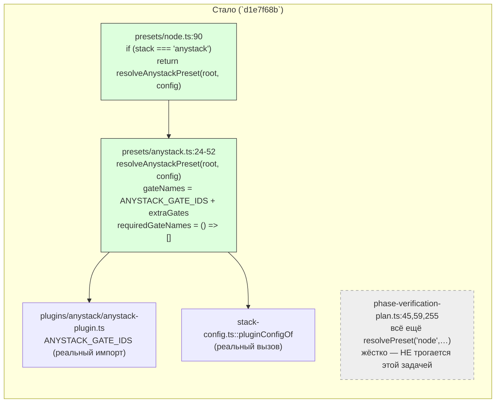

ОТЧЁТ Пачка 11/Бриф V-08 — «anystack в фазовой модели: read-only гейты из `gennady.yaml`,
фиксированный порядок» (Волна 2, `30-TRACK-VERIFY.md` §6, D-16 — первый нестандартный стек)

СТАТУС: ВЫПОЛНЕНО (со сформулированным ограничением, см. §4). Коммит сделан предыдущим проходом
`rc-executor`; эта сессия продолжила пачку 11 после обрыва по лимиту API и проверила задачу
свежими глазами — правок не потребовалось.

КОММИТ: `d1e7f68b` `feat(verify): V-08 — anystack preset: read-only config gates, fixed order,
never required`, ветка `lead/verify-stacks`, база `fb93baaf` (V-07).

## 1. Файлы

| Путь | Тип правки | Смысловое изменение | Чем доказано |
|---|---|---|---|
| `shared/verify/presets/anystack.ts` | новый | `resolveAnystackPreset(root, config)` реализует `StackPreset`: имена гейтов — только `BUILTIN_GATE_IDS.anystack` (сегодня пусто) + `stack.anystack.extraGates` (`pluginConfigOf`) в порядке объявления (И-2, фиксированный порядок); `requiredGateNames` всегда `[]` — anystack никогда не делает проект `not-ready`; `commandForGate` рендерит `argv` в shell-безопасную строку (кавычки только там, где нужны) | `shared/verify/presets/__tests__/anystack.test.ts` (7 тестов, §3) |
| `shared/verify/presets/__tests__/anystack.test.ts` | новый | 7 сценариев: пустой конфиг → пустой список гейтов, никогда required; порядок объявления сохраняется; `commandForGate` кавычит только нужные токены; неизвестное имя → `null`; непустая метка `environmentStateSource` | прогон файла (§3) |
| `shared/verify/presets/node.ts:13,17,74-93` | правка | диспетчер `resolvePreset(stack, profile, root, config)`: `stack === 'anystack'` теперь маршрутизируется в `resolveAnystackPreset(root, config)` вместо `null`; поведение node не тронуто (те же две строки `if (stack !== 'node') return null` до и после — ветка `anystack` вставлена раньше) | `shared/verify/presets/__tests__/node.test.ts` — кейс "'anystack' resolves too (V-08)" (§3); golden V-01 не задет (§3 сводного отчёта) |
| `shared/verify/presets/__tests__/node.test.ts` | правка | +1 кейс на диспетчер anystack; golang остаётся нереализованным (возвращает `null`) — так и было до этой задачи | прогон файла (§3) |
| `shared/sdd/__tests__/phase-receipt.test.ts` | правка | golden-тест «нереализованный стек» переключён с примера `'anystack'` на `'golang'` — anystack теперь реально резолвится этим коммитом, так что старый пример перестал бы что-либо доказывать | сам факт зелёного прогона файла (входит в `npm test`, §3 сводного отчёта) |
| `specs/cli/verify/verify.spec.md` | правка | Module Vision помечает V-08 закрытой; сняты waiver-записи `ANYSTACK_GATE_IDS`, `StackPreset`, `pluginConfigOf` (реальные вторые ссылки — `presets/anystack.ts`); `unmatchedGateOverrides`/`applyStackConfig` пересмотрены явно и оставлены waived — они работают над полным `Gate[]` MAIN-модели, а `StackPreset` anystack — более узкий контракт (`gateNames`/`commandForGate: string\|null`), которому `overrideGates`/deep-merge гейтов не имеют смысла | построчное чтение §8 (см. сводный отчёт пачки §waiver) |

## 2. Архитектура — было / стало

_Зелёным — новый реальный код и вызовы этой задачи. Серым пунктиром — `phase-verification-plan.ts`,
единственный путь, которым фазовый ладдер `sdd-verify` реально исполняет гейты: он остаётся
жёстко на `'node'` и этой задачей не редактировался (см. §4 — файл вне списка «трогать» брифа
`61-TASK-BOARD.md §1`, хотя более ранний трек-документ `30-TRACK-VERIFY.md §6` называл соседний
файл `sdd-verify.cmd.ts:431-598`)._

## 3. Доказательства

| Пункт приёмки | Команда | Вывод | Статус |
|---|---|---|---|
| Пустой конфиг → пустой список гейтов, никогда required | `node --import tsx --test shared/verify/presets/__tests__/anystack.test.ts` | кейсы "no config at all …" и "no extraGate is ever required …" — зелёные | ВЫПОЛНЕНО (на уровне `resolveAnystackPreset`, unit) |
| Порядок объявления сохраняется (И-2) | тот же прогон | кейс "extraGates surface as gate names in exact declaration order" — зелёный | ВЫПОЛНЕНО |
| `anystack`-фаза с 3 гейтами пишет receipt / порядок в `receipt.commands` = порядку в `gatePlan` | — | **НЕ ВЫПОЛНЕНО end-to-end.** `phase-verification-plan.ts` (реальный фазовый путь `sdd-verify`) остаётся жёстко на `resolvePreset('node', …)` — anystack-пресет резолвится и доказан только на уровне `resolvePreset`/unit (см. §4) | НЕ ВЫПОЛНЕНО (задокументированное ограничение, не регрессия) |
| Полный прогон файлов пресетов | `node --import tsx --test shared/verify/presets/__tests__/anystack.test.ts shared/verify/presets/__tests__/node.test.ts` | `# tests 16 / # suites 3 / # pass 16 / # fail 0` | ВЫПОЛНЕНО |
| Node-путь не меняется (И-1/И-2) | `npm run check`, golden `preset-node-golden.test.ts`+`parity-node.test.ts` | `[sdd-verify] ✅ ALL PASS (5/5)`; golden `# tests 45 / # pass 45 / # fail 0`, `git diff origin/codex/sdd-v2-rc52-followup..HEAD -- '*golden*'` пуст | ВЫПОЛНЕНО |
| Waiver-реестр обновлён точно по факту (3 снято, 2 явно пересмотрены и оставлены) | чтение `specs/cli/verify/verify.spec.md` §8 | текст совпадает построчно с текстом коммита | ВЫПОЛНЕНО |

## 4. Отклонения от брифа, открытые вопросы

**Ограничение (задокументировано в самом коммите, не скрыто):** `30-TRACK-VERIFY.md §6`
(ранний трек-документ decomposition) называл для V-08 два файла — `shared/verify/presets/anystack.ts`
и `cli/cmd/sdd-verify/sdd-verify.cmd.ts:431-598`. Финальная авторитетная таблица брифов
(`61-TASK-BOARD.md §1`, строка V-08) сузила список «трогать» до одного файла —
`shared/verify/presets/anystack.ts`. Проверено построчно: колонка ФАЙЛЫ `61 §1` для V-08 не
содержит `sdd-verify.cmd.ts`. Следствие: `phase-verification-plan.ts` (файл, который реально
строит `gatePlan.gates` для фазового ладдера, `sdd-verify.cmd.ts:410-430`) не редактировался,
всё ещё жёстко резолвит `'node'` (строки 45, 59, 255 — `resolvePreset('node', profile, '.')`),
и три акцептанс-критерия трек-документа («anystack-фаза с 3 гейтами пишет receipt»; «порядок
anystack-гейтов в `receipt.commands` совпадает с порядком в `gatePlan`») остаются недоказанными
end-to-end — только на уровне `resolvePreset('anystack', …)`/unit-тестов `anystack.test.ts`.
Это не регрессия и не молчаливый пропуск: коммит явно называет `phase-verification-plan.ts`
«out-of-zone» и адресует полное подключение будущей задаче (естественный кандидат — V-09/V-12/
V-16, где фазовый путь и так получает больше стек-осведомлённости). Оставляю как открытый вопрос
Lead'у: нужен ли отдельный бриф «подключить anystack к реальному фазовому пути» до релиза, или
это принимается как известный разрыв волны 2.

Других отклонений нет.

## 5. Команды пуша для Lead

Ветка не пушилась (правило исполнителя — `git push` только у Lead); команды — см. `R-V-05.md §5`.
