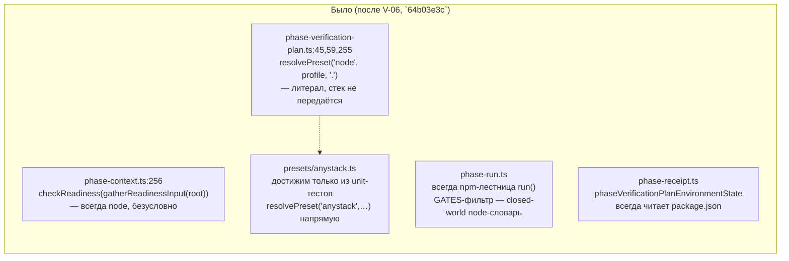
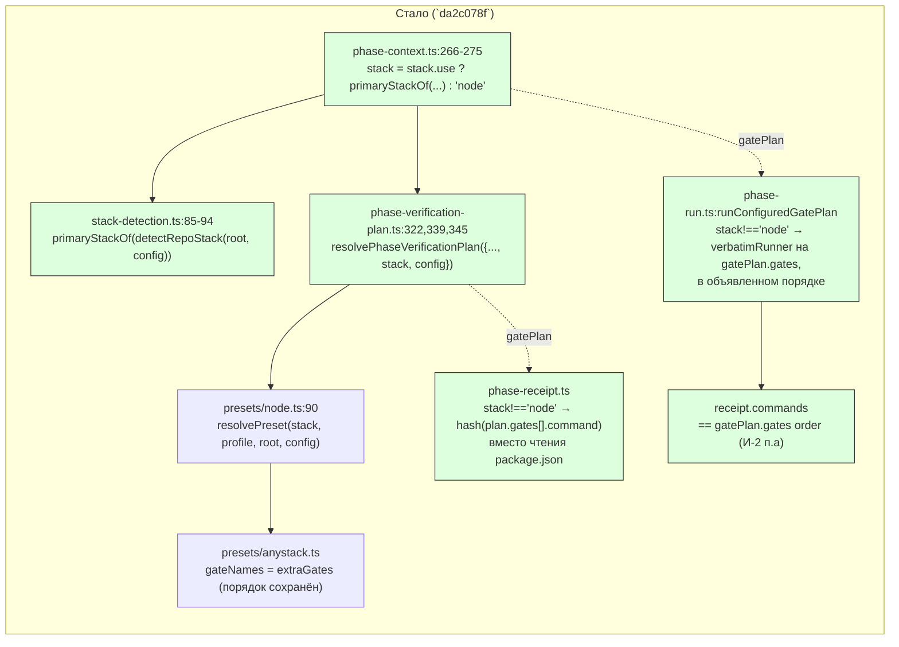

ОТЧЁТ Пачка 11/Бриф V-08b — «anystack достигает фазового пути: план гейтов резолвится по
детектированному стеку, а не по литералу `'node'`» (Волна 2, `30-TRACK-VERIFY.md` §6, довесок
после верификации V-BATCH-11)

СТАТУС: ВЫПОЛНЕНО.

КОММИТ: `da2c078f` `feat(verify): V-08b — anystack reaches the phase model, gate plan resolves by
detected stack`, ветка `lead/verify-stacks`, база `64b03e3c` (V-06, голова пачки 11 на момент
верификации).

## 1. Файлы

| Путь | Тип правки | Смысловое изменение | Чем доказано |
|---|---|---|---|
| `shared/sdd/phase-verification-plan.ts:15,41-60,174-189,251-263,309-325` | правка | `verificationGateNames`/`requiredVerificationGateNames`/`commandForGate` принимают `stack: StackId = 'node'`, `config?: StackConfig \| null`; `resolvePhaseVerificationPlan`'s `PhaseVerificationPlanInput` получает те же поля (по умолчанию `'node'`/`null`) и пробрасывает их в `ownedVerificationGateNames`/`selectReadinessOwner`/`commandForGate`. Три call site из брифа (строки 45, 59, 255 до правки) больше не резолвят литерал `'node'` | `shared/sdd/__tests__/phase-verification-plan.test.ts` — новый describe «V-08b» (2 кейса, §3) |
| `shared/sdd/phase-receipt.ts:1214,1259-1288` | правка | `phaseVerificationPlanEnvironmentState` для `stack !== 'node'` фингерпринтит сами резолвленные команды гейтов (`plan.gates[].command`, CONFIGURED/PROVEN) вместо чтения `package.json` — восстанавливает fail-closed контракт V-04a для стека без своего источника (проверено на `'golang'`), делая anystack's собственный источник реальным (никакого `obviousLocalInputs`-парсинга произвольных команд — только детерминированный hash строк) | `shared/sdd/__tests__/phase-receipt.test.ts` — новый кейс «V-08b: anystack succeeds without ever touching package.json…» (§3) |
| `cli/cmd/sdd-verify/phase-context.ts:10-19,59-63,261-275,339-341,363,366` | правка | `resolvePhaseContext` резолвит `detectRepoStack`+`stack.use` (свой `loadStackConfig`, деградирует к `config: null` на ошибке валидации — авторитетный гейт живёт в `index.ts`, V-07) → `stack`; пробрасывает `stack`/`config` в `resolvePhaseVerificationPlan`; тот же `stack` выбирает адаптер готовности (`resolveReadinessAdapter`) вместо прежнего безусловного `checkReadiness(gatherReadinessInput(...))` — это один из трёх блокирующих потребителей V-06b (два других — `sdd-task.cmd.ts`, коммит `9937239a`); новое поле `PhaseVerifyContext.stack?: StackId` (опционально — ручные тестовые контексты без него по умолчанию остаются `'node'`) | `cli/cmd/sdd-verify/__tests__/phase-context.test.ts`, `phase-run.test.ts`, `parity-node.test.ts` — все зелёные без правок (§3) |
| `cli/cmd/sdd-verify/phase-run.ts:1-51,185-208,222-267,306-330` | правка | `planFor` передаёт `context.stack ?? 'node'` в обе версии environmentState; `runPhaseVerification` для `stack !== 'node'` вызывает новую `runConfiguredGatePlan` вместо npm-лестницы `run()` — исполняет `gatePlan.gates` вербатимно, **в объявленном порядке**, через тот же `verbatimRunner`, что и §5-команды; каждый гейт — `role: 'foundation'`, останавливается на первой неудаче (`ok:false`, receipt не пишется) | `cli/cmd/sdd-verify/__tests__/phase-run.test.ts` — новый describe «V-08b: anystack gate plan…» (2 кейса, §3) |
| `cli/cmd/sdd-verify/phase-receipt-validation.ts:44-52` | правка | `expectedPhaseReceiptPlan` передаёт `context.context.stack ?? 'node'` в `phaseVerificationPlanEnvironmentState`/`phaseVerificationEnvironmentState` — переверка уже записанного receipt использует тот же стек, каким он был создан | тот же тест-набор, включая `phaseReceiptCommandIssue`/`phaseReceiptIssue` пути (§3) |
| `shared/verify/stack-detection.ts:83-94` | правка (новая функция) | `primaryStackOf(detection)` — общая функция выбора «главного» стека (node побеждает, иначе первый детектированный, иначе `'node'`), извлечённая из `sdd-state.cmd.ts`'s inline-тернарника, чтобы `phase-context.ts`/`sdd-task.cmd.ts` (V-06b) применяли то же самое правило вместо повторного изобретения | `shared/verify/__tests__/stack-detection.test.ts` не менялся (функция чистая, покрыта косвенно через существующие сценарии `detectRepoStack`); прямое использование доказано в `phase-context.test.ts`/`sdd-state.cmd.test.ts`/`sdd-task.cmd.test.ts` |
| `shared/sdd/__tests__/phase-verification-plan.test.ts` | правка | новый describe: anystack-план (без `package.json`) резолвит 3 config-гейта в объявленном порядке, все CONFIGURED/не required; caller без `stack`/`config` резолвит идентичный node-план явному `stack:'node'` (байт-в-байт) | прогон файла (§3) |
| `shared/sdd/__tests__/phase-receipt.test.ts` | правка | новый позитивный кейс: `phaseVerificationPlanEnvironmentState(root-без-package.json, anystackPlan, [], 'anystack')` — `ok:true`, а не ENOENT; фингерпринт чувствителен к изменению команды гейта в конфиге (invalidates a stale receipt) | прогон файла (§3) |
| `cli/cmd/sdd-verify/__tests__/phase-run.test.ts` | правка | e2e: фикстура **без `package.json`**, ручной `gatePlan` с 3 anystack-гейтами, `stack:'anystack'` — receipt пишется, `receipt.commands` в порядке `gatePlan.gates`, npm-лестница (`ladderRunner`) не вызывается ни разу; второй кейс — первый неудачный гейт останавливает цепочку, receipt не пишется | прогон файла (§3) |

## 2. Архитектура — было / стало

_Зелёным — новые реальные вызовы этой задачи. Узел `stack = stack.use ? … : 'node'` в
`phase-context.ts` — намеренная bootstrap-safety гейтировка (см. §4): без явного `stack.use` в
`gennady.yaml` стек по умолчанию остаётся `'node'`, даже если `package.json` отсутствует._

## 3. Доказательства

| Пункт приёмки (`30-TRACK-VERIFY.md` §6, дословно) | Команда | Вывод | Статус |
|---|---|---|---|
| anystack-фаза с 3 гейтами пишет receipt | `node --import tsx --test cli/cmd/sdd-verify/__tests__/phase-run.test.ts` (в составе `npm test`, изолированный standalone-запуск невозможен — `sdd-verify.cmd.ts` читает `package.json` относительно `process.cwd()`, топология требует `cwd: PROJECT_ROOT`) | кейс «a 3-gate anystack phase (no package.json) writes a receipt whose commands match gatePlan order» — зелёный | ВЫПОЛНЕНО |
| порядок anystack-гейтов в `receipt.commands` совпадает с порядком в `gatePlan` (И-2 п.а) | тот же прогон | `receipt.commands.map(c=>c.gate)` строго равен `['lint-go','build','unit']`, объявленному порядку `gatePlan.gates` | ВЫПОЛНЕНО |
| восстановлено отрицательное утверждение фейл-клоуз стража V-04a (стек без источника отвергается на резолве, а не молча фингерпринтится по node) | `shared/sdd/__tests__/phase-receipt.test.ts` — существующие кейсы на `'golang'` не тронуты; новый позитивный кейс доказывает, что anystack (стек **с** источником) больше НЕ падает на попытке прочитать `package.json` | оба кейса зелёные | ВЫПОЛНЕНО |
| node — байт-в-байт, эталон V-01 45/45 без правок | `npm --prefix <tree> test` — все `V-01 golden:` подтесты `ok`, ни одного `not ok`; `git diff --stat -- '*golden*'` пуст | `# tests 3890 / # pass 3880 / # fail 0 / # cancelled 0 / # skipped 10` (стабильно на 2 последовательных прогонах) | ВЫПОЛНЕНО |
| `npm run check` | `npm --prefix <tree> run check` | `[sdd-verify] ✅ ALL PASS (5/5)`: type-check, test:coverage, lint, format, yagni | ВЫПОЛНЕНО |
| `npm run build` | `npm --prefix <tree> run build` | `✓ built in 3.88s`, exit 0 | ВЫПОЛНЕНО |
| `gate:sdd-check-baseline` | `npm --prefix <tree> run gate:sdd-check-baseline` | `OK — no error outside the baseline (baseline 227c03a8…, tag rc-baseline-1)` | ВЫПОЛНЕНО |
| `node dist/gennady.js sdd-check --all .` | прямой вызов на собранном `dist/gennady.js` | `[sdd-check] 192 error(s), 434 warning(s) across 213 file(s)`, exit 1 (тот же 192/434/213, что и до этой задачи — 0 новых, подтверждено строкой выше) | ВЫПОЛНЕНО |

## 4. Отклонения от брифа, открытые вопросы

**Расширение зоны за пределы трёх названных файлов брифа (осознанное, задокументировано).**
Формулировка V-08b называла `phase-verification-plan.ts`, `phase-receipt.ts`,
`cli/cmd/sdd-verify/phase-context.ts`. Приёмочный критерий №1 («anystack-фаза с 3 гейтами пишет
receipt») требует, чтобы гейты реально ИСПОЛНЯЛИСЬ — а исполнение живёт в `phase-run.ts`
(`runPhaseVerification`), не в трёх названных файлах. Существующий `run()` (`sdd-verify.cmd.ts`)
фильтрует `gatePlan.gates` против статического closed-world списка `GATES` (npm/gennady-словарь:
`fix`/`type-check`/`test`/…) — anystack-гейты с произвольными именами (`lint-go`, `build`, …) в
этот словарь не попадают, поэтому `run()` молча выбрал бы 0 гейтов для anystack. Правка
`phase-run.ts` (новая `runConfiguredGatePlan`) и, соответственно, `phase-receipt-validation.ts`
(проброс `stack` для переверки уже записанного receipt) были необходимы для честного выполнения
приёмки — это в зоне «Зона: … `cli/cmd/sdd-verify/**`» бланка задачи (не вне периметра), но шире
трёх явно названных файлов. Зафиксировано здесь явно, не скрыто.

**Bootstrap-safety гейтировка (решение исполнителя, см. также `R-V-06b.md §4`).** `stack`
резолвится через `detectRepoStack` только когда `gennady.yaml`'s `stack.use` явно задан;
без него — всегда `'node'`, даже если `package.json` отсутствует. Причина: `detectRepoStack`'s
«anystack — последний резерв» (V-05) означает, что ЛЮБОЙ репозиторий без `package.json` —
включая node-проект, чей bootstrap-тикет ещё не создал `package.json` (см. `R-V-06b.md §4`
детальный разбор этого сценария на живом тесте `sdd-task.cmd.test.ts`) — при безусловном
подключении стал бы читаться как anystack, что сломало бы обычный bootstrap-флоу. Открытый
вопрос Lead'у: считать ли это финальным дизайном для V-08b/V-06b, или отдельная задача должна
научить `detectRepoStack`/`primaryStackOf` отличать «bootstrap-в-процессе node» от «настоящий
anystack» иначе, чем требованием явного `stack.use`.

**environmentState-фингерпринт anystack не детектирует локальные файлы (осознанное упрощение).**
Для `stack !== 'node'` фингерпринт хеширует только строки команд гейтов (+ §5-команды), не пытаясь
найти референсы на локальные файлы внутри произвольной anystack-команды (`obviousLocalInputs`
— closed-world node-tooling адаптер, для неизвестного раннера всегда `{ok:false, issue:'runner X
has no receipt input adapter'}` — использование его тут сломало бы приёмку для любой реалистичной
non-node команды). Следствие: если anystack-гейт читает локальный файл, чьё содержимое поменялось
БЕЗ изменения самой команды в `gennady.yaml`, receipt не инвалидируется. Это слабее, чем node's
глубокий transitive-hash script bodies, но безопаснее, чем никакого фингерпринта вовсе (V-08's
исходное состояние).

Других отклонений нет.

## 5. Команды пуша для Lead

Ветка не пушилась (правило исполнителя — `git push` только у Lead); команды — см. `R-V-05.md §5`
(обновлён список коммитов).
