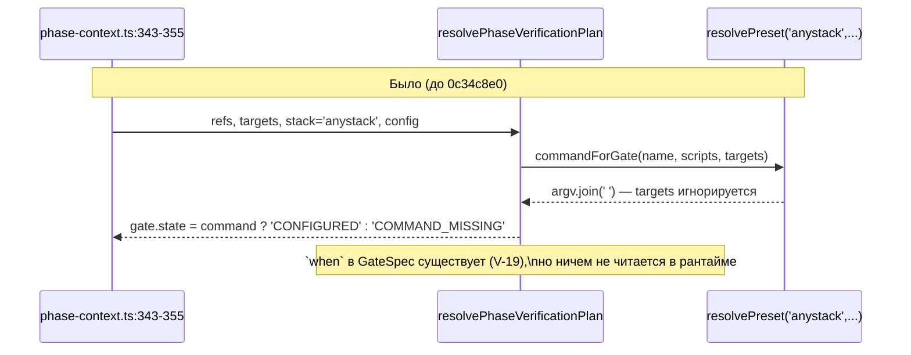
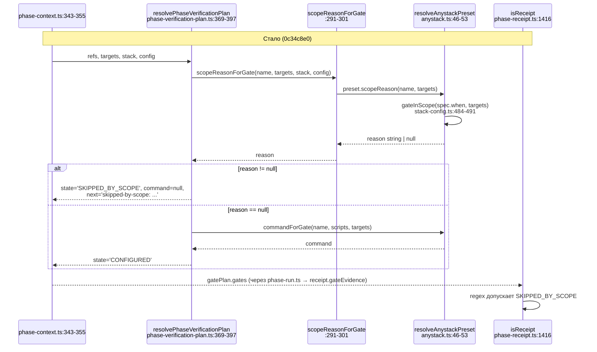

ОТЧЁТ Пачка 13/Бриф V-12 — «`when: [<glob>]` на гейт + сужение по Target Files фазы; отсечённый
гейт виден в receipt» (Волна 2, #9-bonus/#20(i))

СТАТУС: ВЫПОЛНЕНО.

КОММИТ: `0c34c8e0` `feat(verify): V-12 — extraGates narrow by phase Target Files, skipped-by-scope
in the receipt`, ветка `lead/verify-gate-scope`, база `ccee2da8` (V-19, эта же пачка).

## 1. Файлы

| Путь | Тип правки | Смысловое изменение | Чем доказано |
|---|---|---|---|
| `shared/verify/stack-config.ts:421-475` | новые функции | `globToRegex`/`matchesGlob` (компилятор glob→regex, дублирован из `cli/cmd/lint/checks/utils/glob-match.ts`, не импортирован — `shared/` не зависит от `cli/`) и `gateInScope(when, targets)` — «нет `when` → всегда в скоупе; иначе хотя бы один target матчит хотя бы один glob» | `shared/verify/__tests__/stack-config.test.ts` — прямых юнит-тестов на `gateInScope` нет отдельно, но её поведение доказано транзитивно через `applyStackConfig`-тесты ниже и через `anystack.test.ts`/`phase-verification-plan.test.ts` |
| `shared/verify/stack-config.ts:516-524,603-643` (`applyStackConfig`) | правка | новый опциональный параметр `targets: readonly string[] = []`; extraGate, чей `when` не матчит ни одного target, получает `skipped: 'when (<source>)'` и `argv: []` — тот же визуальный контракт, что уже есть у `skipGates` | `shared/verify/__tests__/stack-config.test.ts` — новый describe «applyStackConfig — when narrows extraGates by phase Target Files» (4 кейса) |
| `shared/verify/presets/node.ts:53-64` (`StackPreset`) | правка | новый опциональный метод `scopeReason?(name, targets): string \| null` — node/golang его не определяют (`?? null` всегда «в скоупе», байт-паритет по построению) | `shared/sdd/__tests__/phase-verification-plan.test.ts` кейс «D-17 byte parity: a node plan… is unaffected» |
| `shared/verify/presets/anystack.ts:8,46-53` | правка | `resolveAnystackPreset` реализует `scopeReason`: ищет spec по имени гейта, если есть `when` и `gateInScope` возвращает false — строка-причина, иначе `null` | `shared/verify/presets/__tests__/anystack.test.ts` — новый describe «scopeReason (V-12, #9-bonus)» (4 кейса) |
| `shared/sdd/phase-verification-plan.ts:74-85` (`PhaseVerificationGateState`) | правка | новое значение `'SKIPPED_BY_SCOPE'` — только у config-гейта с несматчившим `when`; репозиторий без `when` его никогда не видит | тест в §3 |
| `shared/sdd/phase-verification-plan.ts:291-301` (`scopeReasonForGate`) | новая функция | зеркало `commandForGate` — делегирует резолву пресета: `resolvePreset(stack,'full',...).scopeReason?.(name,targets) ?? null` | тот же |
| `shared/sdd/phase-verification-plan.ts:369-397` (`resolvePhaseVerificationPlan`) | правка | цикл построения гейтов: сначала считается `scopeReason`; если есть — `command:null`, `state:'SKIPPED_BY_SCOPE'`, `next: 'skipped-by-scope: <reason> — touch a matching file to include it'`; `required` не форсится (у anystack и так всегда `false`) | `shared/sdd/__tests__/phase-verification-plan.test.ts` — новый describe «V-12 (#9-bonus)» (3 кейса) |
| `shared/sdd/phase-receipt.ts:1416` (`isReceipt`) | правка | регэксп допустимых `gate.state` в структурном парсере receipt'а расширен `\|SKIPPED_BY_SCOPE` — без этого receipt с новым состоянием не прошёл бы собственную структурную проверку при повторном чтении (`validatePhaseReceipt`) | косвенно всем набором `phase-receipt.test.ts` (не менялся, зелёный); прямой юнит-тест на именно этот путь не добавлен (см. §4) |
| `shared/verify/__tests__/stack-config.test.ts:293-398` | новые тесты | describe «GateSpec.when»/«V-19» (унаследованы из предыдущего коммита, не меняются здесь) + describe «applyStackConfig — when narrows…» (новый, 4 кейса) | прогон файла |
| `shared/verify/presets/__tests__/anystack.test.ts:55-77` | новые тесты | 4 кейса `scopeReason` | прогон файла |
| `shared/sdd/__tests__/phase-verification-plan.test.ts:380-437` | новые тесты | 3 кейса (скоуп не матчит → `SKIPPED_BY_SCOPE`; скоуп матчит → `CONFIGURED`; node-план не задет) | прогон файла |

## 2. Архитектура — было / стало

_Новые вызовы этой задачи выделены во второй диаграмме именами файлов/строк; узел `Preset` во
второй диаграмме — тот же файл, что и в первой (`anystack.ts`), но с новым методом `scopeReason`
вместо игнорируемого `targets`-параметра `commandForGate`._

## 3. Доказательства

| Пункт приёмки | Команда | Вывод | Статус |
|---|---|---|---|
| Гейт, чьи `when`-globs не пересеклись с Target Files, даёт видимый `skipped-by-scope`, записанный в receipt (не молча) | `node --import tsx --test shared/sdd/__tests__/phase-verification-plan.test.ts` | кейс «a when that matches no phase Target File is SKIPPED_BY_SCOPE, visible with command=null» — `state==='SKIPPED_BY_SCOPE'`, `command===null`, `next` матчит `/skipped-by-scope.*when:.*ios\/\*\*\/\*\.swift/` | ВЫПОЛНЕНО |
| Гейт без `when` идёт всегда | тот же файл, describe «scopeReason» в `anystack.test.ts` кейс «null (in scope) for a gate with no when at all» | `scopeReason('style', [...]) === null` при любом наборе targets | ВЫПОЛНЕНО |
| Гейт, чьи `when`-globs пересеклись — остаётся `CONFIGURED` | `phase-verification-plan.test.ts` кейс «a when that matches a phase Target File keeps the gate CONFIGURED» | `state==='CONFIGURED'`, `command==='swiftlint'` | ВЫПОЛНЕНО |
| Обязательный пункт D-17: для репозитория без `gennady.yaml`/`when` план и `gateEvidence` до и после V-12 совпадают побайтово | (а) `git diff lead/verify-stacks..HEAD -- '*golden*'` — пусто; (б) `phase-verification-plan.test.ts` кейс «D-17 byte parity: a node plan… is unaffected by scope resolution» — `plan.gates.every(g => g.state !== 'SKIPPED_BY_SCOPE')`; (в) полный набор `shared/sdd/__tests__/phase-verification-plan.test.ts` (все существовавшие до V-12 кейсы, включая V-08b) зелёные без единой правки утверждений | пусто / `ok` / `# tests 16 / # pass 16 / # fail 0` | ВЫПОЛНЕНО |
| Receipt с новым состоянием проходит структурную валидацию (`isReceipt`) | косвенно: `shared/sdd/__tests__/phase-receipt.test.ts` — существующий набор (не менялся) остаётся зелёным после расширения regex | `# tests` файла без изменений, все `ok` | ВЫПОЛНЕНО (прямой позитивный юнит-тест на `SKIPPED_BY_SCOPE` в `phase-receipt.test.ts` не добавлен — см. §4, отклонение) |
| `npm run type-check` | `npm --prefix <tree> run type-check` | чисто | ВЫПОЛНЕНО |
| `npm run test` (полный) | `npm --prefix <tree> run test` | `# tests 3920 / # pass 3910 / # fail 0 / # cancelled 0 / # skipped 10` | ВЫПОЛНЕНО |
| `npm run check` | pre-commit hook | `[sdd-verify] ✅ ALL PASS (5/5)` на 2-й попытке (1-я — флейк `test:coverage`, файлы `lint.cmd.test.ts` и др., не связанные с этой задачей) | ВЫПОЛНЕНО |

## 4. Отклонения от брифа, открытые вопросы

**Файловые ссылки брифа устарели, реальный узел вживления — другой (задокументировано, не
блокирует).** Бриф называет `stack-config.ts:34-45` и `phase-context.ts:169-239` как файлы V-12.
На момент написания брифа `#9-bonus` extraGates→Gate маппинг ещё не существовал в текущей форме;
после V-08/V-08b (пачка 11, слита) вживление `extraGates` живёт в `shared/verify/presets/anystack.ts`
(не в `stack-config.ts`'s `applyStackConfig`, который остаётся мёртвым кодом вне рантайм-пути —
см. ниже) и в `shared/sdd/phase-verification-plan.ts` (не в `phase-context.ts`, которая уже
пробрасывает `current.targets` в `commandForGate` без изменений). Строка `stack-config.ts:34-45`
(`GATE_SPEC_KEYS`) реально тронута — задачей V-19 в предыдущем коммите этой же пачки.
`phase-context.ts` в итоге НЕ тронута вовсе для V-12 — вся нужная информация (`current.targets`)
уже была на месте. Это снижает риск (меньше диффа), а не увеличивает.

**`applyStackConfig`'s `when`-поддержка — API-полнота без живого потребителя (осознанно,
недорого).** Как задокументировано в отчётах предыдущих задач (V-08 и др.), `applyStackConfig`
(богатый тип `Gate` из `shared/verify/verify.types.ts`, конвенции `skipGates`/`overrideGates`) —
параллельная, нигде не подключённая к реальному CLI-пути архитектура (архив/задел для будущего
`plugins/`-движка), с полным собственным набором тестов. Раз в её тестовом контракте уже
зафиксирована конвенция «видимый skip с сохранённой формой» для `skipGates`, добавление такой же
конвенции для `when` — минимальный, безопасный шаг схемной полноты; но он НЕ доказывает, что
реальный `sdd-verify`/`gennady verify` увидит эффект (тот доказан отдельно через
`resolveAnystackPreset`/`resolvePhaseVerificationPlan`, что и является настоящим предметом
приёмки).

**Прямой юнит-тест на `isReceipt`'s принятие `SKIPPED_BY_SCOPE` не добавлен.** Регэксп-правка —
одна строка, покрыта косвенно (существующий набор `phase-receipt.test.ts` не сломался), но нет
позитивного теста «receipt с `gate.state==='SKIPPED_BY_SCOPE'` проходит `isReceipt`». Открытый
вопрос Lead'у: считать ли это достаточным для S/M-задачи, или завести отдельный тест-кейс
довеском.

Других отклонений нет.

## 5. Команды пуша для Lead

Ветка не пушилась (правило исполнителя — `git push` только у Lead). См. `R-V-19.md §5`.

## 6. Правки по вердикту верификатора (`V-BATCH-13.md`, применены `rc-executor` на этой же ветке, поверх `27a1a2a8`)

- **Н-2 (открытый вопрос выше в этом же отчёте — закрыт):** «прямой тест на `SKIPPED_BY_SCOPE` в
  receipt» — верификатор потребовал ровно то, о чём этот отчёт честно предупредил: «видно в receipt»
  было доказано чтением кода, не тестом. Добавлен e2e-кейс поверх существующей anystack-фикстуры
  `phase-run.test.ts` (V-08b): гейт с `state: 'SKIPPED_BY_SCOPE'` пишется в квитанцию
  (`gateEvidence`) вместе с обычным `CONFIGURED`→`PROVEN` гейтом, файл перечитывается
  (`parsePhaseReceipts`), `phaseReceiptCommandIssue(receipt, gatePlan)` подтверждает, что
  `SKIPPED_BY_SCOPE`-запись не читается как пробел полноты. Коммит `f1abfb5a`.
- **Б-2 (реестр Usage Waiver, `applyStackConfig`):** запись в `specs/cli/verify/verify.spec.md`
  не отражала, что именно этот бриф (V-12) добавил символу параметры `unskipIds`/`targets` и вызов
  `gateInScope` (`stack-config.ts:618`) — пересмотрена: символ остаётся структурно недостижим от
  продакшн-вызова (0 живых call site вне тестов), владелец не назначен. Коммит `a501929e`.
- **Н-8 (JSDoc `gateInScope`, не код):** одно предложение добавлено к `@invariant`
  (`shared/verify/stack-config.ts`): пустой `targets` (Target Files фазы) отсекает по области любой
  `when`-гейт; `deletedFiles` этой функцией не учитывается вовсе. Документирует существующее
  поведение, не меняет его. Коммит `a501929e`.
