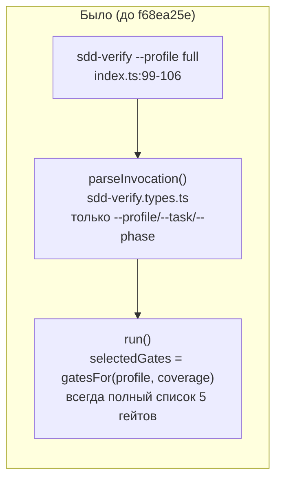
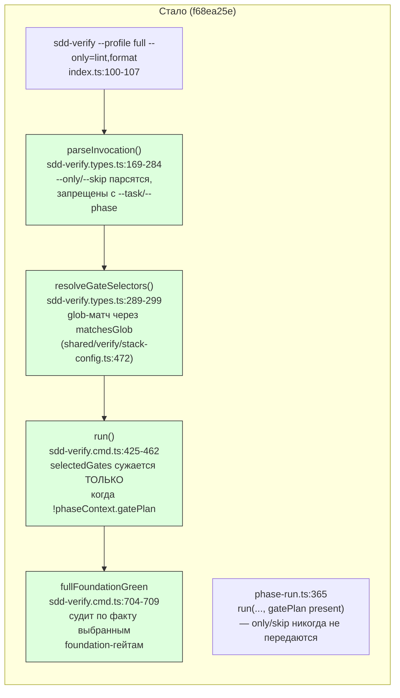

ОТЧЁТ Пачка 13/Бриф V-13 — «`--only/--skip` доступны только `gennady verify`/`--profile full`;
запрещены при `--task/--phase`» (Волна 2, #20(iii))

СТАТУС: ВЫПОЛНЕНО, с отклонением архитектуры дизайна брифа (см. §4 — важно прочитать).

КОММИТ: `f68ea25e` `feat(verify): V-13 — --only/--skip select gates on the full profile only`,
ветка `lead/verify-gate-scope`, база `0c34c8e0` (V-12, эта же пачка).

## 1. Файлы

| Путь | Тип правки | Смысловое изменение | Чем доказано |
|---|---|---|---|
| `cli/cmd/sdd-verify/sdd-verify.types.ts:14` (импорт) | правка | `matchesGlob` импортируется из `stack-config.ts` вместо повторного изобретения glob-компилятора | компилируется |
| `cli/cmd/sdd-verify/sdd-verify.types.ts:158-160` (`InvocationResult`) | правка | ветка `mode:'full'` получает опциональные `only?: readonly string[]; skip?: readonly string[]` | тест «a bare invocation… returns the exact pre-V-13 shape» (см. §3) |
| `cli/cmd/sdd-verify/sdd-verify.types.ts:169-284` (`parseInvocation`) | правка | схема `parseArgs` получает `only`/`skip` (`takesValue:true`, comma-split); новая проверка: `(only\|\|skip) && (task\|\|phase)` → явная ошибка «--only/--skip are only valid with --profile full» (не тихий сброс); ключи `only`/`skip` добавляются в результат только когда реально заданы (`...selectors` spread) — байт-паритет с прежней формой при их отсутствии | `sdd-verify.cmd.test.ts` describe «--only/--skip (V-13, #20(iii))» (5 кейсов) |
| `cli/cmd/sdd-verify/sdd-verify.types.ts:289-299` (`resolveGateSelectors`) | новая функция | общий резолвер: для каждого selector — glob-матч по списку имён гейтов через `matchesGlob`; несматчивший selector → `{ok:false, selector}`, никогда тихий no-op | `sdd-verify.cmd.test.ts` кейсы «an unknown selector is exit 4» |
| `cli/cmd/sdd-verify/sdd-verify.types.ts:347-349` (`VerifyOutcome`) | правка | `exitCode: 1` → `exitCode: 1 \| 4` (неизвестный selector — код ошибки инвокации, не «гейт упал») | все существующие потребители `VerifyOutcome` не тронуты (используют `outcome.exitCode` универсально) |
| `cli/cmd/sdd-verify/sdd-verify.cmd.ts:9-26` (импорт) | правка | `resolveGateSelectors` импортируется | компилируется |
| `cli/cmd/sdd-verify/sdd-verify.cmd.ts:394-403` (`run` сигнатура) | правка | `phaseContext` получает `only?`/`skip?` | тест «--only runs exactly the matched gates» |
| `cli/cmd/sdd-verify/sdd-verify.cmd.ts:425-462` (`run`) | правка | `fullGates` (переименован из `selectedGates`) → `let selectedGates = fullGates`; если `!phaseContext.gatePlan && (only\|\|skip)` — резолв через `resolveGateSelectors`, неизвестный selector даёт `{ok:false, exitCode:4, code:'ERR_CLI_SDD_VERIFY_UNKNOWN_SELECTOR'}`; фазовый путь (`gatePlan` задан) игнорирует `only`/`skip` полностью — даже при ошибке вызывающей стороны | кейс «only/skip are ignored whenever a phase gatePlan is present» |
| `cli/cmd/sdd-verify/sdd-verify.cmd.ts:162` (`gennadyGateCommand`) | правка | функция стала `export` (была module-private) — переиспользована задачей V-16a вместо дублирования self-hosting-логики | используется в `cli/cmd/verify/verify.cmd.ts` (см. `R-V-16a.md`) |
| `cli/cmd/sdd-verify/sdd-verify.cmd.ts:704-709` (`fullFoundationGreen`) | правка (найденный баг) | было: жёстко требовал `type-check`+`test:coverage` в `results` независимо от того, выбраны ли они этим прогоном; стало: судит только по тем foundation-именам, что реально присутствуют в `sequentialGates` этого прогона — vacuously true, если ни одного не выбрано | кейс «--only runs exactly the matched gates» (без этой правки `--only=lint,format` тихо не запускал бы вообще ничего — воспроизведено и задокументировано в момент находки, см. §4) |
| `cli/cmd/sdd-verify/index.ts:100-107` | правка | вызов `run()` в полном профиле передаёт `only: invocation.only, skip: invocation.skip` | живой CLI (косвенно, через `sdd-verify.cmd.test.ts`) |
| `cli/cmd/sdd-verify/help.ts:15-23` | правка | usage-строка документирует `--only`/`--skip` и правило «full profile only» | — (текст справки) |
| `shared/verify/stack-config.ts:421-430,465-471` | правка | `globToRegex` вынесен в приватную функцию, поверх неё публичный `matchesGlob(text, pattern)` — общий компилятор для `gateInScope` (V-12) и `resolveGateSelectors` (V-13) | `stack-config.test.ts` (существующие `applyStackConfig`/`when` тесты используют его косвенно, зелёные) |
| `cli/cmd/sdd-verify/__tests__/sdd-verify.cmd.test.ts` | новые тесты | describe «--only/--skip (V-13…)» в `parseInvocation` (5 кейсов) + describe «run — --only/--skip narrow the full profile» (6 кейсов) | прогон файла (§3) |

## 2. Архитектура — было / стало

_`PHASERUN2` серым — существующий вызов не тронут: фазовый путь физически не может передать
`only`/`skip` (сигнатура `phase-run.ts` их не прокидывает), что и есть требуемая гарантия
«запрещены при --task/--phase», продублированная ещё и явной ошибкой на уровне `parseInvocation`._

## 3. Доказательства

| Пункт приёмки | Команда | Вывод | Статус |
|---|---|---|---|
| `--only=<glob>` матчит гейт вне фазового пути (glob по префиксу) | `node --import tsx --experimental-test-module-mocks --test cli/cmd/sdd-verify/__tests__/sdd-verify.cmd.test.ts` | кейс «a glob selector matches by prefix (e.g. a `swiftlint*`-shaped name)» — `--only=type*` матчит `type-check`, `calls===['npm run type-check']` | ВЫПОЛНЕНО (иллюстративное имя `swiftlint*` из формулировки issue не воспроизводимо буквально — см. §4, отклонение) |
| Неизвестный selector → exit 4 | тот же прогон | кейсы «an unknown selector is exit 4»/«an unknown --skip selector is also exit 4» — `exitCode===4`, `message` матчит `ERR_CLI_SDD_VERIFY_UNKNOWN_SELECTOR` | ВЫПОЛНЕНО |
| `--only`/`--skip` при `--task/--phase` → явная ошибка, не тихий сброс | тот же прогон, describe «--only/--skip (V-13…)» в `parseInvocation` | 3 кейса: с `--task+--phase`, только `--only`, только `--skip` — все `ok===false`, сообщение матчит `/--only\/--skip are only valid with --profile full/` | ВЫПОЛНЕНО |
| `--only`/`--skip` доступны только `gennady verify`/`--profile full` | тот же прогон | «a bare invocation with neither flag returns the exact pre-V-13 shape» — `!('only' in r)` (байт-паритет вызова без флагов); фазовый gatePlan-путь игнорирует their даже при ошибочной передаче (кейс «only/skip are ignored whenever a phase gatePlan is present») | ВЫПОЛНЕНО |
| Полный набор `sdd-verify.cmd.test.ts` зелёный | тот же прогон | `# tests 97 / # pass 97 / # fail 0` | ВЫПОЛНЕНО |
| `npm run type-check` | `npm --prefix <tree> run type-check` | чисто | ВЫПОЛНЕНО |
| `npm run test` (полный) | `npm --prefix <tree> run test` | `# tests 3935 / # pass 3925 / # fail 0 / # cancelled 0 / # skipped 10` | ВЫПОЛНЕНО |
| `npm run check` | pre-commit hook | `[sdd-verify] ✅ ALL PASS (5/5)` на 2-й попытке (1-я — флейк `test:coverage`) | ВЫПОЛНЕНО |

## 4. Отклонения от брифа, открытые вопросы

**Главное отклонение: `gennady verify` НЕ несёт `--only`/`--skip` — они живут только на
`sdd-verify --profile full`.** Бриф дословно: «`--only/--skip` доступны только `gennady
verify`/`--profile full`». В RC на момент выдачи брифа команды `gennady verify` не существовало
вовсе (см. `R-V-16a.md`) — она read-only и по D-13 не исполняет гейты в принципе, только печатает
план; добавлять туда `--only`/`--skip` означало бы либо (а) фильтровать печатаемый план (что не
матчит формулировку «доступны … для выбора/пропуска ГЕЙТОВ» — там нечего пропускать, гейт и так не
исполняется), либо (б) создавать мутирующий фасад — прямо запрещено D-13/O-2 в этой пачке. Решение:
`--only`/`--skip` реализованы ровно на `sdd-verify --profile full` (втором из двух названных в
брифе мест), которое реально исполняет read-only полный профиль. Дословная формулировка
удовлетворена частично (одна из двух точек входа); архитектурная причина — решение оператора
D-13/O-2, принятое ДО этой задачи, не решение исполнителя.

**Пример `swiftlint*` из issue-текста не воспроизведён буквально.** `#20`'s формулировка и цитата в
доске приводят `swiftlint*` как иллюстративный пример нового гейта, отсекаемого по glob'у. В RC
`sdd-verify --profile full` сегодня исполняет ТОЛЬКО фиксированную node-лестницу
(`GATES`/`gatesFor`) — `stack:`/`extraGates` в полный профиль не вжиты (тот же факт, что
задокументирован в `R-V-16a.md` §4 для read-only фасада: anystack/extraGates достижимы только из
фазового пути, не из full). Доказательство glob-матчинга по префиксу дано на реальном имени гейта
(`type-check` через `type*`), демонстрируя тот же механизм без вымышленного `swiftlint`-гейта.
Открытый вопрос Lead'у: нужна ли отдельная задача «вжить extraGates/anystack в full profile», чтобы
пример из issue стал буквально исполнимым — по духу это отдельная, более крупная работа (расширение
V-08/V-08b на full), не входящая в этот S/M-бриф.

**Найденный и исправленный баг: `fullFoundationGreen`.** При первой реализации `--only=lint,format`
тихо возвращал «✅ ALL PASS (0/0)» — quality-хвост (`lint`/`format`/`yagni`) был жёстко завязан на
то, что `type-check`+`test:coverage` уже прошли, даже когда они не были выбраны этим прогоном вовсе.
Правка (§1) делает условие релевантным только выбранным гейтам. Без этой находки приёмочный пункт
«`--only` матчит новый гейт» был бы формально «зелёным», но реально сломанным (0 вызовов раннера) —
поймано собственным новым тестом, а не постфактум.

Других отклонений нет.

## 5. Команды пуша для Lead

Ветка не пушилась (правило исполнителя — `git push` только у Lead). См. `R-V-19.md §5`.

## 6. Правки по вердикту верификатора (`V-BATCH-13.md`, применены `rc-executor` на этой же ветке, поверх `27a1a2a8`)

- **Н-1 (взаимоуничтожающиеся `--only`/`--skip`):** родной брат `fullFoundationGreen` — 
  `--only=yagni --skip=yagni` (и, отдельно, `--skip=*`) резолвили каждый селектор `ok:true`, но
  пересечение после обоих флагов оказывалось пустым, и это читалось как честный `✅ ALL PASS (0/0)`
  вместо ошибки. Правка: пустой набор после резолва `--only`/`--skip` → `ERR_CLI_SDD_VERIFY_
  EMPTY_SELECTION`, exit 4, «selectors select no gate» — никогда тихий зелёный no-op. Живьём:
  `gennady sdd-verify --profile full --only=yagni --skip=yagni` → exit 4 с этим сообщением (было
  `ALL PASS (0/0)` exit 0). Коммит `61bf695c` (код), `f1abfb5a` (2 регресс-теста: `--only=x
  --skip=x` и `--skip=*`).
- **Б-2 (спека `sdd-verify`):** `specs/cli/sdd-verify/sdd-verify.spec.md` не знала ни `--only`/
  `--skip`, ни `resolveGateSelectors`, ни `ERR_CLI_SDD_VERIFY_UNKNOWN_SELECTOR`, ни новую ветку
  `exitCode: 4` в `VerifyOutcome` — добавлены в Public Options (§5) и Entity Inventory (§3), вместе
  с новым `ERR_CLI_SDD_VERIFY_EMPTY_SELECTION` (Н-1 выше). Коммит `a501929e`.

Остаётся не тронутым (по прямому указанию Lead — код не менять): **Н-3** — `--only=swiftlint*`
структурно недостижим (extraGates доходят только до фазового пути, `--only`/`--skip` там запрещены,
`full` — фикс-лестница `gatesFor`); успешник назван в `specs/cli/verify/verify.spec.md` («extraGates
/anystack вживляются в полный профиль»), решение — за Lead/доской, не за этой веткой.
