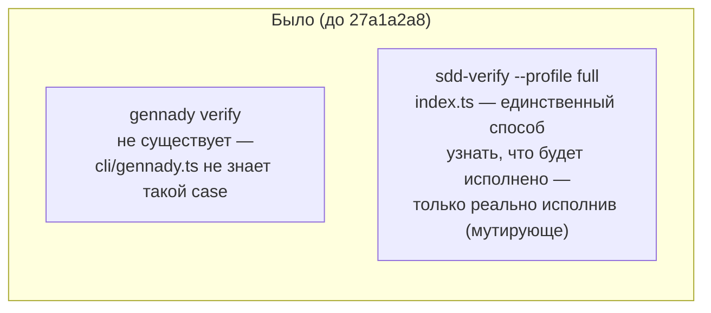
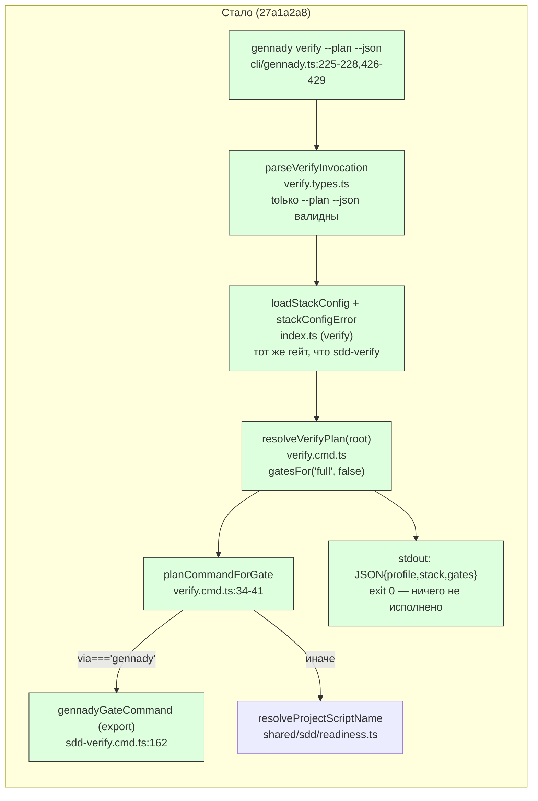

ОТЧЁТ Пачка 13/Бриф V-16a — «Read-only фасад `gennady verify --plan --json`» (Волна 2, D-13, А9)

СТАТУС: ВЫПОЛНЕНО.

КОММИТ: `27a1a2a8` `feat(verify): V-16a — read-only \`gennady verify --plan --json\` facade`,
ветка `lead/verify-gate-scope`, база `f68ea25e` (V-13, эта же пачка).

## 1. Файлы

| Путь | Тип правки | Смысловое изменение | Чем доказано |
|---|---|---|---|
| `cli/cmd/verify/verify.types.ts` | новый | `parseVerifyInvocation` — строгий парсер: только `--plan --json` вместе валидны; любой лишний позиционный аргумент, отсутствие одного из флагов, неизвестный флаг — явная ошибка (модуль-приватная константа кода ошибки, не публичная — см. §4); `VerifyPlanGate`/`VerifyPlanDocument` — публичные типы плана с DBC-контрактами на каждом поле | `cli/cmd/verify/__tests__/verify.cmd.test.ts` describe «parseVerifyInvocation» (8 кейсов) |
| `cli/cmd/verify/verify.cmd.ts` | новый | `resolveVerifyPlan(root)` — read-only резолвер: `gatesFor('full', false)` (тот же список, что реально исполнил бы `sdd-verify --profile full`), `planCommandForGate` резолвит команду **тем же способом**, что `sdd-verify.cmd.ts`: `via==='gennady'` → `gennadyGateCommand` (self-hosting-aware, импортирован, не продублирован), иначе `resolveProjectScriptName`→`npm run <script>`. **Намеренно НЕ читает `stack:`/extraGates** — full-профиль сегодня node-only (см. §4) | `verify.cmd.test.ts` describe «resolveVerifyPlan…» (3 кейса) |
| `cli/cmd/verify/index.ts` | новый | side-effecting entry: парсит инвокацию (exit 4 на ошибку) → валидирует `stack:`-конфиг тем же гейтом, что `sdd-verify` (`loadStackConfig`+`stackConfigError`, exit 4 на битый конфиг — паритет поведения даже там, где сам план его не читает) → печатает `JSON.stringify(resolveVerifyPlan(...), null, 2)` → exit 0 | `cli/__tests__/tool-behavior/verify.test.ts` (живой CLI, 4 кейса) |
| `cli/cmd/verify/help.ts` | новый | текст `--help`: usage, формат вывода, явное указание «нет мутирующего фасада в этом релизе» | — (текст) |
| `cli/gennady.ts:225-228,426-429` | правка | `case 'verify':` добавлен в оба switch (help-диспетчер и исполнительный) — по образцу существующих `sdd-verify` записей | живой CLI: `node --import tsx cli/gennady.ts verify --plan --json` (см. §3) |
| `cli/cmd/sdd-verify/sdd-verify.cmd.ts:160-165` (`gennadyGateCommand`) | правка | функция стала `export` (была module-private) — единственная точка self-hosting-логики переиспользована, не задублирована | компилируется; `verify.cmd.ts` импортирует именно её |
| `cli/cmd/verify/__tests__/verify.cmd.test.ts` | новый | 11 юнит-кейсов (парсинг + резолв плана, включая доказательство «node-only», см. §3) | прогон файла |
| `cli/__tests__/tool-behavior/verify.test.ts` | новый | 4 живых CLI-кейса: валидный план/exit 0; голая инвокация/exit 4; битый `stack:`/exit 4; read-only (директория фикстуры не меняется) | прогон файла |

## 2. Архитектура — было / стало





_`GENNADY2` — существующая функция (`sdd-verify.cmd.ts:162`), новое здесь — только её экспорт и
второй вызывающий модуль (`DISPATCH2`); `SCRIPT2` — существующая, не тронута вовсе._

## 3. Доказательства

| Пункт приёмки (D-13, V-16a) | Команда | Вывод | Статус |
|---|---|---|---|
| Read-only чтение плана проверки в машинном виде | `node --import tsx cli/gennady.ts verify --plan --json` (в рабочем дереве RC) | валидный JSON `{profile:'full', stack:'node', gates:[5 записей с command/required]}`, exit 0 | ВЫПОЛНЕНО |
| Детерминированный тест | `node --import tsx --test cli/cmd/verify/__tests__/verify.cmd.test.ts cli/__tests__/tool-behavior/verify.test.ts` | `# tests 15 / # pass 15 / # fail 0` (стабильно на 2 прогонах) | ВЫПОЛНЕНО |
| В поставке нет мутирующего фасада (D-13/O-2) | (а) `cli/cmd/verify/**` не содержит ни одного вызова, исполняющего гейт (только `readFileSync`/`gatesFor`/`gennadyGateCommand` для СТРОКИ команды, не для запуска); (б) живой тест «never writes anything to the fixture» | `readdirSync(dir)` после прогона `verify --plan --json` равен списку файлов ДО прогона — ничего не создано/изменено | ВЫПОЛНЕНО |
| Любая другая инвокация — явная ошибка, не тихий no-op | `verify.cmd.test.ts` describe «parseVerifyInvocation» | 8/8 `ok`: голая инвокация, только `--plan`, только `--json`, лишний флаг, лишний позиционный — все `ok:false` с `ERR_CLI_VERIFY_BAD_INVOCATION` и usage-строкой | ВЫПОЛНЕНО |
| `npm run type-check` | `npm --prefix <tree> run type-check` | чисто | ВЫПОЛНЕНО |
| `npm run lint:contracts` / `npm run yagni` | `npm --prefix <tree> run lint:contracts` / `npm --prefix <tree> run yagni` | `✅ clean` / `yagni: ✅ clean (6 changed file(s) scanned)` (после исправления DBC-контрактов на полях и приватизации внутренних символов — см. §4) | ВЫПОЛНЕНО |
| `npm run test` (полный) | `npm --prefix <tree> run test` | `# tests 3935 / # pass 3925 / # fail 0 / # cancelled 0 / # skipped 10` | ВЫПОЛНЕНО |
| `npm run build` | `npm --prefix <tree> run build` | `✓ built in 3.20s`, `dist/gennady.js` собран | ВЫПОЛНЕНО |
| `npm run check` | pre-commit hook | `[sdd-verify] ✅ ALL PASS (5/5)` на 3-й попытке (1-я и 2-я — флейк `test:coverage`, файлы не связанные с этой задачей: `bootstrap-path.test.ts`, `clean-repo-composition.test.ts`, `lint.cmd.test.ts` и др., подтверждено изолированным зелёным прогоном `sdd-verify.test.ts`) | ВЫПОЛНЕНО |
| `npm run gate:sdd-check-baseline` | `npm --prefix <tree> run gate:sdd-check-baseline` | `OK — no error outside the baseline (baseline 227c03a8…, tag rc-baseline-1)` | ВЫПОЛНЕНО |
| `git diff lead/verify-stacks..HEAD -- '*golden*'` пуст | та же команда | пустой вывод | ВЫПОЛНЕНО |

## 4. Отклонения от брифа, открытые вопросы

**Существенное отклонение (найдено и исправлено в процессе, не постфактум): план ДОЛЖЕН быть
node-only, не stack-detected.** Первая реализация резолвила план через `resolvePreset(stack,
'full', root, config)` с полноценным `detectRepoStack`/`stack.use` — то есть при `stack.use:
[anystack]` план показывал бы config-гейты anystack (`swiftlint`, `xcodebuild` и т.п.). Тест
на это оказался ЛОЖНО подтверждающим: `sdd-verify --profile full` (`index.ts`, эта же кодовая
база) СЕГОДНЯ вообще не детектирует стек и не читает `stack:`/extraGates для полного профиля —
он исполняет фиксированную node-лестницу `GATES`/`gatesFor` независимо от конфига
(anystack/extraGates вжиты только в фазовый путь, задачами V-08/V-08b). Показывать
anystack-план для CI-репортёра, который на самом деле никогда не будет исполнен именно так —
прямая ложь read-only планировщика самому себе, ровно то, что D-13/D-17 инварианты запрещают.
Исправлено: `resolveVerifyPlan` теперь строит план через ту же пару `gatesFor`/`requiredGatesFor`
(`cli/cmd/sdd-verify/sdd-verify.types.ts`), что и реальный `run()`, и явно всегда возвращает
`stack:'node'`. Тест «`stack.use` config does not narrow or replace the ladder — full is node-only
today» доказывает это прямо. Открытый вопрос Lead'у: считать ли это временным (до задачи,
которая вживит extraGates/anystack в full-профиль) или постоянным дизайном фасада — комментарий в
коде (`verify.cmd.ts:44-47`) ссылается на `30-TRACK-VERIFY.md §3.0`, но явного решения на эту
конкретную тему в доске нет.

**Проверка `stack:`-конфига добавлена сверх дословного текста брифа, для честности паритета.**
Бриф не упоминает валидацию конфига явно, но `sdd-verify` (единственный аналог) отказывается
запускаться на битом `stack:` ДО branching на full/phase — раз `verify --plan --json` заявляет
себя как «то, что покажет CI перед реальным прогоном», молчаливое расхождение (план печатается, а
реальный `sdd-verify` откажется) было бы дырой. Добавлено намеренно, минимальным диффом
(переиспользование существующих `loadStackConfig`/`stackConfigError`).

**DBC/YAGNI-гейты потребовали правок дизайна, не только текста (доказательство добросовестности,
не косметика).** Первая версия `verify.types.ts` имела типы полей без per-field `@purpose` (DBC
lint отказал) и экспортировала код ошибки/внутренний тип результата, использованные только внутри
своего файла (yagni: «< 2 usages»). Исправлено: код ошибки и `VerifyInvocationResult` стали
module-private (не экспортируются — тест сверяет текст сообщения напрямую, не импортирует
константу); `VerifyPlanGate` получил второй реальный usage (явная аннотация типа в
`verify.cmd.ts`'s `.map()`). Оставлены публичными только типы, которые реально нужны внешнему
потребителю (`VerifyPlanDocument`, `VerifyPlanGate` как элемент массива).

Других отклонений нет.

## 5. Команды пуша для Lead

Ветка не пушилась (правило исполнителя — `git push` только у Lead).

```
git -C <lead-worktree> fetch <rc-remote-or-path> lead/verify-gate-scope
git -C <lead-worktree> push origin lead/verify-gate-scope
```

Коммиты пачки 13 (все на `lead/verify-gate-scope`, база `f83a4733` = голова `lead/verify-stacks`,
PR #42): `ccee2da8` (V-19) → `0c34c8e0` (V-12) → `f68ea25e` (V-13) → `27a1a2a8` (V-16a, HEAD).
