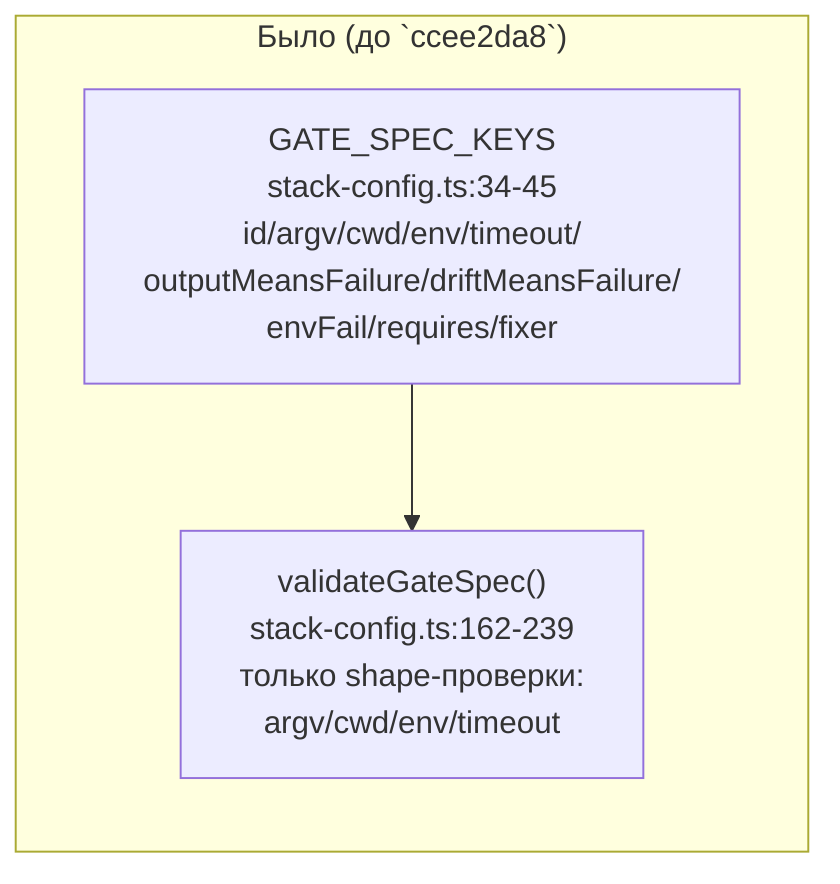
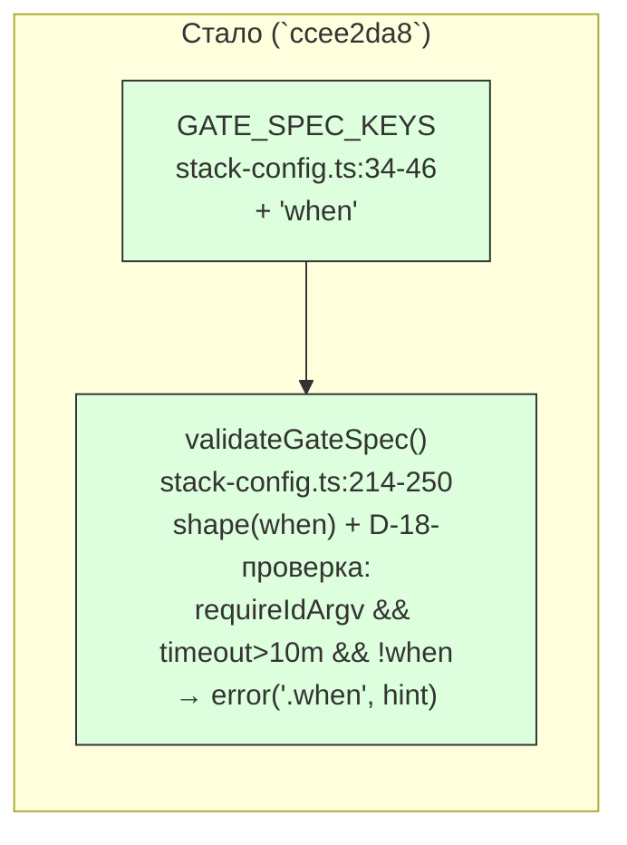

ОТЧЁТ Пачка 13/Бриф V-19 — «Долгий гейт без условия по файлам — ошибка валидации конфигурации с
подсказкой» (Волна 2, D-18 частично)

СТАТУС: ВЫПОЛНЕНО.

КОММИТ: `ccee2da8` `feat(verify): V-19 — long extraGate without `when` fails config validation`,
ветка `lead/verify-gate-scope`, база `f83a4733` (голова `lead/verify-stacks`, PR #42).

## 1. Файлы

| Путь | Тип правки | Смысловое изменение | Чем доказано |
|---|---|---|---|
| `shared/verify/verify.types.ts:236-263` | правка | `GateSpec` получает новое опциональное поле `when?: readonly string[]` (схема file-scope glob'ов; исполнение — задача V-12) | компилируется (`tsc --noEmit`), поле читается валидатором ниже |
| `shared/verify/stack-config.ts:34-46` (`GATE_SPEC_KEYS`) | правка | `'when'` добавлен в список известных ключей `GateSpec` — без этого любой `when:` в конфиге падал бы как `unknownKeyError` | `shared/verify/__tests__/stack-config.test.ts` describe «GateSpec.when» |
| `shared/verify/stack-config.ts:183-191` (`validateGateSpec`) | правка | `when` деструктурируется наравне с остальными полями спецификации | тот же describe |
| `shared/verify/stack-config.ts:214-250` (`validateGateSpec`) | правка | (а) `timeoutIsValid` вынесен в отдельную переменную, чтобы не пересчитывать `parseDuration` дважды; (б) валидация формы `when` — непустой массив непустых строк; (в) новая проверка D-18: для `extraGates`-записи (`requireIdArgv===true`) при `effectiveTimeoutMs > EXTRA_GATE_DEFAULT_TIMEOUT_MS` (10 мин) и отсутствии непустого `when` — ошибка `path: '<gate>.when'` с подсказкой | describe «V-19: a long extraGate without `when` is a validation error (D-18)» — 5 кейсов: >10m без when → ошибка; >10m с when → чисто; ровно 10m (граница) без when → чисто; отсутствующий `timeout` (неявные 10m) → чисто; уже невалидный `timeout` не даёт дублирующей ошибки |
| `shared/verify/__tests__/stack-config.test.ts:293-398` | новый блок тестов | см. выше — 2 describe, 9 кейсов | прогон файла зелёный (см. §3) |

Файл `phase-verification-plan.ts`, названный в брифе, не тронут: у V-19 задача чисто
конфиг-валидационная (load-time, до какого-либо резолва плана), рантайм-плана она не касается —
это явное, безопасное отклонение (см. §4).

## 2. Архитектура — было / стало





_Зелёным — новые узлы этой задачи. Диаграмма — контур `loadStackConfig`/`validateStackConfig`
(схема, не рантайм-план); рантайм-узел, который реально ЧИТАЕТ `when` (`gateInScope`,
`scopeReasonForGate`), появляется в следующем коммите V-12 (`0c34c8e0`), не в этом._

## 3. Доказательства

| Пункт приёмки | Команда | Вывод | Статус |
|---|---|---|---|
| Гейт с `timeout > 10m` без `when` → ошибка валидации с подсказкой | `node --import tsx --test shared/verify/__tests__/stack-config.test.ts` | describe «V-19…» — 5/5 `ok`, включая кейс «rejects timeout over 10m with no when, with a hint naming `when`» (сообщение содержит слово `when`) | ВЫПОЛНЕНО |
| Дефолтный (неявный) таймаут 10m не триггерит ошибку | тот же прогон | кейс «never fires when timeout is omitted» — `errors == []` | ВЫПОЛНЕНО |
| Граница: явные ровно `10m` не триггерят (не «over» 10m) | тот же прогон | кейс «accepts the exact 10m default timeout with no when (boundary…)» — `errors == []` | ВЫПОЛНЕНО |
| Схема `when` валидируется отдельно (непустой массив непустых строк) | тот же прогон | describe «GateSpec.when» — 3/3 `ok` (валидный `when` проходит; `when: []` и `when: [1]` отвергаются) | ВЫПОЛНЕНО |
| Детерминированный тест (не флейки) | 2 последовательных прогона `node --import tsx --test shared/verify/__tests__/stack-config.test.ts` | оба раза `# tests 51 / # pass 51 / # fail 0` (после коммита V-12 в файле добавились ещё кейсы — на момент ЭТОГО коммита было `# tests 46 / # pass 46`, см. полный прогон в §V-12) | ВЫПОЛНЕНО |
| `npm run type-check` | `npm --prefix <tree> run type-check` | чисто, exit 0 | ВЫПОЛНЕНО |
| `npm run check` (полный гейт коммита) | pre-commit hook (`npm run check` внутри) | `[sdd-verify] ✅ ALL PASS (5/5)` на втором прогоне (первый — флейк `test:coverage` под нагрузкой, см. §4) | ВЫПОЛНЕНО |

## 4. Отклонения от брифа, открытые вопросы

**Файл `phase-verification-plan.ts` не тронут.** Бриф-строка `61-TASK-BOARD.md` называет
`shared/verify/stack-config.ts`, `phase-verification-plan.ts` как зону V-19. Проверка D-18
(«timeout > 10m без when → ошибка») — чисто конфиг-валидационная и естественно живёт целиком в
`validateGateSpec`/`loadStackConfig` (load-time, до какого-либо резолва плана фазы). Рантайм-план
(`resolvePhaseVerificationPlan`) не участвует в этой проверке вообще — трогать его здесь означало
бы добавлять код без пользователя. Решение: оставить `phase-verification-plan.ts` для соседней
задачи V-12, которая уже обязана его трогать (сужение по Target Files) и которая единственная
реально ЧИТАЕТ `when` в рантайме. Не нарушает ни один инвариант брифа.

**Флейк `test:coverage` под нагрузкой (класс 2, красный гейт, снят повтором).** Первая попытка
коммита `ccee2da8` упала на `npm run test:coverage` с cancelled-тестами в файлах, не относящихся к
этой задаче (`bootstrap-path.test.ts` и т.п.) — подтверждено прогоном тех же файлов в изоляции
(зелёные) и повторным прогоном `npm run check` (зелёный на 2-й попытке). Синхронный повтор согласно
правилу пачки («до 3 раз»), коммит прошёл со 2-й попытки.

Других отклонений нет.

## 5. Команды пуша для Lead

Ветка не пушилась (правило исполнителя — `git push` только у Lead).

```
git -C <lead-worktree> fetch <rc-remote-or-path> lead/verify-gate-scope
git -C <lead-worktree> push origin lead/verify-gate-scope
```

Коммиты пачки 13 (все на `lead/verify-gate-scope`, база `f83a4733` = голова `lead/verify-stacks`):
`ccee2da8` (V-19) → `0c34c8e0` (V-12) → `f68ea25e` (V-13) → `27a1a2a8` (V-16a).

## 6. Правки по вердикту верификатора (`V-BATCH-13.md`)

Ни одна находка вердикта не была адресована лично V-19 — все три блокирующих (Б-1/Б-2/Б-3) и три
из пяти неблокирующих (Н-1/Н-2/Н-5) относятся к V-16a/V-12/V-13. Fix-коммиты `a9d7ad75`,
`61bf695c`, тест-коммит `f1abfb5a` и docs-коммит `a501929e` (все поверх `27a1a2a8`, той же ветки)
детализированы в `R-V-16a.md §6`, `R-V-12.md §6`, `R-V-13.md §6` и в сводном `R-BATCH-13-…md`.
