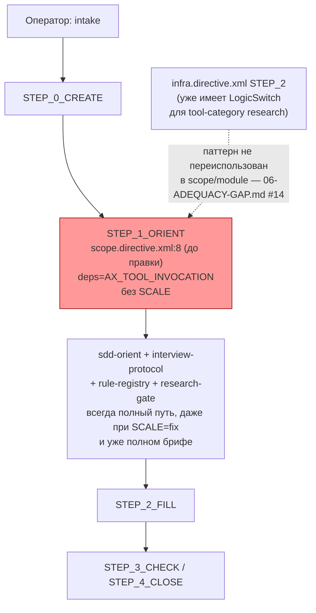

ОТЧЁТ 61 §1 / Пачка 19 — V14-1: Масштаб и экспресс-ветвь доезжают до авторинга скоупа и модуля

СТАТУС: DONE

Рабочее дерево: `rc-w3`. Ветка `lead/spec-authoring` (см. `R-BATCH-19-spec-authoring.md`), от `origin/codex/sdd-v2-rc52-followup` @ `c9b58636`. Предпосылки `T-B6-01` (`d0dde2cd`), `T-B6-14` (`068c7080`) выполнены в этой же ветке до этого коммита.

КОММИТ (локальный, НИЧЕГО не запушено):
- `1c4b746f62b2ee3315fb6811808d50f2d45f364b` feat(V14-1): scale/EXPRESS reaches scope/module authoring

---

## 1. Файлы

| Путь | Тип | Смысловое изменение | Чем доказано |
|---|---|---|---|
| `ai/kit/templates/sdd-v2/scope.directive.hbs` | правка | `BeliefState deps` расширен до `AX_TOOL_INVOCATION, AX_SCALE_PROPORTIONAL_DEPTH`; `STEP_1_ORIENT` получил `<LogicSwitch on="SCALE and brief completeness">`: при `SCALE=fix|function` и уже полном брифе (консьюмер, happy/negative path, ограничения, исключения) — EXPRESS: пропустить interview-protocol/rule-registry/research-gate целиком и идти прямо в `STEP_2_FILL`; при `SCALE=product` или неполном брифе/реальной неоднозначности — грузить протоколы по их же триггеру. `STEP_3_CHECK`/`STEP_4_CLOSE` остаются отдельными Step вне `LogicSwitch` и не сокращаются. | `scale-express-authoring.test.ts` (сборка scope): deps-ассерт, EXPRESS-ассерт, ассерт «`STEP_3_CHECK`/`STEP_4_CLOSE` строго после `</LogicSwitch>`» |
| `ai/kit/templates/sdd-v2/module.directive.hbs` | правка | Тот же паттерн: `deps` расширен, `STEP_1_ORIENT` получил `<LogicSwitch on="SCALE and orientation ambiguity">` — при `SCALE=fix|function` и однозначной ориентации `sdd-orient` — EXPRESS: пропустить interview/research/registry целиком; `STEP_4_CHECK`/`STEP_5_CLOSE` — отдельные Step вне switch. | тот же тест (сборка module): аналогичные 3 ассерта |
| `ai/directives/sdd-v2/scope.directive.xml` | регенерирован | Пересобран из `.hbs` (`delta: -1`). | `check:directives-fresh` |
| `ai/directives/sdd-v2/module.directive.xml` | регенерирован | Пересобран из `.hbs` (`delta: -1`). | `check:directives-fresh` |
| `ai/kit/__tests__/scale-express-authoring.test.ts` | новый | 7 тестов (2×3 по владельцу + 1 grep-lock): `deps` содержит `AX_SCALE_PROPORTIONAL_DEPTH`, EXPRESS-текст присутствует и по-прежнему требует брифо-полноту/отсутствие неоднозначности, каждый Approval-Check Step (`STEP_3_CHECK`/`STEP_4_CLOSE` scope, `STEP_4_CHECK`/`STEP_5_CLOSE` module) лежит строго после закрытия `LogicSwitch`, не свёрнут внутрь него. | сам тест — `node --test ai/kit/__tests__/scale-express-authoring.test.ts`: 7/7 pass |

`git show --stat 1c4b746f`: 5 файлов, 136 insertions(+), 14 deletions(-) — все 5 в таблице.

---

## 2. Архитектура было / стало

### Было — scope/module не знают о SCALE, всегда полный интервью-путь



### Стало — SCALE-зависимая LogicSwitch перед Approval Check, гейты не тронуты

```mermaid
flowchart TB
  Op["Оператор: intake"] --> S0["STEP_0_CREATE"]
  S0 --> S1["STEP_1_ORIENT\nscope.directive.xml:10\ndeps=AX_TOOL_INVOCATION, AX_SCALE_PROPORTIONAL_DEPTH"]
  S1 --> Orient["sdd-orient (unconditional)"]
  Orient --> LS["LogicSwitch on=\"SCALE and brief completeness\"\nscope.directive.xml:92-100"]
  LS -->|"SCALE=fix|function AND brief complete"| Express["EXPRESS: skip interview/registry/research\nscope.directive.xml:94-96"]
  LS -->|"SCALE=product OR brief неполон\nOR реальная неоднозначность"| Full2["interview-protocol / rule-registry / research-gate\nпо их же триггеру"]
  Express --> S2["STEP_2_FILL"]
  Full2 --> S2
  S2 --> Check["STEP_3_CHECK (scope.directive.xml:123)\nSTEP_4_CLOSE (scope.directive.xml:141)\nвне LogicSwitch, не сокращены"]
  ModS1["module STEP_1_ORIENT:70-82\nтот же паттерн\nLogicSwitch on=\"SCALE and orientation ambiguity\""] --> ModCheck["module STEP_4_CHECK:119\nSTEP_5_CLOSE:135\nвне LogicSwitch"]
  style LS fill:#9f9,stroke:#090
  style Express fill:#9f9,stroke:#090
  style Check fill:#9f9,stroke:#090
  style ModCheck fill:#9f9,stroke:#090
```
Нетронутые узлы (сборка/линт-инфраструктура, роутер) — не показаны.

---

## 3. Доказательства (ПРИЁМКА: «наличие правила масштаба в собранных директивах ≥1 в каждой; все точки утверждения сохранены»)

**1. Наличие правила масштаба ≥1 в каждой собранной директиве.**
```
$ grep -c "AX_SCALE_PROPORTIONAL_DEPTH" ai/directives/sdd-v2/scope.directive.xml ai/directives/sdd-v2/module.directive.xml
ai/directives/sdd-v2/scope.directive.xml:2
ai/directives/sdd-v2/module.directive.xml:2
```
Обе ≥1 (по 2: объявление в `deps` + цитата перед `LogicSwitch`). ВЫПОЛНЕНО.

**2. Все точки утверждения оператором сохранены (ни один Approval Check не свёрнут в EXPRESS-ветвь).**
```
$ grep -n "STEP_3_CHECK\|STEP_4_CLOSE\|</LogicSwitch>" ai/directives/sdd-v2/scope.directive.xml
100:        </LogicSwitch>
123:    <Step id="STEP_3_CHECK">
141:    <Step id="STEP_4_CLOSE">
$ grep -n "STEP_4_CHECK\|STEP_5_CLOSE\|</LogicSwitch>" ai/directives/sdd-v2/module.directive.xml
82:        </LogicSwitch>
119:    <Step id="STEP_4_CHECK">
135:    <Step id="STEP_5_CLOSE">
```
`STEP_3_CHECK`/`STEP_4_CLOSE` (scope) и `STEP_4_CHECK`/`STEP_5_CLOSE` (module) — их номера строк строго больше номера строки `</LogicSwitch>` в том же файле, то есть они отдельные Step, идущие ПОСЛЕ закрытия ветки, а не внутри неё. ВЫПОЛНЕНО.

**3. Специализированный kit-тест.**
```
$ node --experimental-strip-types --test ai/kit/__tests__/scale-express-authoring.test.ts
# tests 7
# suites 3
# pass 7
# fail 0
```
ВЫПОЛНЕНО.

**4. `build:directives` / `check:directives-fresh`.**
```
$ npm run build:directives
✓ sdd-v2/scope.directive.xml (delta: -1)
✓ sdd-v2/module.directive.xml (delta: -1)
Generated 55 directive(s).
$ node ai/kit/check-directives-fresh.ts
✓ ai/directives/** matches a fresh rebuild.
```
exit 0 оба раза (35 dangling-axiom warnings — пред-существующий класс находок, не по этой задаче; 0 undefined-axiom errors). ВЫПОЛНЕНО.

**5. `audit:sdd-templates` (fresh + axioms + contracts + halts + budgets).**
```
✓ ai/directives/** matches a fresh rebuild.
✓ axiom-activation audit clean — 28 template(s) checked.
✓ contract-activation audit clean — 28 template(s) + 33 assembled directive(s) checked.
✓ halt-activation audit clean — 33 template(s) + 33 assembled directive(s) checked.
✓ every lazy directive under ai/directives/sdd-v2/** is within budget.
```
exit 0 на каждом шаге; `AX_SCALE_PROPORTIONAL_DEPTH` заякорен вне `BeliefState` в обоих файлах (цитата перед `LogicSwitch`), новых dangling/undefined находок не добавлено. ВЫПОЛНЕНО.

**6. `npm test` (полный) и `npm run check`.**
`npm test`: первый прогон 3622/3631 pass, 1 fail (флаки под нагрузкой хоста — см. п.7 ниже и заметку в сообщении коммита); повторный прогон 3630/3638 pass, 0 fail, exit 0. `npm run check` (`sdd-verify --profile full`): `[sdd-verify] ✅ ALL PASS (5/5)` — type-check (4.0s), test:coverage (42.4s), lint (9.7s), format (2.2s), yagni (0.5s), exit 0 с первого прогона. ВЫПОЛНЕНО.

**7. Ресурсный контекст.** Хост во время прогонов пачки нёс `load average` ~55–70 при 12 ядрах (конкурентные сессии на общем хосте — не связано с содержанием этой задачи). Единственная зафиксированная нестабильность — 1 упавший тест в первом полном `npm test`, воспроизведённый повторным синхронным прогоном как зелёный (без ретрая коммита — коммит `1c4b746f` уже стоял в дереве до этого верификационного прогона, повторный прогон был только финальной проверкой пачки, не условием коммита).

---

## 4. Отклонения от брифа

Нет. Реализовано буквально по строке доски (`61-TASK-BOARD.md`/`62-BATCH-QUEUE.md:273`): «наличие правила масштаба в собранных директивах ≥1 в каждой; все точки утверждения сохранены» — оба условия проверены механически (п.1, п.2) и тестом (п.3), не только прочтением.

НАЙДЕНО ПОПУТНО: нет нового сверх того, что уже зафиксировано в `06-ADEQUACY-GAP.md`/#14 и `_raw/V14-PROPOSALS-TRIAGE.md:43-46` (обе — предпосылка задачи, не тронуты).

ОТКРЫТЫЕ ВОПРОСЫ: нет.

Команды пуша для Lead:
```
git push origin lead/spec-authoring
```
(после мержа всех задач пачки в эту ветку — см. сводный отчёт `R-BATCH-19-spec-authoring.md`).
