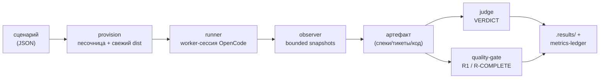

# Введение: что такое eval и как он работает

## Что такое eval и зачем он нужен

eval — стенд, который проверяет: пройдёт ли **живая дешёвая модель** (`deepseek-v4-flash`) одну фазу
SDD-флоу как обычный разработчик, если дать ей рабочий репозиторий и собранные директивы. Модель
работает в одноразовой изолированной песочнице; за ней следит внешний наблюдатель (`observer`), а итог
оценивают два независимых измерителя — стохастичный LLM-судья (`judge`) и детерминированная механика
(`sdd-check` / `sdd-verify` / quality-gate).

Зачем это нужно: когда модель спотыкается, вопрос не «слабая модель», а **где флоу сам себе мешает** —
спека неполна, директива уводит не туда, инструмент отвергает собственную же санкционированную форму.
eval превращает это ощущение в воспроизводимый факт.

## Метод: генетический eval-first цикл

Флоу мы улучшаем не правками «на глаз», а отбором: каждое изменение сначала прогоняется через eval, и
остаётся только то, что подтвердили объективные проверки. Один прогон показывает, **насколько хорошо
флоу отработал**: докуда по фазам дошла модель, прошли ли механические проверки, что сказал судья,
сколько ушло вызовов инструментов и токенов, где сломалась.

**Цикл:**

1. Прогоняем текущий флоу, смотрим результат.
2. **Прошло чисто** → повторяем несколько раз; стабильно зелёный — закрепляем тестом или сценарием и
   берём следующий случай.
3. **Упало или прошло частично** → вносим **одно** минимальное изменение (директива, шаблон, инструмент
   или промпт) и прогоняем снова:
   - стало лучше → фиксируем изменение и пишем тест, который это улучшение стережёт;
   - **стало хуже → откатываем изменение, но оставляем тест на эту деградацию**, чтобы больше в неё не
     наступить;
   - без разницы → откладываем.
4. Повторяем от лучшего состояния. Правило: **одно изменение за прогон**; несколько подряд без
   улучшения — стоп и сверка с оператором.

**Пример.** В recover-промпт добавили обязательный обход директив (`root → scope → router`) перед
записью спеки. Прогон дал деградацию: модель уходила в чтение директив, спеку не создавала, а расход
токенов вырастал примерно в 12 раз — golden-проверка падала. Изменение откатили, прямой промпт
(код → спека одним действием) закрепили как рабочий, а на саму деградацию оставили тест.

**Кто побеждает.** По приоритету: сначала механика (golden-тесты, `sdd-check`) — она бинарна, её провал
проигрывает сразу, какой бы экономной ни была версия. Среди прошедших смотрим расход (токены, вызовы,
сообщения); разница в пределах разброса — честная «ничья», а не натянутая победа. Что новая версия не
хуже прежней, формально проверяет `session-metrics.py compare`: шагов и вызовов инструментов не стало
больше, а признаки доведённого до конца результата не пропали.

**Где записано, что сработало, а что нет.** Оба исхода — и удачный, и неудачный — воспроизводимы и
лежат рядом: числа по каждому прогону — в `.results/metrics-ledger.jsonl`; гипотезы и их итоги — в
[`journal/EXPERIMENTS-LOG.md`](./journal/EXPERIMENTS-LOG.md); принятые и отклонённые решения (с пометкой
«почему, чтобы не повторять») — в [`journal/flow-verification-ledger.md`](./journal/flow-verification-ledger.md).
Победившее изменение вливается только в главный worktree; проигравшее в main не попадает. Как это
делать самому — в [`07-EXPERIMENTS.md`](./07-EXPERIMENTS.md).

## Один прогон под микроскопом

Коротко, что происходит за один прогон (полный разбор по шагам — в [`01-WALKTHROUGH.md`](./01-WALKTHROUGH.md)):

Харнесс не запускает `opencode` сам — он подключается к **уже поднятому** HTTP-серверу OpenCode и
создаёт в нём worker-сессию. Исходный checkout никогда не служит песочницей и не меняется во время
прогона.

## Два контура проверки: модель и директивы

Флоу проверяется на двух уровнях — не путать:

| Контур                       | Что проверяет                                    | Как                                                                       |
| ---------------------------- | ------------------------------------------------ | ------------------------------------------------------------------------- |
| **flow-eval** (этот)         | Пройдёт ли живая **модель** фазу как разработчик | Реальный прогон в песочнице, observer + judge + механика.                 |
| **flow-sim** (`ai/flow-sim`) | Правильно ли ведут себя сами **директивы**       | Сценарный прогон ролей Executor/Verifier/Arbiter по фиксированным картам. |

flow-eval отвечает «может ли модель пройти флоу», flow-sim — «делают ли директивы то, что должны»
(например, роутит ли `LOGIC_SWITCH` куда надо, держит ли `STOP`). Подробности второго контура — в
[`../../flow-sim/README.md`](../../flow-sim/README.md).

## Куда дальше

- Пошаговый разбор одного прогона — [`01-WALKTHROUGH.md`](./01-WALKTHROUGH.md).
- Устройство и детерминизм vs judge — [`02-ARCHITECTURE.md`](./02-ARCHITECTURE.md).
- Поставить окружение и запустить — [`03-SETUP.md`](./03-SETUP.md), [`04-RUNNING.md`](./04-RUNNING.md).
- Написать свой eval / поставить эксперимент — [`06-NEW-EVAL.md`](./06-NEW-EVAL.md),
  [`07-EXPERIMENTS.md`](./07-EXPERIMENTS.md).
