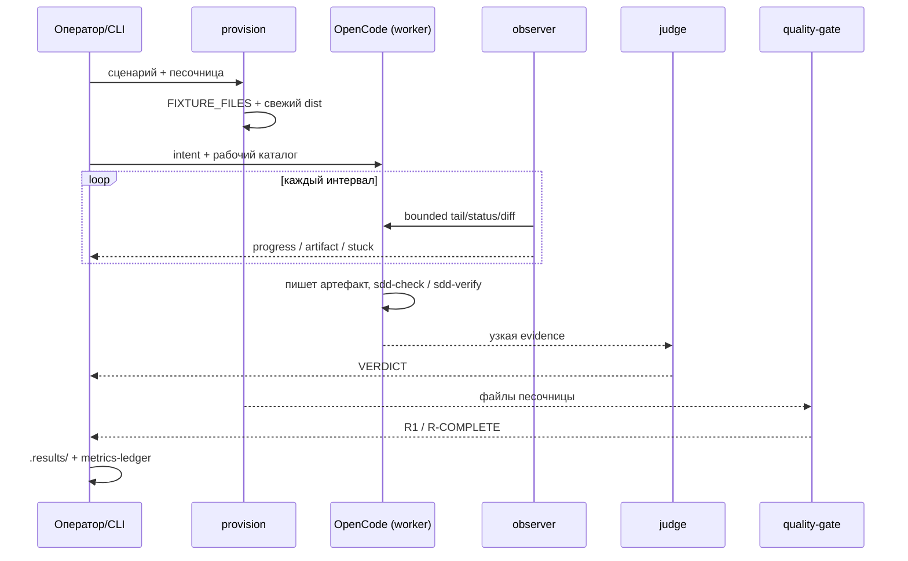

# Прогон по шагам: полный SDD-флоу

Разбираем один сквозной прогон на встроенной фикстуре greenfield — так виден **весь** SDD-флоу:
`authoring → (approval #1) → scaffold → (approval #2) → execute`. Никакого внешнего репозитория не
нужно: фикстура создаётся с нуля во временной песочнице. Цель документа — показать, что именно eval
делает внутри, как проверяется каждый шаг и куда попадает результат.

> Канонический `scenarios.json` гоняет каждую фазу на **своей** фикстуре независимо (так дешевле). Чтобы
> увидеть сквозной флоу, те же три фазы «сцепляют» на **одной** песочнице, симулируя approval оператора
> между ними. Процедура сцепления — в [`04-RUNNING.md`](./04-RUNNING.md); здесь — что при этом
> происходит на каждом шаге.

## Что берём за пример

- **Фикстура:** `fibonacci-library` (минимальная — портал спек + бриф; достаточно для старта с authoring).
- **Флоу:** от брифа до реализованного и проверенного тикета.
- **Модель:** `llm-proxy/deepseek-v4-flash` (и worker, и judge).

## Шаг 0. Запуск

Оператор (или управляющий агент) вызывает харнесс одной командой:

```bash
npm run sdd-flow-eval -- \
  --scenario-file <one-scenario>.json \
  --directory "$SDD_EVAL_ROOT" \
  --gennady-root "$PWD" \
  --base-url "http://127.0.0.1:$OPENCODE_EVAL_PORT" \
  --model llm-proxy/deepseek-v4-flash \
  --judge-model llm-proxy/deepseek-v4-flash \
  --concurrency 1 --observe-every-ms 300000 --stuck-after 2 --max-observations 8
```

Что делает `cli.ts`, приняв команду: разбирает флаги → **провижнит** песочницу под сценарий →
запускает worker → наблюдает → судит → печатает отчёт и сохраняет артефакты. `--directory` — это только
корень, под которым создаётся отдельная песочница `sdd-flow-eval-*`; общим рабочим каталогом он не
служит.

## Шаг 1. provision — песочница

`provision.ts` для greenfield-фикстуры:

1. Материализует `FIXTURE_FILES` (портал `specs/README.md`, бриф `inputs/brief.md`, каркас
   `package.json` / `tsconfig.json` / тест-раннеры) в изолированный временный git-репозиторий.
2. Делает один baseline-коммит — worker стартует с чистого git-статуса.
3. `materializeLocalCli` кладёт в песочницу **свежие** `dist/**`, `ai/**` и bin-shim из `--gennady-root`.

Последнее критично: песочница исполняет ту сборку gennady и те директивы, что собраны прямо сейчас, а
не то, что когда-то стояло в репозитории. Поэтому после правок кода перед прогоном обязателен
`npm run build` (см. [`03-SETUP.md`](./03-SETUP.md)).

## Шаг 2. Что поднимается и что передаётся в OpenCode

Харнесс **не запускает** `opencode` сам — сервер OpenCode должен уже слушать порт (поднимается заранее,
см. [`03-SETUP.md`](./03-SETUP.md)). Харнесс подключается к нему через `@opencode-ai/sdk` и создаёт
**worker-сессию** с именем `sdd-eval:<scenario-id>`. В сессию уходит:

- **intent** сценария — задача, которую видит модель (для `spec-authoring` ещё и `scale`, чтобы
  headless-worker не переспрашивал масштаб);
- **рабочий каталог** = путь песочницы; собранные директивы SDD уже лежат там (`ai/**`), модель их
  читает и «исполняет» как обычный разработчик через CLI `gennady`;
- **модель** — `--model` (worker), отдельно `--judge-model` (судья).

Никакого субпроцесса `codex`/`opencode` — только HTTP к уже поднятому серверу.

## Шаг 3. runner — одна сессия на сценарий

`runner.ts` создаёт ровно одну worker-сессию на сценарий и ограничивает параллелизм (`--concurrency`) и
бюджет наблюдений (`--max-observations`). Для authoring-батчей параллелизм держат на `1`: каждый
authoring-worker поднимает ещё и review-субагента, и несколько параллельных сессий перегружают один
тест-сервер.

## Шаг 4. observer — наблюдение без вмешательства

`observer.ts` раз в `--observe-every-ms` читает **ограниченный** срез: хвост лога, статус, события и
`git diff` песочницы — и выводит одну строку:

```text
fibonacci-library: status=running progress=true artifact=changed artifact-wait=0 tools=4 repeat=0 stuck=false tail=...
```

- `progress` — что-то изменилось (хвост/статус/события/файлы);
- `artifact=changed|none` — менялись ли именно артефакты репозитория;
- `artifact-wait=N` / `repeat=N` — сколько наблюдений подряд без изменений / полностью одинаковых;
- `stuck=true` — достигнут порог отсутствия прогресса (`--stuck-after`), и наблюдатель **сам**
  останавливает worker (`abort`).

Наблюдатель ничего не подсказывает модели — только фиксирует и решает, не застряла ли она.

## Шаг 5. worker пишет артефакт и проверяет себя

Модель проходит фазу и оставляет артефакты, проверяя себя **встроенными** инструментами флоу:

- **authoring** → спеки (`specs/**`), затем `gennady sdd-check` на структурную целостность; останов
  перед Approval #1.
- **scaffold** → тикеты и трекер-индекс; останов перед Approval #2.
- **execute** → реализация + подтверждение: `gennady sdd-verify` выдаёт receipt фазы, аудит и ревью
  оставляют свои receipts. Без пройденной верификации тикет не помечается DONE.

Здесь же видно, «слабое ли звено — модель или флоу»: если инструмент отвергает собственную
санкционированную форму или директива уводит не туда, worker честно упрётся, и это увидит наблюдатель.

### Между фазами — симуляция approval оператора

eval headless, UI нет, поэтому «утверждение оператора» между фазами делается **правкой файлов**
(`operator-approve.sh <sandbox>`): портал `specs/README.md` `🚧`→`✅` и записи Decision Log в спеках
`pending`→`approved`. Оба нужны — судья читает и портал, и Decision Log. Только после этого запускают
следующую фазу на **той же** песочнице.

## Шаг 6. judge — независимая оценка

`judge.ts` — отдельная сессия (`sdd-eval-judge`) с **узкой** evidence: `intent`, `acceptance`, `diff`,
`events`, `tail`, `state`. Она не видит промпт worker'а, полный транскрипт и внутренности runner'а.
Первая строка ответа — ровно `VERDICT: pass|fail|inconclusive`; нет явной строки → `inconclusive` (не
ложный fail). Судья стохастичен — поэтому он не последняя инстанция (см. шаг 7).

## Шаг 7. quality-gate — детерминированная проверка

`quality-gate.ts` работает на файлах готовой песочницы, без LLM:

- **R1** — `gennady sdd-check --all .`: `clean` → pass, `N error(s)` → fail. Применяется к сценариям,
  которые производят спеки.
- **R-COMPLETE** (для execute-сценариев с полем `completion`) — читает с диска: артефакт существует,
  тикет `[x] DONE`, раунд закрыт, на спеке есть `SDD_AUDIT_RECEIPT` / `SDD_REVIEW_RECEIPT`. Ловит
  «заброшенный артефакт» — код написан, а тикет не доведён. Если присутствует, решающий над R1.

Расхождение судьи с механикой — это дефект харнесса/судьи, **а не** проверяемого флоу. Механика —
источник истины. Подробнее — [`05-METRICS.md`](./05-METRICS.md).

## Шаг 8. Куда попадает результат и запись «сработало / нет»

- **Артефакты прогона** — `.results/run-<timestamp>/<scenario-id>/`: обоснование судьи `judge.md`,
  итоговые спеки, состояние.
- **Числа прогона** — `session-metrics.py record` пишет одну JSON-строку в `.results/metrics-ledger.jsonl`
  (вызовы инструментов, шаги, токены, статус тикета, receipts).
- **Что сработало, а что нет** — фиксируется в журнале: гипотезы и исходы в
  [`journal/EXPERIMENTS-LOG.md`](./journal/EXPERIMENTS-LOG.md), принятые/отклонённые решения — в
  [`journal/flow-verification-ledger.md`](./journal/flow-verification-ledger.md). Как вести это самому —
  [`07-EXPERIMENTS.md`](./07-EXPERIMENTS.md).

## Критерии результата

- **pass** — нужные артефакты созданы, механика чистая, модель остановилась на правильной границе фазы;
- **fail** — артефакты неверны, модель ушла в другую фазу, зациклилась или исчерпала бюджет;
- **inconclusive** — доказательств недостаточно; это **не** успех.

## Одна фаза целиком



## Куда дальше

- Как это устроено на уровне модулей — [`02-ARCHITECTURE.md`](./02-ARCHITECTURE.md).
- Как реально запустить сквозной прогон и сцепить фазы — [`04-RUNNING.md`](./04-RUNNING.md).
- Как считается результат детерминированно — [`05-METRICS.md`](./05-METRICS.md).
