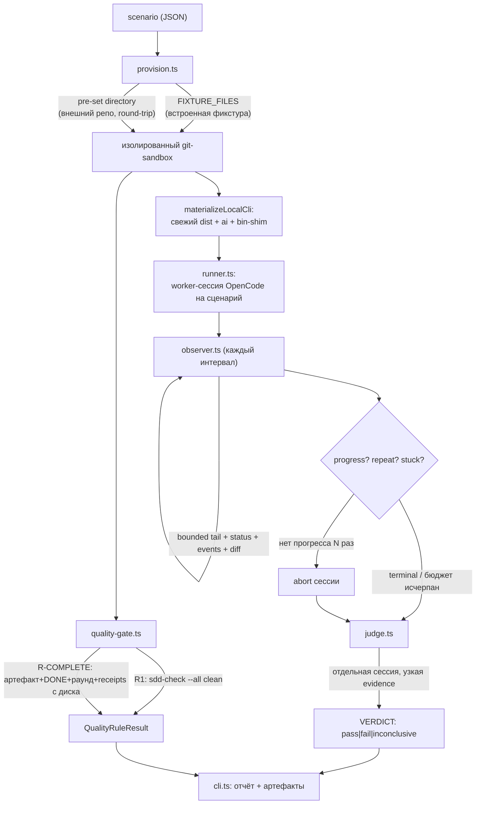

# Архитектура flow-eval-харнесса

Читать первым после [`README.md`](../README.md). Здесь — устройство и принцип работы; как запустить —
в [`RUNBOOK.ru.md`](../RUNBOOK.ru.md), как добавить eval — в [`WRITING-EVALS.ru.md`](../WRITING-EVALS.ru.md).

## 1. Принцип работы

Харнесс не запускает бинарь `opencode` и не спавнит `codex`. Он подключается через `@opencode-ai/sdk`
к **уже запущенному** OpenCode HTTP-серверу (`--base-url`). Сама модель ходит не напрямую к провайдеру,
а через LLM-proxy (например, `llm-proxy/deepseek-v4-flash`) — сервер OpenCode обращается к нему как
к обычному провайдеру.

Исходный checkout (worktree, откуда запущен харнесс) никогда не используется как песочница и не
модифицируется во время прогона: для каждого сценария создаётся отдельная изолированная копия.

## 2. Пайплайн

Коротко по шагам:

1. **scenario** описывает фазу/режим SDD, intent и либо встроенную фикстуру, либо готовый каталог
   (внешний репо).
2. **provision** материализует рабочую копию: для встроенной фикстуры — новый git-репозиторий из
   `FIXTURE_FILES`; для внешнего репо (round-trip) — уже существующий git worktree, переданный как
   `scenario.directory`. В обоих случаях `materializeLocalCli` кладёт в песочницу свежий `dist/**`,
   `ai/**` и CLI bin-shim из текущего `--gennady-root` — песочница никогда не работает на устаревшей
   сборке.
3. **runner** создаёт одну worker-сессию OpenCode на сценарий и ограничивает параллелизм/бюджет
   наблюдений (`SddEvalConfig`).
4. **observer** раз в `--observe-every-ms` читает ограниченный хвост, статус, события и diff репозитория
   и вычисляет `progress` / `artifactProgress` / `repeatCount` / `stuck`. При `stuck` наблюдатель сам
   останавливает worker-сессию (`abort`).
5. **judge** — отдельная OpenCode-сессия с узкой evidence (`intent`, `acceptance`, `diff`, `events`,
   `tail`, состояние). Обязан вернуть `VERDICT: pass|fail|inconclusive` первой строкой.
6. **quality-gate** — механические правила поверх той же файловой системы песочницы: `R1` (структурная
   целостность через `sdd-check --all`) и опциональный `R-COMPLETE` (для execute-сценариев с полем
   `completion` — читает артефакт/тикет/спеку с диска и проверяет реальный DONE).
7. **cli.ts** агрегирует результаты worker + judge + quality-gate, печатает отчёт и сохраняет
   долгоживущие артефакты (спеки, обоснование judge, `.results/`).

## 3. Роли модулей

| Модуль                 | Ответственность                                                                                                                   |
| ---------------------- | --------------------------------------------------------------------------------------------------------------------------------- |
| `cli.ts`               | Парсит флаги, провижнит сценарии, запускает пакет, печатает отчёт, сохраняет артефакты.                                           |
| `provision.ts`         | Строит sandbox на сценарий: встроенная фикстура (`FIXTURE_FILES`) или готовый каталог; кладёт свежий CLI (`materializeLocalCli`). |
| `runner.ts`            | Одна worker-сессия OpenCode на сценарий; ограничивает параллелизм и бюджет наблюдений.                                            |
| `observer.ts`          | Раз в интервал читает bounded evidence, определяет progress/repeat/stuck, при stuck сам абортит сессию.                           |
| `judge.ts`             | Отдельная сессия с узкой evidence; парсит `VERDICT:` из первой строки ответа.                                                     |
| `evidence.ts`          | Источник bounded evidence (tail/events/diff/status/usage) поверх OpenCode SDK/SQLite.                                             |
| `quality-gate.ts`      | Детерминированные правила `R1`/`R-COMPLETE` — читают файлы песочницы напрямую, без LLM.                                           |
| `opencode-runtime.ts`  | Единственный адаптер к `@opencode-ai/sdk`: создание сессий, prompt, abort, judge — никакого субпроцесса.                          |
| `types.ts`             | Источник истины для типов сценария/фазы/режима/фикстуры/judge-контракта.                                                          |
| `scenarios.json`       | Эталонные сценарии (authoring, scaffold, execute, repair и др.).                                                                  |
| `scripts/*.sh`, `*.py` | Внешние прогоны (round-trip/migration) и слой детерминированных метрик — см. [METRICS.ru.md](./METRICS.ru.md).                    |

## 4. Что детерминировано, а что — judge

| Слой                           | Детерминизм | Источник вердикта                                                                                                     |
| ------------------------------ | ----------- | --------------------------------------------------------------------------------------------------------------------- |
| `judge.ts` (VERDICT)           | Нет (LLM)   | Отдельная сессия модели; стохастична по природе, узкая evidence снижает шум.                                          |
| `quality-gate.ts` — R1         | Да          | `gennady sdd-check --all .`, парсинг вывода (`parseSddCheckResult`).                                                  |
| `quality-gate.ts` — R-COMPLETE | Да          | Чтение артефакта/тикета/спеки с диска: `[x] DONE`, закрытый раунд, `SDD_AUDIT_RECEIPT`/`SDD_REVIEW_RECEIPT` на спеке. |
| `session-metrics.py` record    | Да          | SQLite OpenCode (шаги/тулы/токены) + файлы фикстуры на диске — без LLM.                                               |
| `session-metrics.py` gate      | Да          | RED, если артефакт есть, а тикет не завершён (см. [METRICS.ru.md](./METRICS.ru.md)).                                  |
| `session-metrics.py` compare   | Да          | non-regression: `steps`/`tool_calls` не выросли, `completion`-сигналы не регрессировали.                              |
| `session-telemetry.py`         | Да          | Обзервабилити (тулы/чтения/reasoning) — только для чтения, ничего не решает.                                          |

Практическое следствие: **вердикт judge не отменяет проверку фактов**. Если judge противоречит diff'у
или показаниям quality-gate — это дефект харнесса/судьи, а не дефект проверяемого SDD-флоу (см.
[RUNBOOK.ru.md](../RUNBOOK.ru.md#критерии-результата)).

## 5. Куда дальше

- Как поднять окружение перед прогоном (сервер OpenCode, LLM-proxy, сборка, правило `~/Developer/`) —
  [`PREREQUISITES.ru.md`](./PREREQUISITES.ru.md).
- Как написать свой eval на встроенной фикстуре — [`WRITING-EVALS.ru.md`](../WRITING-EVALS.ru.md).
- Как завести eval на СВОЁМ внешнем репозитории (round-trip) —
  [`WRITING-EVALS-EXTERNAL.ru.md`](./WRITING-EVALS-EXTERNAL.ru.md).
- Слой метрик и non-regression — [`METRICS.ru.md`](./METRICS.ru.md).
- Готовый бриф для агента разработчика — [`AGENT-BRIEF.ru.md`](./AGENT-BRIEF.ru.md).
- Разбор реальных прогонов (глубокие кейсы) — `swiftlint-toolchain-setup.md`,
  `roundtrip-wall3-assessment.md`, `flow-verification-redesign.md`, `flow-verification-ledger.md`.
