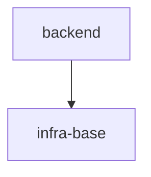

# S1 — новый product/library scope из чистого портала

Проверяет: router `LOGIC_SWITCH` ветку 3 (`new-scope` + `product`/`library` → `scope.directive.xml`)
на v2-репозитории с READINESS=ready и живым порталом.

## Fixture

`package.json`:

```json
{
  "name": "demo-project",
  "version": "0.1.0",
  "scripts": {
    "typecheck": "tsc --noEmit",
    "test": "vitest run",
    "test:coverage": "vitest run --coverage",
    "lint": "gennady lint --all .",
    "format": "prettier --check ."
  }
}
```

`node_modules/.bin/gennady` (пустой файл — гейт readiness проверяет только наличие):

```

```

`specs/README.md`:

````markdown
# demo-project

## Vision

Набор личных инструментов продуктивности.

## Scope Graph


````

## Scopes

| Scope                                           | Type           | Spec | Description                |
| ----------------------------------------------- | -------------- | ---- | -------------------------- |
| [`infra-base`](./infra-base/infra-base.spec.md) | infrastructure | ✅   | TS + vitest + gennady lint |
| [`backend`](./backend/backend.spec.md)          | product        | ✅   | Backend API                |

```

Никакого `tasks/` каталога (v2), никакого `specs/.sdd-session.md` (нет сессии в процессе),
никакого `specs/notes/` (scope ещё не существует).

## Entry

Скилл: `/sdd`. Первая реплика оператора:

> Нужен новый scope: продукт `notes` — заметки с локальным хранением.

## Operator Script

1. На объединённый вопрос роутера (тип scope: product/library + предложенный `scale`) — ответ:
   «product, со scale согласен» (принимает предложенный дефолт `scale`, явно называет `product`).
2. На вопрос `scope.directive` STEP_1_CONFIRM (подтверждение scope-type + состав секций) — ответ:
   «да, годится».

## Stop

Сразу после того, как `scope.directive` (mode=`greenfield`) показал Approval Check по итогам
STEP_1_CONFIRM (подтверждён scope-type + список секций) и получил от оператора «да, годится».
Прогон завершается ДО STEP_2_INTENT_CAPTURE — ничего из содержимого спеки ещё не пишется, интервью
не запускается. Трейс заканчивается строкой `stop: per-map — <это условие дословно>` (не `halt:` —
остановка по карте, не директивный `H_*`-гейт).

## Checkpoints

1. Первый вызов инструмента в трейсе — `sdd-state` (без `--probe`, без пути) — router STEP_0_STATE:
   «Call `sdd-state` (deterministic) — one call returns everything routing needs».
2. Сработавшая ветка `STEP_0_STATE` — `LogicSwitch` DEFAULT: «repo is `v2` + ready — proceed to
   STEP_1_CLASSIFY» (никакая другая ветка STEP_0_STATE — ни `migration-v1-v2`, ни `readiness` — не
   загружена; в трейсе нет строк `directive: ai/directives/sdd-v2/migration-v1-v2.directive.xml
   loaded` или `directive: ai/directives/sdd-v2/readiness.directive.xml loaded`).
3. `STEP_1_CLASSIFY` классифицировал intent как `new-scope`, зафиксировал scope-type = `product` и
   `scale:` в `specs/.sdd-session.md` — до этого была ровно ОДНА объединённая развилка с оператором
   («one stop for both, never a second one»).
4. Сработавшая ветка `LOGIC_SWITCH` (главный роутинг) — дословно: «WHEN intent ∈ {new-scope,
   evolve-scope} AND scope-type ∈ {product, library} -> READ_AND_USE_DIRECTIVE("ai/directives/sdd-v2/scope.directive.xml")».
   В трейсе ровно один `directive: ... loaded` после router — `scope.directive.xml`; ни `infra`, ни
   `interface`, ни `module`, ни `root`, ни `recover-from-code` директивы не загружены.
5. Внутри `scope.directive`: `AX_MODE_AUTO_DETECT_OR_HALT` определил mode=`greenfield` (файла
   `specs/notes/notes.spec.md` нет на диске) — не `refine`, не `pivot`.
6. Прогон остановился на `STEP_1_CONFIRM`: «Confirm the scope-type, outline which sections the spec
   will carry. Approval Check. STOP.» — нет ни одной строки `write:` под `specs/notes/` (запись
   `specs/.sdd-session.md` предписана самим роутером на `STEP_1_CLASSIFY` и легальна — это не
   создание артефакта scope, это фиксация сессии), `sdd-new product --scope notes` НЕ вызван (это
   STEP_9, недостижим до стопа).
7. На `STEP_1_CONFIRM` состав секций показан оператору как `show:`-строка, перечисляющая секции
   именно из манифеста `sdd-new product --scope notes --manifest` (`SCOPE_TYPE`, `VISION`,
   `OVERVIEW`, `PROJECT_TYPE`, `GOLDEN_DX`, `SCOPE_DEPENDENCIES`, `REQUIREMENTS_AND_CONSTRAINTS`,
   `ARCHITECTURE`, `MODULE_MAP`, `DECISION_LOG`, `BOOTSTRAP_REQUIREMENTS`, `HANDOFF`) — включая
   `OVERVIEW` и `MODULE_MAP` — а не произвольный пересказ секций агентом.
```
