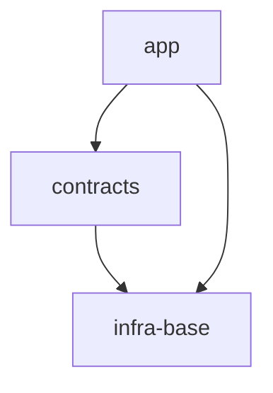

# S10 — multi-scope изменение, роутинг в порядке Scope Graph

Проверяет: router `STEP_1_CLASSIFY` (intent = `multi-scope`, обязательная объединённая SCALE-развилка)
и `LOGIC_SWITCH` ветку `multi-scope` (`ai/directives/sdd-v2/router.directive.xml`) — декомпозицию
запроса по Scope Graph в порядке зависимостей (`AX_CROSS_SCOPE_CHANGE`: shared-scope первым) на
v2-репозитории с READINESS=ready и живым порталом, где оба затронутых scope уже имеют спеку.

## Fixture

Ниже `<GENNADY_WORKTREE>` — абсолютный путь к worktree gennady, который выдаёт оркестратор. Все
`tool:`-вызовы gennady-команд в Checkpoints (`sdd-state`, `orient`, `sdd-check`, …) — сокращение для
`npx tsx <GENNADY_WORKTREE>/cli/gennady.ts <cmd> <args>`, НЕ `gennady <cmd>` напрямую и НЕ чужой
чекаут `~/Developer/gennady` (per `PROTOCOL.md`, «Правила исполнителя»).

`package.json` (`typecheck`/`test`/`test:coverage`/`format` — инструментарий demo-фикстуры, не
вызываются ни в одном Checkpoint этой карты; `lint` — реальная gennady-команда, поэтому
репо-относительно):

```json
{
  "name": "demo-project",
  "version": "0.1.0",
  "scripts": {
    "typecheck": "tsc --noEmit",
    "test": "vitest run",
    "test:coverage": "vitest run --coverage",
    "lint": "npx tsx <GENNADY_WORKTREE>/cli/gennady.ts lint --all .",
    "format": "prettier --check ."
  }
}
```

`node_modules/.bin/gennady` (пустой файл — гейт readiness проверяет только наличие):

```

```

`specs/README.md`:

````markdown
# demo-project

## Vision

Набор личных инструментов продуктивности с общим слоем контрактов.

## Scope Graph



## Scopes

| Scope                                           | Type           | Spec | Description                       |
| ----------------------------------------------- | -------------- | ---- | --------------------------------- |
| [`infra-base`](./infra-base/infra-base.spec.md) | infrastructure | ✅   | TS + vitest + gennady lint        |
| [`contracts`](./contracts/contracts.spec.md)    | library        | ✅   | Общие типы и контракты            |
| [`app`](./app/app.spec.md)                      | product        | ✅   | Приложение, потребитель contracts |
````

`specs/contracts/contracts.spec.md` (минимальная существующая спека — содержимое не читается до
`## Stop`, только факт присутствия файла имеет значение для mode-detection):

```markdown
# contracts

## Vision

Общий пакет типов и контрактов для всех продуктовых scope.

## Requirements and Constraints

- Тип `Session` — сессия пользователя.
```

`specs/app/app.spec.md` (минимальная существующая спека, тем же принципом):

```markdown
# app

## Vision

Основное приложение, использует `contracts` для типов домена.

## Scope Dependencies

- `contracts` — типы домена (`Session` и производные).
```

Никакого `tasks/` каталога (v2), никакого `specs/.sdd-session.md` (нет сессии в процессе),
никакого `specs/notes/` или прочих незарегистрированных scope.

Реестр правил — четыре директории-болванки, по одному минимальному файлу в каждой (per
`AX_SCOPE_RULES_DECLARATION`-категории `coding`/`testing`/`architecture`/`infra`:
`ai/directives/<category>/<rule>.xml`),
чтобы ЛЮБОЕ чтение реестра правил в этом прогоне (даже если по тексту карты оно не должно быть
достигнуто до `## Stop`) находило файл внутри песочницы фикстуры, а не утекало в
`ai/directives/coding/` etc. реального `<worktree>` (запрещено `PROTOCOL.md`: «Реестр правил и любые
файлы проекта читать ТОЛЬКО внутри песочницы фикстуры»):

`ai/directives/coding/typescript-rules.xml`:

```xml
<Rule id="TS_BASE" type="coding"><Text>Строгий TypeScript, без `any`.</Text></Rule>
```

`ai/directives/testing/vitest-rules.xml`:

```xml
<Rule id="VITEST_BASE" type="testing"><Text>Тесты — `vitest run`, coverage — `vitest run --coverage`.</Text></Rule>
```

`ai/directives/architecture/module-rules.xml`:

```xml
<Rule id="MODULE_BASE" type="architecture"><Text>Модуль = Port + Adapter, без прямых импортов между модулями.</Text></Rule>
```

`ai/directives/infra/lint-rules.xml`:

```xml
<Rule id="LINT_BASE" type="infra"><Text>`gennady lint --all .` — без предупреждений.</Text></Rule>
```

## Entry

Скилл: `/sdd`. Первая реплика оператора:

> Добавь поле `expiresAt` в тип `Session` в `contracts` и обнови `app`, который его использует.

## Operator Script

1. На объединённый вопрос роутера (`STEP_1_CLASSIFY`: intent = multi-scope + предложенный `scale`
   default) — ответ: «да, multi-scope, scale — module, согласен» (принимает classification и
   предложенный дефолт `scale` одним ответом, одна развилка на обоих).

Примечание: «brief check-in with the operator between scopes» (LOGIC_SWITCH, ветка `multi-scope`)
в этой карте НЕ достигается — прогон останавливается внутри обработки ПЕРВОГО scope (`contracts`),
до того как для него завершится собственная ветка LOGIC_SWITCH и наступит переход ко второму
scope (`app`). Более тяжёлый Stop (после завершения scope 1) требовал бы полного approval-обмена
`scope.directive` STEP_1_CONFIRM — карта намеренно дешёвая и стопится раньше.

## Stop

Сразу после того, как `scope.directive.xml` (для ПЕРВОГО scope в порядке Scope Graph — `contracts`,
mode=`refine`, т.к. `specs/contracts/contracts.spec.md` уже существует на диске) был загружен и
прошёл `STEP_0_INTAKE` (mode-detect), — но ДО того, как его собственный `STEP_1_CONFIRM` задал
Approval Check оператору. Прогон завершается ДО STEP*1_CONFIRM's question — никакого вопроса про
`contracts` ещё не задано, `app` ещё не тронут вообще (ни `directive: ... scope.directive.xml
loaded` во второй раз, ни `note: cross-scope loop 2/2` в трейсе нет). Трейс заканчивается строкой
`stop: per-map — <это условие дословно>` (не `halt:` — остановка по карте, не директивный
`H*\*`-гейт).

## Checkpoints

1. Первый вызов инструмента в трейсе — `sdd-state` (без `--probe`, без пути) — router
   `STEP_0_STATE`: «Call `sdd-state` (deterministic) — one call returns everything routing needs».
2. Сработавшая ветка `STEP_0_STATE` — `LogicSwitch` DEFAULT: «repo is `v2` + ready — proceed to
   STEP_1_CLASSIFY» (никакая другая ветка STEP_0_STATE — ни `migration-v1-v2`, ни `readiness` — не
   загружена; в трейсе нет строк `directive: ai/directives/sdd-v2/migration-v1-v2.directive.xml
loaded` или `directive: ai/directives/sdd-v2/readiness.directive.xml loaded`).
3. `STEP_1_CLASSIFY` классифицировал intent как `multi-scope` строго на основании текста: «A change
   spanning several scopes (cross-platform) is normal (`AX_CROSS_SCOPE_CHANGE`): open a working set
   of the touched specs in the session and route them in Scope-Graph dependency order — the shared /
   cross-cutting scope first, then its dependents — looping the per-scope branches, not a new
   branch.» — рабочий набор в `specs/.sdd-session.md` содержит ОБЕ затронутых спеки (`contracts` и
   `app`), не одну.
4. До routing — ровно ОДНА объединённая развилка с оператором (intent + SCALE), а не две отдельные:
   `STEP_1_CLASSIFY` дословно: «present the proposed SCALE together with the classified intent as a
   pre-filled default the operator confirms or corrects, in the SAME exchange that resolves any
   intent ambiguity — one stop for both, never a second one.» В трейсе ровно одна строка `ask:` /
   `operator:` до `step: STEP_2_ROUTE`.
5. Эта развилка — обязательный именованный hard stop, не пропущенный из-за уверенности классификации
   (интент был читаем прямо из сообщения оператора): `STEP_1_CLASSIFY` дословно: «This exchange is
   mandatory even when the intent is unambiguous from state and the scale does not change the route
   — it is a named hard stop (`AX_DIALOGUE_DISCIPLINE`), never skipped on high confidence.» —
   Checkpoint нарушен, если в трейсе нет строки `ask:`/`operator:` для этого шага (агент «угадал» и
   молча записал `scale:` без вопроса).
6. Сработавшая ветка `LOGIC_SWITCH` (главный роутинг, router `STEP_2_ROUTE`) — дословно: «WHEN intent
   = multi-scope (one change spans several scopes) -> decompose the request against the Scope Graph
   in dependency order per `AX_CROSS_SCOPE_CHANGE` (the shared / cross-cutting scope first, then its
   dependents); for EACH scope in that order run its own ordinary route (branches 3–6 of this same
   LOGIC_SWITCH) to completion, one scope at a time, with a brief check-in with the operator between
   scopes» — ни одна другая ветка `LOGIC_SWITCH` (`root`, `recover-from-code`, `infra`, `interface`,
   `module`, DEFAULT) не сработала на верхнем уровне.
7. Порядок обработки — `contracts` (зависимость) ПЕРВЫМ, `app` (потребитель) вторым, никогда наоборот
   — по `AX_CROSS_SCOPE_CHANGE`: «So author the shared scope FIRST, then detail each dependent scope
   — the order is the Scope Graph's dependency order (a dependency is authored before its
   dependents).» В трейсе строка `note: cross-scope loop 1/2 — scope=contracts` предшествует любой
   обработке `app`; строки `note: cross-scope loop 2/2 — scope=app` в трейсе НЕТ вообще (прогон
   стопится внутри обработки scope 1, см. `## Stop`).
8. Для scope `contracts` сработавшая под-ветка LOGIC_SWITCH (branch 3, «run its own ordinary route»)
   — дословно: «WHEN intent ∈ {new-scope, evolve-scope} AND scope-type ∈ {product, library} ->
   READ_AND_USE_DIRECTIVE("ai/directives/sdd-v2/scope.directive.xml")» — ни `infra`, ни `interface`,
   ни `module`, ни `root`, ни `recover-from-code` директивы не загружены; в трейсе ровно один
   `directive: ai/directives/sdd-v2/scope.directive.xml loaded` (для `contracts`; для `app` вторая
   загрузка не достигнута до Stop).
9. Внутри `scope.directive` (для `contracts`): `STEP_0_INTAKE` определил mode = `refine`, не
   `greenfield` — файл `specs/contracts/contracts.spec.md` присутствует на диске, что по тексту
   STEP_0_INTAKE («Stat `specs/<scope>/<scope>.spec.md`: absent → `greenfield`; present → detect the
   mode per `AX_DIRECTIVE_MODE` / `AX_MODE_AUTO_DETECT_OR_HALT`») обязывает detect-the-mode, а не
   молчаливый дефолт на greenfield.
10. Прогон остановился ДО вопроса `STEP_1_CONFIRM` scope.directive для `contracts`: «Confirm the
    scope-type, outline which sections the spec will carry. Approval Check. STOP.» — в трейсе нет ни
    одной строки `ask:`/`operator:` после `step: STEP_1_CONFIRM` этого вложенного вызова, нет ни
    одной строки `write:` под `specs/contracts/` или `specs/app/` (обновление `.sdd-session.md` на
    `STEP_1_CLASSIFY` router — легально, это фиксация сессии, не артефакт scope), `sdd-new` не
    вызван ни для одного из scope.
