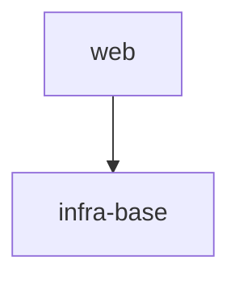

# S5 — восстановление спеки по коду для одного пути (портал живой)

Проверяет: router `LOGIC_SWITCH` ветку 2 (`recover-from-code` — портал live + оператор называет
конкретный путь), и внутри `recover-from-code` — порядок `AX_DOSED_SURVEY` (layout → manifest →
README/ADR → import edges → tests → deeper read) и что запись НЕ начинается до подтверждения развилки
оператором.

## Fixture

`package.json`:
```json
{
  "name": "demo-project",
  "version": "0.1.0",
  "scripts": {
    "typecheck": "tsc --noEmit",
    "test": "vitest run",
    "test:coverage": "vitest run --coverage",
    "lint": "gennady lint --all .",
    "format": "prettier --check ."
  }
}
```

`node_modules/.bin/gennady` (пустой файл):
```
```

`specs/README.md`:
```markdown
# demo-project

## Vision
Веб-клиент для чтения документов.

## Scope Graph



## Scopes

| Scope | Type | Spec | Description |
|---|---|---|---|
| [`infra-base`](./infra-base/infra-base.spec.md) | infrastructure | ✅ | TS + vitest |
| [`web`](./web/web.spec.md) | product | ✅ | React SPA — чтение документов |
```

Код без спеки — `src/parser/`, у `web` спека уже есть (`specs/web/web.spec.md`, минимальная —
достаточно для существования scope, содержимое не важно для этого сценария):

`specs/web/web.spec.md`:
```markdown
# Scope: web

<!--SECTION:VISION-->
## Vision
React SPA для чтения документов.
<!--/SECTION:VISION-->
```

`src/parser/lexer.ts`:
```typescript
export type Token = { kind: 'text' | 'heading'; value: string };

export function tokenize(input: string): Token[] {
  return input.split('\n').map((line) =>
    line.startsWith('#') ? { kind: 'heading', value: line } : { kind: 'text', value: line }
  );
}
```

`src/parser/render.ts`:
```typescript
import type { Token } from './lexer.ts';

export function render(tokens: Token[]): string {
  return tokens.map((t) => (t.kind === 'heading' ? `<h1>${t.value}</h1>` : `<p>${t.value}</p>`)).join('');
}
```

Никаких README/ADR внутри `src/parser/`, никаких тестов для него — сигнал для survey «нет
поведенческих доказательств кроме самого кода».

## Entry

Скилл: `/sdd`. Первая реплика оператора:

> Восстанови спецификацию по коду для `src/parser`.

## Operator Script

1. На развилку STEP_2_PROPOSE («завести `parser` как отдельный module внутри уже существующего
   `web` scope» ИЛИ «вынести в новый library-scope») — ответ: «заводи как модуль внутри web».

## Stop

Сразу после того, как оператор ответил на развилку STEP_2_PROPOSE (шаг 1 Operator Script) и агент
показал итоговую decision-card с зафиксированным scope fit (`web`, module `parser`) — ДО STEP_3_RECOVER
(до загрузки `scope.directive`/`module.directive` и до любой записи).

## Checkpoints

1. `STEP_0_INTAKE` прошёл оба гейта без halt: путь `src/parser` существует и содержит исходники
   (`H_PATH_NOT_FOUND` / `H_PATH_EMPTY` не сработали), портал `specs/README.md` присутствует
   (`H_NO_PORTAL` не сработал).
2. `sdd-state` вызван (без `--probe`) для получения текущего Scope Graph / Scopes table — «Also read
   the current portal's Scope Graph + Scopes table (`sdd-state`) — the survey needs the existing
   scopes to judge fit against» (часть STEP_1_SURVEY).
3. Порядок survey в трейсе (последовательность `note:`/чтений) соответствует `AX_DOSED_SURVEY`
   дословно: «directory listing and file names → package / workspace manifest (if any) → README /
   ADR / doc files sitting beside the path → import graph of the path's own files ... → test files
   ... → only then, if still unclear, a fuller read of the source». Для `src/parser` шаги
   README/ADR и tests дают пустой результат (файлов нет) — это ДОЛЖНО быть зафиксировано в трейсе как
   пройденный, а не пропущенный шаг (`note: нет README/ADR рядом с src/parser`, `note: нет тестов для
   src/parser`), а не молча проигнорировано.
4. Facts / Assumptions / Hypotheses разделены при представлении survey и предложения
   (`AX_EVIDENCE_HYGIENE`) — минимум одна `Hypothesis` (назначение `parser` для оператора можно
   только предположить, не прочитать).
5. Развилка (новый scope vs модуль внутри `web`) прошла через
   `READ_AND_USE_DIRECTIVE("ai/directives/sdd-v2/interview-protocol.directive.xml")` — в трейсе есть
   `directive: ai/directives/sdd-v2/interview-protocol.directive.xml loaded` МЕЖДУ STEP_1_SURVEY и
   финальным подтверждением, согласно: «Where the fit or the split is a genuine fork ... run it
   through READ_AND_USE_DIRECTIVE("ai/directives/sdd-v2/interview-protocol.directive.xml")».
6. `H_SCOPE_NOT_CONFIRMED` не сработал (оператор подтвердил, не отверг).
7. Ни одной строки `write:` в трейсе, и НИ `scope.directive.xml`, НИ `module.directive.xml` не
   загружены (это STEP_3_RECOVER, недостижим до стопа) — `gennady lint --spec=... --inventory-reverse`
   (STEP_4) тем более не вызван.
