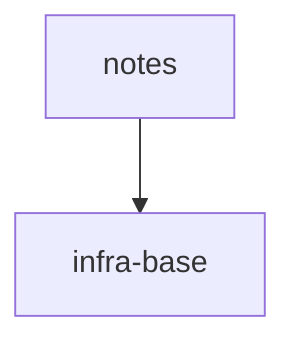
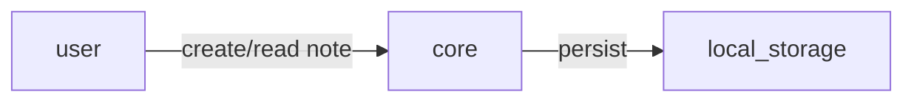

# S6 — скаффолдинг тикетов для одного модуля через `sdd-scaffold`

Проверяет: `scaffold.directive` создаёт тикет и индексы ЧЕРЕЗ `sdd-new` (никогда ручной `Write`
файла с нуля), проходит оба гейта (DAG-approval, test-plan-approval), и закрывается финальным
`sdd-check --all .` без новых error-находок.

Точка входа — отдельная дверь `/sdd-scaffold`, не роутер `/sdd` (per Mission `scaffold.directive`:
«A separate door (`/sdd-scaffold`), run in its own process»).

## Fixture

`package.json`:

```json
{
  "name": "demo-project",
  "version": "0.1.0",
  "scripts": {
    "typecheck": "tsc --noEmit",
    "test": "vitest run",
    "test:coverage": "vitest run --coverage",
    "lint": "gennady lint --all .",
    "format": "prettier --check ."
  }
}
```

`node_modules/.bin/gennady` (пустой файл):

```

```

`specs/README.md`:

````markdown
# demo-project

## Vision

Заметки с локальным хранением.

## Scope Graph


````

## Scopes

| Scope                                           | Type           | Spec | Description                   |
| ----------------------------------------------- | -------------- | ---- | ----------------------------- |
| [`infra-base`](./infra-base/infra-base.spec.md) | infrastructure | ✅   | TS + vitest + gennady lint    |
| [`notes`](./notes/notes.spec.md)                | product        | ✅   | Заметки с локальным хранением |

````

`specs/infra-base/infra-base.spec.md` (минимальная — только чтобы cascade STEP_1 нашёл эффективные
правила инфры; правил на неё вешать не нужно):
```markdown
# Scope: infra-base

<!--SECTION:VISION-->
## Vision
TS + vitest + gennady lint.
<!--/SECTION:VISION-->

<!--SECTION:EFFECTIVE_RULES-->
## Effective Rules
Нет активных правил сверх дефолтов тулчейна.
<!--/SECTION:EFFECTIVE_RULES-->
````

`specs/notes/notes.spec.md`:

````markdown
# Scope: notes

<!--SECTION:VISION-->

## Vision

Заметки с локальным хранением — без сети, без учётных записей.

<!--/SECTION:VISION-->

<!--SECTION:OVERVIEW-->

## Overview


````

<!--/SECTION:OVERVIEW-->

<!--SECTION:RULES-->

## Rules

Нет scope-специфичных правил сверх cascade инфры.

<!--/SECTION:RULES-->

<!--SECTION:BOOTSTRAP_REQUIREMENTS-->

## Bootstrap Requirements

| Requirement                              | Kind | Owner           | Resolution         |
| ---------------------------------------- | ---- | --------------- | ------------------ |
| Нет внешних зависимостей сверх toolchain | —    | this-scope-task | нечего бутстрапить |

<!--/SECTION:BOOTSTRAP_REQUIREMENTS-->

<!--SECTION:HANDOFF-->

## Handoff

Единственный модуль на старте — `core`. См. `specs/notes/core/core.spec.md`.

<!--/SECTION:HANDOFF-->

````

`specs/notes/core/core.spec.md`:
```markdown
# Module: core

<!--SECTION:MODULE_VISION-->
## Module Vision
Хранение и получение заметок. Родительский scope: `../../notes.spec.md`.
<!--/SECTION:MODULE_VISION-->

<!--SECTION:OVERVIEW-->
## Overview

```mermaid
flowchart LR
  caller -->|save/get| NoteStorePort
  NoteStorePort --> LocalNoteStoreAdapter
````

<!--/SECTION:OVERVIEW-->

<!--SECTION:MODULE_USAGE_EXAMPLE-->

## Module Usage Example

```typescript
const store = createLocalNoteStore();
store.save({ id: '1', text: 'привет' });
const note = store.get('1');
```

<!--/SECTION:MODULE_USAGE_EXAMPLE-->

<!--SECTION:INTER_MODULE_DEPENDENCIES-->

## Inter-Module Dependencies

- **Depends on:** нет (единственный модуль)
- **Provides to:** нет
<!--/SECTION:INTER_MODULE_DEPENDENCIES-->

<!--SECTION:ENTITY_INVENTORY-->

## Entity Inventory

| Name                    | Type    | Purpose                                            |
| ----------------------- | ------- | -------------------------------------------------- |
| `NoteStorePort`         | Port    | Абстракция хранения заметок                        |
| `LocalNoteStoreAdapter` | Adapter | Реализация NoteStorePort через локальное хранилище |

<!--/SECTION:ENTITY_INVENTORY-->

<!--SECTION:MODULE_CONTRACTS-->

## Module Contracts

Один Port (`NoteStorePort`) и один Adapter (`LocalNoteStoreAdapter`).

<!--/SECTION:MODULE_CONTRACTS-->

<!--SECTION:FILE_STRUCTURE-->

## File Structure

```
core/
├── ports/
│   └── note-store.port.ts
├── adapters/
│   └── local-note-store.adapter.ts
```

<!--/SECTION:FILE_STRUCTURE-->

<!--SECTION:HANDOFF-->

## Handoff to Tasks

- **Implementation files to be created:** `ports/note-store.port.ts`, `adapters/local-note-store.adapter.ts`
- **Test files to be created:** `adapters/local-note-store.adapter.test.ts`
- **Stack dependencies:**
  - Language: `typescript`
  - Test framework: `vitest`
- **Module Rules Additions:** None
<!--/SECTION:HANDOFF-->

```

Никаких тикетов и никаких `*.3-tasks.md` на диске ещё нет — mode должен определиться как `initial`.

## Entry

Скилл: `/sdd-scaffold`. Первая реплика оператора:

> Создай тикеты для notes/core.

## Operator Script

1. GATE 1 (STEP_2_DAG) — оператор одобряет breakdown (одна плита-тикет на модуль `core`, т.к. модуль
   один и весь его контент — один Port + один Adapter, co-edited): «да, разбивка ок».
2. GATE 2 (STEP_4_TEST_PLAN_REVIEW) — оператор одобряет тест-план (BDD-сценарии покрывают Vision,
   контракт `NoteStorePort` имеет typing-сценарий): «план тестов ок».

## Stop

Сразу после финального `sdd-check --all .` в STEP_5_FINALIZE (exit=0, без новых error-находок) —
после этого директива только отдаёт управление `execute` (изолированно, дешёвой моделью) и это уже
не часть сценария. Трейс заканчивается строкой `stop: per-map — <это условие дословно>` (не `halt:` —
остановка по карте, не директивный `H_*`-гейт).

## Checkpoints

1. `H_NO_SPECS` не сработал (`specs/README.md` присутствует, у `notes` есть спека).
2. Mode определён как `initial` (`AX_MODE_AUTO_DETECT_OR_HALT`) — нет существующих тикетов/трекеров
   для `notes/core`, значит не `extend-dag`.
3. `H_BOOTSTRAP_REQUIREMENTS_MISSING` не сработал — секция `Bootstrap Requirements` присутствует в
   `specs/notes/notes.spec.md` (даже как «нечего бутстрапить»).
4. STEP_2_DAG сформировал ровно ОДИН тикет на модуль `core` (per `AX_DAG_AND_TICKET_BOUNDARIES`:
   «Product / library scope → one ticket per module-spec»; Port + единственный подтверждённый v1
   Adapter co-edit — «A Port and its single confirmed-v1 Adapter co-edit and live in one ticket» —
   не два тикета).
5. GATE 1 — decision-card с DAG показан оператору (трейс содержит `show:`-строку, перечисляющую
   состав decision-card — тикет-на-модуль breakdown) и получено согласие ДО STEP_3_TASK_GENERATION
   (трейс: `operator:` строка на этом шаге предшествует любому `tool: sdd-new task ...`).
6. Тикет создан командой `sdd-new task --scope notes --module core --id <ACR>-<slug>` — ЕСТЬ строка
   `tool:` с этой командой; НЕТ строки `write:`, создающей файл тикета напрямую (Write-инструментом) —
   `sdd-new` «never overwrites and prints the section manifest», это единственный легальный путь
   создания файла тикета.
7. В тикете фазы `impl` и `test` разделены (`AX_PHASES_DECLARED_IN_HEADER`: «collapsing impl + test
   into one phase» — запрещено явно), и для контракта `NoteStorePort` есть `contract`-уровня typing
   BDD-сценарий (`AX_TICKET_HAS_BDD_AND_TESTS`) — иначе `H_TYPING_SCENARIO_MISSING`.
8. GATE 2 — тест-план показан как decision card (каждый сценарий с тегом `[NOTES-REQ-N]` или похожим,
   привязан к Vision), с `show:`-строкой в трейсе, перечисляющей показанные сценарии/теги, и получено
   согласие ДО STEP_5_FINALIZE.
9. Индексы созданы командами `sdd-new module-index --scope notes --module core` и `sdd-new
   scope-index --scope notes` (обе — `tool:` строки), не ручным `write:` с нуля.
10. Финальный `sdd-check --all .` — есть `tool:` строка с `exit=0`; никаких новых error-находок
    (`H_MISSING_RULE_FILE` / `H_ID_COLLISION` / `H_RULES_CYCLE` не сработали).
```
