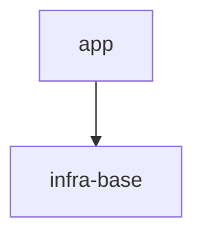

# S7 — полный контур `/sdd-execute`: план → фазы → аудит → code-review → summary

Проверяет: `execute.directive` целиком — `sdd-task` для плана, открытие Round через `sdd-log`,
диспетчеризацию фаз через `phase-execution-protocol` (каждая фаза читает строго по манифесту,
пишет только свой Target Files, гоняет верификацию, закрывается типизированным Handoff), закрытие
Round, `sdd-sync`, автоматический (не операторский) диспетч `audit.directive`, ветвление по
вердикту аудита, ленивый `code-review.directive` после PASS, и финальный оператору summary.
Отдельно проверяет различие `BLOCKED` ≠ `FAIL` (`AX_HALT_VS_FAIL_DISTINCTION`) и что audit
запускается «automatically», а не по команде оператора (`AX_AUDIT_HOOK`).

**Важно для Executor — одна сессия играет обе роли.** В этом прогоне нет отдельных субагентов:
Executor последовательно ИСПОЛНЯЕТ роль orchestrator (планирование, диспетч, синк, чтение
`execute.directive`) и роль worker (каждая фаза, чтение `phase-execution-protocol.directive.xml`),
затем роль audit-subagent и роль code-review-subagent — та же сессия, тот же контекст, роли не
изолированы реальной песочницей процесса. Изоляция ИМИТИРУЕТСЯ дисциплиной чтения: находясь в роли
worker, Executor читает СТРОГО по манифесту фазы (не заглядывает в чужие секции тикета), находясь в
роли audit — читает `git diff` + Handoff-артефакты, а не весь тикет с нуля. Каждая смена роли — своя
строка трейса: `note: role=orchestrator` / `note: role=worker P1` / `note: role=worker P2` /
`note: role=audit-subagent` / `note: role=code-review-subagent`, ПЕРЕД первым действием в этой роли.

## Fixture

Изолированная песочница — git-репозиторий (`git init`), фикстура коммитится как baseline ДО
запуска флоу (`git add -A && git commit -m fixture-baseline`) — `AX_GIT_DIFF_SCAN` аудита читает
`git diff` относительно этого коммита, значит baseline обязателен. Ниже `<GENNADY_WORKTREE>` —
абсолютный путь к worktree gennady, который выдаёт оркестратор (тот же, что и для
`npx tsx <worktree>/cli/gennady.ts`); подставить его и в `package.json`, и в ссылки `Rules:` тикета
— дословно, без переноса в другой чекаут.

`package.json`:

```json
{
  "name": "demo-project",
  "version": "0.1.0",
  "scripts": {
    "typecheck": "<GENNADY_WORKTREE>/node_modules/.bin/tsc --noEmit",
    "test": "node --import <GENNADY_WORKTREE>/node_modules/.bin/tsx --test src/app/greeting/*.test.ts",
    "test:coverage": "node --import <GENNADY_WORKTREE>/node_modules/.bin/tsx --test --experimental-test-coverage src/app/greeting/*.test.ts",
    "lint": "npx tsx <GENNADY_WORKTREE>/cli/gennady.ts lint --all .",
    "format": "<GENNADY_WORKTREE>/node_modules/.bin/prettier --check ."
  }
}
```

`tsconfig.json`:

```json
{
  "compilerOptions": {
    "target": "ES2022",
    "module": "NodeNext",
    "moduleResolution": "NodeNext",
    "strict": true,
    "noEmit": true,
    "skipLibCheck": true
  },
  "include": ["src"]
}
```

`.prettierrc.json`: `{ "semi": true, "singleQuote": true }`

`node_modules/.bin/gennady` (пустой файл — то же соглашение, что в S1/S6: `sdd-state`-гейт
readiness проверяет только наличие; сам `lint` реально бьёт в `<GENNADY_WORKTREE>/cli/gennady.ts`
через `npx tsx`, не в этот стаб):

```

```

`specs/README.md`:

````markdown
# demo-project

## Vision

Сервис приветствий.

## Scope Graph


````

## Scopes

| Scope                                           | Type           | Spec | Description                   |
| ----------------------------------------------- | -------------- | ---- | ----------------------------- |
| [`infra-base`](./infra-base/infra-base.spec.md) | infrastructure | ✅   | TS + node:test + gennady lint |
| [`app`](./app/app.spec.md)                      | product        | ✅   | Сервис приветствий            |

````

`specs/app/app.spec.md`:
```markdown
# Scope: app

<!--SECTION:VISION-->
## Vision
Приветствие пользователя по имени.
<!--/SECTION:VISION-->

<!--SECTION:OVERVIEW-->
## Overview
```mermaid
flowchart LR
  caller -->|greet name| core
````

<!--/SECTION:OVERVIEW-->

<!--SECTION:RULES-->

## Rules

Нет scope-специфичных правил сверх cascade инфры.

<!--/SECTION:RULES-->

<!--SECTION:BOOTSTRAP_REQUIREMENTS-->

## Bootstrap Requirements

| Requirement                              | Kind | Owner           | Resolution         |
| ---------------------------------------- | ---- | --------------- | ------------------ |
| Нет внешних зависимостей сверх toolchain | —    | this-scope-task | нечего бутстрапить |

<!--/SECTION:BOOTSTRAP_REQUIREMENTS-->

<!--SECTION:HANDOFF-->

## Handoff

Единственный модуль — `greeting`. См. `specs/app/greeting/greeting.spec.md`.

<!--/SECTION:HANDOFF-->

````

`specs/app/app.3-tasks.md`:
```markdown
# app — Tasks

## Cascade Table
| Tier | Source |
|---|---|
| target-scope | specs/app/app.spec.md — Rules (нет активных) |

## Tracker Index
| Task-ID | Title | Dependencies | Status | Reopens |
|---|---|---|---|---|
| APP-greet-greeting | Приветствие по имени | — | [ ] TODO | — |
````

`specs/app/greeting/greeting.spec.md`:

````markdown
# Module: greeting

<!--SECTION:MODULE_VISION-->

## Module Vision

Формирует приветствие по имени. Родительский scope: `../../app.spec.md`.

<!--/SECTION:MODULE_VISION-->

<!--SECTION:OVERVIEW-->

## Overview

```mermaid
flowchart LR
  caller -->|greet name| GreeterPort
  GreeterPort --> EchoGreeterAdapter
```
````

<!--/SECTION:OVERVIEW-->

<!--SECTION:MODULE_USAGE_EXAMPLE-->

## Module Usage Example

```typescript
const greeter: GreeterPort = new EchoGreeterAdapter();
greeter.greet('Alice'); // 'Привет, Alice!'
```

<!--/SECTION:MODULE_USAGE_EXAMPLE-->

<!--SECTION:INTER_MODULE_DEPENDENCIES-->

## Inter-Module Dependencies

- **Depends on:** нет (единственный модуль)
- **Provides to:** нет
<!--/SECTION:INTER_MODULE_DEPENDENCIES-->

<!--SECTION:ENTITY_INVENTORY-->

## Entity Inventory

_Это полный список сущностей модуля. Любое введение сущности execution-агентом помимо этого списка считается drift'ом и требует обновления spec._

| Name                 | Type    | Purpose                                                   |
| -------------------- | ------- | --------------------------------------------------------- |
| `GreeterPort`        | Port    | Абстракция формирования приветствия по имени              |
| `EchoGreeterAdapter` | Adapter | Реализация GreeterPort — синхронное форматирование строки |

<!--/SECTION:ENTITY_INVENTORY-->

<!--SECTION:MODULE_CONTRACTS-->

## Module Contracts

#### Port: `GreeterPort`

- **Purpose:** Формирует приветственную строку по имени.
- **Consumers:** internal: `src/app/greeting/echo-greeter.adapter.ts`
- **Runtime Backing:** `real-runtime`
- **Verification Levels:** `contract`, `unit`
- **Deferred Runtime Scope:** None

**Contract (DbC):**

- Preconditions:
  - `name` — непустая строка после `trim()`
- Postconditions:
  - результат содержит `name` и начинается с «Привет, »
- Invariants:
  - вызов не имеет побочных эффектов

#### Adapter: `EchoGreeterAdapter`

- **Implements:** `GreeterPort` (`src/app/greeting/greeter.port.ts`)
- **Purpose:** Синхронно форматирует строку приветствия.
- **Runtime Backing:** `real-runtime`
- **Verification Levels:** `contract`, `unit`
- **Deferred Runtime Scope:** None

**Side Effects:**

- нет — чистая функция
<!--/SECTION:MODULE_CONTRACTS-->

<!--SECTION:FILE_STRUCTURE-->

## File Structure

```
src/app/greeting/
├── greeter.port.ts
├── echo-greeter.adapter.ts
└── echo-greeter.adapter.test.ts
```

<!--/SECTION:FILE_STRUCTURE-->

<!--SECTION:HANDOFF-->

## Handoff to Tasks

- **Implementation files to be created:** `greeter.port.ts`, `echo-greeter.adapter.ts`
- **Test files to be created:** `echo-greeter.adapter.test.ts`
- **Stack dependencies:**
  - Language: `typescript`
  - Test framework: `node:test`
- **Module Rules Additions:** None
<!--/SECTION:HANDOFF-->

````

`specs/app/greeting/greeting.3-tasks.md`:
```markdown
# greeting — Tasks

## Tracker Index
| Task-ID | Title | Dependencies | Status | Reopens |
|---------|-------|--------------|--------|---------|
| APP-greet-greeting | Приветствие по имени | — | [ ] TODO | — |

## Slug Registry
- greet-greeting

## Intra-Module DAG
```mermaid
graph TD
  A[greet-greeting]
````

## Decision Log (module-task level)

Нет.

## Conventions

Project-wide conventions declared once in `specs/3-tasks.md`.

````

`specs/3-tasks.md`:
```markdown
# Project — Tasks

## Scopes
| Scope | Type | Tasks | Progress |
|---|---|---|---|
| app | product | [3-tasks](./app/app.3-tasks.md) | 0/1 |

## Conventions
Execution-Log token vocabulary: `intro` / `yagni` / `decision` / `tried` / `discovery` / `insight` /
`verified` / `ver` / `DONE`. Baseline Completion Rule: `sdd-verify --profile <kind>` + ticket §5
commands green. Post-task audit hook: mandatory (`AX_AUDIT_HOOK`). File header: `@file` / `@consumers`
/ `@tasks`.
````

Готовый тикет — `specs/app/greeting/greeting.task.APP-greet-greeting.md` (Status `[ ] TODO`,
Execution Log пуст — ни одна фаза ещё не запускалась, ни один файл `src/` ещё не существует):

```markdown
# Task: APP-greet-greeting — Приветствие по имени

<!--SECTION:META-->

## Meta

- **Task-ID:** APP-greet-greeting
- **Status:** [ ] TODO
- **Purpose:** Сформировать приветствие по имени через GreeterPort/EchoGreeterAdapter
- **Scope:** app
- **Module:** greeting
- **Dependencies:** None
- **Spec References:**
  - Contract: [GreeterPort](../greeting/greeting.spec.md#module-contracts)
  - Adapter: [EchoGreeterAdapter](../greeting/greeting.spec.md#module-contracts)
- **Runtime Backing:** `real-runtime`
- **Verification Levels:** `contract`, `unit`
- **Deferred Runtime Scope:** None
<!--/SECTION:META-->

<!--SECTION:PHASES_OVERVIEW-->

## Phases Overview

| ID  | Kind | Deps | Status |
| --- | ---- | ---- | ------ |
| P1  | impl | —    | [ ]    |
| P2  | test | P1   | [ ]    |

<!--/SECTION:PHASES_OVERVIEW-->

## Phases

<!--SECTION:PHASE_P1-->

### P1 — impl

- **Objective:** Создать `GreeterPort` и `EchoGreeterAdapter` (метод `greet(name: string): string`).
- **Rules:**
  - [ai/directives/coding/typescript-rules.xml](<GENNADY_WORKTREE>/ai/directives/coding/typescript-rules.xml)
- **Target Files:**
  - src/app/greeting/greeter.port.ts
  - src/app/greeting/echo-greeter.adapter.ts
- **Inputs:** none
- **Exit:** `tsc --noEmit` проходит; `EchoGreeterAdapter` присваивается типу `GreeterPort`.
<!--/SECTION:PHASE_P1-->

<!--SECTION:PHASE_P2-->

### P2 — test

- **Objective:** Покрыть тестами BDD-сценарии (unit + contract typing).
- **Rules:**
  - [ai/directives/testing/node-test.xml](<GENNADY_WORKTREE>/ai/directives/testing/node-test.xml)
- **Target Files:**
  - src/app/greeting/echo-greeter.adapter.test.ts
- **Inputs:** P1 handoff
- **Exit:** `node --test` — все 3 сценария зелёные.
<!--/SECTION:PHASE_P2-->

<!--SECTION:BDD-->

## Acceptance Criteria (BDD)

**Feature:** EchoGreeterAdapter формирует приветствие по имени

**Scenario:** greets a non-empty name [`unit`] [APP-REQ-1]

- **Given** имя "Alice"
- **When** вызван `greet(name)`
- **Then** возвращена строка "Привет, Alice!"

**Scenario:** rejects an empty name [`unit`] [APP-REQ-1]

- **Given** пустая строка ""
- **When** вызван `greet(name)`
- **And** выбрасывается ошибка

**Scenario:** EchoGreeterAdapter satisfies GreeterPort [`contract`] [APP-REQ-1]

- **Given** экспортированный экземпляр `EchoGreeterAdapter`
- **When** он присвоен переменной типа `GreeterPort`
- **Then** TypeScript принимает присвоение на этапе компиляции
<!--/SECTION:BDD-->

<!--SECTION:VERIFICATION-->

## Verification

| Command                 | Required by                               |
| ----------------------- | ----------------------------------------- |
| `npm run typecheck`     | ai/directives/coding/typescript-rules.xml |
| `npm run test`          | ai/directives/testing/node-test.xml       |
| `npm run test:coverage` | ai/directives/testing/node-test.xml       |
| `npm run lint`          | ai/directives/coding/typescript-rules.xml |
| `npm run format`        | ai/directives/coding/typescript-rules.xml |

- **Task-specific Completion additions:** none beyond project baseline.
<!--/SECTION:VERIFICATION-->

<!--SECTION:TEST_COVERAGE-->

## Test Scenario Coverage

- Scenario greets a non-empty name → `src/app/greeting/echo-greeter.adapter.test.ts` :: `greets a non-empty name`
- Scenario rejects an empty name → `src/app/greeting/echo-greeter.adapter.test.ts` :: `rejects an empty name`
- Scenario EchoGreeterAdapter satisfies GreeterPort → `src/app/greeting/echo-greeter.adapter.test.ts` :: `EchoGreeterAdapter satisfies GreeterPort`
<!--/SECTION:TEST_COVERAGE-->

<!--SECTION:EXECUTION_LOG-->

## Execution Log

<!--/SECTION:EXECUTION_LOG-->

<!--SECTION:DECISION_LOG-->

## Decision Log

<!--/SECTION:DECISION_LOG-->
```

## Entry

Скилл: `/sdd-execute`. Первая реплика оператора:

> Выполни APP-greet-greeting.

## Operator Script

`execute` — автономный контур (`AX_AUDIT_HOOK`: «operator does not invoke audit manually»); в
штатном прогоне этой фикстуры нет ни одной обязательной остановки к оператору — ни `H_*`, ни
`## Stop` карты. Скрипт держит ОДИН запасной ответ на случай непредвиденной паузы:

1. Если агент всё же остановится и спросит оператора (например, `H_PAUSED_AWAITING_OPERATOR` из-за
   расхождения, которого фикстура не должна провоцировать) — ответ: «продолжай, блокера нет,
   перепроверь и продолжи выполнение». Это НЕ ожидаемый путь — попадание в этот ответ само по себе
   находка для Verifier (см. «Импровизации» в `PROTOCOL.md`), а не штатная ветка карты.

## Stop

Сразу после того, как code-review вернул `CLEAN` (STEP*7B_CODE_REVIEW) и orchestrator показал
финальный `EXECUTE_SUMMARY_FORMAT` (STEP_8_SUMMARY). Прогон НЕ уходит дальше — возврат управления
оператору после summary уже не часть сценария. Трейс заканчивается строкой
`stop: per-map — <это условие дословно>` (не `halt:` — остановка по карте, не директивный
`H*\*`-гейт).

## Checkpoints

1. STEP_0_RESOLVE: первый вызов — `sdd-task` БЕЗ Task-ID, за детерминированной картой исполнения —
   «FIRST run `sdd-task` (no Task-ID) for the deterministic execution map — the pickable set
   ... and the blocked tickets» — до этого нет ни одного `tool:` с конкретным `sdd-task
APP-greet-greeting`.
2. `LogicSwitch on="intent"` в STEP_0_RESOLVE сработал по ветке «WHEN intent is a specific Task-ID /
   ticket path -> run that ticket (STEP_1–8)» — оператор назвал конкретный Task-ID, значит НЕ
   ветка `next`/`pick`, НЕ `batch`/`all`/`queue`.
3. STEP_1_PLAN: единственное чтение тикета — `sdd-task APP-greet-greeting` («one tool call, no
   broad ticket read»), возвращающее Meta + Phases Overview + per-phase read-manifests + gates;
   preflight blocker scan через `sdd-check` (`AX_BLOCKER_RESOLUTION_TRAIL`); Round открыт через
   `sdd-log` — есть `tool:`-строка с этой командой ДО диспетча P1. Состояние по Phases Overview —
   все `[ ]` → «fresh (all phases by `Deps`)», не resume/audit-only/pause.
4. Смена роли на worker перед P1 зафиксирована строкой `note: role=worker P1` (или аналогичной,
   дословно называющей роль и фазу), и загрузка `ai/directives/sdd-v2/phase-execution-protocol.directive.xml`
   отражена строкой `directive: ... loaded` — per Mission phase-execution-protocol: «A worker
   directive — runs in isolation on a cheaper model».
5. Worker P1 читает СТРОГО по манифесту фазы (`AX_READ_PER_MANIFEST`: «read EXACTLY that, nothing
   beyond it») — в трейсе нет чтения секций тикета за пределами Meta/Phases Overview/P1-блока/gates
   до момента, когда P1 обращается к ним по манифесту; нет чтения `PHASE_P2` до его собственного
   диспетча.
6. STEP_2_NARROW_RECON (P1): recon-строка появляется в трейсе ТОЛЬКО если есть расхождение
   (`AX_NARROW_RECON`: «log a recon line ONLY on divergence; when state matches the plan, stay
   silent») — поскольку `src/app/greeting/` пуст и это ожидаемо (Target Files ещё не существуют,
   так и заявлено манифестом P1), молчание — норма, не находка.
7. P1 открывает ТОЛЬКО правило, перечисленное в его собственном `Rules:` — `typescript-rules.xml`
   (`AX_RULES_LOAD_FROM_PHASE_BLOCK`: «Open ONLY rule files listed under this phase's `Rules:` bullet
   list»); `node-test.xml` (правило фазы P2) не загружается на P1.
8. P1 пишет ТОЛЬКО `src/app/greeting/greeter.port.ts` и `echo-greeter.adapter.ts` (`AX_PHASE_SCOPE_LOCK`:
   «Touch only this phase's `Target Files`»; `H_OUT_OF_PHASE_WRITE` не сработал) — нет `write:` под
   `echo-greeter.adapter.test.ts` на P1.
9. Оба новых файла P1 получают заголовок `@file` / `@consumers` / `@tasks: APP-greet-greeting`
   (`AX_FILE_HEADER_APPEND_ONLY`: «New file: create header with all three»).
10. P1 STEP_5_VERIFY: сначала `sdd-verify --profile code` (per Phase-execution `AX_VERIFICATION_BEFORE_HANDOFF`
    / STEP_5: «Profile by phase kind: `impl` / ... → `code` (format · lint · typecheck — a code phase
    skips tests)»), затем `gennady lint --spec=specs/app/greeting/greeting.spec.md <Target Files>`, ЗАТЕМ
    каждая команда §5 **verbatim** — точная строка из тикета (`npm run typecheck`, `npm run lint`,
    `npm run format`), с логом `ver <cmd> → pass exit=<N>` per `AX_VERIFICATION_BEFORE_HANDOFF`: «the
    log line `ver <cmd>` MUST be the exact string of the command that was actually executed». `npm run
test` / `npm run test:coverage` НЕ входят в P1-профиль `code` («a code phase skips tests») —
    отсутствие их `ver`-строк на P1 — ожидаемо, не находка.
11. P1 закрывается `**Handoff →** artifacts: [...]; decisions: [...]; open: [...]` (`AX_HANDOFF_TYPED`
    / `HANDOFF_FORMAT`) — свободная проза вместо типизированной строки запрещена; Phases Overview
    `[ ]` → `[x]` для P1 (`AX_TICKET_WRITE_SCOPE`: «`Phases Overview` Status column for THIS phase ID
    only»).
12. STEP_2_DISPATCH ветка `LogicSwitch on="worker Handoff status"` — P1 вернул `DONE` → «record
    Handoff, thread it into the next phase's Inputs» — P2 диспетчится ТОЛЬКО после появления P1
    Handoff в текущем Round (`AX_EXECUTION_ORDER`: «a phase starts only after every phase it depends
    on reaches `[x] DONE`»; `H_INPUT_HANDOFF_MISSING` не сработал), Inputs P2 = P1 Handoff verbatim.
13. P2 STEP_5_VERIFY использует профиль `test` (STEP_5: «`test` → `test` (format · typecheck ·
    test:coverage)») — четыре команды §5, покрывающие этот профиль (`npm run typecheck`, `npm run
test`, `npm run test:coverage`, `npm run format`), логируются `ver`; `AX_BDD_NAME_DISCIPLINE`:
    канонические имена сценариев из Test Scenario Coverage использованы verbatim как имена test-кейсов
    (`greets a non-empty name`, `rejects an empty name`, `EchoGreeterAdapter satisfies GreeterPort`).
14. STEP_3_CLOSE_ROUND: `sdd-log` вызван для Round close (`ROUND_CLOSE_FORMAT`), Meta Status →
    `[x] DONE` — обе строки после P2 `DONE`, не раньше.
15. STEP_4_SYNC: `tool: sdd-sync APP-greet-greeting` — «updates the scope + project trackers and
    verifies the write».
16. STEP_5_AUDIT — смена роли `note: role=orchestrator` → `note: role=audit-subagent`; диспетч
    произошёл БЕЗ вопроса оператору (`AX_AUDIT_HOOK`: «`sdd-execute` orchestrator dispatches
    audit-subagent automatically after the last phase of a Round closes — operator does not invoke
    audit manually») — в трейсе между Round close и появлением `directive: ai/directives/sdd-v2/audit.directive.xml
loaded` нет ни одной строки `operator:`/`ask:`.
17. Audit STEP_1_MECHANICAL: `sdd-check --task <ticket-path>` взят «as given», ЗАТЕМ независимый
    повторный прогон гейта — «INDEPENDENTLY re-run the green gate — `sdd-verify --profile full`,
    `gennady lint --spec=<module-spec>` ..., and `gennady testcov --run --min=80`» — все три вызова
    есть как отдельные `tool:`-строки на audit-роли, а не переиспользование `ver`-строк, логированных
    воркерами P1/P2 (`AX_MECHANICAL_VIA_SDD_CHECK` / STEP_1_MECHANICAL: «Always re-derive the gate
    yourself rather than trust the worker's logged `ver` lines»).
18. Audit STEP_2_SEMANTIC: closed-world sweep выполнен ПЕРВЫМ (`AX_CLOSED_WORLD_PRIMARY_CHECK` /
    STEP_2: «Run the closed-world inventory sweep FIRST») — сверка `GreeterPort` + `EchoGreeterAdapter`
    против Entity Inventory находит их присутствующими (нет `CLOSED_WORLD_DRIFT`, оба объявлены
    заранее — не через `intro`-строку).
19. Вердикт аудита `PASS` (или `PASS_WITH_ACKNOWLEDGED_RISKS`) → `LogicSwitch on="audit verdict +
attempt"` в STEP_6_BRANCH сработал по ветке «-> STEP_7B_CODE_REVIEW» — НЕ `STEP_7_RESOLVE` (нет
    повторного Round `fix`, нет второго вызова audit R2 в трейсе).
20. STEP_7B_CODE_REVIEW диспетчится «lazy, after the audit passes» — смена роли
    `note: role=code-review-subagent` появляется ПОСЛЕ строки с вердиктом audit `PASS`, не до неё;
    загрузка `ai/directives/sdd-v2/code-review.directive.xml` отражена `directive: ... loaded`.
21. Code-review читает `git diff` Round'а, а не весь тикет с нуля (`STEP_1_READ_DIFF`: «Read the
    Round's git diff ... and the changed files, plus the contract anchors») — в трейсе есть `tool:`
    строка с `git diff` на этой роли (легитимно: `AX_PERMITTED_BASH_COMMANDS` резервирует `git diff`
    за шагом, которому оно принадлежит, и audit/code-review — тот шаг).
22. Вердикт code-review `CLEAN` → «`CLEAN` → STEP_8» (не `H_CODE_REVIEW_BLOCKER`, поскольку в
    фикстуре нет умышленного бага) — в трейсе нет строки `halt: H_CODE_REVIEW_BLOCKER`.
23. STEP_8_SUMMARY показан оператору как `EXECUTE_SUMMARY_FORMAT` — трейс содержит `show:`-строку,
    перечисляющую состав итога (Round-таблица фаз, вердикт audit, вердикт финальный, файлы,
    проблемы) — без неё этот чекпоинт непроверяем.
24. Ни разу не спутаны `halt:` и `stop:` — единственный `halt:` в этом прогоне мог быть только
    настоящим `H_*` из `execute.directive`/`phase-execution-protocol` (например
    `H_PAUSED_AWAITING_OPERATOR`), и в штатном (безошибочном) исполнении фикстуры такого `halt:` НЕТ
    вовсе — прогон закрывается единственной строкой `stop: per-map — ...` в самом конце, что
    отдельно подтверждает `AX_HALT_VS_FAIL_DISTINCTION`: «Halt is NOT failure ... A skill or phase
    that stops awaiting operator decision is in a PAUSED state, not a FAILED state» — в этой карте
    ни PAUSED, ни FAILED не должны возникнуть, раз фикстура собрана без блокеров.
