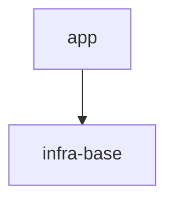
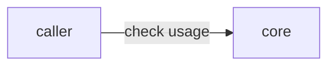
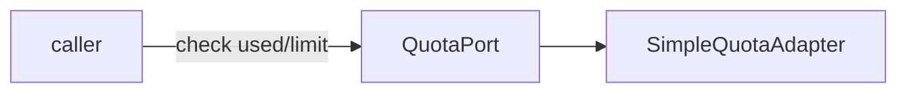

# S8 — тривиальный fix через `/sdd-reconcile`: короткое замыкание в STEP_2B_CLASSIFY

Проверяет: `reconcile.directive` в mode=`fix` доходит до `STEP_2B_CLASSIFY`, пробник `STEP_2_PROBE`
подтверждает тривиальный класс (single site, пустой blast radius, контракты/спеки не затронуты), и
`LogicSwitch on="fix class"` срабатывает по ПЕРВОЙ ветке — короткое замыкание прямо внутри
`STEP_2B_CLASSIFY`: патч кода, `sdd-sync`, лёгкий гейт (typecheck + тесты только затронутых файлов),
`FIX_SUMMARY_FORMAT` — и весь хвост (`STEP_3_PLAN`…`STEP_7_VERIFY`, аудит + code-review над reconciled
set, реопен тикета) остаётся недостигнутым. Отдельно проверяет, что `STEP_6_SYNC` как отдельный шаг НЕ пройден
(тот же инструмент `sdd-sync` вызывается, но как часть действия `STEP_2B_CLASSIFY`, а не как переход
`step: STEP_6_SYNC`).

Точка входа — отдельная дверь `/sdd-reconcile`, не роутер `/sdd`.

## Fixture

Изолированная песочница — git-репозиторий (`git init`), фикстура коммитится как baseline ДО запуска
флоу (`git add -A && git commit -m fixture-baseline`). Баг живёт в самом baseline — это уже
существующий код, о котором сейчас сообщает оператор; диф появится только от собственного патча
шага STEP_2B (до этого момента `git diff` пуст, что и предписывает `AX_SPEC_IS_SOLE_SOURCE`/
`STEP_1_PICTURE`: диф читается как часть картины, но с чистым деревом это законный «нет
предшествующих правок»). Ниже `<GENNADY_WORKTREE>` — абсолютный путь к worktree gennady, который
выдаёт оркестратор; подставить его дословно везде, где он встречается.

`package.json`:

```json
{
  "name": "demo-project",
  "version": "0.1.0",
  "scripts": {
    "typecheck": "<GENNADY_WORKTREE>/node_modules/.bin/tsc --noEmit",
    "test": "node --import <GENNADY_WORKTREE>/node_modules/tsx/dist/loader.mjs --test src/app/quota/*.test.ts",
    "lint": "npx tsx <GENNADY_WORKTREE>/cli/gennady.ts lint --all ."
  }
}
```

`tsconfig.json` (`allowImportingTsExtensions` — фикстура импортирует `.ts` без транспиляции;
`types: []` — не опираться на `@types/node`, фикстура не проходила `npm install`; `exclude` —
`node:test`/`node:assert` в тест-файлах типизирует ЛИШЬ окружение прогона тестов через
`node --import tsx`, а не `tsc`; без `exclude` тест-файл валит typecheck `TS2307` на `node:test`
и `TS5097` на `.ts`-импорт. Форма проверена живым прогоном `npm run typecheck` в
scratch-времянке — `exit=0`):

```json
{
  "compilerOptions": {
    "target": "ES2022",
    "module": "NodeNext",
    "moduleResolution": "NodeNext",
    "strict": true,
    "noEmit": true,
    "skipLibCheck": true,
    "allowImportingTsExtensions": true,
    "types": []
  },
  "include": ["src"],
  "exclude": ["**/*.test.ts"]
}
```

`node_modules/.bin/gennady` (пустой файл — тот же стаб-конвенция, что в S1/S6/S7):

```

```

`specs/README.md`:

````markdown
# demo-project

## Vision

Сервис проверки лимитов использования.

## Scope Graph


````

## Scopes

| Scope                                           | Type           | Spec | Description                    |
| ----------------------------------------------- | -------------- | ---- | ------------------------------ |
| [`infra-base`](./infra-base/infra-base.spec.md) | infrastructure | ✅   | TS + node:test + gennady lint  |
| [`app`](./app/app.spec.md)                      | product        | ✅   | Проверка лимитов использования |

````

`specs/infra-base/infra-base.spec.md`:
```markdown
# Scope: infra-base

<!--SECTION:VISION-->
## Vision
TS + node:test + gennady lint.
<!--/SECTION:VISION-->

<!--SECTION:EFFECTIVE_RULES-->
## Effective Rules
Нет активных правил сверх дефолтов тулчейна.
<!--/SECTION:EFFECTIVE_RULES-->
````

`specs/app/app.spec.md`:

````markdown
# Scope: app

<!--SECTION:VISION-->

## Vision

Проверяет, укладывается ли использование в лимит.

<!--/SECTION:VISION-->

<!--SECTION:OVERVIEW-->

## Overview


````

<!--/SECTION:OVERVIEW-->

<!--SECTION:RULES-->

## Rules

Нет scope-специфичных правил сверх cascade инфры.

<!--/SECTION:RULES-->

<!--SECTION:BOOTSTRAP_REQUIREMENTS-->

## Bootstrap Requirements

| Requirement                              | Kind | Owner           | Resolution         |
| ---------------------------------------- | ---- | --------------- | ------------------ |
| Нет внешних зависимостей сверх toolchain | —    | this-scope-task | нечего бутстрапить |

<!--/SECTION:BOOTSTRAP_REQUIREMENTS-->

<!--SECTION:HANDOFF-->

## Handoff

Единственный модуль — `quota`. См. `specs/app/quota/quota.spec.md`.

<!--/SECTION:HANDOFF-->

````

`specs/app/app.3-tasks.md`:

```markdown
# app — Tasks

## Cascade Table
| Tier | Source |
|---|---|
| target-scope | specs/app/app.spec.md — Rules (нет активных) |

## Tracker Index
| Task-ID | Title | Dependencies | Status | Reopens |
|---|---|---|---|---|
| APP-check-quota | Проверка лимита использования | — | [x] DONE | — |
````

`specs/app/quota/quota.spec.md`:

````markdown
# Module: quota

<!--SECTION:MODULE_VISION-->

## Module Vision

Проверяет, укладывается ли использование в заданный лимит. Родительский scope: `../../app.spec.md`.

<!--/SECTION:MODULE_VISION-->

<!--SECTION:OVERVIEW-->

## Overview


````

<!--/SECTION:OVERVIEW-->

<!--SECTION:MODULE_USAGE_EXAMPLE-->

## Module Usage Example

```typescript
const quota: QuotaPort = new SimpleQuotaAdapter();
quota.isWithinLimit(10, 10); // true — на лимите ещё разрешено
```

<!--/SECTION:MODULE_USAGE_EXAMPLE-->

<!--SECTION:INTER_MODULE_DEPENDENCIES-->

## Inter-Module Dependencies

- **Depends on:** нет (единственный модуль)
- **Provides to:** нет
<!--/SECTION:INTER_MODULE_DEPENDENCIES-->

<!--SECTION:ENTITY_INVENTORY-->

## Entity Inventory

_Это полный список сущностей модуля. Любое введение сущности execution-агентом помимо этого списка считается drift'ом и требует обновления spec._

| Name                 | Type    | Purpose                                                    |
| -------------------- | ------- | ---------------------------------------------------------- |
| `QuotaPort`          | Port    | Абстракция проверки, укладывается ли использование в лимит |
| `SimpleQuotaAdapter` | Adapter | Реализация QuotaPort через прямое сравнение чисел          |

<!--/SECTION:ENTITY_INVENTORY-->

<!--SECTION:MODULE_CONTRACTS-->

## Module Contracts

#### Port: `QuotaPort`

- **Purpose:** Проверяет, укладывается ли использование в лимит.
- **Consumers:** internal: `src/app/quota/simple-quota.adapter.ts`
- **Runtime Backing:** `real-runtime`
- **Verification Levels:** `contract`, `unit`
- **Deferred Runtime Scope:** None

**Contract (DbC):**

- Preconditions:
  - `used` и `limit` — неотрицательные целые числа
- Postconditions:
  - результат `true`, если и только если `used` меньше или равно `limit` — использование ровно на лимите разрешено
- Invariants:
  - вызов не имеет побочных эффектов

#### Adapter: `SimpleQuotaAdapter`

- **Implements:** `QuotaPort` (`src/app/quota/quota.port.ts`)
- **Purpose:** Сравнивает used и limit напрямую.
- **Runtime Backing:** `real-runtime`
- **Verification Levels:** `contract`, `unit`
- **Deferred Runtime Scope:** None

**Side Effects:**

- нет — чистая функция
<!--/SECTION:MODULE_CONTRACTS-->

<!--SECTION:FILE_STRUCTURE-->

## File Structure

```
src/app/quota/
├── quota.port.ts
├── simple-quota.adapter.ts
└── simple-quota.adapter.test.ts
```

<!--/SECTION:FILE_STRUCTURE-->

<!--SECTION:HANDOFF-->

## Handoff to Tasks

- **Implementation files to be created:** `quota.port.ts`, `simple-quota.adapter.ts`
- **Test files to be created:** `simple-quota.adapter.test.ts`
- **Stack dependencies:**
  - Language: `typescript`
  - Test framework: `node:test`
- **Module Rules Additions:** None
<!--/SECTION:HANDOFF-->

````

`specs/app/quota/quota.3-tasks.md`:

```markdown
# quota — Tasks

## Tracker Index
| Task-ID | Title | Dependencies | Status | Reopens |
|---------|-------|--------------|--------|---------|
| APP-check-quota | Проверка лимита использования | — | [x] DONE | — |

## Slug Registry
- check-quota

## Intra-Module DAG
```mermaid
graph TD
  A[check-quota]
````

## Decision Log (module-task level)

Нет.

## Conventions

Project-wide conventions declared once in `specs/3-tasks.md`.

````

`specs/3-tasks.md`:

```markdown
# Project — Tasks

## Scopes
| Scope | Type | Tasks | Progress |
|---|---|---|---|
| app | product | [3-tasks](./app/app.3-tasks.md) | 1/1 |

## Conventions
Execution-Log token vocabulary: `intro` / `yagni` / `decision` / `tried` / `discovery` / `insight` /
`verified` / `ver` / `DONE`. Baseline Completion Rule: `sdd-verify --profile <kind>` + ticket §5
commands green. Audit/code-review hook: per-group, mandatory once the group's last ticket closes
(`AX_AUDIT_HOOK`). File header: `@file` / `@consumers`
/ `@tasks`.
````

Готовый тикет — `specs/app/quota/quota.task.APP-check-quota.md` (Status `[x] DONE`, один Round, обе
фазы DONE, Handoff присутствует на каждой фазе):

```markdown
# Task: APP-check-quota — Проверка лимита использования

<!--SECTION:META-->

## Meta

- **Task-ID:** APP-check-quota
- **Status:** [x] DONE
- **Purpose:** Реализовать QuotaPort/SimpleQuotaAdapter — проверку, укладывается ли использование в лимит
- **Scope:** app
- **Module:** quota
- **Dependencies:** None
- **Spec References:**
  - Contract: [QuotaPort](../quota/quota.spec.md#module-contracts)
  - Adapter: [SimpleQuotaAdapter](../quota/quota.spec.md#module-contracts)
- **Runtime Backing:** `real-runtime`
- **Verification Levels:** `contract`, `unit`
- **Deferred Runtime Scope:** None
- **Reopens:** —
<!--/SECTION:META-->

<!--SECTION:PHASES_OVERVIEW-->

## Phases Overview

| ID  | Kind | Deps | Status |
| --- | ---- | ---- | ------ |
| P1  | impl | —    | [x]    |
| P2  | test | P1   | [x]    |

<!--/SECTION:PHASES_OVERVIEW-->

## Phases

<!--SECTION:PHASE_P1-->

### P1 — impl

- **Objective:** Создать `QuotaPort` и `SimpleQuotaAdapter` (метод `isWithinLimit(used: number, limit: number): boolean`).
- **Rules:**
  - [ai/directives/coding/typescript-rules.xml](<GENNADY_WORKTREE>/ai/directives/coding/typescript-rules.xml)
- **Target Files:**
  - src/app/quota/quota.port.ts
  - src/app/quota/simple-quota.adapter.ts
- **Inputs:** none
- **Exit:** `tsc --noEmit` проходит; `SimpleQuotaAdapter` присваивается типу `QuotaPort`.
- **Handoff →** artifacts: [quota.port.ts, simple-quota.adapter.ts]; decisions: []; open: []
<!--/SECTION:PHASE_P1-->

<!--SECTION:PHASE_P2-->

### P2 — test

- **Objective:** Покрыть тестами BDD-сценарии (unit + contract typing).
- **Rules:**
  - [ai/directives/testing/node-test.xml](<GENNADY_WORKTREE>/ai/directives/testing/node-test.xml)
- **Target Files:**
  - src/app/quota/simple-quota.adapter.test.ts
- **Inputs:** P1 handoff
- **Exit:** `node --test` — все сценарии зелёные.
- **Handoff →** artifacts: [simple-quota.adapter.test.ts]; decisions: []; open: []
<!--/SECTION:PHASE_P2-->

<!--SECTION:BDD-->

## Acceptance Criteria (BDD)

**Feature:** SimpleQuotaAdapter проверяет использование против лимита

**Scenario:** usage below limit is within limit [`unit`] [APP-REQ-1]

- **Given** used=3, limit=10
- **When** вызван `isWithinLimit(used, limit)`
- **Then** возвращено `true`

**Scenario:** usage above limit is not within limit [`unit`] [APP-REQ-1]

- **Given** used=11, limit=10
- **When** вызван `isWithinLimit(used, limit)`
- **Then** возвращено `false`

**Scenario:** SimpleQuotaAdapter satisfies QuotaPort [`contract`] [APP-REQ-1]

- **Given** экспортированный экземпляр `SimpleQuotaAdapter`
- **When** он присвоен переменной типа `QuotaPort`
- **Then** TypeScript принимает присвоение на этапе компиляции
<!--/SECTION:BDD-->

<!--SECTION:VERIFICATION-->

## Verification

| Command             | Required by                               |
| ------------------- | ----------------------------------------- |
| `npm run typecheck` | ai/directives/coding/typescript-rules.xml |
| `npm run test`      | ai/directives/testing/node-test.xml       |
| `npm run lint`      | ai/directives/coding/typescript-rules.xml |

- **Task-specific Completion additions:** none beyond project baseline.
<!--/SECTION:VERIFICATION-->

<!--SECTION:TEST_COVERAGE-->

## Test Scenario Coverage

- Scenario usage below limit is within limit → `src/app/quota/simple-quota.adapter.test.ts` :: `usage below limit is within limit`
- Scenario usage above limit is not within limit → `src/app/quota/simple-quota.adapter.test.ts` :: `usage above limit is not within limit`
- Scenario SimpleQuotaAdapter satisfies QuotaPort → `src/app/quota/simple-quota.adapter.test.ts` :: `SimpleQuotaAdapter satisfies QuotaPort`
<!--/SECTION:TEST_COVERAGE-->

<!--SECTION:EXECUTION_LOG-->

## Execution Log

### Round 1 — 2026-07-20

| Phase | Kind | Status   | Target Files                                                       | Deps |
| ----- | ---- | -------- | ------------------------------------------------------------------ | ---- |
| P1    | impl | [x] DONE | src/app/quota/quota.port.ts, src/app/quota/simple-quota.adapter.ts | —    |
| P2    | test | [x] DONE | src/app/quota/simple-quota.adapter.test.ts                         | P1   |

verified: `npm run typecheck` pass, `npm run test` pass (3/3), `npm run lint` pass.

<!--/SECTION:EXECUTION_LOG-->

<!--SECTION:DECISION_LOG-->

## Decision Log

Нет.

<!--/SECTION:DECISION_LOG-->
```

Код (уже на диске, часть baseline — граничный случай `used == limit` не покрыт существующими
тестами, поэтому баг прошёл Round 1 незамеченным):

`src/app/quota/quota.port.ts`:

```typescript
/**
 * @file src/app/quota/quota.port.ts
 * @consumers src/app/quota/simple-quota.adapter.ts
 * @tasks: APP-check-quota
 */

export interface QuotaPort {
  isWithinLimit(used: number, limit: number): boolean;
}
```

`src/app/quota/simple-quota.adapter.ts` (БАГ — использует `<` вместо `<=`, нарушает
postcondition `QuotaPort` на границе `used == limit`):

```typescript
/**
 * @file src/app/quota/simple-quota.adapter.ts
 * @consumers src/app/quota/simple-quota.adapter.test.ts
 * @tasks: APP-check-quota
 */
import type { QuotaPort } from './quota.port.ts';

export class SimpleQuotaAdapter implements QuotaPort {
  isWithinLimit(used: number, limit: number): boolean {
    return used < limit;
  }
}
```

`src/app/quota/simple-quota.adapter.test.ts` (существующие тесты — оба проходят даже с багом,
граница не покрыта):

```typescript
/**
 * @file src/app/quota/simple-quota.adapter.test.ts
 * @consumers none
 * @tasks: APP-check-quota
 */
import { test } from 'node:test';
import assert from 'node:assert/strict';
import { SimpleQuotaAdapter } from './simple-quota.adapter.ts';
import type { QuotaPort } from './quota.port.ts';

test('usage below limit is within limit', () => {
  const adapter = new SimpleQuotaAdapter();
  assert.equal(adapter.isWithinLimit(3, 10), true);
});

test('usage above limit is not within limit', () => {
  const adapter = new SimpleQuotaAdapter();
  assert.equal(adapter.isWithinLimit(11, 10), false);
});

test('SimpleQuotaAdapter satisfies QuotaPort', () => {
  const adapter: QuotaPort = new SimpleQuotaAdapter();
  assert.ok(adapter);
});
```

**Baseline-гейт.** Этот набор файлов (specs + tasks + код) при коммите как `fixture-baseline`
проходит `npx tsx <GENNADY_WORKTREE>/cli/gennady.ts sdd-check --all .` ЧИСТО — никаких находок сверх
самого бага (бага `sdd-check` не видит: контракт `QuotaPort` синтаксически на месте, тест зелёный,
граница просто не покрыта). Если у Executor `sdd-check --all .` на baseline даёт находки — это
дефект фикстуры, а не ожидаемое поведение; при правке фикстуры дальше держать этот инвариант (или,
если находка неизбежна по конструкции фикстуры, явно перечислить её здесь, а не оставлять
подразумеваемой).

## Entry

Скилл: `/sdd-reconcile`. Первая реплика оператора (per `AX_OPERATOR_LANGUAGE` — operator-facing
сообщение по-русски):

> баг: SimpleQuotaAdapter.isWithinLimit(used, limit) возвращает false, когда used равно limit —
> например, isWithinLimit(10, 10) → false, хотя контракт QuotaPort разрешает использование ровно на
> лимите.

## Operator Script

Пусто. `STEP_0_INTAKE` детектирует mode=`fix` механически (репорт бага в интейке, никакой
неоднозначности), `STEP_2_PROBE` подтверждает тривиальный класс без остатка сомнения — по тексту
директивы `H_TRIVIALITY_UNCONFIRMED` срабатывает только «when triviality is plausible but the probe
leaves doubt»; эта фикстура по построению такого сомнения не оставляет (single site, blast radius
пуст, контракт `QuotaPort` не меняется — сам постконтракт уже требует `<=`, меняется только код).
Короткое замыкание `STEP_2B_CLASSIFY` не задаёт вопросов оператору вовсе — карта не ожидает ни
одного `ask:`/`operator:` до `## Stop`. Если Executor всё же остановится и спросит оператора — это
находка для Verifier («Импровизации» в `PROTOCOL.md`), а не штатная ветка карты; в этом случае
единственный запасной ответ — «нет, это точно единичный сайт, продолжай короткий путь».

## Stop

Сразу после того, как `STEP_2B_CLASSIFY` (ветка `LogicSwitch on="fix class"`: «WHEN the class is
trivial: a single site, blast radius confirmed empty by the probe, contracts / specs untouched ->
patch the code, back-sync the spec (`sdd-sync`), run the light gate (typecheck + tests of the
touched files), present `FIX_SUMMARY_FORMAT`. DONE — the full tail (STEP*3–7, audit + code-review
over the reconciled set) stays skipped.») показал `FIX_SUMMARY_FORMAT` оператору. Прогон НЕ уходит дальше —
`STEP_3_PLAN` и весь хвост недостижимы по определению этой ветки. Трейс заканчивается строкой
`stop: per-map — <это условие дословно>` (не `halt:` — остановка по карте, не директивный
`H*\*`-гейт).

## Checkpoints

1. `STEP_0_INTAKE` определил mode=`fix` — оператор сообщил баг, значит по тексту Action «Findings /
   bug / review present → `fix`» (не «Code already changed / "formalize what I coded" / drift →
   `from-code`»), детекция механическая per `AX_MODE_AUTO_DETECT_OR_HALT`: «Mode detection is
   mechanical and table-driven from intake (artifact presence + operator verb). Ambiguous intake
   never defaults silently → HALT and ask the operator». Интейк однозначен — в трейсе нет `halt:
H_AMBIGUOUS_MODE`.
2. `STEP_1_PICTURE` выполнен как механический, ограниченный по объёму шаг — Action дословно:
   «Intent-search the specs for the area in play + read the git diff; map which specs / tasks own it
   (`orient` for the entity / contract surface, `sdd-check` for the link / tracker state). This is
   the bounded read — not the whole repo.» — в трейсе есть `tool:`-строки с `orient` (по сущности
   `QuotaPort`/`SimpleQuotaAdapter`) и `sdd-check` (по трекеру `app`/`quota`), но нет
   project-wide `grep`/`find`/`ripgrep` за пределами того, что перечисляет Action (`AX_SPEC_IS_SOLE_SOURCE`).
3. `STEP_2_PROBE` дошёл до диспетча критика на затронутую спеку, seeded проблемой — Action
   дословно: «Dispatch the critic on the affected spec, seeded with the problem, to judge: **bug or
   spec-defect** (code violates a right spec, or the spec was wrong); **the class** (where else the
   same class occurs, via `orient` over the closed-world); **the blast radius** (what else the diff
   touches).» Вердикт пробника: bug (код нарушает верный контракт — постконтракт `QuotaPort` уже
   требует `<=`, значит спека права, `SimpleQuotaAdapter` — нет), класс = единичный сайт сравнения
   (`orient` по closed-world не находит второй Adapter с той же операцией), blast radius пуст (диф
   пока пуст — правка ещё не сделана, контракт/спека не подлежат изменению). Это ровно то, что
   требует `AX_PROBLEM_PROBES_SPEC`: «Any reported problem, bug, or freeform change is first a
   question about the spec, not a line to patch.» — патч не начат до вердикта пробника.
   3a. Пробник — это вердикт ДИСПАТЧЕННОГО критика, а не самооценка Executor'а: Action `STEP_2_PROBE`
   говорит буквально «Dispatch the critic», не «judge yourself». В трейсе Checkpoint 3 обязана
   присутствовать явная смена роли (`note:`/`show:`, называющая роль критика, например
   `role=critic-sensor`, аналогично конвенции S9) и/или отдельный вызов диспатча, ДО строки с
   вердиктом — вердикт «bug / единичный сайт / blast radius пуст» не может появиться в трейсе как
   прямое утверждение Executor'а без предшествующего диспатча. Self-probe (Executor вынес вердикт
   пробника от своего имени, без диспатча критика) → `VIOLATED`, независимо от того, что сам вердикт
   по содержанию совпал с ожидаемым — Verifier проверяет ПРОЦЕСС получения вердикта, не только его
   результат.
4. `STEP_2B_CLASSIFY` построил ownership map ПЕРЕД классификацией — per `AX_TASK_RESOLUTION`: «Every
   fix routes through the task that owns the affected file — ownership is resolved from the
   artifacts, before classification. `@tasks: <ACR>-<slug>[, ...]` in a file header names the owning
   task(s).» В трейсе есть чтение заголовка `src/app/quota/simple-quota.adapter.ts` (`@tasks:
APP-check-quota`) ДО первой строки `branch:` этого шага.
5. Сработавшая ветка `LogicSwitch on="fix class — confirmed by the STEP_2 probe, never by
self-assessment"` — дословно первая ветка: «WHEN the class is trivial: a single site, blast
   radius confirmed empty by the probe, contracts / specs untouched -> patch the code, back-sync the
   spec (`sdd-sync`), run the light gate (typecheck + tests of the touched files), present
   `FIX_SUMMARY_FORMAT`. DONE — the full tail (STEP_3–7, audit + code-review over the reconciled set) stays skipped.» —
   НЕ вторая ветка («WHEN triviality is plausible but the probe leaves doubt ->
   `H_TRIVIALITY_UNCONFIRMED`»), НЕ `DEFAULT -> STEP_3_PLAN`. Классификация «triviality confirmed by
   the blast-radius probe, never by self-assessment» (`AX_FIX_CLASSIFICATION`) опирается на вердикт
   `STEP_2_PROBE`, зафиксированный в Checkpoint 3, а не на самостоятельное мнение агента.
6. Патч кода — есть `write:`-строка на `src/app/quota/simple-quota.adapter.ts`, меняющая `used <
limit` на `used <= limit` (единственная содержательная правка, per «patch the code» из ветки
   Checkpoint 5); никакого `write:` под `quota.port.ts` (контракт не меняется — «contracts / specs
   untouched» подтверждено).
   6a. Патч сопровождён регрессионным тестом на границу — есть `write:`-строка на
   `src/app/quota/simple-quota.adapter.test.ts`, добавляющая сценарий на `used === limit` (например
   `isWithinLimit(10, 10) → true`), а не только правка адаптера. Патч без покрывающего границу теста
   оставляет тот же класс бага незамеченным следующим Round'ом (та же причина, по которой baseline
   этой фикстуры прошёл Round 1 незамеченным — Fixture, «граничный случай ... не покрыт
   существующими тестами») — Checkpoint нарушен, если `write:` под тестовым файлом отсутствует, даже
   если сам светофор (Checkpoint 8) зелёный.
7. `sdd-sync` вызван как часть действия этой же ветки («back-sync the spec (`sdd-sync`)») — в трейсе
   `tool: sdd-sync APP-check-quota` (или эквивалент без аргумента, если инструмент вызывается по
   области), но НЕТ строки `step: STEP_6_SYNC` — переход на отдельный шаг `STEP_6_SYNC` директивой
   не предписан внутри этой ветки (`STEP_6_SYNC` — шаг ПОЛНОГО хвоста, недостижимый здесь).
8. Лёгкий гейт — ТОЛЬКО typecheck и тесты затронутых файлов, дословно «run the light gate
   (typecheck + tests of the touched files)»: в трейсе `tool: npm run typecheck → exit=0` с
   `output:`-строкой, подтверждающей чистый вывод, и `tool: npm run test → exit=0` с `output:`,
   показывающей все сценарии зелёными включая новый граничный (Checkpoint 6a), — тест-скрипт
   фикстуры скоуплен на `src/app/quota/*.test.ts`. Достижимый результат — ОДНО из двух: (a) light
   gate зелёный целиком (ожидаемый исход на этой фикстуре — tsconfig/test-скрипт живьём проверены,
   см. `## Fixture`); ИЛИ (b), только если сама директива к моменту прогона правлена под этот случай:
   красный гейт → запись pre-existing failure в `FIX_SUMMARY_FORMAT` + предложение оператору отдельной
   задачи на починку гейта, а не тихое замалчивание красного результата или самовольная правка
   несвязанного кода, чтобы гейт стал зелёным. <!-- sync with directive wording after batch --> НЕТ
   строки `tool: npx tsx ... sdd-verify --profile full` — тот вызов принадлежит `STEP_7_VERIFY`
   («`sdd-check` + `sdd-verify --profile full` must pass»), недостижимому на этой ветке.
9. `FIX_SUMMARY_FORMAT` показан оператору — трейс содержит `show:`-строку с
   «Trivial fixes: 1 applied» (правка `simple-quota.adapter.ts` + регрессионный тест из Checkpoint 6a
   одной сгруппированной записью — слот тривиальной ветки контракта) и строкой лёгкого гейта
   (`🔍 light gate: typecheck ✅ · tests ✅ (N/N)`, включая новый граничный сценарий); секции с нулевым
   счётом опущены. Каждый изменённый на диске файл фигурирует ровно в одной секции — сводка с
   нулевыми счётчиками при непустом диффе = VIOLATED. Без `show:`-строки Checkpoint непроверяем
   (per `PROTOCOL.md`).
10. Ни `STEP_3_PLAN`, ни `STEP_4_AGREE` не достигнуты — нет `step: STEP_3_PLAN`, нет
    `PLAN_TABLE_FORMAT`-показа, нет вопроса `QUESTION_FORMAT` по `AX_OPERATOR_AGREEMENT`: «Every fix
    must be operator-approved before execution... No edits are made before explicit operator "yes" /
    "go" / "ok".» — эта гарантия относится к полному хвосту; короткое замыкание по тексту ветки не
    требует отдельного operator agreement на плане (`FIX_SUMMARY_FORMAT` показывается по факту, не
    испрашивается заранее).
11. `STEP_5_APPLY` не достигнут — нет `tool:`-строки batch-диспетча через execute
    (`AX_DISPATCH_VIA_BATCH`: «After all reopens are prepared, dispatch the reopened tasks through
    execute as one BATCH.») — реопенов нет, значит и батча нет; нет загрузки
    `directive: ai/directives/sdd-v2/execute.directive.xml` в этом прогоне вообще.
12. Реопена тикета не произошло — `AX_REOPEN_FORMAT` не применён: тикет `APP-check-quota` остаётся
    `[x] DONE`, никакого нового `### Round 2 — ...` в Execution Log, никакого `write:` на Meta Status
    → `[ ] TODO`. Нет строки `tool:`, синкающей `tasks/<scope>/README.md`/`tasks/README.md` под
    новый reopen-count (в v2-раскладке этой фикстуры — `specs/app/app.3-tasks.md` /
    `specs/3-tasks.md` остаются с прежним Progress `1/1`, без изменений).
13. `STEP_7_VERIFY` не достигнут — нет диспетча аудита над reconciled set
    (`directive: ai/directives/sdd-v2/audit.directive.xml loaded` отсутствует) и нет диспетча
    code-review (`directive: ai/directives/sdd-v2/code-review.directive.xml loaded` отсутствует).
    Это ровно то, что предписывает Action `STEP_2B_CLASSIFY`: «DONE — the full tail (STEP_3–7, audit +
    code-review over the reconciled set) stays skipped», и что подтверждает Action `STEP_7_VERIFY` от противного:
    «This full tail applies to the DEFAULT (non-trivial) path only — the trivial fix class already
    exited at STEP_2B with its own light gate... Reaching STEP_7 means the path is non-trivial.» —
    этот прогон STEP_7 не достигает.
14. `H_TRIVIALITY_UNCONFIRMED` не сработал — Halt-таблица: «Fix looks trivial but the probe leaves
    doubt — ask the operator: short-circuit or full path» — пробник `STEP_2_PROBE` (Checkpoint 3) не
    оставил сомнения по построению фикстуры, значит в трейсе нет строки `halt: H_TRIVIALITY_UNCONFIRMED`.
15. Финальная строка трейса — `stop: per-map — <Stop дословно>`, сразу после `show:`-строки
    `FIX_SUMMARY_FORMAT` (Checkpoint 9); никакого `halt:` в этом прогоне не было вовсе (все Halt-гейты
    directive — `H_NO_INPUT`, `H_AMBIGUOUS_MODE`, `H_OPERATOR_REJECT`, `H_TRIVIALITY_UNCONFIRMED`,
    `H_VERIFICATION_FAIL` — не сработали на построенной фикстуре).
