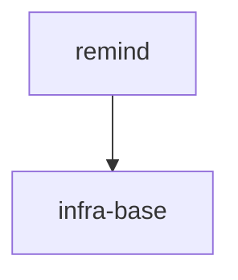

# S9 — `/sdd-reconcile`, mode `from-code`: спека тянется за кодом, который оператор дописал руками

Проверяет: `reconcile.directive` определяет mode=`from-code` (не `fix`) через
`AX_MODE_AUTO_DETECT_OR_HALT`, проводит проб `AX_PROBLEM_PROBES_SPEC`, строит ownership map через
`AX_TASK_RESOLUTION` и попадает в ветку «Header absent» (новый файл без `@tasks`), классифицирует
находку как `spec-update` (а не `direct-fix` / `task-reopen`), проверяет, что `LogicSwitch on="fix
class"` в `STEP_2B_CLASSIFY` НЕ уходит в тривиальную ветку (Entity Inventory меняется — «contracts /
specs untouched» ложно), показывает план (`PLAN_TABLE_FORMAT`) и берёт явное согласие оператора
(`AX_OPERATOR_AGREEMENT`) ДО любого редактирования, затем применяет только spec-edit (`STEP_5_APPLY`)
— без `AX_REOPEN_FORMAT`, без `AX_DISPATCH_VIA_BATCH` (ownership map пуста, код уже правильный, спека
не инвалидирует код). Точка входа — отдельный скилл `/sdd-reconcile` (per Mission: «A separate skill»),
не роутер `/sdd`.

**Границы этой карты.** `STEP_6_SYNC` (`sdd-sync`) и `STEP_7_VERIFY` (эпик-аудит + code-review) —
общий для обоих режимов (`fix`/`from-code`) хвост директивы, и механика диспетча эпик-аудита +
code-review уже покрыта картой S7 (там это те же поддирективы `audit.directive.xml` /
`code-review.directive.xml`, с тем же протоколом смены ролей). Специфика `from-code` целиком
исчерпывается детекцией режима, пробом и классификацией/согласием/apply-шагом (`STEP_0`–`STEP_5`) —
поэтому карта режет прогон сразу после `STEP_5_APPLY`, не платя токенами за повтор того, что S7 уже
проверяет.

## Fixture

Изолированная песочница — git-репозиторий (`git init`), фикстура коммитится как baseline ДО
запуска флоу (`git add -A && git commit -m fixture-baseline`) — `STEP_1_PICTURE` читает `git diff`
относительно этого коммита, значит baseline обязателен. Рука оператора («я дописал X руками»)
landится ПОСЛЕ baseline-коммита — новый файл остаётся untracked/uncommitted, и `git diff` /
`git status` показывают ровно его, ничего больше. Ниже `<GENNADY_WORKTREE>` — абсолютный путь к
worktree gennady, который выдаёт оркестратор; подставить его дословно (`package.json`, ссылки
`Rules:` в тикете).

`package.json`:

```json
{
  "name": "demo-project",
  "version": "0.1.0",
  "scripts": {
    "typecheck": "<GENNADY_WORKTREE>/node_modules/.bin/tsc --noEmit",
    "test": "node --import <GENNADY_WORKTREE>/node_modules/.bin/tsx --test src/app/scheduler/*.test.ts",
    "test:coverage": "node --import <GENNADY_WORKTREE>/node_modules/.bin/tsx --test --experimental-test-coverage src/app/scheduler/*.test.ts",
    "lint": "npx tsx <GENNADY_WORKTREE>/cli/gennady.ts lint --all .",
    "format": "<GENNADY_WORKTREE>/node_modules/.bin/prettier --check ."
  }
}
```

`tsconfig.json`:

```json
{
  "compilerOptions": {
    "target": "ES2022",
    "module": "NodeNext",
    "moduleResolution": "NodeNext",
    "strict": true,
    "noEmit": true,
    "skipLibCheck": true
  },
  "include": ["src"]
}
```

`.prettierrc.json`: `{ "semi": true, "singleQuote": true }`

`node_modules/.bin/gennady` (пустой файл — то же соглашение, что в S1/S6/S7: гейт readiness
проверяет только наличие; `lint` реально бьёт в `<GENNADY_WORKTREE>/cli/gennady.ts` через `npx tsx`):

```

```

`specs/README.md`:

````markdown
# demo-project

## Vision

Напоминания по расписанию.

## Scope Graph


````

## Scopes

| Scope                                           | Type           | Spec | Description                   |
| ----------------------------------------------- | -------------- | ---- | ----------------------------- |
| [`infra-base`](./infra-base/infra-base.spec.md) | infrastructure | ✅   | TS + node:test + gennady lint |
| [`remind`](./remind/remind.spec.md)             | product        | ✅   | Напоминания по расписанию     |

````

`specs/infra-base/infra-base.spec.md` (минимальная — только чтобы cascade нашёл эффективные правила
инфры):
```markdown
# Scope: infra-base

<!--SECTION:VISION-->
## Vision
TS + node:test + gennady lint.
<!--/SECTION:VISION-->

<!--SECTION:EFFECTIVE_RULES-->
## Effective Rules
Нет активных правил сверх дефолтов тулчейна.
<!--/SECTION:EFFECTIVE_RULES-->
````

`specs/remind/remind.spec.md`:

````markdown
# Scope: remind

<!--SECTION:VISION-->

## Vision

Напоминания по расписанию — без сети, без учётных записей.

<!--/SECTION:VISION-->

<!--SECTION:OVERVIEW-->

## Overview


````

<!--/SECTION:OVERVIEW-->

<!--SECTION:RULES-->

## Rules

Нет scope-специфичных правил сверх cascade инфры.

<!--/SECTION:RULES-->

<!--SECTION:BOOTSTRAP_REQUIREMENTS-->

## Bootstrap Requirements

| Requirement                              | Kind | Owner           | Resolution         |
| ---------------------------------------- | ---- | --------------- | ------------------ |
| Нет внешних зависимостей сверх toolchain | —    | this-scope-task | нечего бутстрапить |

<!--/SECTION:BOOTSTRAP_REQUIREMENTS-->

<!--SECTION:HANDOFF-->

## Handoff

Единственный модуль на старте — `scheduler`. См. `specs/remind/scheduler/scheduler.spec.md`.

<!--/SECTION:HANDOFF-->

````

`specs/remind/remind.3-tasks.md`:

```markdown
# remind — Tasks

## Cascade Table
| Tier | Source |
|---|---|
| target-scope | specs/remind/remind.spec.md — Rules (нет активных) |

## Tracker Index
| Task-ID | Title | Dependencies | Status | Reopens |
|---|---|---|---|---|
| REMIND-schedule-scheduler | Планирование и получение напоминаний | — | [x] DONE | — |
````

`specs/remind/scheduler/scheduler.spec.md`:

````markdown
# Module: scheduler

<!--SECTION:MODULE_VISION-->

## Module Vision

Хранит и отдаёт напоминания. Родительский scope: `../../remind.spec.md`.

<!--/SECTION:MODULE_VISION-->

<!--SECTION:OVERVIEW-->

## Overview


````

<!--/SECTION:OVERVIEW-->

<!--SECTION:MODULE_USAGE_EXAMPLE-->

## Module Usage Example

```typescript
const scheduler: ReminderPort = new InMemoryReminderAdapter();
scheduler.schedule({ id: '1', text: 'позвонить', at: '2026-08-13T09:00:00Z' });
scheduler.list();
```

<!--/SECTION:MODULE_USAGE_EXAMPLE-->

<!--SECTION:INTER_MODULE_DEPENDENCIES-->

## Inter-Module Dependencies

- **Depends on:** нет (единственный модуль)
- **Provides to:** нет
<!--/SECTION:INTER_MODULE_DEPENDENCIES-->

<!--SECTION:ENTITY_INVENTORY-->

## Entity Inventory

_Это полный список сущностей модуля. Любое введение сущности execution-агентом помимо этого списка считается drift'ом и требует обновления spec._

| Name                      | Type    | Purpose                                             |
| ------------------------- | ------- | --------------------------------------------------- |
| `ReminderPort`            | Port    | Абстракция планирования и получения напоминаний     |
| `InMemoryReminderAdapter` | Adapter | Реализация ReminderPort через Map в памяти процесса |

<!--/SECTION:ENTITY_INVENTORY-->

<!--SECTION:MODULE_CONTRACTS-->

## Module Contracts

#### Port: `ReminderPort`

- **Purpose:** Планирует напоминание и отдаёт список запланированных.
- **Consumers:** internal: `src/app/scheduler/in-memory-reminder.adapter.ts`
- **Runtime Backing:** `real-runtime`
- **Verification Levels:** `contract`, `unit`
- **Deferred Runtime Scope:** None

**Contract (DbC):**

- Preconditions:
  - `reminder.id` — непустая строка
- Postconditions:
  - после `schedule` напоминание присутствует в `list()`
- Invariants:
  - `list()` не имеет побочных эффектов

#### Adapter: `InMemoryReminderAdapter`

- **Implements:** `ReminderPort` (`src/app/scheduler/reminder.port.ts`)
- **Purpose:** Хранит напоминания в `Map` в памяти процесса.
- **Runtime Backing:** `real-runtime`
- **Verification Levels:** `contract`, `unit`
- **Deferred Runtime Scope:** None

**Side Effects:**

- мутирует внутренний `Map`, живёт в памяти процесса
<!--/SECTION:MODULE_CONTRACTS-->

<!--SECTION:FILE_STRUCTURE-->

## File Structure

```
src/app/scheduler/
├── reminder.port.ts
├── in-memory-reminder.adapter.ts
└── in-memory-reminder.adapter.test.ts
```

<!--/SECTION:FILE_STRUCTURE-->

<!--SECTION:HANDOFF-->

## Handoff to Tasks

- **Implementation files to be created:** `reminder.port.ts`, `in-memory-reminder.adapter.ts`
- **Test files to be created:** `in-memory-reminder.adapter.test.ts`
- **Stack dependencies:**
  - Language: `typescript`
  - Test framework: `node:test`
- **Module Rules Additions:** None
<!--/SECTION:HANDOFF-->

````

`specs/remind/scheduler/scheduler.3-tasks.md`:

```markdown
# scheduler — Tasks

## Tracker Index
| Task-ID | Title | Dependencies | Status | Reopens |
|---------|-------|--------------|--------|---------|
| REMIND-schedule-scheduler | Планирование и получение напоминаний | — | [x] DONE | — |

## Slug Registry
- schedule-scheduler

## Intra-Module DAG
```mermaid
graph TD
  A[schedule-scheduler]
````

## Decision Log (module-task level)

Нет.

## Conventions

Project-wide conventions declared once in `specs/3-tasks.md`.

````

`specs/3-tasks.md`:

```markdown
# Project — Tasks

## Scopes
| Scope | Type | Tasks | Progress |
|---|---|---|---|
| remind | product | [3-tasks](./remind/remind.3-tasks.md) | 1/1 |

## Conventions
Execution-Log token vocabulary: `intro` / `yagni` / `decision` / `tried` / `discovery` / `insight` /
`verified` / `ver` / `DONE`. Baseline Completion Rule: `sdd-verify --profile <kind>` + ticket §5
commands green. Audit/code-review hook: per-group, mandatory once the group's last ticket closes
(`AX_AUDIT_HOOK`). File header: `@file` / `@consumers`
/ `@tasks`.
````

Готовый (уже выполненный) тикет — `specs/remind/scheduler/scheduler.task.REMIND-schedule-scheduler.md`
(Status `[x] DONE`, обе фазы закрыты Round 1):

```markdown
# Task: REMIND-schedule-scheduler — Планирование и получение напоминаний

<!--SECTION:META-->

## Meta

- **Task-ID:** REMIND-schedule-scheduler
- **Status:** [x] DONE
- **Purpose:** Реализовать планирование и получение напоминаний через ReminderPort/InMemoryReminderAdapter
- **Scope:** remind
- **Module:** scheduler
- **Dependencies:** None
- **Spec References:**
  - Contract: [ReminderPort](../scheduler/scheduler.spec.md#module-contracts)
  - Adapter: [InMemoryReminderAdapter](../scheduler/scheduler.spec.md#module-contracts)
- **Runtime Backing:** `real-runtime`
- **Verification Levels:** `contract`, `unit`
- **Deferred Runtime Scope:** None
<!--/SECTION:META-->

<!--SECTION:PHASES_OVERVIEW-->

## Phases Overview

| ID  | Kind | Deps | Status |
| --- | ---- | ---- | ------ |
| P1  | impl | —    | [x]    |
| P2  | test | P1   | [x]    |

<!--/SECTION:PHASES_OVERVIEW-->

## Phases

<!--SECTION:PHASE_P1-->

### P1 — impl

- **Objective:** Создать `ReminderPort` и `InMemoryReminderAdapter`.
- **Rules:**
  - [ai/directives/coding/typescript-rules.xml](<GENNADY_WORKTREE>/ai/directives/coding/typescript-rules.xml)
- **Target Files:**
  - src/app/scheduler/reminder.port.ts
  - src/app/scheduler/in-memory-reminder.adapter.ts
- **Inputs:** none
- **Exit:** `tsc --noEmit` проходит; `InMemoryReminderAdapter` присваивается типу `ReminderPort`.
<!--/SECTION:PHASE_P1-->

<!--SECTION:PHASE_P2-->

### P2 — test

- **Objective:** Покрыть тестами BDD-сценарии (unit + contract typing).
- **Rules:**
  - [ai/directives/testing/node-test.xml](<GENNADY_WORKTREE>/ai/directives/testing/node-test.xml)
- **Target Files:**
  - src/app/scheduler/in-memory-reminder.adapter.test.ts
- **Inputs:** P1 handoff
- **Exit:** `node --test` — все сценарии зелёные.
<!--/SECTION:PHASE_P2-->

<!--SECTION:BDD-->

## Acceptance Criteria (BDD)

**Feature:** InMemoryReminderAdapter планирует и отдаёт напоминания

**Scenario:** schedules a reminder and lists it [`unit`] [REMIND-REQ-1]

- **Given** напоминание с id "1"
- **When** вызван `schedule(reminder)`
- **Then** `list()` содержит это напоминание

**Scenario:** InMemoryReminderAdapter satisfies ReminderPort [`contract`] [REMIND-REQ-1]

- **Given** экспортированный экземпляр `InMemoryReminderAdapter`
- **When** он присвоен переменной типа `ReminderPort`
- **Then** TypeScript принимает присвоение на этапе компиляции
<!--/SECTION:BDD-->

<!--SECTION:VERIFICATION-->

## Verification

| Command                 | Required by                               |
| ----------------------- | ----------------------------------------- |
| `npm run typecheck`     | ai/directives/coding/typescript-rules.xml |
| `npm run test`          | ai/directives/testing/node-test.xml       |
| `npm run test:coverage` | ai/directives/testing/node-test.xml       |
| `npm run lint`          | ai/directives/coding/typescript-rules.xml |
| `npm run format`        | ai/directives/coding/typescript-rules.xml |

- **Task-specific Completion additions:** none beyond project baseline.
<!--/SECTION:VERIFICATION-->

<!--SECTION:TEST_COVERAGE-->

## Test Scenario Coverage

- Scenario schedules a reminder and lists it → `src/app/scheduler/in-memory-reminder.adapter.test.ts` :: `schedules a reminder and lists it`
- Scenario InMemoryReminderAdapter satisfies ReminderPort → `src/app/scheduler/in-memory-reminder.adapter.test.ts` :: `InMemoryReminderAdapter satisfies ReminderPort`
<!--/SECTION:TEST_COVERAGE-->

<!--SECTION:EXECUTION_LOG-->

## Execution Log

### Round 1 — 2026-07-02, impl+test

- P1 DONE — `ReminderPort` + `InMemoryReminderAdapter` созданы.
- P2 DONE — тесты зелёные.
- Round closed. Meta Status → [x] DONE.
<!--/SECTION:EXECUTION_LOG-->

<!--SECTION:DECISION_LOG-->

## Decision Log

Нет.

<!--/SECTION:DECISION_LOG-->
```

Код, уже существовавший на диске ДО правки оператора (часть baseline-коммита, заголовки по
`AX_FILE_HEADER_APPEND_ONLY`):

`src/app/scheduler/reminder.port.ts`:

```typescript
/**
 * @file Абстракция планирования и получения напоминаний.
 * @consumers internal: src/app/scheduler/in-memory-reminder.adapter.ts
 * @tasks REMIND-schedule-scheduler
 */
export interface Reminder {
  id: string;
  text: string;
  at: string;
}

export interface ReminderPort {
  schedule(reminder: Reminder): void;
  list(): Reminder[];
}
```

`src/app/scheduler/in-memory-reminder.adapter.ts`:

```typescript
/**
 * @file Реализация ReminderPort через Map в памяти процесса.
 * @consumers internal: src/app/scheduler (caller)
 * @tasks REMIND-schedule-scheduler
 */
import type { Reminder, ReminderPort } from './reminder.port.js';

export class InMemoryReminderAdapter implements ReminderPort {
  private readonly reminders = new Map<string, Reminder>();

  schedule(reminder: Reminder): void {
    this.reminders.set(reminder.id, reminder);
  }

  list(): Reminder[] {
    return [...this.reminders.values()];
  }
}
```

`src/app/scheduler/in-memory-reminder.adapter.test.ts` (минимальный, покрывает оба BDD-сценария из
тикета — точное содержимое не принципиально для карты, важно только что он существует и зелёный).

Этот набор — весь baseline. Собрать его, `git init`, `git add -A`, `git commit -m fixture-baseline`.

**ПОСЛЕ baseline-коммита**, поверх — рука оператора, ЕЩЁ НЕ закоммичена, никакого файла-заголовка:
это и есть drift, который флоу должен обнаружить и формализовать.

`src/app/scheduler/recurring-reminder.adapter.ts` (новый файл, экспортирован, БЕЗ `@file`/`@consumers`/
`@tasks` — заголовок отсутствует целиком, не «есть заголовок без `@tasks`»):

```typescript
import type { Reminder, ReminderPort } from './reminder.port.js';

export class RecurringReminderAdapter implements ReminderPort {
  private readonly reminders = new Map<string, Reminder>();

  schedule(reminder: Reminder): void {
    const [base, ...rest] = reminder.id.split('#');
    const occurrence = rest.length > 0 ? Number(rest[0]) + 1 : 0;
    this.reminders.set(`${base}#${occurrence}`, reminder);
  }

  list(): Reminder[] {
    return [...this.reminders.values()];
  }
}
```

Ни в `specs/remind/scheduler/scheduler.spec.md` (Entity Inventory), ни в каком тикете
`RecurringReminderAdapter` не упомянут — это ЗАКРЫТОЕ множество сущностей модуля (Entity Inventory
как «полный список»), и код обогнал его. Ни у одного другого файла в фикстуре нет незакоммиченных
изменений — `git diff` относительно baseline показывает ровно один untracked-файл.

## Entry

Скилл: `/sdd-reconcile`. Первая реплика оператора:

> Я дописал `RecurringReminderAdapter` руками в `src/app/scheduler/recurring-reminder.adapter.ts` —
> формализуй.

## Operator Script

1. На вопрос `STEP_4_AGREE` (показан план — spec-update строкой на `RecurringReminderAdapter`,
   предупреждение про Entity Inventory) — ответ: «да, го — вноси в Entity Inventory».

## Stop

Сразу после `STEP_5_APPLY` — после того, как spec-edit (новая строка `RecurringReminderAdapter` в
Entity Inventory `specs/remind/scheduler/scheduler.spec.md`) записан на диск, и ДО первого вызова
`sdd-sync` (`STEP_6_SYNC`). Выбор этой границы, а не конца `STEP_7_VERIFY`: специфика `from-code`
(детекция режима, проб, классификация, согласие, apply spec-only) исчерпывается к концу `STEP_5`, а
`STEP_6_SYNC`/`STEP_7_VERIFY` — общий для обоих режимов хвост, чья диспетч-механика (`audit.directive.xml`

- `code-review.directive.xml`, смена ролей) уже проверена картой S7 — гонять её здесь второй раз не
  добавляет проверочной ценности за те же токены. Трейс заканчивается строкой `stop: per-map — <это
условие дословно>` (не `halt:` — остановка по карте, не директивный `H_*`-гейт).

## Checkpoints

1. `STEP_0_INTAKE` определил mode=`from-code`, НЕ `fix` — дословно по `AX_MODE_AUTO_DETECT_OR_HALT` /
   `STEP_0_INTAKE`: «Findings / bug / review present → `fix`. Code already changed / "formalize what I
   coded" / drift → `from-code`» — реплика оператора («я дописал ... руками ... формализуй») буквально
   матчит триггер `from-code`, ни находок, ни бага, ни review не упомянуто → ветка `fix` не сработала,
   `H_AMBIGUOUS_MODE` не сработал (интейк не двусмысленный).
2. `STEP_1_PICTURE` — трейс содержит `tool:`-строку с `git diff` (читает ровно один untracked-файл
   `recurring-reminder.adapter.ts`) и `tool:`-строки с `orient` и `sdd-check`, дословно по Action:
   «Intent-search the specs for the area in play + read the git diff; map which specs / tasks own it
   (`orient` for the entity / contract surface, `sdd-check` for the link / tracker state)». Никакого
   project-wide grep/find вне этих чтений — «This is the bounded read — not the whole repo».
3. `STEP_2_PROBE` — смена роли на critic (`note: role=critic-sensor` или аналогичная, дословно
   называющая роль), диспетч seeded ровно тремя вопросами из `AX_PROBLEM_PROBES_SPEC`: **bug or
   spec-defect** (вердикт: код правильный, спека устарела — «is the code right and the spec was
   wrong» — не «Does the code violate a correct spec»), **the class** (через `orient` — сиблингов
   незадекларированных Reminder-сущностей больше нет), **the blast radius** (из diff — тронут только
   один новый файл, ничего больше). Вердикт зафиксирован как `show:`-строка ДО перехода на
   `STEP_2B_CLASSIFY`.
   3a. Пробник — вердикт ДИСПАТЧЕННОГО критика (Checkpoint 3), а не самооценка Executor'а: Action
   `STEP_2_PROBE` предписывает «Dispatch the critic», а роль в трейсе (`note: role=critic-sensor`,
   Checkpoint 3) обязана предшествовать строке с самим вердиктом. Self-probe (Executor выносит
   «bug or spec-defect» / class / blast-radius вердикт от своего имени, без предшествующей смены роли
   на диспатч критика) → `VIOLATED`, даже если содержание вердикта совпадает с ожидаемым — Verifier
   проверяет ПРОЦЕСС получения вердикта, не только его итог.
4. `STEP_2B_CLASSIFY`, ownership map (`AX_TASK_RESOLUTION`) — читает заголовок
   `recurring-reminder.adapter.ts` (первые строки до `import`), заголовка НЕТ вовсе → сработала ветка
   «Header absent → classify anyway (the fix IS adding the header), note "no task" for the plan» —
   строка `note:` фиксирует «no task» именно для ЭТОГО файла, при этом никакой
   `tool: sdd-task ...`/reopen не вызван — файл не входит ни в один `@tasks:`, ownership map для него
   пуста.
   4a. «The fix IS adding the header» (Checkpoint 4) — это не только заметка на шаге классификации, но
   ОБЯЗАТЕЛЬНАЯ строка самого плана `STEP_3_PLAN`: `PLAN_TABLE_FORMAT` (Checkpoint 8) должен нести
   отдельную строку/пункт «добавить `@file`/`@consumers`/`@tasks` заголовок в
   `recurring-reminder.adapter.ts`» — задача добавления заголовка не растворяется в spec-update
   строке про Entity Inventory, у неё своя видимая позиция в таблице, показанной оператору
   (`AX_TASK_RESOLUTION` + `AX_FILE_HEADER_APPEND_ONLY` требуют заголовок на КАЖДОМ файле, который
   несёт `@tasks:`-конвенцию проекта — Conventions `specs/3-tasks.md`: «File header: `@file` /
   `@consumers` / `@tasks`»). План без этой строки — план, который тихо забыл собственную находку
   Checkpoint 4.
5. `STEP_2B_CLASSIFY`, категория действия — находка классифицирована как `spec-update`, дословно:
   «**spec-update** — spec gap: missing inventory entity, ... Edit the spec; a spec change that
   invalidates code escalates to task-reopen» — не `direct-fix` (это не «a missing header with no
   other findings», а полноценный gap Entity Inventory) и не `task-reopen` (файл не несёт `@tasks:` —
   `task-reopen` предписан только «ANY finding in a code file carrying `@tasks:`», что здесь ложно).
6. Эскалации в `task-reopen` НЕ произошло: spec-edit (добавление строки в Entity Inventory) не
   инвалидирует уже написанный код — `RecurringReminderAdapter` уже реализует `ReminderPort` корректно
   (from-code: код — новая реальность), поэтому условие эскалации «a spec change that invalidates
   code» не выполнено; в трейсе нет `tool:` с `AX_REOPEN_FORMAT`-паттерном (никакого нового Round для
   существующего тикета, никакого нового тикета).
7. `LogicSwitch on="fix class"` внутри `STEP_2B_CLASSIFY` НЕ ушёл в тривиальную ветку — дословно: «WHEN
   the class is trivial: a single site, blast radius confirmed empty by the probe, contracts / specs
   untouched -> patch the code, ...». Здесь «contracts / specs untouched» ложно по построению: находка
   ЕСТЬ изменение спеки (новая строка Entity Inventory) — значит spec touched, тривиальная ветка не
   применима. Сработал `DEFAULT -> STEP_3_PLAN, the full path` — в трейсе нет `show: FIX_SUMMARY_FORMAT`
   на этом шаге (тот принадлежит только тривиальной ветке) и нет строки, помечающей путь как
   «DONE» до `STEP_3`.
8. `STEP_3_PLAN` показал план оператору как `PLAN_TABLE_FORMAT` (`show:`-строка с составом таблицы —
   как минимум одна строка `spec-update` на `RecurringReminderAdapter` → Entity Inventory
   `scheduler.spec.md`) — новая сущность reconciled через `orient` до включения в план
   (`AX_REUSE_FIRST`: «REUSE existing (adapt artifact to it) > EXTEND existing > JUSTIFY new (record
   one-line rationale ...) > ESCALATE» — `RecurringReminderAdapter` не совпадает по поведению с
   `InMemoryReminderAdapter` (разная семантика `schedule`), значит не REUSE/EXTEND — план несёт
   одну строку rationale «JUSTIFY new»).
   8a. Rationale из Checkpoint 8 — самостоятельная, ЯВНО ВИДИМАЯ строка в `PLAN_TABLE_FORMAT`, не
   пересказанная только в трейсе `note:`/`show:` мимо самой таблицы: оператор должен увидеть в
   таблице плана колонку/пункт с текстом обоснования («не REUSE — иная семантика `schedule`; не
   EXTEND — …; JUSTIFY new»), иначе `AX_REUSE_FIRST` («record one-line rationale in artifact: why
   existing surface is insufficient») выполнено словами Executor'а, а не в артефакте, который видит
   оператор — Checkpoint нарушен, если rationale есть в трейсе, но отсутствует в содержимом самой
   показанной таблицы.
9. `STEP_4_AGREE` — вопрос задан через `QUESTION_FORMAT` (`ask:`-строка с каналом и заголовком),
   предупреждение про класс/blast radius присутствует (`AX_OPERATOR_SAFEGUARD`) — и ДО этого вопроса
   нет ни одной строки `write:` под `specs/` или `src/`, дословно по `AX_OPERATOR_AGREEMENT`: «No
   edits are made before explicit operator "yes" / "go" / "ok"». Ответ оператора («да, го — вноси в
   Entity Inventory») зафиксирован строкой `operator:` ПОСЛЕ `ask:` и ПЕРЕД первым `write:`.
10. `STEP_5_APPLY` — ровно одна `write:`-строка: `specs/remind/scheduler/scheduler.spec.md` (Entity
    Inventory получает строку `RecurringReminderAdapter`) — дословно: «Apply spec edits (defect /
    from-code); reopen / create tasks per the STEP_2B ownership map» — вторая половина действия
    (reopen/create tasks) не производит эффекта, потому что ownership map для этого finding пуста
    (Checkpoint 4) — соответственно нет диспетча батча (`AX_DISPATCH_VIA_BATCH` не задействован: нет
    reopened tasks, которые можно было бы диспетчить как batch) и нет `tool:` с `sdd-task
--batch`/аналогом. Никакой код не тронут (`src/app/scheduler/recurring-reminder.adapter.ts`
    остаётся как оператор его написал — файл вообще не появляется как `write:`, только как объект
    находки).
11. Ни разу не спутаны `halt:` и `stop:` — единственный потенциальный директивный `H_*` в этом пути
    (`H_AMBIGUOUS_MODE`, `H_TRIVIALITY_UNCONFIRMED`, `H_OPERATOR_REJECT`) не сработал ни один (интейк
    однозначен, тривиальность исключена построением фикстуры per Checkpoint 7, оператор согласился) —
    прогон закрывается единственной строкой `stop: per-map — ...` сразу после `STEP_5_APPLY`, не
    строкой `halt:`.
