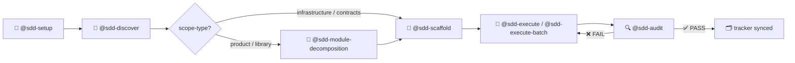
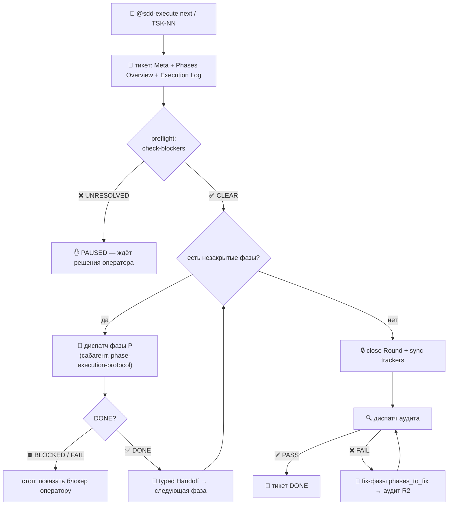
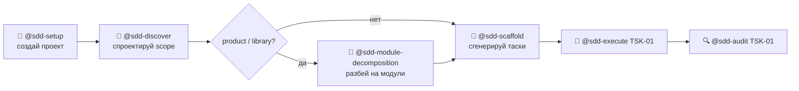
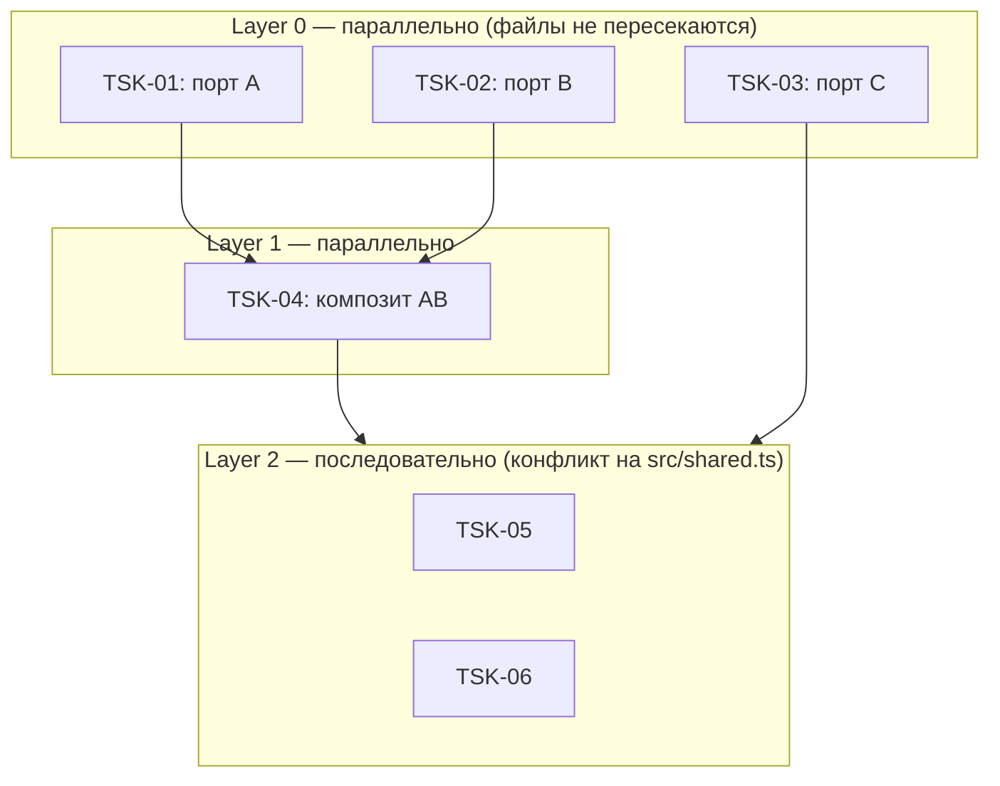
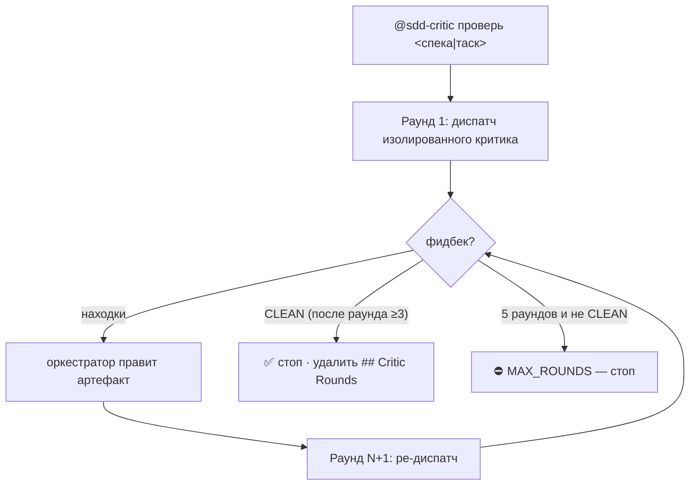
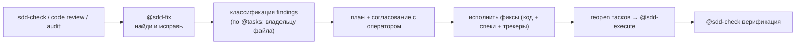
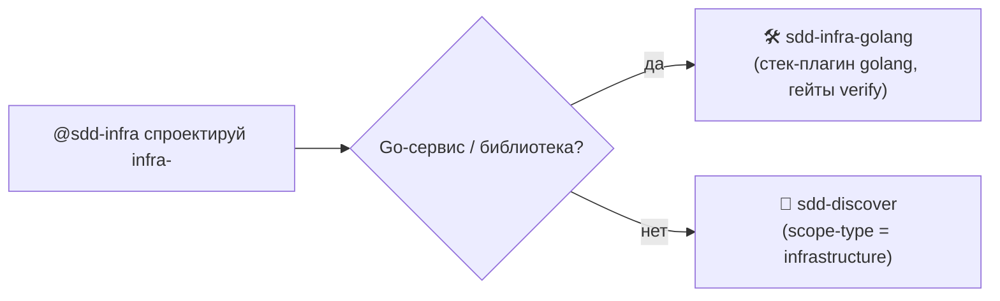

# 🧭 SDD Flow Guide

> **Spec-Driven Development** — воркфлоу, в котором код рождается из спецификаций: сперва утверждаем
> *что* и *как*, потом исполняем по маленьким тикетам, и каждый тикет проходит независимый аудит.
> Всё, что вы пишете, фиксируется: спека → тикет → код → трекер, — и проверяется механически.

Этот гайд — единственная точка входа в SDD. Он читается по сценариям: новичок стартует с раздела 1,
продвинутый — сразу к разделам 2–3. Справочники свёрнуты в `<details>`.

**Как пользоваться** (30 секунд):

```bash
# 1. Развернуть директивы и навыки в проект (делается один раз)
npx gennady sync          # директивы: ai/directives/ (из пакета → проект)
npx gennady sync-skills   # навыки: ai/skills/ → .claude/skills/

# 2. Дальше общаетесь со скиллами через агента:
@sdd-discover спроектируй scope vcs-client
@sdd-execute TSK-03
```

> ⚠️ **Оба шага обязательны.** Скиллы — тонкие клиенты над директивами из `ai/directives/sdd/`.
> Без `npx gennady sync` директив в проекте не будет, и навыки не смогут их загрузить.

---

## 🗺️ 0. Карта потока



**Легенда:** 🧩 — скилл (активируется `@sdd-*`) · 📜 — директива (читается агентом из `ai/directives/sdd/`) · 📦 — артефакт (файл в репозитории).

| Фаза | Скиллы | Артефакт на выходе |
| --- | --- | --- |
| 🧱 Setup | `@sdd-setup` | `specs/README.md` — портал (Vision + Scope Graph) |
| 🔭 Discovery | `@sdd-discover`, `@sdd-continue`, `@sdd-infra` | `specs/<scope>/<scope>.spec.md` — спека скоупа |
| 🧩 Design | `@sdd-module-decomposition`, `@sdd-critic` | `specs/<scope>/<module>/<module>.spec.md` — модульные спеки |
| 🗂️ Planning | `@sdd-scaffold` | `tasks/README.md`, `tasks/<scope>/README.md`, тикеты `*.task-NN.md` |
| ⚙️ Execution | `@sdd-execute`, `@sdd-execute-batch` | изменения в Target Files + `## 7. Execution Log` внутри тикета |
| 🔍 Audit | `@sdd-audit`, `@sdd-check` | вердикт + findings (роутятся в правки спеки/тикета/кода) |
| 🔁 Iteration | `@sdd-continue`, `@sdd-fix` | обновлённые спеки, переоткрытые тикеты |

**Глоссарий (кратко):**

| Термин | Что это |
| --- | --- |
| **Scope** | Архитектурно когерентная единица со своим runtime / стеком / deployment'ом |
| **scope-type** | `infrastructure` · `contracts` · `library` · `product` |
| **Spec** | Живой документ скоупа/модуля (`specs/**`) — источник истины (`AX_SPEC_IS_SOLE_SOURCE`) |
| **Ticket** | Тикет задачи: Meta, Phases Overview, тела фаз, BDD, Verification, Coverage, Execution Log |
| **Phase** | Атомарная единица работы внутри тикета: `bootstrap | impl | test | config | doc | refactor | fix` |
| **Round** | Цикл `open → DONE` в Execution Log; старые раунды никогда не редактируются |
| **Handoff** | Типизированный payload между фазами: `artifacts / decisions / open` |
| **Audit** | Фаза 5: fresh-eyes проверка выравнивания спека ↔ тикет ↔ код |
| **phases_to_fix** | Результат FAIL-аудита: маппинг finding → фаза, чьи Target Files содержат проблему |
| **Blocker** | Неразрешённый блокер в Execution Log — останавливает выполнение (`✋ PAUSED`, не FAIL) |

---

## 🚀 1. Новичок

> Если вы ещё не работали с SDD — начинайте здесь. Оба сценария не требуют никаких знаний о
> директивах: скилл сам читает директиву и «активируется как она».

### Сценарий 1 — «Выполни следующую задачу»

**Когда:** в проекте уже есть `tasks/` и незакрытые тикеты. · **Вход:** ничего · **Выход:** выполненный тикет + синхронизированные трекеры.



**Шаги:**

1. `npx gennady sync && npx gennady sync-skills` — развернуть директивы и скиллы (однократно).
2. `@sdd-execute next` (или `@sdd-execute TSK-03`) — скилл сам найдёт pickable-тикет: `[ ] TODO` и все зависимости `[x] DONE`.
3. Наблюдайте за прогрессом: `0% ⏳ resolving` → `🔧 P1 executing` → `✅ all phases done → 🔍 audit` → `100% ✅ audit PASS`.
4. На тикете FAIL аудита скилл сам перезапустит **только** отмеченные фазы (максимум 2 попытки аудита) — не надо чинить вручную.

**Директивы (читаются скиллом, вам не нужны):** `phase-execution-protocol.xml` (фазы), `audit.directive.xml` (аудит).

> ⚠️ **Правило:** если фаза вернула `BLOCKED` — это не сбой скилла. Оператор должен отметить разрешение
> блокера в Execution Log строкой `✅ RESOLVED <ref>` и запустить `@sdd-execute` снова.

### Сценарий 2 — «Проект с нуля до первого выполненного тикета»

**Когда:** новый репозиторий, ничего нет. · **Выход:** портал, спека, очередь тикетов и первый `[x] DONE`.



**Шаги:**

1. `@sdd-setup создай проект` — появится `specs/README.md` (Vision, Scope Graph, Scopes table).
2. `@sdd-discover спроектируй scope <name>` — интервью, затем `specs/<scope>/<scope>.spec.md`.
3. Для product/library — `@sdd-module-decomposition разбей <name> на модули` (инвентарь сущностей + DbC).
4. `@sdd-scaffold сгенерируй таски` — появится `tasks/` с DAG тикетов и трекерами.
5. `@sdd-execute TSK-01` → аудит → `[x] DONE`.

> 💡 **Совет:** между шагами 2–4 полезно прогнать `@sdd-critic проверь спеку <path>` — дешевле поймать
> изъяны до того, как по спеке нарезаны десятки тикетов.

---

## 🧭 2. Повседневные сценарии

> Основная работа: спроектировать скоуп, доработать его, выполнить очередь. Диаграммы тут — для
> понимания порядка, сам скилл делает всё сам.

### Сценарий 3 — Спроектировать новый scope

**Когда:** есть идея фичи, спеки нет. · **Вход:** имя scope + scope-type · **Выход:** `specs/<scope>/<scope>.spec.md`.

```mermaid
sequenceDiagram
    participant U as "Оператор"
    participant D as "@sdd-discover"
    participant S as "📦 &lt;scope&gt;.spec.md"
    U->>D: «спроектируй scope vcs-client»
    loop interview (coverage map)
        D->>U: один вопрос за сообщение
        U-->>D: ответ
    end
    D->>U: decision cards (ASCII-диаграммы)
    U-->>D: подтверждение
    D->>S: пишет спеку (Vision, Requirements, Архитектура)
```

**Шаги:** `@sdd-discover спроектируй scope <name>` → пройдите интервью (карта покрытия закроется) → подтвердите decision-карты → для product/library вызовите `@sdd-module-decomposition`.

**Директивы:** `discovery.directive.xml` · `interview-protocol.xml` · `visual-vocabulary.xml`.

> ⚠️ **Типичная ошибка:** путать **refine** и **pivot**. Дискриминатор: если старое решение остаётся
> валидным параллельно — это `refine`; если заменяется несовместимым — `pivot` (старое помечается
> superseded в Decision Log).

### Сценарий 4 — Продолжить / изменить существующую спеку

**Когда:** спека уже есть, нужно добавить требования/контракты или заменить архитектуру. · **Выход:** обновлённая спека.

```text
@sdd-continue — refine (добавить)  →  старые решения остаются валидными
@sdd-continue — pivot (заменить)   →  несовместимое изменение, старое → superseded
```

**Шаги:**

1. `@sdd-continue добавь sync-skills в cli` — режим `refine` (автоопределяется по глаголу).
2. `@sdd-continue измени архитектуру на event-driven` — режим `pivot`.
3. Режим `greenfield` в `sdd-continue` **запрещён** — для новой спеки используйте `sdd-discover`.
4. После изменений спеки: `@sdd-scaffold` (extend-dag) перегенерирует только новые тикеты; старые не трогаются.

**Директива:** `discovery.directive.xml` (режимы refine/pivot).

### Сценарий 5 — Выполнить всю очередь (batch)

**Когда:** много pickable-тикетов, хочется прогнать разом с учётом зависимостей. · **Выход:** батч-саммари `✅ N · 🔄 R · ❌ F`.



**Шаги:**

1. `@sdd-execute-batch выполни всю очередь` — оркестратор построит слои DAG и покажет план.
2. Проверьте план (`📋 Execution Plan`), ответьте на запрос старта.
3. Внутри слоя тикеты без файловых конфликтов выполняются параллельно; слои — последовательно.
4. Опциональный флаг `epic-only` — один эпик-аудит в конце вместо per-task аудитов.

**Доп. аргументы:** явный список `@sdd-execute-batch TSK-04 TSK-05`, домен `domain:cli`, путь к тикету.

> ⚠️ Тикеты со статусом `[!] BLOCKED` или ожидающие `[~] IN_PROGRESS` зависимость **исключаются** из батча и помечаются `⏸️ waiting` — это не ошибка батча.

---

## 🎓 3. Продвинутые сценарии

<details>
<summary>🔍 Сценарий 6 — Критика артефактов перед исполнением</summary>

**Когда:** хотите выловить «слепые пятна» в спеке или тасках до того, как по ним пойдёт исполнение. · **Выход:** доработанный артефакт (или вердикт CLEAN).



**Правила:** критик видит **только** артефакт + родительскую спеку (изоляция); правит артефакт оркестратор; минимум 3 раунда, максимум 5; по умолчанию репорятся только production-threatening дефекты (`Polish: off` — мелочи не гонят цикл).

**Директивы:** `critic.directive.xml` (оркестратор) · `critic-protocol.xml` (саб-агент).

</details>

<details>
<summary>🔧 Сценарий 7 — Аудит и починка после ревью</summary>

**Когда:** пришёл code review, `sdd-check` показал нарушения, или аудит вернул FAIL. · **Выход:** исправленный код + переоткрытые таски + `sdd-check PASS`.



**Шаги:** `@sdd-fix` с фидингами из контекста → согласуйте план → фиксы применяются сами, затронутые тикеты переоткрываются и перевыполняются через `@sdd-execute` → финальная верификация.

**Директивы:** `fix.directive.xml` · `audit.directive.xml`.

</details>

<details>
<summary>🏗️ Сценарий 8 — Инфраструктурные scope и Go-роутинг</summary>

**Когда:** нужно сконфигурировать tooling (package manager, type-checker, linter, formatter, тест-раннер, git hooks, CI). · **Выход:** infra-спека с Tool Stack и Verification Commands.



**Шаги:** `@sdd-infra спроектируй infra-golang` → для Go скилл сам переадресует в `sdd-infra-golang` (стек-плагин, `gennady verify`, `.gennadyrc`) → иначе продолжит по `discovery.directive.xml` с принудительным `scope-type=infrastructure`.

> ⚠️ Не импровизируйте Go-тулинг из общего пути — Go имеет собственный плагинный гейт-модель.

**Директивы:** `discovery.directive.xml` · `plugins/golang/directives/infra/golang-setup.xml`.

</details>

<details>
<summary>📡 Сценарий 9 — Живой прогресс и целостность дерева</summary>

**Когда:** хотите видеть live-прогресс сабагентов и периодически проверять, что дерево не разъехалось.

```bash
# 1. Живой прогресс (однократно на проект): ставит хуки в .claude/settings.json
@sdd-hooks-install

# 2. Следить за прогрессом во втором терминале
tail -f .claude/sdd-progress.ndjson | jq -r '"\(.ts) | \(.kind) | \(.tool // .session)"'

# 3. Read-only проверка целостности всего SDD-дерева (8 механических проверок + self-reflection)
@sdd-check
```

**Что проверяет `sdd-check`:** целостность портала, связность спек, синхронизацию трекеров, консистентность DAG, полноту Execution Log, целостность Task-ID (`@tasks:`), файловые хедеры, наличие тест-файлов.

**Скиллы:** `sdd-hooks-install` · `sdd-check` (оба без директив — конфиг/верификация).

</details>

---

## 📚 4. Справочники

<details>
<summary>🧩 4.1 Скиллы (13)</summary>

| Скилл | Фаза | Инвокация | Активирует |
| --- | --- | --- | --- |
| `sdd-setup` | discover | `@sdd-setup создай проект` | `setup.directive.xml` |
| `sdd-discover` | discover | `@sdd-discover спроектируй scope <name>` | `discovery.directive.xml` |
| `sdd-infra` | discover | `@sdd-infra спроектируй infra-<stack>` | `discovery.directive.xml` (→ `sdd-infra-golang` для Go) |
| `sdd-module-decomposition` | design | `@sdd-module-decomposition разбей <name> на модули` | `module-decomposition.directive.xml` |
| `sdd-critic` | design | `@sdd-critic проверь спеку/таск <path>` | `critic.directive.xml` + `critic-protocol.xml` |
| `sdd-scaffold` | plan | `@sdd-scaffold сгенерируй таски` | `scaffold.directive.xml` |
| `sdd-execute` | execute | `@sdd-execute TSK-NN` / `next` / `pick one` | `phase-execution-protocol.xml` + `audit.directive.xml` |
| `sdd-execute-batch` | execute | `@sdd-execute-batch выполни всю очередь` | те же |
| `sdd-audit` | verify | `@sdd-audit TSK-NN` | `audit.directive.xml` |
| `sdd-check` | verify | `@sdd-check` | — (read-only, через `sdd scan`/`check`) |
| `sdd-continue` | iterate | `@sdd-continue добавь/измени <X> в <scope>` | `discovery.directive.xml` (refine/pivot) |
| `sdd-fix` | iterate | `@sdd-fix исправь <findings>` | `fix.directive.xml` |
| `sdd-hooks-install` | setup | `@sdd-hooks-install` | — (конфиг-бутстрап) |

Деплой в проект: сначала `npx gennady sync` (директивы), затем `npx gennady sync-skills` (навыки, из `ai/skills/` → `.claude/skills/`; dev-пути нормализуются в продуктовые).

</details>

<details>
<summary>📜 4.2 Директивы (12)</summary>

Все — в `ai/directives/sdd/`.

| Директива | Что делает |
| --- | --- |
| `setup.directive.xml` | Портал: Vision, Scope Graph, Scopes table; sole owner `specs/README.md` |
| `discovery.directive.xml` | Спека скоупа по scope-type; режимы greenfield/refine/pivot |
| `module-decomposition.directive.xml` | Модульные спеки: инвентарь сущностей, публичные поверхности, DbC (Ports/Adapters/Services) |
| `scaffold.directive.xml` | Тикеты из спек: DAG, Cascade Table, BDD, Phases Overview, per-phase Rules |
| `phase-execution-protocol.xml` | Одна фаза одного тикета: scope-lock по Target Files, Handoff, blocker-эскалация |
| `audit.directive.xml` | Выравнивание спека ↔ тикет ↔ код; `phases_to_fix`, роутинг findings |
| `critic.directive.xml` | Оркестратор многораундовой критики (min 3 / max 5 раундов) |
| `critic-protocol.xml` | Изолированный критик-сабагент: read-only, только артефакт + родительская спека |
| `fix.directive.xml` | Классификация findings → план → фиксы → reopen → execute → verify |
| `interview-protocol.xml` | Движок интервью оператора: coverage map, один вопрос за сообщение |
| `visual-vocabulary.xml` | Cheat-sheet диаграмм: ASCII в чате / mermaid в спеках (`<details>`) |
| `svelte-ui-discovery.directive.xml` | Компонент-спека `.ui.spec.md` из Figma SVG (component-level) |

Правила, на которые ссылаются фазы: `ai/directives/coding/` · `testing/` · `infra/` · `architecture/`.

</details>

<details>
<summary>📦 4.3 Артефакты — что где создаётся</summary>

| Артефакт | Создаёт | Путь |
| --- | --- | --- |
| Портал проекта | `sdd-setup` | `specs/README.md` |
| Спека скоупа | `sdd-discover` / `sdd-continue` | `specs/<scope>/<scope>.spec.md` |
| Модульная спека | `sdd-module-decomposition` | `specs/<scope>/<module>/<module>.spec.md` |
| Компонент-спека | `svelte-ui-discovery` | `specs/<scope>/components/<name>.ui.spec.md` |
| Проектный трекер | `sdd-scaffold` | `tasks/README.md` (Tracker Index, High-Level DAG) |
| Трекер скоупа | `sdd-scaffold` | `tasks/<scope>/README.md` (Cascade Table, Tracker) |
| Тикет | `sdd-scaffold` | `tasks/<scope>/<scope>.task-NN.md` |
| Execution Log | фазы `sdd-execute` | секция `## 7.` внутри тикета |
| Audit Rounds | `sdd-audit` | секция `## Audit Rounds` внутри тикета |
| Decision Log | `sdd-discover` | секция в спеке (`D-NNN`) |

</details>

<details>
<summary>🛠️ 4.4 CLI-поддержка</summary>

| Команда | Зачем |
| --- | --- |
| `npx gennady sync` | **Обязателен первым:** деплой директив `ai/directives/` из пакета → проект (есть `--dry-run`, выбор поддиректории) |
| `npx gennady sync-skills` | Деплой навыков `ai/skills/` → `.claude/skills/` (есть `--dry-run`, выбор скилла). Без `sync` навыки не найдут директивы |
| `npx gennady verify` | Верификационные гейты стека (используется фазовым `sdd verify`) |
| `npx gennady lint` | DBC AST-контракты, file-header, anchors |
| `npx gennady orient` | Карта проекта / навигация по файлам и задачам |

Скрипты-хелперы скилла `sdd-execute`: `sdd help · extract · lint · verify · check-blockers · scan · check` — единый диспатчер `ai/skills/sdd-execute/scripts/sdd`.

</details>

<details>
<summary>📖 4.5 Связанные документы</summary>

| Документ | Что это |
| --- | --- |
| [`ai/skills/README.md`](../ai/skills/README.md) | Справочник скиллов (типовые сценарии вызова) |
| [`ai/directives/sdd/README.md`](../ai/directives/sdd/README.md) | Справочник директив (поток + таблицы) |
| [`specs/ai-skills/ai-skills.spec.md`](../specs/ai-skills/ai-skills.spec.md) | Спека библиотеки навыков |
| [`specs/ai-skills/sdd-skills/sdd-skills.spec.md`](../specs/ai-skills/sdd-skills/sdd-skills.spec.md) | Спека модуля SDD-скиллов |
| [`AGENTS.md`](../AGENTS.md) | Роутер по директивам и правилам для агентов |

</details>
