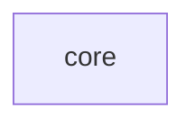

# ttt — Tasks

## Tracker Index
| Task-ID | Title | Dependencies | Status | Reopens |
|---------|-------|--------------|--------|---------|
| TTT-core | Tic-tac-toe engine + CLI | — | [ ] TODO | — |

## Slug Registry
<!-- one slug per line; this IS the uniqueness mechanism — the same slug in two branches collides on merge here, surfacing "same feature" instead of hiding it. Append-only. -->
- core

## Intra-Module DAG

<!-- edge A → B = "A depends on B". Cross-module / cross-scope edges live one level up, not here. -->

## Decision Log (module-task level)
<!-- decomposition / planning decisions, ADR-compact. Local execution-time decisions stay in each ticket's own Decision Log. -->

## Conventions
Project-wide conventions (Execution-Log token vocabulary, Baseline Completion Rule, post-task audit hook, file-header) are declared once in `specs/3-tasks.md` and inherited here — not repeated.
