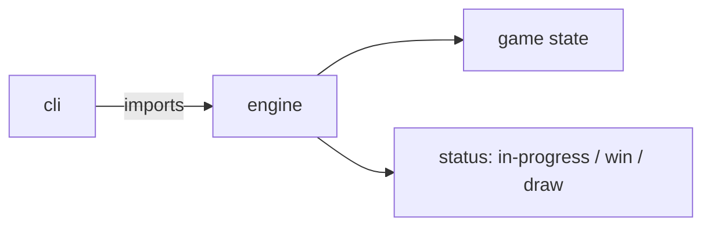
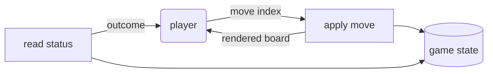

# ttt: Library Specification

<!--SECTION:SCOPE_TYPE-->
## scope-type
library
<!--/SECTION:SCOPE_TYPE-->

<!--SECTION:VISION-->
## Vision & Primary Goal
A minimal, dependency-free tic-tac-toe engine plus a thin CLI. It exists as the smallest
honest end-to-end target for the SDD Flow v2 eval: a task every model knows cold, on the
same stack as the tooling, so a red result blames the flow, not the problem.
<!--/SECTION:VISION-->

<!--SECTION:OVERVIEW-->
## Overview
The engine is a pure state machine: a caller creates a game, applies moves, and asks for
status; the CLI is the only side-effecting layer, reading moves and printing the board.


_How the CLI wires in the pure engine — TTT-REQ-1, TTT-REQ-4._
<!--/SECTION:OVERVIEW-->

<!--SECTION:GOLDEN_DX-->
## Target Experience
```js
import { createGame, applyMove, status, render } from 'tic-tac-toe/game';

let game = createGame();            // empty 3x3 board, X to move
game = applyMove(game, 4);          // X takes the centre; turn passes to O
console.log(render(game));          // human-readable board

try {
  applyMove(game, 4);               // error path: the cell is taken
} catch (err) {
  console.error(err.message);       // "cell 4 is occupied"
}

status(game);                       // { kind: 'in-progress' } until a line or a full board
```
<!--/SECTION:GOLDEN_DX-->

<!--SECTION:SCOPE_DEPENDENCIES-->
## Scope Dependencies
- **Depends on:** none (Node standard library only — `node:test`, `node:assert`).
- **Provides to:** the CLI user; any consumer importing the `game` engine.
<!--/SECTION:SCOPE_DEPENDENCIES-->

<!--SECTION:REQUIREMENTS_AND_CONSTRAINTS-->
## Requirements & Constraints

### Requirements

### TTT-REQ-1 [должен]
**Когда** вызывающий применяет ход на пустую клетку в диапазоне 0–8, **движок должен** поставить метку текущего игрока и передать ход другому игроку.

> Это базовое правило игры; без чередования хода партия не может развиваться.

### TTT-REQ-2 [должен · нештатная]
**Если** ход применяется на занятую клетку или на индекс вне диапазона 0–8, **то движок должен** отклонить ход ошибкой и оставить состояние неизменным.

> Нелегальный ход — самый частый ошибочный ввод; молчаливое игнорирование скрыло бы баг в вызывающем коде.

### TTT-REQ-3 [должен]
**Когда** запрашивается статус, **движок должен** вернуть победителя при завершённой линии, ничью при полной доске без линии, иначе — «партия идёт».

> Статус — единственный способ узнать исход; без него CLI не может завершить партию.

### TTT-REQ-4 [должен]
**Когда** CLI получает последовательность ходов, **CLI должен** проиграть партию и напечатать финальную доску и исход.

> CLI — наблюдаемая поверхность библиотеки; без неё нельзя проверить работу руками.

### Out-of-Scope
- AI-противник, сеть, персистентность, GUI.
- Доски размером не 3×3.

### Runtime & Deferred Scope
- Engine (`createGame`/`applyMove`/`status`/`render`): `real-runtime` — чистые функции.
- CLI (`src/cli.js`): `real-runtime` — читает ходы из аргументов, печатает в stdout.
- Deferred: нет.

### Rules
| Rule | Category | Source |
|---|---|---|
| Движок без побочных эффектов; ввод/вывод только в CLI | Architecture | TTT-REQ-1, TTT-REQ-3 |
| Нелегальный ход — исключение, состояние не мутируется | Correctness | TTT-REQ-2 |
<!--/SECTION:REQUIREMENTS_AND_CONSTRAINTS-->

<!--SECTION:DATA_FLOW-->
## Data Flow

_Player drives moves through the pure engine and reads back board and outcome — TTT-REQ-1, TTT-REQ-3, TTT-REQ-4._
<!--/SECTION:DATA_FLOW-->

<!--SECTION:PUBLIC_API_SURFACE-->
## Public API Surface
- `createGame(): GameState` — a fresh empty board with `X` to move.
- `applyMove(state, cell): GameState` — a new state with the move applied; throws on an illegal cell.
- `status(state): { kind: 'in-progress' | 'win' | 'draw', winner?: 'X' | 'O' }` — the game outcome.
- `render(state): string` — a human-readable 3×3 board.

`GameState` is an immutable value: the 9-cell board plus whose turn it is.
<!--/SECTION:PUBLIC_API_SURFACE-->

<!--SECTION:ARCHITECTURE-->
## Architecture
Pure functional core, imperative shell. The engine is a set of pure functions over an
immutable `GameState`; the CLI is the only I/O boundary. Rejected: a stateful `Game`
class (harder to test, invites hidden mutation) and an in-engine `console.log` (couples
the core to I/O, breaks the pure-core contract).
<!--/SECTION:ARCHITECTURE-->

<!--SECTION:DECISION_LOG-->
## Decision Log
One decision beyond the defaults — the immutability of `GameState`.

<details>
<summary>Полные записи Decision Log</summary>

- **D-001 · `applyMove` returns a new state rather than mutating** → keeps the core pure and trivially testable ↳ rejected in-place mutation (hides bugs, needs defensive copies at call sites).

</details>
<!--/SECTION:DECISION_LOG-->

<!--SECTION:BOOTSTRAP_REQUIREMENTS-->
## Prerequisites
No external bootstrap required — the project uses only the Node standard library plus `c8` for coverage.

<details>
<summary>Таблица предусловий</summary>

| Requirement | Kind | Owner | Resolution |
|---|---|---|---|
| — | — | — | No external bootstrap required. |

</details>
<!--/SECTION:BOOTSTRAP_REQUIREMENTS-->

<!--SECTION:HANDOFF-->
## Handoff to Modules
- **Areas requiring decomposition:** none — a single flat scope (engine + CLI).
- **Named abstractions:** `GameState`, `createGame`, `applyMove`, `status`, `render`.
- **Bootstrap tickets ready for cascade:** none — see Prerequisites.
- **Open risks:** none of note; the domain is fully specified.
<!--/SECTION:HANDOFF-->
