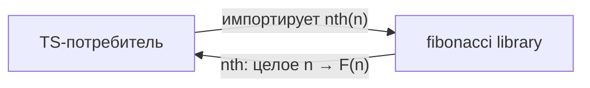
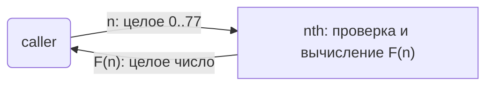

# fibonacci: Library Specification

<!--SECTION:SCOPE_TYPE-->
## scope-type
library
<!--/SECTION:SCOPE_TYPE-->

<!--SECTION:VISION-->
## Vision & Primary Goal
Библиотека даёт потребителю одну чистую функцию `nth(n)`: по целому индексу `n` она
возвращает `n`-е число Фибоначчи. Потребителю не нужно знать, как устроен ряд или как
проверять вход: валидный домен и ошибки на недопустимый вход определены один раз и
проверяются одинаково во всех вызовах. Главная проблема, которую решает библиотека, —
точный и предсказуемый расчёт числа Фибоначчи в согласованном домене без скрытого
состояния и побочных эффектов.
<!--/SECTION:VISION-->

<!--SECTION:OVERVIEW-->
## Overview
Библиотека подключается как обычный npm-модуль и отдаёт наружу один экспорт — функцию
`nth`. Вызов `nth(n)` либо возвращает целое число Фибоначчи, либо выбрасывает
исключение с явным сообщением, если `n` вне домена.


_Библиотека отдаёт потребителю одну чистую функцию `nth`, которая превращает индекс в число Фибоначчи._
<!--/SECTION:OVERVIEW-->

<!--SECTION:GOLDEN_DX-->
## Target Experience
Использование сводится к импорту и одному вызову; инициализация, конфигурация и
подготовка состояния не нужны.

```ts
import { nth } from 'fibonacci-library';

nth(0);   // 0
nth(1);   // 1
nth(10);  // 55
nth(77);  // 5527939700884757

try {
  nth(-1);    // RangeError: n должно быть в диапазоне [0, 77]
  nth(1.5);   // TypeError: n должно быть целым числом
  nth(78);    // RangeError: n должно быть в диапазоне [0, 77]
} catch (err) {
  // вызывающий сам решает, как показать ошибку
}
```

Ошибки различимы по классу: `TypeError` говорит о нецелом входе, `RangeError` — о целом
вне диапазона `[0, 77]`. Намерение такого разделения — позволить вызывающему отличать
программную ошибку типа от ошибки домена без разбора текста сообщения.
<!--/SECTION:GOLDEN_DX-->

<!--SECTION:SCOPE_DEPENDENCIES-->
## Scope Dependencies
- **Depends on:** None
- **Provides to:** None
<!--/SECTION:SCOPE_DEPENDENCIES-->

<!--SECTION:REQUIREMENTS_AND_CONSTRAINTS-->
## Requirements & Constraints

### Requirements

### FIB-REQ-1 [должен]
**Функция nth должна** быть чистой: каждый вызов с одним и тем же значением `n`
возвращает одинаковый результат и не производит наблюдаемых побочных эффектов (без
мутаций, ввода-вывода и скрытого состояния).

> Чистота — прямое требование задачи; она делает функцию предсказуемой и безопасной для
> повторных вызовов без кэша и конфигурации.

### FIB-REQ-2 [должен]
**Когда** вызывающий передаёт целое число `n` от 0 до 77 включительно, **функция nth
должна** вернуть `n`-е число Фибоначчи как точное целое: F(0)=0, F(1)=1 и
F(n)=F(n−1)+F(n−2) при n≥2.

> Границы домена заданы оператором (inputs/brief.md): при n≤77 результат точно
> представим в IEEE-754 double (`Number.MAX_SAFE_INTEGER`), вычисление остаётся
> целочисленным и не теряет точность.

### FIB-REQ-3 [должен · нештатная]
**Если** вызывающий передаёт `n`, которое не является целым числом (дробное значение,
NaN, ±∞), **то функция nth должна** выбросить `TypeError`, сообщение которого называет
переданное значение и требование целочисленности.

> Нецелый вход — программная ошибка вызова; явное исключение надёжнее молчаливого
> округления или возврата NaN, которые скрыли бы опечатку.

### FIB-REQ-4 [должен · нештатная]
**Если** вызывающий передаёт целое `n` вне диапазона `[0, 77]` (n<0 или n>77), **то
функция nth должна** выбросить `RangeError`, сообщение которого называет переданное
значение и допустимый диапазон.

> Выход за домен означает, что результат не гарантированно точен в double, а
> отрицательный индекс не определён рядом Фибоначчи. Класс ошибки отделён от
> `TypeError`, чтобы вызывающий отличал недопустимый домен от недопустимого типа.

### Out-of-Scope
- Поддержка индексов больше 77 и отрицательных индексов.
- Нецелые и нечисловые входы как допустимые значения.
- Работа с `bigint`, строками, массивами и итераторами.
- Генерация последовательности, кэширование и мемоизация между вызовами.
- Асинхронные и потоковые API.

### Runtime & Deferred Scope
Чистая синхронная функция без внешнего рантайма и состояния; отложенных частей нет.
Вычисление не опирается на `Number.MAX_SAFE_INTEGER` за пределами согласованного
домена — возврат всегда остаётся обычным `number`.

### Rules
| Rule | Category | Source |
|---|---|---|
| TypeScript coding rules | coding | `ai/directives/coding/typescript-rules.xml` |
| node:test testing rules | testing | `ai/directives/testing/node-test.xml` |
<!--/SECTION:REQUIREMENTS_AND_CONSTRAINTS-->

<!--SECTION:DATA_FLOW-->
## Data Flow
Данные вызова `nth` движутся напрямую от вызывающего к функции и обратно: на входе целый
индекс из согласованного домена, на выходе точное число Фибоначчи. Промежуточных
хранилищ и внешних систем нет.


_Данные вызова nth: на входе индекс из домена [0, 77], на выходе точное число Фибоначчи — FIB-REQ-2._
<!--/SECTION:DATA_FLOW-->

<!--SECTION:PUBLIC_API_SURFACE-->
## Public API Surface
- `nth(n): number` — единственная capability: вычислить `n`-е число Фибоначчи по целому
  индексу из `[0, 77]`. Владелец — [модуль nth](./nth/nth.spec.md). Точная сигнатура,
  предусловия и классы ошибок заданы в Entity Surfaces и Contracts модуля.
<!--/SECTION:PUBLIC_API_SURFACE-->

<!--SECTION:ARCHITECTURE-->
## Architecture
Модуль устроен как одна чистая функция без Port/Adapter: у поведения нет изменяемой
вариативности и внешних зависимостей, поэтому слой абстракции был бы пустым. Функция
сама валидирует вход и вычисляет результат; состояние между вызовами не хранится.

Отвергнутые альтернативы:
- класс-обёртка или объект с кэшем — нарушает чистоту и не нужен при домене из одного
  вызова;
- формула Бине на числах с плавающей точкой — теряет точность на границе домена;
- возврат `NaN`/`undefined` вместо исключений — прячет программную ошибку;
- `bigint`-результат — выходит за согласованный домен и усложняет потребителю типы.
<!--/SECTION:ARCHITECTURE-->

<!--SECTION:MODULE_MAP-->
## Module Map

### Modules
- [nth](./nth/nth.spec.md) — чистая функция `nth(n)`: валидация домена и вычисление F(n).

### Inter-Module Dependency Map
Модуль один, межмодульных зависимостей нет — граф не рисуется, рисовать нечего.

### Stack Dependencies
- Languages: TypeScript (ES2022, NodeNext)
- Test frameworks: `node:test` (`node --test`), см. `ai/directives/testing/node-test.xml`

### Handoff to Tasks
- **Primary input:** `specs/fibonacci/fibonacci.spec.md` (этот файл).
- **Required directives:** `ai/directives/coding/typescript-rules.xml`,
  `ai/directives/testing/node-test.xml`, `ai/directives/testing/common.xml`.
- **Open risks & validation needs:** нет открытых рисков; полнота покрыта модулем nth.
<!--/SECTION:MODULE_MAP-->

<!--SECTION:DECISION_LOG-->
## Decision Log
Два решения по поведению публичного API: классы ошибок ввода и отказ от слоя
абстракции.

<details>
<summary>Полные записи Decision Log</summary>

### FIB-DL-1 2026-09-02 — классы ошибок ввода разделены на TypeError и RangeError (почему: вызывающий отличает нецелый тип от целого вне домена по классу исключения; отвергнуто: единый Error с текстом сообщения — теряется программная различимость)
### FIB-DL-2 2026-09-02 — модуль реализован без Port/Adapter и состояния (почему: одна реализация без вариативности, контракт живёт на функции; отвергнуто: интерфейс и класс-обёртка — не дают тестового шва для чистой функции и добавляют пустой слой)

### Approval #1 — current specification set
- **Status:** pending
- **Reviewed set:** `specs/fibonacci/fibonacci.spec.md`, `specs/fibonacci/nth/nth.spec.md`
- **Independent review:** pending
- **Operator decision:** pending
- **Recorded:** 2026-09-02

</details>
<!--/SECTION:DECISION_LOG-->

<!--SECTION:BOOTSTRAP_REQUIREMENTS-->
## Prerequisites
No external bootstrap required.

<details>
<summary>Таблица предусловий</summary>

| Requirement | Kind | Owner | Resolution | Readiness Gates | Gate Artifacts |
|---|---|---|---|---|---|

</details>
<!--/SECTION:BOOTSTRAP_REQUIREMENTS-->

<!--SECTION:HANDOFF-->
## Handoff to Modules
- **Areas requiring decomposition:** один модуль `nth`; дальнейшая декомпозиция не нужна.
- **Named abstractions:** функция `nth(n)` из Target Experience.
- **Bootstrap tickets ready for cascade:** не требуется (см. Prerequisites).
- **Open risks:** нет.
<!--/SECTION:HANDOFF-->

